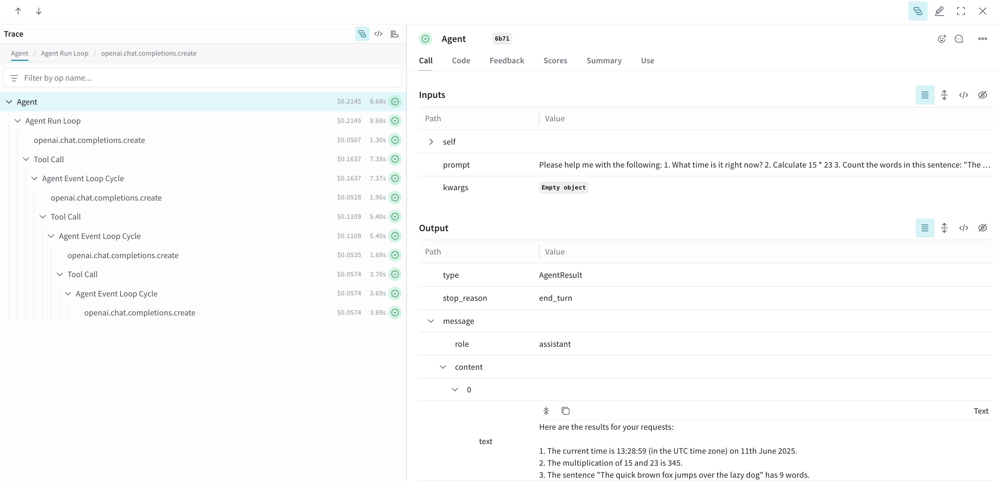

# Strands Agents

[Strands Agents](https://strandsagents.com/) is a simple-to-use, code-first framework for building agents with AI capabilities. It's designed to be lightweight, customizable, and production-ready with built-in observability and tracing support.

When working with AI agents, understanding their execution flow, tool usage, and reasoning steps is essential. Weave automatically captures traces from your Strands applications, enabling you to monitor and analyze your agents' behavior and interactions.

## Installation

Install the required dependencies using `pip`:

```bash
pip install weave strands-agents
```

## Get started

To use Strands Agents with Weave, simply call `weave.init()` at the beginning of your script. Weave will automatically trace all agent interactions.

```python
import weave
from strands import Agent
from strands.models.openai import OpenAIModel

# Initialize Weave with your project name
weave.init("strands-demo")

# Create a model
model = OpenAIModel(
    client_args={
        "api_key": "your-openai-api-key",
    },
    model_id="gpt-4",
    params={
        "max_tokens": 1000,
        "temperature": 0.7,
    }
)

# Create an agent
agent = Agent(model=model)

# Agent calls are automatically traced
response = agent("What is artificial intelligence?")
print(response)
```

Weave will track and log all agent interactions, including:

- **Agent calls** - Top-level agent invocations with prompts and responses
- **Internal execution** - Agent run loops and reasoning cycles  
- **Tool usage** - When agents call external tools
- **Event loops** - Individual reasoning steps within the agent

## Using Tools

Strands Agents support tools to extend agent capabilities. Here's an example using both built-in tools and custom tools:

```python
import weave
from strands import Agent, tool
from strands_tools import calculator, current_time
from strands.models.openai import OpenAIModel

weave.init("strands-tools-demo")

# Define a custom tool
@tool
def word_counter(text: str) -> int:
    """Count the number of words in the given text."""
    return len(text.split())

# Create an agent with tools
model = OpenAIModel(
    client_args={"api_key": "your-openai-api-key"},
    model_id="gpt-4"
)

agent = Agent(
    model=model,
    tools=[calculator, current_time, word_counter]
)

# Ask the agent to use tools
response = agent("""
Please help me with the following:
1. What time is it right now?
2. Calculate 15 * 23
3. Count the words in this sentence: "The quick brown fox jumps over the lazy dog"
""")

print(response)
```



## View traces

When you run your Strands application, Weave automatically generates a link to the dashboard where you can view detailed traces of your agent's execution, including tool calls, reasoning steps, and model interactions.

The traces provide insights into:
- How your agent processes requests
- Which tools were called and their results
- The sequence of reasoning steps
- Performance metrics and timing information

This makes it easy to debug, optimize, and understand your agent's behavior in production.