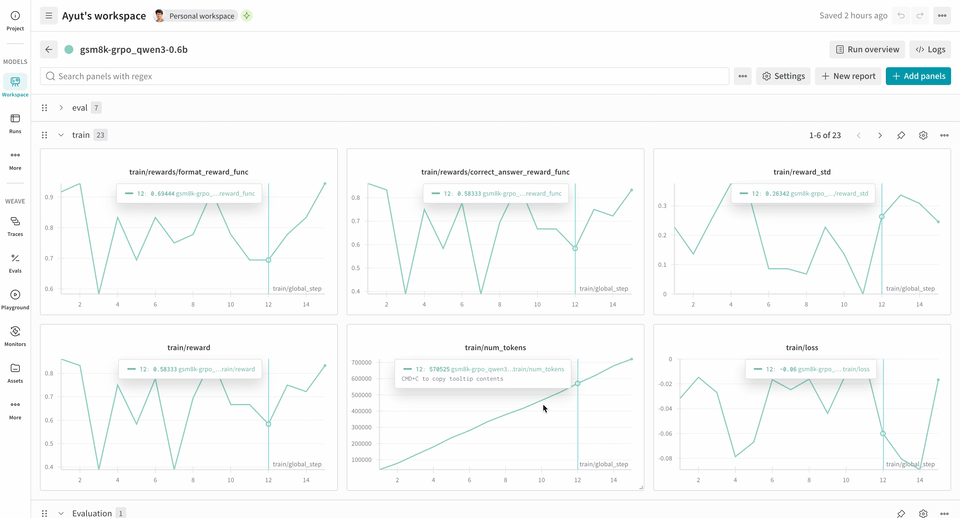

# Verifiers

[Verifiers](https://github.com/willccbb/verifiers) is a library of modular components for creating RL environments and training LLM agents. Environments built with Verifiers can serve as LLM evaluations, synthetic data pipelines, agent harnesses for any OpenAI‑compatible endpoint, and RL training.

With Weave, you get automatic tracing purpose‑built for agentic RL workflows. Agentic RL involves multi‑turn conversations, tool invocations, and environment/user interactions during rollouts. Simply tracking loss, reward, and other time series metrics is not sufficient to debug these workflows efficiently.

Weave records inputs, outputs, and timestamps for each step so you can inspect how data transforms at every turn, debug complex multi‑round conversations, and optimize training results.



## Getting started

Install Verifiers:

```bash
# Local dev / evaluation with API models
uv add verifiers

# Trainer + GPU support
uv add 'verifiers[all]' && uv pip install flash-attn --no-build-isolation

# Latest main branch
uv add verifiers @ git+https://github.com/willccbb/verifiers.git
```

Install Weave and W&B:

```bash
uv pip install weave wandb
```

Weave enables implicit patching by default. Learn more about it [here](../integrations/index.md).

### Trace rollouts and evaluate

Run a small evaluation on a `SingleTurnEnv` and inspect the trace in Weave.

```python
import os
from openai import OpenAI
import verifiers as vf
import weave

os.environ["OPENAI_API_KEY"] = "<YOUR-OPENAI-API-KEY>"

# Initialize Weave
weave.init("verifiers_demo")

# Minimal single-turn environment
dataset = vf.load_example_dataset("gsm8k", split="train").select(range(2))
parser = vf.ThinkParser()

def correct_answer(parser, completion, answer):
    parsed = parser.parse_answer(completion) or ""
    return 1.0 if parsed.strip() == answer.strip() else 0.0

rubric = vf.Rubric(funcs=[correct_answer, parser.get_format_reward_func()], weights=[1.0, 0.2])

env = vf.SingleTurnEnv(
    dataset=dataset,
    system_prompt="Think step-by-step, then answer.",
    parser=parser,
    rubric=rubric,
)

client = OpenAI()
results = env.evaluate(
    client, "gpt-4.1-mini", num_examples=2, rollouts_per_example=2, max_concurrent=8
)
```

### Fine-tune a model with experiment tracking and tracing

The true potential of Weave traces shows up during RL fine‑tuning. Pair traces with W&B runs to unlock rich charts, tables, and comparisons alongside step‑level detail. To log metrics, configs, artifacts, and traces, simply `import wandb; wandb.init(...)`.

The `verifiers` repository includes ready‑to‑run [examples](https://github.com/willccbb/verifiers/tree/main/examples/grpo) to help you get started.

1. Install the framework from source:

```bash
git clone https://github.com/willccbb/verifiers
cd verifiers
uv sync --all-extras && uv pip install flash-attn --no-build-isolation
```

2. Install an off-the-shelf environment:

```bash
vf-install gsm8k --from-repo
```

3. Train your model.

The example sets `report_to=wandb` by default, so you don't need to call `wandb.init` separately. You'll be prompted to authenticate this machine to log metrics to W&B.

```bash
# inference (shell 0)
CUDA_VISIBLE_DEVICES=0 vf-vllm --model willcb/Qwen3-0.6B --enforce-eager --disable-log-requests

# training (shell 1)
CUDA_VISIBLE_DEVICES=1 accelerate launch --num-processes 1 --config-file configs/zero3.yaml examples/grpo/train_gsm8k.py
```

:::note
We tested the example on 2xH100s. The following settings of env vars helped run it successfully. You might not need it but sharing in case you run into NCCL errors.

```bash
# In BOTH shells (server and trainer) before launch
export NCCL_CUMEM_ENABLE=0
export NCCL_CUMEM_HOST_ENABLE=0
```
:::

:::info
Traces will omit `logprobs` for the `Environment.a_generate` and `Rubric.score_rollouts` methods. This is done to keep payloads small while leaving originals intact for training.
:::

## See also

Verifiers has first‑class integration with W&B Models. See [Monitoring](https://verifiers.readthedocs.io/en/latest/training.html#monitoring) to learn more.
