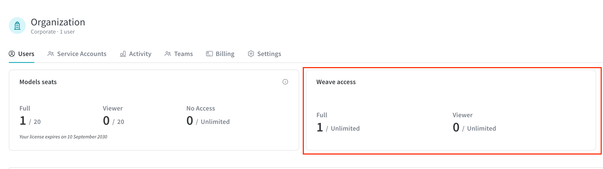

# W&B Weave Self-managed

This install guide outlines the process of deploying all the components necessary to enable W&B Weave in a self-managed environment.

:::important
Weave on self-managed is currently in Private Preview (PrPr). 
To deploy a fully production grade instance, please email `support@wandb.com`.
W&B strongly recommends using the [W&B Dedicated Cloud](https://docs.wandb.ai/guides/hosting/hosting-options/dedicated_cloud) option where Weave is Generally Available for production environments.
:::

One of the key components required to deploy W&B Weave is the [ClickHouseDB](https://clickhouse.com/) used by Weave application backend.

While the deployment results in a fully functional ClickHouseDB installation, there may be additional measures needed to improve reliability and availability in a fully production-ready environment.

## Requirements

- W&B Platform installed. For more information, see the [Self-Managed Deployment Guide](https://docs.wandb.ai/guides/hosting/hosting-options/self-managed/)
- [Bitnami's ClickHouse Helm Chart](https://github.com/bitnami/charts/tree/main/bitnami/clickhouse)
- An S3 bucket pre-configured for ClickHouse storage. For configuration details, see [Provide S3 Credentials](#provide-s3-credentials)
- Kubernetes Cluster Nodes with the following specifications:
  - CPU: 8 cores  
  - RAM: 64 GB  
  - Disk: 200GB+
- A Weave-enabled license from W&B. To request a license, please reach out to `support@wandb.com`.

:::tip  
For a more detailed reference architecture, see [https://docs.wandb.ai/guides/hosting/self-managed/ref-arch/](https://docs.wandb.ai/guides/hosting/self-managed/ref-arch/#models-and-weave).
:::

## Deploy ClickHouse

The ClickHouse deployment in this document uses the [Bitnami ClickHouse](https://bitnami.com/stack/clickhouse) package.

The Bitnami Helm chart provides good support for basic ClickHouse functionalities, particularly the use of [ClickHouse Keeper](https://clickhouse.com/docs/en/guides/sre/keeper/clickhouse-keeper).

### Configure Helm repository

1. Add the Bitnami Helm repository:

   `helm repo add bitnami https://charts.bitnami.com/bitnami` 

2. Update the repository:

   `helm repo update`


### Create Helm Configuration

The most critical part of the Helm configuration is the ClickHouse configuration, which is provided in XML format. Below is an example `values.yaml` file with customizable parameters to suit your needs.
To make the configuration process easier, we have added comments in the relevant sections using the format `<!-- COMMENT -->`.

Modify the following parameters:

- `clusterName`
- `auth.username`
- `auth.password`
- S3 bucket-related configurations

```yaml
# Stable version
image:
  registry: docker.io
  repository: bitnami/clickhouse
  tag: 24.8

## @param clusterName ClickHouse cluster name
clusterName: weave_cluster

## @param shards Number of ClickHouse shards to deploy
shards: 1

## @param replicaCount Number of ClickHouse replicas per shard to deploy
## if keeper enable, same as keeper count, keeper cluster by shards.
replicaCount: 3
persistence:
  enabled: false


## ClickHouse resource requests and limits
resources:
  requests:
    cpu: 0.5
    memory: 500Mi
  limits:
    cpu: 3.0
    memory: 6Gi

## Authentication
auth:
  username: weave_admin
  password: "weave_123"
  existingSecret: ""
  existingSecretKey: ""


## @param logLevel Logging level
logLevel: information

## @section ClickHouse keeper configuration parameters
keeper:
  enabled: true

## @param defaultConfigurationOverrides [string] Default configuration overrides (evaluated as a template)
defaultConfigurationOverrides: |
  <clickhouse>
    <!-- Macros -->
    <macros>
      <shard from_env="CLICKHOUSE_SHARD_ID"></shard>
      <replica from_env="CLICKHOUSE_REPLICA_ID"></replica>
    </macros>
    <!-- Log Level -->
    <logger>
      <level>{{ .Values.logLevel }}</level>
    </logger>
    {{- if or (ne (int .Values.shards) 1) (ne (int .Values.replicaCount) 1)}}
    <remote_servers>
      <{{ .Values.clusterName }}>
        {{- $shards := $.Values.shards | int }}
        {{- range $shard, $e := until $shards }}
        <shard>
          <internal_replication>true</internal_replication>
          {{- $replicas := $.Values.replicaCount | int }}
          {{- range $i, $_e := until $replicas }}
          <replica>
            <host>{{ printf "%s-shard%d-%d.%s.%s.svc.%s" (include "common.names.fullname" $ ) $shard $i (include "clickhouse.headlessServiceName" $) (include "common.names.namespace" $) $.Values.clusterDomain }}</host>
            <port>{{ $.Values.service.ports.tcp }}</port>
          </replica>
          {{- end }}
        </shard>
        {{- end }}
      </{{ .Values.clusterName }}>
    </remote_servers>
    {{- end }}
    {{- if .Values.keeper.enabled }}
    <keeper_server>
      <tcp_port>{{ $.Values.containerPorts.keeper }}</tcp_port>
      {{- if .Values.tls.enabled }}
      <tcp_port_secure>{{ $.Values.containerPorts.keeperSecure }}</tcp_port_secure>
      {{- end }}
      <server_id from_env="KEEPER_SERVER_ID"></server_id>
      <log_storage_path>/bitnami/clickhouse/keeper/coordination/log</log_storage_path>
      <snapshot_storage_path>/bitnami/clickhouse/keeper/coordination/snapshots</snapshot_storage_path>
      <coordination_settings>
        <operation_timeout_ms>10000</operation_timeout_ms>
        <session_timeout_ms>30000</session_timeout_ms>
        <raft_logs_level>trace</raft_logs_level>
      </coordination_settings>
      <raft_configuration>
        {{- $nodes := .Values.replicaCount | int }}
        {{- range $node, $e := until $nodes }}
        <server>
          <id>{{ $node | int }}</id>
          <hostname from_env="{{ printf "KEEPER_NODE_%d" $node }}"></hostname>
          <port>{{ $.Values.service.ports.keeperInter }}</port>
        </server>
        {{- end }}
      </raft_configuration>
    </keeper_server>
    {{- end }}
    {{- if or .Values.keeper.enabled .Values.zookeeper.enabled .Values.externalZookeeper.servers }}
    <zookeeper>
      {{- if or .Values.keeper.enabled }}
      {{- $nodes := .Values.replicaCount | int }}
      {{- range $node, $e := until $nodes }}
      <node>
        <host from_env="{{ printf "KEEPER_NODE_%d" $node }}"></host>
        <port>{{ $.Values.service.ports.keeper }}</port>
      </node>
      {{- end }}
      {{- else if .Values.zookeeper.enabled }}
      {{- $nodes := .Values.zookeeper.replicaCount | int }}
      {{- range $node, $e := until $nodes }}
      <node>
        <host from_env="{{ printf "KEEPER_NODE_%d" $node }}"></host>
        <port>{{ $.Values.zookeeper.service.ports.client }}</port>
      </node>
      {{- end }}
      {{- else if .Values.externalZookeeper.servers }}
      {{- range $node :=.Values.externalZookeeper.servers }}
      <node>
        <host>{{ $node }}</host>
        <port>{{ $.Values.externalZookeeper.port }}</port>
      </node>
      {{- end }}
      {{- end }}
    </zookeeper>
    {{- end }}
    {{- if .Values.metrics.enabled }}
    <prometheus>
      <endpoint>/metrics</endpoint>
      <port from_env="CLICKHOUSE_METRICS_PORT"></port>
      <metrics>true</metrics>
      <events>true</events>
      <asynchronous_metrics>true</asynchronous_metrics>
    </prometheus>
    {{- end }}
    <storage_configuration>
      <disks>
        <s3_disk>
          <type>s3</type>
          <!-- MODIFY THE BUCKET NAME -->
          <endpoint>https://s3.us-east-1.amazonaws.com/bucketname/foldername</endpoint>
          <!-- MODIFY THE BUCKET NAME -->

          <!-- AVOID USE CREDENTIALS CHECK THE RECOMMENDATION -->
          <access_key_id>xxx</access_key_id>
          <secret_access_key>xxx</secret_access_key>
          <!-- AVOID USE CREDENTIALS CHECK THE RECOMMENDATION -->

         <metadata_path>/var/lib/clickhouse/disks/s3_disk/</metadata_path>
        </s3_disk>
        <s3_disk_cache>
  	      <type>cache</type>
          <disk>s3_disk</disk>
          <path>/var/lib/clickhouse/s3_disk_cache/cache/</path>
          <max_size>100Gi</max_size>
          <cache_on_write_operations>1</cache_on_write_operations>
          <enable_filesystem_cache_on_write_operations>1</enable_filesystem_cache_on_write_operations> 
        </s3_disk_cache>
      </disks>
      <policies>
        <s3_main>
          <volumes>
            <main>
              <disk>s3_disk_cache</disk>
            </main>
          </volumes>
        </s3_main>
      </policies>
    </storage_configuration>
    <merge_tree>
      <storage_policy>s3_main</storage_policy>
    </merge_tree>
  </clickhouse>

## @section Zookeeper subchart parameters
zookeeper:
  enabled: false
```

W&B recommends keep the `clusterName` in the `values.yaml`  with the value `weave_cluster`
This is the cluster name expected by the W&B Weave when executing the Database Migration.
In case you want to use a different name, please refer to the [Setting clusterName](#setting-clustername) section of this documentation.

### Provide S3 Credentials

You can specify credentials for accessing an S3 bucket by either hardcoding the configuration, or having ClickHouse fetch the data from environment variables or an EC2 instance:

#### Hardcode the configuration   
   
Directly include the credentials in the storage configuration:

```plaintext
<type>s3</type>
<endpoint>https://s3.us-east-1.amazonaws.com/bucketname/foldername</endpoint>
<access_key_id>xxx</access_key_id>
<secret_access_key>xxx</secret_access_key>
```

#### Use environment variables or EC2 Metadata

Instead of hardcoding credentials, you can enable ClickHouse to fetch them dynamically from environment variables or Amazon EC2 instance metadata.

```plaintext
<use_environment_credentials>true</use_environment_credentials>
```  

You can find more details on this at [ClickHouse: Separation of Storage and Compute](https://clickhouse.com/docs/en/guides/separation-storage-compute).

## Install ClickHouse

:::important
If you do not wish to create a new namespace or install ClickHouse in a specific namespace, omit the arguments `--create-namespace --namespace <NAMESPACE>`.
:::

With the repositories set up and the `values.yaml` file prepared, the next step is to deploy ClickHouse.

```bash
helm install --create-namespace --namespace <NAMESPACE> clickhouse bitnami/clickhouse -f values.yaml 
```

## Confirm ClickHouse deployment

Confirm that ClickHouse is deployed using the following command:

```bash
kubectl get pods -n <NAMESPACE>
```

You should see the following pods

```bash
NAME                                 READY   STATUS    RESTARTS   AGE
clickhouse-shard0-0                  1/1     Running   0          9m59s
clickhouse-shard0-1                  1/1     Running   0          10m
clickhouse-shard0-2                  1/1     Running   0          10m
```

## Deploy Weave

Weave is already available for automatic deployment via [W&B Operator](https://docs.wandb.ai/guides/hosting/operator/#wb-kubernetes-operator). With the W&B Platform installed, the next steps would be as follows:

1. Edit the [CR instance](https://docs.wandb.ai/guides/hosting/operator/#complete-example) used to deploy the platform.
2. Add the Weave configuration.

## Gather information

1. Use Kubernetes service details to configure Weave tracing:

  - **Endpoint**: `<release-name>-headless.<namespace>.svc.cluster.local`
    - Replace `<release-name>` with your Helm release name
    - Replace `<namespace>` with your `NAMESPACE`
    - Get the service details: `kubectl get svc -n <namespace>`
  - **Username**: Set in the `values.yaml`
  - **Password**: Set in the `values.yaml`

2. With this information, update the W&B Platform Custom Resource(CR) by adding the following configuration:

    ```yaml
    apiVersion: apps.wandb.com/v1
    kind: WeightsAndBiases
    metadata:
      labels:
        app.kubernetes.io/name: weightsandbiases
        app.kubernetes.io/instance: wandb
      name: wandb
      namespace: default
    spec:
      values:
        global:
        [...]
          clickhouse:
            host: <release-name>-headless.<namespace>.svc.cluster.local
            port: 8123
            password: <password>
            user: <username>
            database: wandb_weave
            # This option must be true if replicating data across multiple nodes
            replicated: true

          weave-trace:
            enabled: true
        [...]
        weave-trace:
          install: true
        [...]
    ```

### Setting clusterName

The `clusterName` in the `values.yaml` must be `weave_cluster` or the database migraiton will fail.
In case a different cluster name is used, the environment variable `WF_CLICKHOUSE_REPLICATED_CLUSTER` should be configured in the `weave-trace.extraEnv` with the name choosen according to the example.

    ```yaml
        [...]
          clickhouse:
            host: <release-name>-headless.<namespace>.svc.cluster.local
            port: 8123
            password: <password>
            user: <username>
            database: wandb_weave
            # This option must be true if replicating data across multiple nodes
            replicated: true

          weave-trace:
            enabled: true
        [...]
        weave-trace:
          install: true
          extraEnv:
            WF_CLICKHOUSE_REPLICATED_CLUSTER: "different_cluster_name"
        [...]
    ```

The final configuration may look like the example below:

```yaml
apiVersion: apps.wandb.com/v1
kind: WeightsAndBiases
metadata:
  labels:
    app.kubernetes.io/name: weightsandbiases
    app.kubernetes.io/instance: wandb
  name: wandb
  namespace: default
spec:
  values:
    global:
      license: eyJhbGnUzaHgyQjQyQWhEU3...ZieKQ2x5GGfw
      host: https://wandb.example.com

      bucket:
        name: abc-wandb-moving-pipefish
        provider: gcs

      mysql:
        database: wandb_local
        host: 10.218.0.2
        name: wandb_local
        password: 8wtX6cJHizAZvYScjDzZcUarK4zZGjpV
        port: 3306
        user: wandb

      clickhouse:
        host: <release-name>-headless.<namespace>.svc.cluster.local
        port: 8123
        password: <password>
        user: <username>
        database: wandb_weave
        # This option must be true if replicating data across multiple nodes
        replicated: true

      weave-trace:
        enabled: true
 
    ingress:
      annotations:
        ingress.gcp.kubernetes.io/pre-shared-cert: abc-wandb-cert-creative-puma
        kubernetes.io/ingress.class: gce
        kubernetes.io/ingress.global-static-ip-name: abc-wandb-operator-address

    weave-trace:
      install: true
```

1. With the Custom Resource (CR) prepared, apply the new configuration:

    ```bash
    kubectl apply -n <NAMESPACE> -f wandb.yaml
    ```

## Accessing Weave

With the deployment up and running, when accessing W&B endpoint configured in the `host` option, you should see the Weave licensing enabled.

