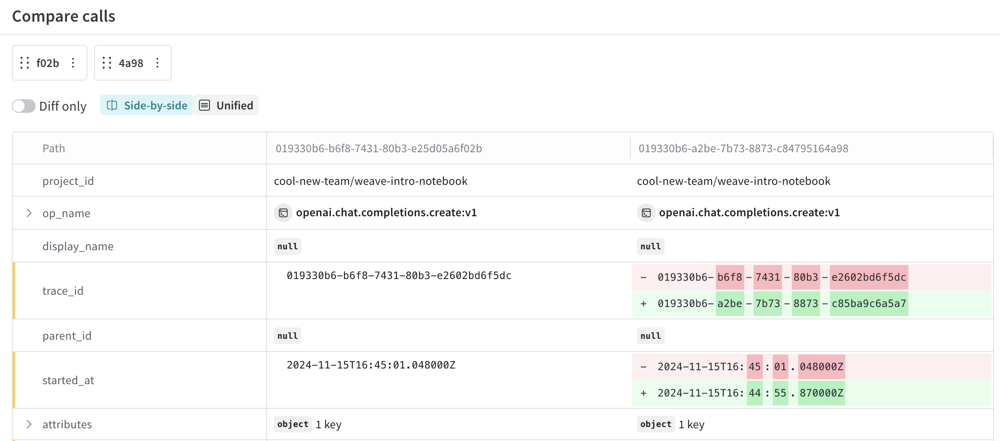
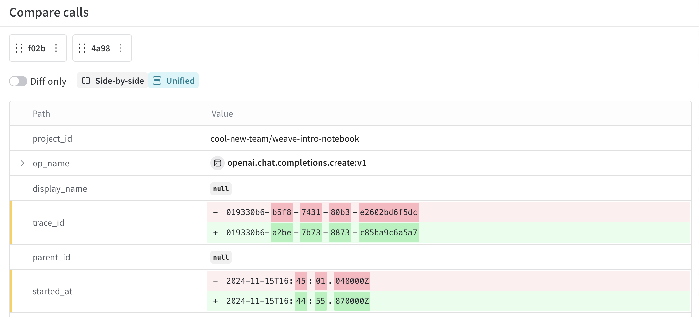
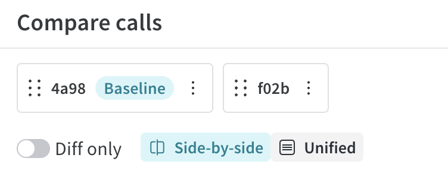
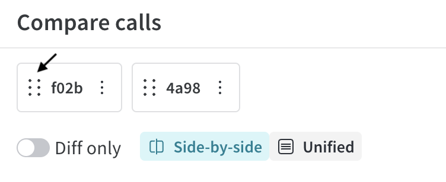
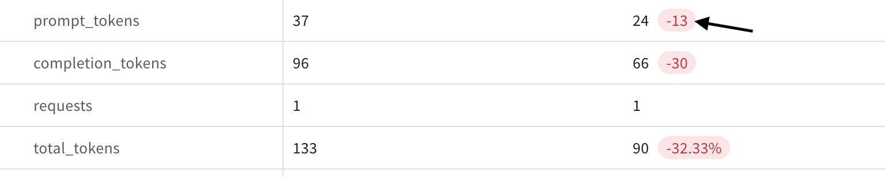
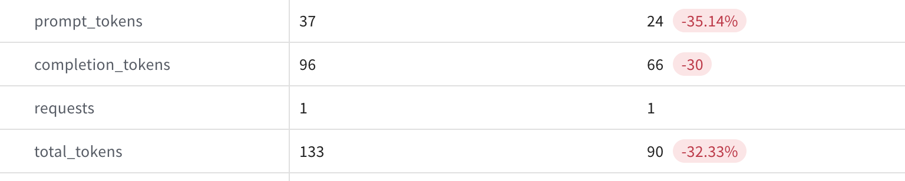
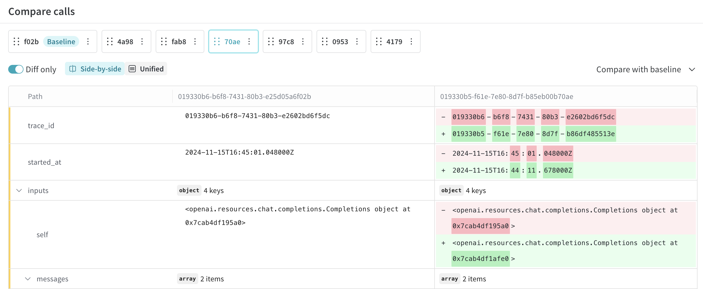

# Comparison

The Weave Comparison feature allows you to visually compare and diff code, traces, prompts, models, and model configurations.  You can compare two objects side-by-side or analyze a larger set of objects to identify differences, patterns, and trends.

This guide covers the steps to start a comparison and the available actions to tailor your comparison view, including baseline comparisons, numeric diff formatting, and more. 

## Access the Comparison view

1. In the sidebar, select the type of object you'd like to compare (e.g. **Traces**, **Models**, etc.).
2. Select the objects that you want to compare. The selection method varies depending on the type of object you are comparing:
   - For **Traces**, select traces to compare by checking the checkboxes in the appropriate rows in the Traces column.
   - For objects such as **Models**, navigate to the model Versions page and check the checkboxes next to the  versions that you want to compare.
3. Click **Compare** to open the Comparison view. Now, you can refine your view using the [available actions](#available-actions).

## Available actions

In the Comparison view, you have multiple actions available, depending on how many objects are being compared. Make sure to look at the [usage notes](#usage-notes).

- [Change the diff display](#change-the-diff-display)
- [Display side-by-side](#display-side-by-side)
- [Display in a unified view](#display-in-a-unified-view)
- [Set a baseline](#set-a-baseline)
- [Remove a baseline](#remove-a-baseline)
- [Change the comparison order](#change-the-comparison-order)
- [Change numeric diff display format](#change-numeric-diff-display-format)
- [Compare with baseline or previous](#compare-with-baseline-or-previous)
- [Compare a pair from a multi-object comparison](#compare-a-pair-from-a-multi-object-comparison)
- [Remove an object from comparison](#remove-an-object-from-comparison)

### Change the diff display

By default, **Diff only** is set to off. To filter the table rows so that only changed rows are displayed, toggle **Diff only** on. 

### Display side-by-side 

> This option is only available when comparing two objects, or a [pair from a multi-object comparison](#compare-a-pair-from-a-multi-object-comparison).

To compare each object side-by-side in separate columns, select **Side-by-side**. 

### Display in a unified view

> This option is only available when comparing two objects, or a [pair from a multi-object comparison](#compare-a-pair-from-a-multi-object-comparison).

To compare each object in a unified view, select **Unified**. 

### Set a baseline

By default, each object in the Comparison view is compared to the object to its left. However, you can set an object as the _baseline_, which means that all objects will be compared to the leftmost object in the view.
To set an object as baseline, do the following:

1. In the Comparison view topbar, mouse over the object that you want to set as the baseline.
2. Click the three dots to the right of the ID.
   
3. In the dropdown, select **Make baseline**. The UI refreshes so that the baseline object is furthest left in the topbar, and `Baseline` displays next to the ID.
    

### Remove a baseline

To remove an object as baseline, do the following:

1. In the Comparison view topbar, mouse over the baseline object.
2. Click the three dots to the right of the ID.
3. In the dropdown, select **Remove baseline**. Now, `Baseline` no longer displays next to the call ID.

### Change the comparison order

To change the comparison order, do the following:

1. In the Comparison view topbar, mouse over the ID that you want to reorder. 
2. Click the six dots to the left of the ID.
   
3. Drag the ID to the left or the right, depending on which object was selected. 
4. Place the ID in the desired ordering. The UI refreshes with an updated comparison ordering.

### Change numeric diff display format 

For numeric values such as `completion_tokens` and `total_tokens`, you can view the diff as either an integer or a percentage. Additionally, positive numeric values can be viewed as a multiplier. To change a numeric diff's display format, do the following:

1. In the Comparison table, find the numeric value that you want to update the diff display format for.
    
2. Click the diff value. The format automatically updates to either an integer or a percentage.
    

### Compare with baseline or previous

> This option is only available when comparing 3 or more objects.
> You can also [set](#set-a-baseline) or [remove an existing baseline by clicking the 3 dots to the right of the ID](#remove-a-baseline).

To perform a baseline comparison with 3 or more objects, do the following:

1. In the right hand corner of the Comparison view, click the dropdown. Depending on your current view configuration, the dropdown is either titled **Compare with previous** or **Compare with baseline**.
2. Depending on your current view configuration, select either **Compare with previous** or **Compare with baseline**.
   - **Compare with baseline**: Sets the leftmost object as the baseline. The table updates so that the leftmost column is the baseline.
   -  **Compare with previous**: No object is set as baseline.

### Compare a pair from a multi-object comparison

> This option is only available when comparing 3 or more objects.

When comparing 3 or more objects, you can compare a single object to a previous object or baseline. This changes the Comparison table view so that the view is identical to a two-object comparison. To compare a pair of objects from a multi-object comparison, do the following:

1. In the Comparison view topbar, find the ID that you want to compare to previous or baseline. 
2. To select the item, click the ID. The UI refreshes with a two-way comparison table.
    

To reset the view so that the first 6 objects selected for comparison are displayed in the table, click the ID again.

### Remove an object from comparison

> This option is only available when comparing 3 or more objects.

To remove an object from comparison, do the following:

1. In the Comparison view topbar, find the object that you want to remove from comparison.
2. Click the three dots to the right of the ID.
3. In the dropdown, select **Remove object from comparison**. The UI refreshes with an updated table that no longer includes the removed object.

## Usage notes

 - The Comparison feature is only available in the UI.
 - You can compare as many objects as you'd like. However, the UI only displays a maximum of 6. To view an object in the comparison table that is not visible when comparing more than 6 objects, either [change the comparison order](#change-the-comparison-order) so that the object is one of the first 6 objects from left to right, or [pair from a multi-object comparison](#compare-a-pair-from-a-multi-object-comparison) for easy viewing. 