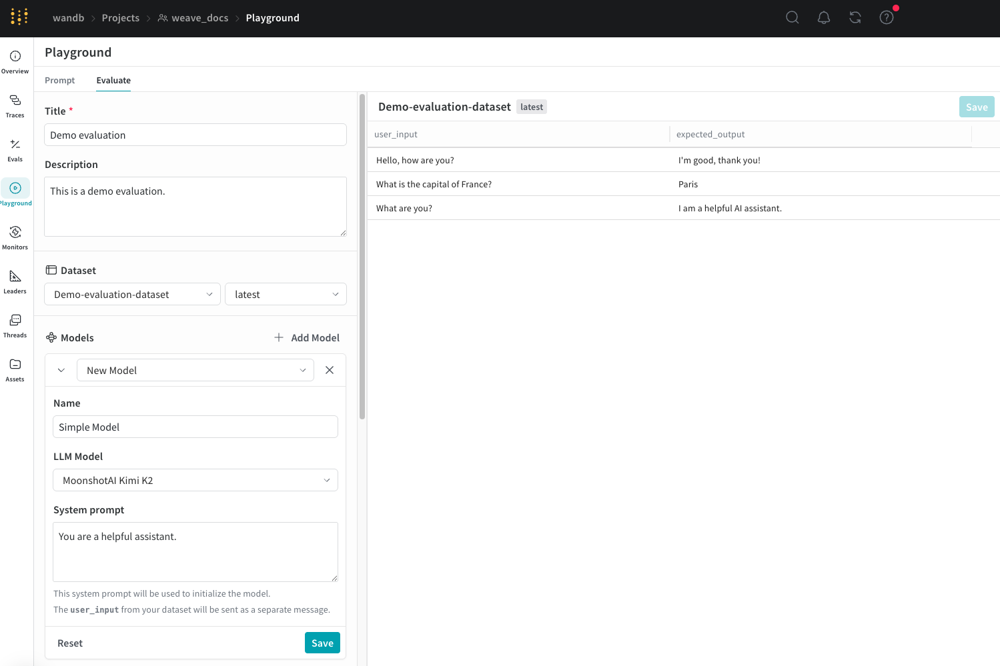

import Tabs from '@theme/Tabs';
import TabItem from '@theme/TabItem';

# Evaluation Playground

The Evaluation Playground is a powerful tool in the Weave UI that allows you to access existing models, build new ones, and compare their performances using evaluation datasets and LLM scoring judges. This enables you to start experimenting with and comparing your models without setting up any code. You can also save the models, scorers, and datasets you develop in the playground for later development and deployment.

For example, you can open the Evaluation Playground, add two models you've previously saved, and then evaluate their performance based on a new or previously saved question-answer style evaluation dataset. You can then create a new model in the interface, add system prompts to it, and then run a new evaluation on all three models to see how they perform against one another.



## Set up an evaluation in the playground

To set up an evaluation in the Evaluation Playground:

1. Open the Weave UI, and then open the project that you want to perform the evaluation in. This opens the Traces page. 
2. From the Traces page, click the **Playground** icon in the left-menu, and then select the **Evaluate** tab on the Playground page. On the Evaluate page, you can either: 
    * **Load a demo example**: This loads a predefined configuration that evaluates MoonshotAI Kimi K2 model on expected output and uses an LLM judge to determine its correctness. You can use this configuration to experiment with the interface.
    * **Start from scratch**: This loads a blank configuration for you to build upon.
3. If you selected **Start from scratch**, add a descriptive title and description for your evaluation in the **Title** and **Description** fields.

Follow the instructions in the next sections to set up your datasets, models, and scorers.

### Add a dataset

[Datasets](../core-types/datasets) are organized collections example user inputs and your expected responses from models. During evaluation, the playground feeds each test input into your model, collects its output, and then scores the output based on a metric you've selected, such as correctness. You can choose to create a dataset in the UI, add an existing dataset already saved to your project, or upload a new dataset.

You can upload datasets in the following formats:

* `.csv`
* `.tsv` 
* `.json`
* `.jsonl`

See the Datasets pages for more information on how to format and save datasets to Weave.

To add a dataset in the **Dataset** section: 

1. Click the dropdown menu and then select either: 
    * **Start from scratch** to create a new dataset in the UI.
    * **Upload a file** to upload a dataset from your local machine.
    * An existing dataset already saved to your project.
2. Optional: Click **Save** to save the dataset to your project for later use.

Once you've selected an option, the dataset is visible in the right pane of the UI and you can edit each field as necessary by clicking on it. You can also add new rows to the dataset by clicking **Add row**.

:::note
You can only use the UI to edit new datasets. 

It is also important to appropriately name the columns in your dataset `user_input` and `expected_output` so that the scorers can access the data.
:::

### Add a model

[Models](https://weave-docs.wandb.ai/guides/core-types/models) are systems that generate output based on user input. You can select existing models in your project to create new ones to evaluate. You can only use models created using the playground feature.

To add a model in the **Models** section of the Evaluation Playground:

1. Click **Add Model** and either select **New Model** or an existing model from the dropdown menu.
2. If you selected **New Model**, configure the following fields:
    * **Name**: Add a descriptive name to your new model.
    * **LLM Model**: Select a foundation model to build your new model on, such as OpenAI's GPT-4. You can select from a list of foundation models you have already configured access to, or you can add access to a foundation model by selecting **Add AI provider** and selecting a model. Adding a provider prompts you to enter your access credentials to that provider. See your provider's documentation to see how to locate your API key, endpoints, and any additional configuration information you need to access the model using Weave.
    * **System Prompt**: Provide the model instructions on how it should behave, for example, `You are a helpful assistant specializing in Python programming.` The `user_input` from your dataset is sent in a subsequent message and you do not need to include it in the system prompt.

    If you choose an existing model, a new field appears beside the model's name that allows you to select a version of the existing model and there are no other additional fields to configure. If you want to make changes to your existing model before or after evaluation, use the [Prompt Playground](../tools/playground.md).

3. Optional: Click **Save** to save the model to your project for later use.
4. Optional: You can add additional models to simultaneously evaluate by clicking **Add Model** again and adding other models as necessary.

### Add Scorers

[Scorers](../evaluation/scorers) use LLM judges to measure and assess the quality of AI model outputs. You can select existing scorers in your project or create new ones to evaluate your models with. You can only use scorers created within the playground.

To add a scorer in the Evaluation Playground: 

1. Click **Add Scorer** and then configure the following fields:
    * **Name**: Add a descriptive name to your scorer.
    * **Type**: Select how scores are output, either a boolean or a number. Boolean scorers return a binary `True` or `False` depending on whether the model's output met the judging parameters you set for it. Number scorers output a score between `0` and `1`, providing a general grade of how well the model's output met your judging parameters.
    * **LLM-as-a-judge-model**: Select a foundation model to use as the scorer's judge. Similar to the LLM Model field in the **Models** section, you can select from foundation models you've already configured access to, or configure new access to foundation models.
    * **Scoring Prompt**: Provide the LLM judge parameters on what it should be scoring output on. For example, if you want it to check for hallucinations, you can enter a scoring prompt similar to this:

        ```
        Given the following context and answer, determine if the answer contains any information not supported by the context.

        User input: {user_input}
        Expected output: {expected_output}
        Model Output: {output}

        Is the model output correct?
        ```

        You can use the fields from your datasets and responses as variables in the scoring prompt, such as `{user_input}` and `{output}`.

2. Optional: Click **Save** to save the scorer to your project for later use.

### Run the evaluation

Once you've set up your datasets, models, and scorers, you can run the evaluation. 

* To run the evaluation in the Evaluation Playground, click **Run eval**. 

Weave runs an individual evaluation for each model you've added and collects metrics on each request made using the dataset. Weave saves each of these evaluations in the **Evals** section for later review.

### Review evaluation results

After completing the evaluation, the playground opens a report that displays various metrics collected on each request made to your models.


The **Dataset results** tab displays the input, expected output, the model's actual output, latency, token usage, and scoring results. You can click the IDs in the **Row** column to open a detailed view of the metrics for a specific set of requests. You can also use the display format buttons directly below the tabs to change the display format of the report's cells.

The **Summary** tab provides an overview of how each model performed with visual representations of the data.

For more information about how to open and compare evaluations, see [Evaluations](../core-types/evaluations).