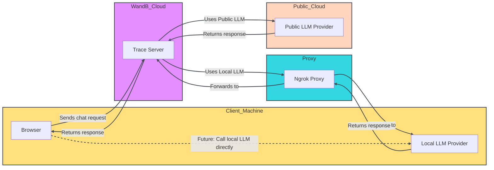

# Playground

Evaluating LLM prompts and responses is challenging. The Weave Playground is designed to simplify the process of iterating on LLM prompts and responses, making it easier to experiment with different models and prompts. With features like prompt editing, message retrying, and model comparison, Playground helps you to quickly test and improve your LLM applications. Playground currently supports models from OpenAI, Anthropic, Google, Groq, Amazon Bedrock, and Microsoft Azure, as well as [custom providers](#add-a-custom-provider).

## Features

- **Quick access:** Open the Playground from the W&B sidebar for a fresh session or from the Call page to test an existing project.
- **Message controls:** Edit, retry, or delete messages directly within the chat.
- **Flexible messaging:** Add new messages as either user or system inputs, and send them to the LLM.
- **Customizable settings:** Configure your preferred LLM provider and adjust model settings.
- **Multi-LLM support:** Switch between models, with team-level API key management.
- **Compare models:** Compare how different models respond to prompts.

Get started with the Playground to optimize your LLM interactions and streamline your prompt engineering process and LLM application development.

- [Prerequisites](#prerequisites)
  - [Add provider credentials and information](#add-provider-credentials-and-information)
  - [Access the Playground](#access-the-playground)
- [Select an LLM](#select-an-llm)
- [Adjust LLM parameters](#adjust-llm-parameters)
- [Add a function](#add-a-function)
- [Retry, edit, and delete messages](#retry-edit-and-delete-messages)
- [Add a new message](#add-a-new-message)
- [Compare LLMs](#compare-llms)
- [Adjust the number of trials](#adjust-the-number-of-trials)
- [Add a custom provider](#add-a-custom-provider)
- [Edit a custom provider](#edit-a-custom-provider)
- [Remove a custom provider](#remove-a-custom-provider)
- [Use ngrok with Ollama](#use-ngrok-with-ollama)

## Prerequisites

Before you can use Playground, you must [add provider credentials](#add-provider-credentials-and-information), and [open the Playground UI](#access-the-playground).

### Add provider credentials and information

Playground currently supports models from OpenAI, Anthropic, Google, Groq, Amazon Bedrock, and Microsoft Azure. To use one of the available models, add the appropriate information to your team secrets in W&B settings.

- OpenAI: `OPENAI_API_KEY`
- Anthropic: `ANTHROPIC_API_KEY`
- Google: `GOOGLE_API_KEY`
- Groq: `GROQ_API_KEY`
- Amazon Bedrock:
  - `AWS_ACCESS_KEY_ID`
  - `AWS_SECRET_ACCESS_KEY`
  - `AWS_REGION_NAME`
- Azure:
  - `AZURE_API_KEY`
  - `AZURE_API_BASE`
  - `AZURE_API_VERSION`
- X.AI:
  - `XAI_API_KEY`
- Deepseek
  - `DEEPSEEK_API_KEY`

### Access the Playground

There are two ways to access the Playground:

1. _Open a fresh Playground page with a simple system prompt_: In the sidebar, select **Playground**. Playground opens in the same tab.
2. _Open Playground for a specific call_:
   1. In the sidebar, select the **Traces** tab. A list of traces displays.
   2. In the list of traces, click the name of the call that you want to view. The call's details page opens.
   3. Click **Open chat in playground**. Playground opens in a new tab.


## Select an LLM

You can switch the LLM using the dropdown menu in the top left. The available models from various providers are listed below:

- [Amazon Bedrock](#amazon-bedrock)
- [Anthropic](#anthropic)
- [Azure](#azure)
- [Google](#google)
- [Groq](#groq)
- [OpenAI](#openai)
- [X.AI](#xai)
- [Deepseek](#deepseek)

<!-- USE make update_playground_models -->
<!-- LLM_LIST_START, DON'T EDIT THIS SECTION -->

### [Amazon Bedrock](../integrations/bedrock.md)

- ai21.j2-mid-v1
- ai21.j2-ultra-v1
- amazon.nova-micro-v1:0
- amazon.nova-lite-v1:0
- amazon.nova-pro-v1:0
- amazon.titan-text-lite-v1
- amazon.titan-text-express-v1
- mistral.mistral-7b-instruct-v0:2
- mistral.mixtral-8x7b-instruct-v0:1
- mistral.mistral-large-2402-v1:0
- mistral.mistral-large-2407-v1:0
- anthropic.claude-3-sonnet-20240229-v1:0
- anthropic.claude-3-5-sonnet-20240620-v1:0
- anthropic.claude-3-haiku-20240307-v1:0
- anthropic.claude-3-opus-20240229-v1:0
- anthropic.claude-v2
- anthropic.claude-v2:1
- anthropic.claude-instant-v1
- cohere.command-text-v14
- cohere.command-light-text-v14
- cohere.command-r-plus-v1:0
- cohere.command-r-v1:0
- meta.llama2-13b-chat-v1
- meta.llama2-70b-chat-v1
- meta.llama3-8b-instruct-v1:0
- meta.llama3-70b-instruct-v1:0
- meta.llama3-1-8b-instruct-v1:0
- meta.llama3-1-70b-instruct-v1:0
- meta.llama3-1-405b-instruct-v1:0

### [Anthropic](../integrations/anthropic.md)

- claude-3-7-sonnet-20250219
- claude-3-5-sonnet-20240620
- claude-3-5-sonnet-20241022
- claude-3-haiku-20240307
- claude-3-opus-20240229
- claude-3-sonnet-20240229

### [Azure](../integrations/azure.md)

- azure/o1-mini
- azure/o1-mini-2024-09-12
- azure/o1
- azure/o1-preview
- azure/o1-preview-2024-09-12
- azure/gpt-4o
- azure/gpt-4o-2024-08-06
- azure/gpt-4o-2024-11-20
- azure/gpt-4o-2024-05-13
- azure/gpt-4o-mini
- azure/gpt-4o-mini-2024-07-18

### [Google](../integrations/google.md)

- gemini/gemini-2.5-pro-preview-03-25
- gemini/gemini-2.0-pro-exp-02-05
- gemini/gemini-2.0-flash-exp
- gemini/gemini-2.0-flash-001
- gemini/gemini-2.0-flash-thinking-exp
- gemini/gemini-2.0-flash-thinking-exp-01-21
- gemini/gemini-2.0-flash
- gemini/gemini-2.0-flash-lite
- gemini/gemini-2.0-flash-lite-preview-02-05
- gemini/gemini-1.5-flash-001
- gemini/gemini-1.5-flash-002
- gemini/gemini-1.5-flash-8b-exp-0827
- gemini/gemini-1.5-flash-8b-exp-0924
- gemini/gemini-1.5-flash-latest
- gemini/gemini-1.5-flash
- gemini/gemini-1.5-pro-001
- gemini/gemini-1.5-pro-002
- gemini/gemini-1.5-pro-latest
- gemini/gemini-1.5-pro

### [Groq](../integrations/groq.md)

- groq/deepseek-r1-distill-llama-70b
- groq/llama-3.3-70b-versatile
- groq/llama-3.3-70b-specdec
- groq/llama-3.2-1b-preview
- groq/llama-3.2-3b-preview
- groq/llama-3.2-11b-vision-preview
- groq/llama-3.2-90b-vision-preview
- groq/llama-3.1-8b-instant
- groq/llama3-70b-8192
- groq/llama3-8b-8192
- groq/gemma2-9b-it

### [OpenAI](../integrations/openai.md)

- gpt-4.1-mini-2025-04-14
- gpt-4.1-mini
- gpt-4.1-2025-04-14
- gpt-4.1
- gpt-4.1-nano-2025-04-14
- gpt-4.1-nano
- o4-mini-2025-04-16
- o4-mini
- gpt-4.5-preview-2025-02-27
- gpt-4.5-preview
- o3-2025-04-16
- o3
- o3-mini-2025-01-31
- o3-mini
- gpt-4o-mini
- gpt-4o-2024-05-13
- gpt-4o-2024-08-06
- gpt-4o-mini-2024-07-18
- gpt-4o
- gpt-4o-2024-11-20
- o1-mini-2024-09-12
- o1-mini
- o1-preview-2024-09-12
- o1-preview
- o1-2024-12-17
- gpt-4-1106-preview
- gpt-4-32k-0314
- gpt-4-turbo-2024-04-09
- gpt-4-turbo-preview
- gpt-4-turbo
- gpt-4
- gpt-3.5-turbo-0125
- gpt-3.5-turbo-1106

### X.AI

- xai/grok-3-beta
- xai/grok-3-fast-beta
- xai/grok-3-fast-latest
- xai/grok-3-mini-beta
- xai/grok-3-mini-fast-beta
- xai/grok-3-mini-fast-latest
- xai/grok-beta
- xai/grok-2-1212
- xai/grok-2
- xai/grok-2-latest

### Deepseek

- deepseek/deepseek-reasoner
- deepseek/deepseek-chat

<!-- LLM_LIST_END, DON'T EDIT THIS SECTION -->

## Adjust LLM parameters

You can experiment with different parameter values for your selected model. To adjust parameters, do the following:

1. In the upper right corner of the Playground UI, click **Chat settings** to open the parameter settings dropdown.
2. In the dropdown, adjust parameters as desired. You can also toggle Weave call tracking on or off, and [add a function](#add-a-function).
3. Click **Chat settings** to close the dropdown and save your changes.


## Add a function

You can test how different models use functions based on input it receives from the user. To add a function for testing in Playground, do the following:

1. In the upper right corner of the Playground UI, click **Chat settings** to open the parameter settings dropdown.
2. In the dropdown, click **+ Add function**.
3. In the pop-up, add your function information.
4. To save your changes and close the function pop-up, click the **x** in the upper right corner.
5. Click **Chat settings** to close the settings dropdown and save your changes.

## Retry, edit, and delete messages

With Playground, you can retry, edit, and delete messages. To use this feature, hover over the message you want to edit, retry, or delete. Three buttons display: **Delete**, **Edit**, and **Retry**.

- **Delete**: Remove the message from the chat.
- **Edit**: Modify the message content.
- **Retry**: Delete all subsequent messages and retry the chat from the selected message.


## Add a new message

To add a new message to the chat, do the following:

1. In the chat box, select one of the available roles (**Assistant** or **User**)
2. Click **+ Add**.
3. To send a new message to the LLM, click the **Send** button. Alternatively, press the **Command** and **Enter** keys.


## Compare LLMs

Playground allows you to compare LLMs. To perform a comparison, do the following:

1. In the Playground UI, click **Compare**. A second chat opens next to the original chat.
2. In the second chat, you can:
   - [Select the LLM to compare](#select-an-llm)
   - [Adjust parameters](#adjust-llm-parameters)
   - [Add functions](#add-a-function)
3. In the message box, enter a message that you want to test with both models and press **Send**.

## Adjust the number of trials

Playground allows you to generate multiple outputs for the same input by setting the number of trials. The default setting is `1`. To adjust the number of trials, do the following:

1. In the Playground UI, open the settings sidebar if it is not already open.
2. Adjust the **Number of trials**.

## Add a custom provider

In addition to the [supported providers](#select-an-llm), you can use the Playground to test OpenAI compatible API endpoints for custom models. Examples include:

- Older versions of supported model providers
- Local models

To add a custom provider to the Playground, do the following:

1. In the upper left corner of the Playground UI, click the **Select a model** dropdown.
2. Select **+ Add AI provider**.
3. In the pop-up modal, enter the provider information:

   - _Provider name_: For example, `openai` or `ollama`.
   - _API key_: For example, an OpenAI API key.
   - _Base URL_: For example, `https://api.openai.com/v1/` or a ngrok URL `https://e452-2600-1700-45f0-3e10-2d3f-796b-d6f2-8ba7.ngrok-free.app`.
   - _Headers_ (optional): You can add multiple header keys and values.
   - _Models_: You can add multiple models for one provider. For example, `deepseek-r1` and `qwq`.
   - _Max tokens_ (optional): For each model, you can specify the max tokens that the model can generate in a response.

4. Once you've entered your provider information, click **Add provider**.
5. Select your new provider and available model(s) from the **Select a model** dropdown in the upper left corner of the Playground UI.

:::important
Because of CORS restrictions, you can't call localhost or 127.0.0.1 URLs directly from the Playground. If you're running a local model server (such as Ollama), use a tunneling service like ngrok to expose it securely. For details, see [Use ngrok with Ollama](#use-ngrok-with-ollama).
:::

Now, you can test the custom provider model(s) using standard Playground features. You can also [edit](#edit-a-custom-provider) or [remove](#remove-a-custom-provider) the custom provider.

## Edit a custom provider

To edit information for a [previously created custom provider](#add-a-custom-provider), do the following:

1. In the Weave sidebar, navigate to **Overview**.
2. From the top navigation menu, select **AI Providers**.
3. In the **Custom providers** table, find the custom provider you want to update.
4. In the **Last Updated** column of the entry for your custom provider, click the edit button (the pencil icon).
5. In the pop-up modal, edit the provider information.
6. Click **Save**.

## Remove a custom provider

To remove a [previously created custom provider](#add-a-custom-provider), do the following:

1. In the Weave sidebar, navigate to **Overview**.
2. From the top navigation menu, select **AI Providers**.
3. In the **Custom providers** table, find the custom provider you want to update.
4. In the **Last Updated** column of the entry for your custom provider, click the delete button (the trashcan icon).
5. In the pop-up modal, confirm that you want to delete the provider. This action cannot be undone.
6. Click **Delete**.

## Use ngrok with Ollama

To test a locally running Ollama model in the Playground, use ngrok to create a temporary public URL that bypasses CORS restrictions.

To set it up, do the following:

1. [Install ngrok](https://ngrok.com/docs/getting-started/#step-1-install) for your operating system.
2. Start your Ollama model:

   ```bash
   ollama run <model>
   ```

3. In a separate terminal, create an ngrok tunnel with the required CORS headers:

   ```bash
   ngrok http 11434 --response-header-add "Access-Control-Allow-Origin: *" --host-header rewrite
   ```

After ngrok starts, it will display a public URL, such as `https://xxxx-xxxx.ngrok-free.app`. Use this URL as the base URL when you add Ollama as a custom provider in the Playground.

The following diagram illustrates the data flow between your local environment, the ngrok proxy, and the W&B cloud services:


