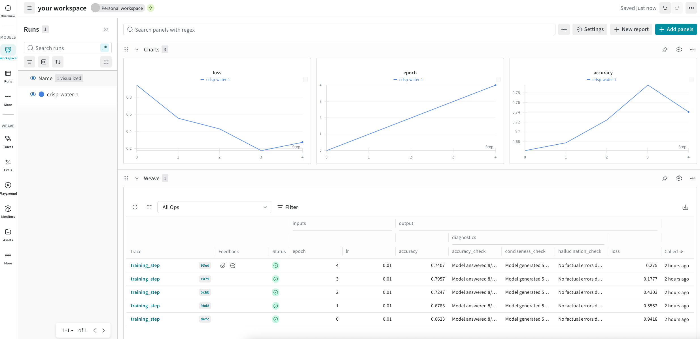

# Log traces during model training runs



You can now log Weave traces during model training runs and view them in your personal workspace. 

Personal workspaces are customizable dashboards in the UI that allow you to view in-depth analysis and data visualizations of your model training runs. By adding Weave panels to your workspace, you can view and access trace data logged during model runs to help gain better insight into how your models perform during training.

For example, if you're fine-tuning an LLM model and your W&B workspace shows that accuracy drops at step 500, the integrated Weave traces can reveal exactly what happened, such as your model started generating overly verbose responses that failed the evaluation criteria.

## Use Weave Panels

[By decorating the functions with `@weave.op`](/quickstart) in your ML-pipelines, you automatically capture their execution information and access it in a personal workspace.

For example, the following script demonstrates how Weave traces integrate with W&B training runs. It simulates a machine learning training loop where each training step logs metrics to W&B while simultaneously creating detailed Weave traces. The `@weave.op` decorators on the functions automatically capture inputs, outputs, and execution details. When the training loop logs metrics with `wandb.log()`, it also logs Weave trace information to your project.

```python
import wandb
import weave
import random

# Initialize both W&B and Weave with the same project
project = "my-workspace-project"
weave.init(project)

@weave.op
def evaluate_model(model_state, epoch):
    # Simulate evaluation metrics
    accuracy = 0.7 + epoch * 0.02 + random.uniform(-0.05, 0.05)
    
    # Track specific model behaviors
    test_responses = {
        "conciseness_check": "Model generated 500 words for simple question",
        "accuracy_check": "Model answered 8/10 questions correctly",
        "hallucination_check": "No factual errors detected"
    }
    
    return {
        "accuracy": accuracy,
        "diagnostic_results": test_responses
    }

@weave.op
def training_step(epoch, lr):
    # Simulate Training logic
    loss = 1.0 / (epoch + 1) + random.uniform(-0.1, 0.1)
    
    # Evaluation with traces
    eval_results = evaluate_model(f"checkpoint_{epoch}", epoch)
    
    return {
        "loss": loss,
        "accuracy": eval_results["accuracy"],
        "diagnostics": eval_results["diagnostic_results"]
    }

# Training loop
with wandb.init(project=project, config={"lr": 0.01}) as run:
    for epoch in range(5):
        # Execute training with Weave tracing
        results = training_step(epoch, run.config.lr)
        
        # Log to W&B - creates the integration point
        run.log({
            "epoch": epoch,
            "loss": results["loss"],
            "accuracy": results["accuracy"]
        })
```

You can run this example script to see how traces get logged with the rest of your run information.

To view the trace information in your workspace during or after a run, you can either open the link provided in the terminal at the start of a run (it looks like this: `wandb: 🚀 View run at https://wandb.ai/wandb/my-project/runs/<run-ID>`) or navigate to the workspace in the UI.

To navigate to a workspace from the UI:

1. Open the W&B UI and click the **Projects** tab. This opens a list of your projects.
2. From the list of projects, click the project that you logged your run to. This opens the **Workspaces** page.
3. If you've set up your workspace as an automatic workspace, the workspace automatically populates with data visualizations and information about your run. The trace data for your run is under the **Weave** section of the workspace. If your workspace is a manual workspace, you can add Weave panels to by clicking **Add panels** and selecting new panels from the **Weave** section of the Add Panels menu.

For more information about workspaces, see [View experiments results](https://docs.wandb.ai/guides/track/workspaces).
