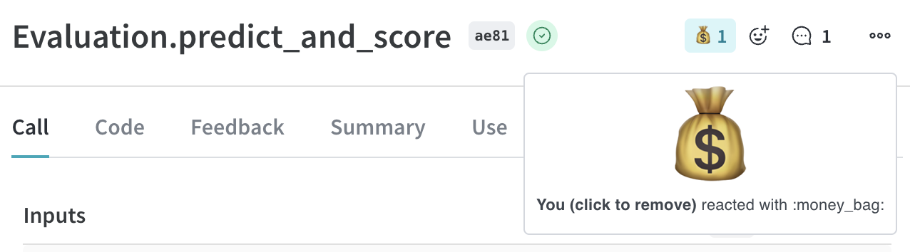
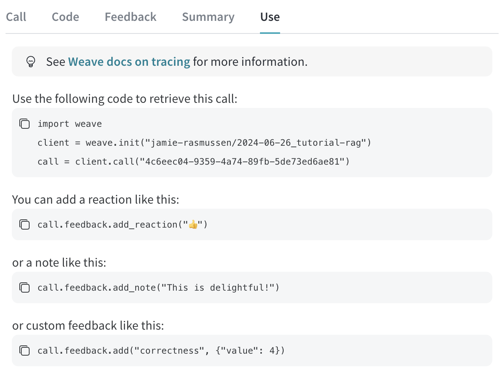

import Tabs from '@theme/Tabs';
import TabItem from '@theme/TabItem';

# Feedback

Evaluating LLM applications automatically is challenging. Teams often rely on direct user feedback, particularly from domain experts, who assess the content quality using simple indicators such as thumbs up or down. Developers also actively identify and resolve content issues.

Weave's feedback feature enables users to provide feedback directly within the Weave UI or through the API. You can add emoji reactions, textual notes, and structured data to calls. This feedback helps compile evaluation datasets, monitor application performance, and collect examples for advanced tasks like fine-tuning.

## View and Add Feedback within UI

Reactions and notes are displayed in a column in the calls grid. Hovering over these indicators provides more detail. Use these buttons to add reactions or notes.


View and edit feedback in the header of the call details page.



View the feedback for a call on the "Feedback" tab of the call details page.


Access copy-and-paste examples on the "Use" tab of the call details page to manipulate the feedback for that call using the SDK.



## SDK

Use the Weave SDK to programmatically add, remove, and query feedback on calls.

### Querying a project's feedback

<Tabs groupId="programming-language">
  <TabItem value="python" label="Python" default>
    ```python
    import weave
    client = weave.init('intro-example')

    # Get all feedback in a project
    all_feedback = client.get_feedback()

    # Fetch a specific feedback object by id.
    # Note that the API still returns a collection, which is expected
    # to contain zero or one item(s).
    one_feedback = client.get_feedback("<feedback_uuid>")[0]

    # Find all feedback objects with a specific reaction. You can specify offset and limit.
    thumbs_up = client.get_feedback(reaction="👍", limit=10)

    # After retrieval you can view the details of individual feedback objects.
    for f in client.get_feedback():
        print(f.id)
        print(f.created_at)
        print(f.feedback_type)
        print(f.payload)
    ```

  </TabItem>
  <TabItem value="typescript" label="TypeScript">
    ```plaintext
    This feature is not available in TypeScript yet.  Stay tuned!
    ```
  </TabItem>
</Tabs>

### Adding feedback to a call

<Tabs groupId="programming-language">
  <TabItem value="python" label="Python" default>
    ```python
    import weave
    client = weave.init('intro-example')

    call = client.get_call("<call_uuid>")

    # Adding an emoji reaction
    call.feedback.add_reaction("👍")

    # Adding a note
    call.feedback.add_note("this is a note")

    # Adding custom key/value pairs.
    # The first argument is a user-defined "type" string.
    # Feedback must be JSON serializable and less than 1kb when serialized.
    call.feedback.add("correctness", { "value": 5 })
    ```

  </TabItem>
  <TabItem value="typescript" label="TypeScript">
    ```plaintext
    This feature is not available in TypeScript yet.  Stay tuned!
    ```
  </TabItem>
</Tabs>

### Retrieving the Call UUID

For scenarios where you need to add feedback immediately after a call, you can retrieve the call UUID programmatically during or after the call execution. Here is how to get the UUID of the call from within the operation:

<Tabs groupId="programming-language">
  <TabItem value="python" label="Python" default>
    ```python

    import weave
    weave.init("uuid")

    @weave.op()
    def simple_operation(input_value):
        # Perform some simple operation
        output = f"Processed {input_value}"
        # Get the current call ID
        current_call = weave.require_current_call()
        call_id = current_call.id
        return output, call_id
    ```

  </TabItem>
  <TabItem value="typescript" label="TypeScript">
    ```plaintext
    This feature is not available in TypeScript yet.  Stay tuned!
    ```
  </TabItem>
</Tabs>

Additionally, you can use call() method to execute the operation and retrieve the call ID after execution of the function:

<Tabs groupId="programming-language">
  <TabItem value="python" label="Python" default>
    ```python
    import weave
    weave.init("uuid")

    @weave.op()
    def simple_operation(input_value):
        return f"Processed {input_value}"

    # Execute the operation and retrieve the result and call ID
    result, call = simple_operation.call("example input")
    call_id = call.id
    ```

  </TabItem>
  <TabItem value="typescript" label="TypeScript">
    ```plaintext
    This feature is not available in TypeScript yet.  Stay tuned!
    ```
  </TabItem>
</Tabs>

### Querying feedback on a call

<Tabs groupId="programming-language">
  <TabItem value="python" label="Python" default>
    ```python
    for f in call.feedback:
        print(f.id)
        print(f.feedback_type)
        print(f.payload)
    ```
  </TabItem>
  <TabItem value="typescript" label="TypeScript">
    ```plaintext
    This feature is not available in TypeScript yet.  Stay tuned!
    ```
  </TabItem>
</Tabs>

### Deleting feedback from a call

<Tabs groupId="programming-language">
  <TabItem value="python" label="Python" default>
    ```python
    call.feedback.purge("<feedback_uuid>")
    ```
  </TabItem>
  <TabItem value="typescript" label="TypeScript">
    ```plaintext
    This feature is not available in TypeScript yet.  Stay tuned!
    ```
  </TabItem>
</Tabs>

## Human annotation

Human annotations are supported in the weave UI after configuration of a Human Annotation scorer, which can be accessed via the `Scorers` page in the navigation sidebar. Once configured, annotations can be used when inspecting individual calls in the main Call or Evaluation table, by selecting the marker icon in the call header (seen below).


### Creating a Human Annotation scorer

To create a scorer, click "create scorer" in the "Scorers" page (accessed via the navigation sidebar). Select the type of scorer, in this case: "Human annotation". Then fill out the subsequent form to configure the scorer, paying special attention to the `Type`, which will be used to determine the type of feedback that will be collected. Here is an example scorer configuration where a human labeler is asked to choose which type of document the llm used:


This scorer will automatically show up in the "Feedback" sidebar with the options provided.


Once labeled, the feedback can also be viewed in the calls table (refreshing the table may be required). The column can be ordered and filtered.


### Through the API

Human annotation scorers can also be configured through the API. Each scorer is its own object, which is created and updated independently. The following example creates two scorers, one for the temperature of the llm call, and one for the tone of the response. Simply import the `AnnotationSpec` class from `weave.flow.annotation_spec` and use the `save` method on the weave client to create the scorer.

<Tabs groupId="programming-language">
  <TabItem value="python" label="Python" default>
    ```python
    import weave
    from weave.flow.annotation_spec import AnnotationSpec

    api = weave.init("feedback-example")

    spec1 = AnnotationSpec(
      name="Temperature",
      description="The perceived temperature of the llm call",
      field_schema={
        "type": "number",
        "minimum": -1,
        "maximum": 1,
      }
    )
    spec2 = AnnotationSpec(
      name="Tone",
      description="The tone of the llm response",
      field_schema={
        "type": "string",
        "enum": ["Aggressive", "Neutral", "Polite", "N/A"],
      },
    )
    api.save(spec1, "temperature-scorer")
    api.save(spec2, "tone-scorer")
    ```

  </TabItem>
  <TabItem value="typescript" label="TypeScript">
    ```plaintext
    This feature is not available in TypeScript yet.  Stay tuned!
    ```
  </TabItem>
</Tabs>

### Modifying a Human Annotation scorer

Building on the previous example, the following code creates a new version of the temperature scorer, by using the same object-id when saving.

<Tabs groupId="programming-language">
  <TabItem value="python" label="Python" default>
    ```python
    import weave
    from weave.flow.annotation_spec import AnnotationSpec

    api = weave.init("feedback-example")

    # create a new version of the scorer
    spec1 = AnnotationSpec(
      name="Temperature",
      description="The perceived temperature of the llm call",
      field_schema={
        "type": "integer",  # <<- change type to integer
        "minimum": -1,
        "maximum": 1,
      }
    )
    api.save(spec1, "temperature-scorer")
    ```

  </TabItem>
  <TabItem value="typescript" label="TypeScript">
    ```plaintext
    This feature is not available in TypeScript yet.  Stay tuned!
    ```
  </TabItem>
</Tabs>

The result is an updated object, with a history of all versions. This can be viewed in the scorers tab, under "Human annotations".


