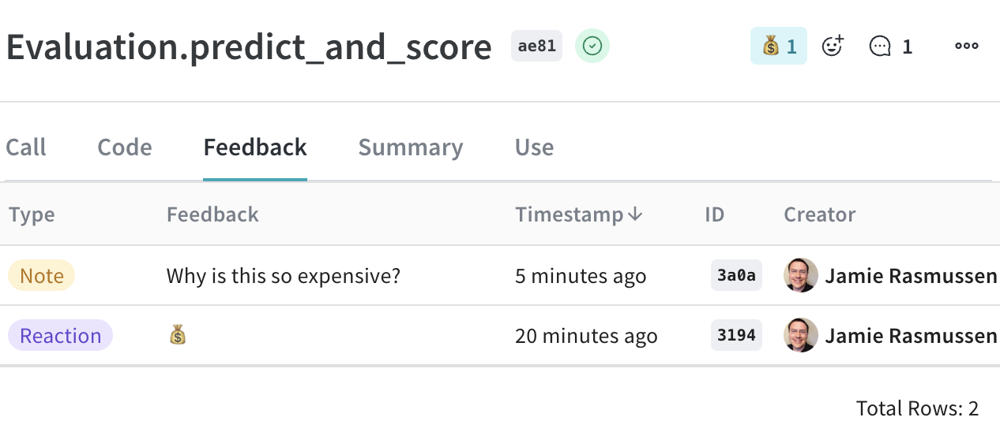
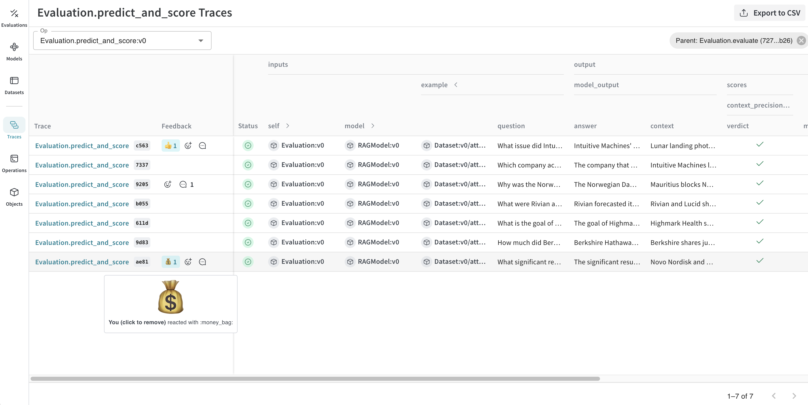
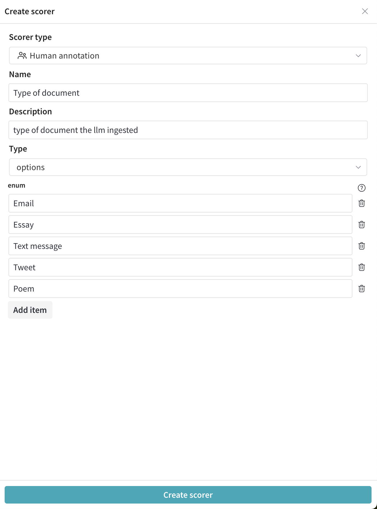
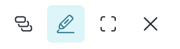
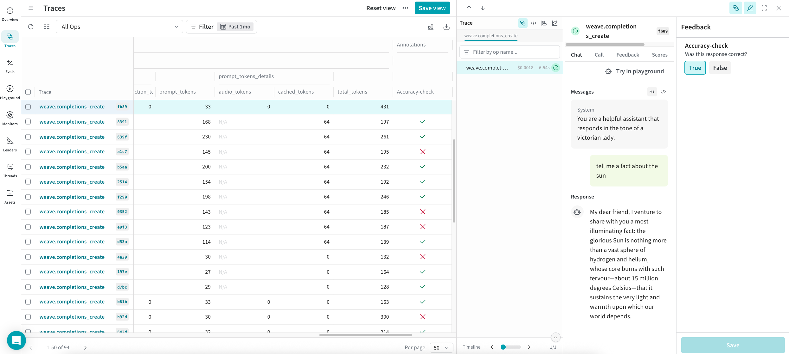
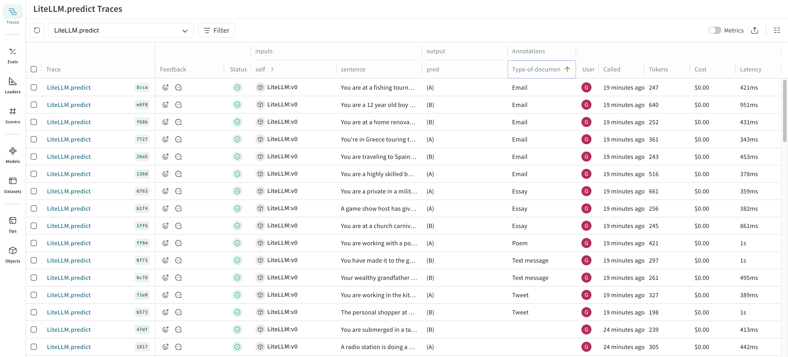
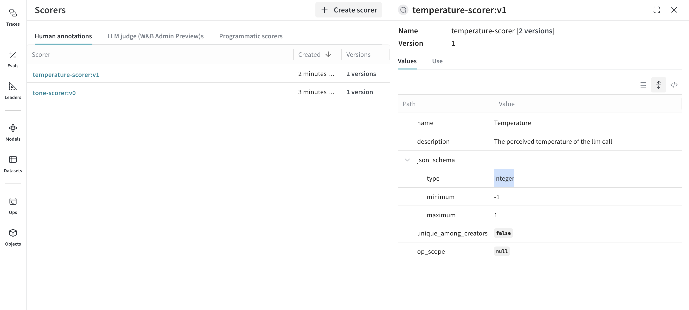

import Tabs from '@theme/Tabs';
import TabItem from '@theme/TabItem';

# Feedback

Efficiently evaluating LLM applications requires robust tooling to collect and analyze feedback. Weave provides an integrated feedback system, allowing users to provide call feedback directly through the UI or programmatically via the SDK. Various feedback types are supported, including emoji reactions, textual comments, and structured data, enabling teams to:

- Build evaluation datasets for performance monitoring.
- Identify and resolve LLM content issues effectively.
- Gather examples for advanced tasks like fine-tuning.

This guide covers how to use Weave’s feedback functionality in both the UI and SDK, query and manage feedback, and use human annotations for detailed evaluations.

- [Provide feedback in the UI](#provide-feedback-in-the-ui)
- [Provide feedback via the SDK](#provide-feedback-via-the-sdk)
- [Add human annotations](#add-human-annotations)

## Provide feedback in the UI

In the Weave UI, you can add and view feedback [from the call details page](#from-the-call-details-page) or [using the icons](#use-the-icons).

### From the call details page

1. In the sidebar, navigate to **Traces**.
2. Find the row for the call that you want to add feedback to.
3. Open the call details page.
4. Select the **Feedback** column for the call.
5. Add, view, or delete feedback:
   - _[Add and view feedback using the icons](#use-the-icons)_ located in the upper right corner of the call details feedback view.
   - _View and delete feedback from the call details feedback table._ Delete feedback by clicking the trashcan icon in the rightmost column of the appropriate feedback row.



### Use the icons

You can add or remove a reaction, and add a note using the icons that are located in both the call table and individual call details pages.

- _Call table_: Located in **Feedback** column in the appropriate row in the call table.
- _Call details page_: Located in the upper right corner of each call details page.

To add a reaction:

1. Click the emoji icon.
2. Add a thumbs up, thumbs down, or click the **+** icon for more emojis.

To remove a reaction:

1. Hover over the emoji reaction you want to remove.
2. Click the reaction to remove it.

> You can also delete feedback from the [**Feedback** column on the call details page.](#from-the-call-details-page).

To add a comment:

1. Click the comment bubble icon.
2. In the text box, add your note.
3. To save the note, press the **Enter** key. You can add additional notes.



## Provide feedback via the SDK

> You can find SDK usage examples for feedback in the UI under the **Use** tab in the call details page.

You can use the Weave SDK to programmatically add, remove, and query feedback on calls.

### Query a project's feedback

You can query the feedback for your Weave project using the SDK. The SDK supports the following feedback query operations:

- `client.get_feedback()`: Returns all feedback in a project.
- `client.get_feedback("<feedback_uuid>")`: Return a specific feedback object specified by `<feedback_uuid>` as a collection.
- `client.get_feedback(reaction="<reaction_type>")`: Returns all feedback objects for a specific reaction type.

You can also get additional information for each feedback object in `client.get_feedback()`:

- `id`: The feedback object ID.
- `created_at`: The creation time information for the feedback object.
- `feedback_type`: The type of feedback (reaction, note, custom).
- `payload`: The feedback payload

<Tabs groupId="programming-language" queryString>
  <TabItem value="python" label="Python" default>
    ```python
    import weave
    client = weave.init('intro-example')

    # Get all feedback in a project
    all_feedback = client.get_feedback()

    # Fetch a specific feedback object by id.
    # The API returns a collection, which is expected to contain at most one item.
    one_feedback = client.get_feedback("<feedback_uuid>")[0]

    # Find all feedback objects with a specific reaction. You can specify offset and limit.
    thumbs_up = client.get_feedback(reaction="👍", limit=10)

    # After retrieval, view the details of individual feedback objects.
    for f in client.get_feedback():
        print(f.id)
        print(f.created_at)
        print(f.feedback_type)
        print(f.payload)
    ```

  </TabItem>
  <TabItem value="typescript" label="TypeScript">
    ```plaintext
    This feature is not available in TypeScript yet.  Stay tuned!
    ```
  </TabItem>
</Tabs>

### Add feedback to a call

You can add feedback to a call using the call's UUID. To use the UUID to get a particular call, [retrieve it during or after call execution](#retrieve-the-call-uuid). The SDK supports the following operations for adding feedback to a call:

- `call.feedback.add_reaction("<reaction_type>")`: Add one of the supported `<reaction_types>` (emojis), such as 👍.
- `call.feedback.add_note("<note>")`: Add a note.
- `call.feedback.add("<label>", <object>)`: Add a custom feedback `<object>` specified by `<label>`.

<Tabs groupId="programming-language" queryString>
  <TabItem value="python" label="Python" default>
    ```python
    import weave
    client = weave.init('intro-example')

    call = client.get_call("<call_uuid>")

    # Adding an emoji reaction
    call.feedback.add_reaction("👍")

    # Adding a note
    call.feedback.add_note("this is a note")

    # Adding custom key/value pairs.
    # The first argument is a user-defined "type" string.
    # Feedback must be JSON serializable and less than 1 KB when serialized.
    call.feedback.add("correctness", { "value": 5 })
    ```

  </TabItem>
  <TabItem value="typescript" label="TypeScript">
    ```plaintext
    This feature is not available in TypeScript yet.  Stay tuned!
    ```
  </TabItem>
</Tabs>

#### Retrieve the call UUID

For scenarios where you need to add feedback immediately after a call, you can retrieve the call UUID programmatically during or after the call execution.

- [During call execution](#during-call-execution)
- [After call execution](#after-call-execution)

##### During call execution

To retrieve the UUID during call execution, get the current call, and return the ID.

<Tabs groupId="programming-language" queryString>
  <TabItem value="python" label="Python" default>
    ```python

    import weave
    weave.init("uuid")

    @weave.op()
    def simple_operation(input_value):
        # Perform some simple operation
        output = f"Processed {input_value}"
        # Get the current call ID
        current_call = weave.require_current_call()
        call_id = current_call.id
        return output, call_id
    ```

  </TabItem>
  <TabItem value="typescript" label="TypeScript">
    ```plaintext
    This feature is not available in TypeScript yet.  Stay tuned!
    ```
  </TabItem>
</Tabs>

##### After call execution

Alternatively, you can use `call()` method to execute the operation and retrieve the ID after call execution:

<Tabs groupId="programming-language" queryString>
  <TabItem value="python" label="Python" default>
    ```python
    import weave
    weave.init("uuid")

    @weave.op()
    def simple_operation(input_value):
        return f"Processed {input_value}"

    # Execute the operation and retrieve the result and call ID
    result, call = simple_operation.call("example input")
    call_id = call.id
    ```

  </TabItem>
  <TabItem value="typescript" label="TypeScript">
    ```plaintext
    This feature is not available in TypeScript yet.  Stay tuned!
    ```
  </TabItem>
</Tabs>

### Delete feedback from a call

You can delete feedback from a particular call by specifying a UUID.

<Tabs groupId="programming-language" queryString>
  <TabItem value="python" label="Python" default>
    ```python
    call.feedback.purge("<feedback_uuid>")
    ```
  </TabItem>
  <TabItem value="typescript" label="TypeScript">
    ```plaintext
    This feature is not available in TypeScript yet.  Stay tuned!
    ```
  </TabItem>
</Tabs>

## Add human annotations

Human annotations are supported in the Weave UI. To make human annotations, you must first create a Human Annotation scorer using either the [UI](#create-a-human-annotation-scorer-in-the-ui) or the [API](#create-a-human-annotation-scorer-using-the-api). Then, you can [use the scorer in the UI to make annotations](#use-the-human-annotation-scorer-in-the-ui), and [modify your annotation scorers using the API](#modify-a-human-annotation-scorer-using-the-api).

### Create a human annotation scorer in the UI

To create a human annotation scorer in the UI, do the following:

1. In the sidebar, navigate to **Scorers**.
2. In the upper right corner, click **+ Create scorer**.
3. In the configuration page, set:
   - `Scorer type` to `Human annotation`
   - `Name`
   - `Description`
   - `Type`, which determines the type of feedback that will be collected, such as `boolean` or `integer`.
4. Click **Create scorer**. Now, you can [use your scorer to make annotations](#use-the-human-annotation-scorer-in-the-ui).

In the following example, a human annotator is asked to select which type of document the LLM ingested. As such, the `Type` selected for the score configuration is an `enum` containing the possible document types.



### Use the human annotation scorer in the UI

Once you [create a human annotation scorer](#create-a-human-annotation-scorer-in-the-ui), it will automatically display in the **Feedback** sidebar of the call details page with the configured options. To use the scorer, do the following:

1. In the sidebar, navigate to **Traces**
2. Find the row for the call that you want to add a human annotation to.
3. Open the call details page.
4. In the upper right corner, click the **Show feedback** button.

   

   Your available human annotation scorers display in the sidebar.

   

5. Make an annotation.
6. Click **Save**.
7. In the call details page, click **Feedback** to view the calls table. The new annotation displays in the table. You can also view the annotations in the **Annotations** column in the call table in **Traces**.

   > Refresh the call table to view the most up-to-date information.



### Create a human annotation scorer using the API

Human annotation scorers can also be created through the API. Each scorer is its own object, which is created and updated independently. To create a human annotation scorer programmatically, do the following:

1. Import the `AnnotationSpec` class from `weave.flow.annotation_spec`
2. Use the `save` method on the weave client to create the scorer.

In the following example, two scorers are created. The first scorer, `Temperature`, is used to score the perceived temperature of the LLM call. The second scorer, `Tone`, is used to score the tone of the LLM response. Each scorer is created using `save` with an associated object ID (`temperature-scorer` and `tone-scorer`).

<Tabs groupId="programming-language" queryString>
  <TabItem value="python" label="Python" default>
    ```python
    import weave
    from weave.flow.annotation_spec import AnnotationSpec

    client = weave.init("feedback-example")

    spec1 = AnnotationSpec(
      name="Temperature",
      description="The perceived temperature of the llm call",
      field_schema={
        "type": "number",
        "minimum": -1,
        "maximum": 1,
      }
    )
    spec2 = AnnotationSpec(
      name="Tone",
      description="The tone of the llm response",
      field_schema={
        "type": "string",
        "enum": ["Aggressive", "Neutral", "Polite", "N/A"],
      },
    )
    weave.publish(spec1, "temperature-scorer")
    weave.publish(spec2, "tone-scorer")
    ```

  </TabItem>
  <TabItem value="typescript" label="TypeScript">
    ```plaintext
    This feature is not available in TypeScript yet.  Stay tuned!
    ```
  </TabItem>
</Tabs>

### Modify a human annotation scorer using the API

Expanding on [creating a human annotation scorer using the API](#create-a-human-annotation-scorer-using-the-api), the following example creates an updated version of the `Temperature` scorer, by using the original object ID (`temperature-scorer`) on `save`. The result is an updated object, with a history of all versions.

> You can view human annotation scorer object history in the **Scorers** tab under **Human annotations**.

<Tabs groupId="programming-language" queryString>
  <TabItem value="python" label="Python" default>
    ```python
    import weave
    from weave.flow.annotation_spec import AnnotationSpec

    client = weave.init("feedback-example")

    # create a new version of the scorer
    spec1 = AnnotationSpec(
      name="Temperature",
      description="The perceived temperature of the llm call",
      field_schema={
        "type": "integer",  # <<- change type to integer
        "minimum": -1,
        "maximum": 1,
      }
    )
    weave.publish(spec1, "temperature-scorer")
    ```

  </TabItem>
  <TabItem value="typescript" label="TypeScript">
    ```plaintext
    This feature is not available in TypeScript yet.  Stay tuned!
    ```
  </TabItem>
</Tabs>



### Use a human annotation scorer using the API

The feedback API allows you to use a human annotation scorer by specifying a specially constructed name and an `annotation_ref` field. You can obtain the `annotation_spec_ref` from the UI by selecting the appropriate tab, or during the creation of the `AnnotationSpec`.

<Tabs groupId="programming-language" queryString>
  <TabItem value="python" label="Python" default>
    ```python
    import weave

    client = weave.init("feedback-example")

    call = client.get_call("<call_id>")
    annotation_spec = weave.ref("<annotation_spec_ref_uri>")

    call.feedback.add(
      feedback_type="wandb.annotation." + annotation_spec.name,
      payload={"value": 1},
      annotation_ref=annotation_spec.uri(),
    )
    ```

  </TabItem>
</Tabs>
