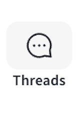
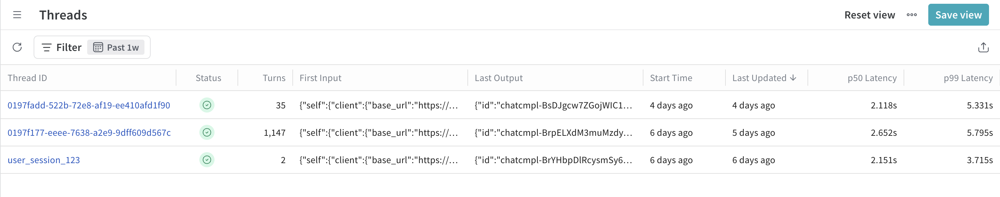
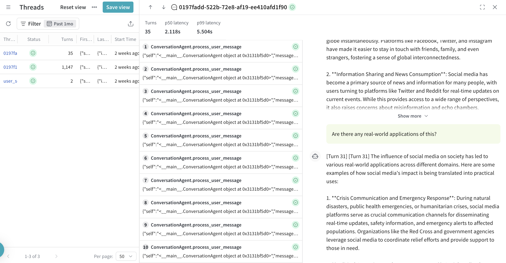
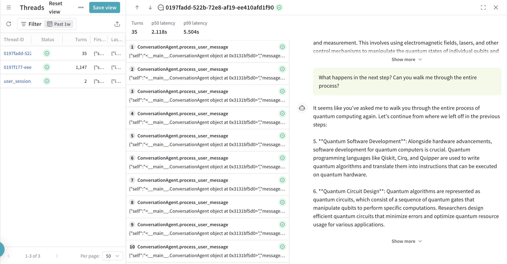

# Threads

With _Threads_, you can track and analyze multi-turn conversations in your LLM applications. Threads group related calls under a shared `thread_id`, allowing you to visualize complete sessions and track conversation-level metrics across turns. You can create threads programmatically, and visualize them in the Weave UI.

To get started with Threads, do the following:

1. Familiarize yourself with the basics of Threads.
   - [Use cases](#use-cases)
   - [Definitions](#definitions)
   - [The UI experience](#ui-overview)
   - [API specification](#api-specification)
2. Try the code samples, which demonstrate common usage patterns and real-world use cases.
   - [Basic usage examples](#basic-thread-creation)
- [Advanced usage examples](#manual-agent-loop-implementation)

## Use cases

Threads are useful when you want to organize and analyze:

- Multi-turn conversations
- Session-based workflows
- Any sequence of related operations. 

Threads let you group calls by context, making it easier to understand how your system responds across multiple steps. For example, you can track a single user session, an agent’s chain of decisions, or a complex request that spans infrastructure and business logic layers.

By structuring your application with threads and turns, you get cleaner metrics and better visibility in the Weave UI. Instead of seeing every low-level operation, you can focus on the high-level steps that matter.

## Definitions

### Thread

A _Thread_ is a logical grouping of related calls that share a common conversational context. A Thread:

- Has a unique `thread_id`
- Contains one or more _turns_
- Maintains context across calls
- Represent complete user sessions or interaction flows

### Turn

A _Turn_ is a high-level operation within a Thread, displayed in the UI as individual rows in a thread view. Each Turn:

- Represents one logical step in a conversation or workflow
- Turns are the direct children of a thread context and may include nested lower-level calls (not shown in thread-level stats).

### Call

A _Call_ is any `@weave.op`-decorated function execution in your application.

- _Turn calls_ are top-level operations that start new turns
- _Nested calls_ are lower-level operations within a turn

### Trace

A _Trace_ captures the full call stack for a single operation. Threads group traces together that are part of the same logical conversation or session. In other words, a thread is made up of multiple turns, each representing one part in the conversation. For more information on Traces, see the [Tracing overview](tracing.mdx).

## UI overview

In the Weave sidebar, select **Threads** to access the [Threads list view](#threads-list-view). 



### Threads list view

- Lists recent threads in your project
- Columns include number of turns, start time, and last updated
- Click a row to open its [detail drawer](#threads-detail-drawer)



### Threads detail drawer

- Click any row to open the detail drawer for that row
- Shows all turns within a thread. 
- Turns are listed in the order they started (based on their start time, not by duration or end time).
- Includes call-level metadata (latency, inputs, outputs)
- Optionally shows message content or structured data if logged
- To view the full execution of a turn, you can open it from the thread detail drawer. This lets you drill into all nested operations that occurred during that specific turn.
- If a turn includes messages extracted from LLM calls, they will appear in the right-hand chat pane. These messages typically come from calls made by supported integrations (e.g., `openai.ChatCompletion.create`) and must meet specific criteria to display. For more information, see [Chat view behavior](#chat-view-behavior).

### Chat view behavior

The chat pane displays structured message data extracted from LLM calls made during each turn. This view gives you a conversational-style rendering of the interaction.



#### What qualifies as a message?

Messages are extracted from calls within a turn that represent direct interactions with LLM providers (e.g., sending a prompt and receiving a response). Only calls that are not further nested inside other calls are shown as messages. This avoids duplicating intermediate steps or aggregated internal logic.

Typically, messages are emitted by automatically patched third-party SDKs like:
- `openai.ChatCompletion.create`
- `anthropic.Anthropic.completion`

#### What happens if no messages are present?

If a turn doesn't emit any messages, the chat pane will show an empty message section for that turn. However, the chat pane may still include messages from other turns in the same thread.

#### Turn and Chat interactions

- Clicking a turn scrolls the chat pane to that turn's message location (pinning behavior).
- Scrolling the chat pane highlights the corresponding turn in the left-hand list.

#### Navigate to and from the trace view

You can open the full trace for a turn by clicking into it.

A back button appears in the upper left corner to return to the thread detail view. UI state (like scroll position) is not preserved across the transition.



## SDK usage

Each example in this section demonstrates a different strategy for organizing turns and threads in your application. For most examples, you should provide your own LLM call or system behavior inside the stub functions.

- To track a session or conversation, use the `weave.thread()` context manager.
- Decorate logical operations with `@weave.op` to track them as turns or nested calls.
- If you pass a `thread_id`, Weave uses it to group all operations in that block under the same thread. If you omit the `thread_id`, Weave auto-generates a unique one for you.

The return value from `weave.thread()` is a `ThreadContext` object with a `thread_id` property, which you can log, reuse, or pass to other systems.

Nested `weave.thread()` contexts always start a new thread unless the same `thread_id` is reused. Ending a child context does not interrupt or overwrite the parent context. This allows for forked thread structures or layered thread orchestration, depending on your app logic.

### Basic thread creation

The following code sample demonstrates how to use `weave.thread()` to group one or more operations under a shared `thread_id`. This is the simplest way to start using Threads in your application.

```python
import weave

@weave.op
def say_hello(name: str) -> str:
    return f"Hello, {name}!"

# Start a new thread context
with weave.thread() as thread_ctx:
    print(f"Thread ID: {thread_ctx.thread_id}")
    say_hello("Bill Nye the Science Guy")
```


### Manual agent loop implementation 

This example shows how to manually define a conversational agent using `@weave.op` decorators and `weave.thread()` context management. Each call to `process_user_message` creates a new turn in the thread. You can use this pattern when building your own agent loop and want full control over how context and nesting are handled.

Use the auto-generated thread ID for short-lived interactions, or pass a custom session ID (like `user_session_123`) to persist thread context across sessions.

```python
import weave

class ConversationAgent:
    @weave.op
    def process_user_message(self, message: str) -> str:
        """
        TURN-LEVEL OPERATION: This represents one conversation turn.
        Only this function will be counted in thread statistics.
        """
        # Store user message
        # Generate AI response through nested calls
        response = self._generate_response(message)
        # Store assistant response
        return response

    @weave.op
    def _generate_response(self, message: str) -> str:
        """NESTED CALL: Implementation details, not counted in thread stats."""
        context = self._retrieve_context(message)     # Another nested call
        intent = self._classify_intent(message)       # Another nested call
        response = self._call_llm(message, context)   # LLM call (nested)
        return self._format_response(response)        # Final nested call

    @weave.op
    def _retrieve_context(self, message: str) -> str:
        # Vector DB lookup, knowledge base query, etc.
        return "retrieved_context"

    @weave.op
    def _classify_intent(self, message: str) -> str:
        # Intent classification logic
        return "general_inquiry"

    @weave.op
    def _call_llm(self, message: str, context: str) -> str:
        # OpenAI/Anthropic/etc API call
        return "llm_response"

    @weave.op
    def _format_response(self, response: str) -> str:
        # Response formatting logic
        return f"Formatted: {response}"

# Usage: Thread context established automatically
agent = ConversationAgent()

# Establish thread context - each process_user_message call becomes a turn
with weave.thread() as thread_ctx:  # Auto-generates thread_id
    print(f"Thread ID: {thread_ctx.thread_id}")

    # Each call to process_user_message creates 1 turn + multiple nested calls
    agent.process_user_message("Hello, help with setup")           # Turn 1
    agent.process_user_message("What languages do you recommend?") # Turn 2
    agent.process_user_message("Explain Python vs JavaScript")     # Turn 3

# Result: Thread with 3 turns, ~15-20 total calls (including nested)

# Alternative: Use explicit thread_id for session tracking
session_id = "user_session_123"
with weave.thread(session_id) as thread_ctx:
    print(f"Session Thread ID: {thread_ctx.thread_id}")  # "user_session_123"

    agent.process_user_message("Continue our previous conversation")  # Turn 1 in this session
    agent.process_user_message("Can you summarize what we discussed?") # Turn 2 in this session
```

### Manual agent with unbalanced call depth 

This example demonstrates that turns can be defined at different depths in the call stack depending on how thread context is applied. The sample uses two providers (OpenAI and Anthropic), each with a different call depth before reaching the turn boundary.

All turns share the same `thread_id`, but the turn boundary appears at different levels in the stack depending on the provider logic. This is useful when calls need to be traced differently for different backends, while still grouping them into the same thread.

```python 
import weave
import random
import asyncio

class OpenAIProvider:
    """OpenAI branch: 2 levels deep call chain to turn boundary"""

    @weave.op
    def route_to_openai(self, user_input: str, thread_id: str) -> str:
        """Level 1: Route and prepare OpenAI request"""
        # Input validation, routing logic, basic preprocessing
        print(f"  L1: Routing to OpenAI for: {user_input}")

        # Call Level 2 directly - this creates the call chain depth
        return self.execute_openai_call(user_input, thread_id)

    @weave.op
    def execute_openai_call(self, user_input: str, thread_id: str) -> str:
        """Level 2: TURN BOUNDARY - Execute OpenAI API call"""
        print(f"    L2: Executing OpenAI API call")

        # This is the turn boundary - wrap with thread context
        with weave.thread(thread_id):
            response = f"OpenAI GPT-4 response: {user_input}"
            return response


class AnthropicProvider:
    """Anthropic branch: 3 levels deep call chain to turn boundary"""

    @weave.op
    def route_to_anthropic(self, user_input: str, thread_id: str) -> str:
        """Level 1: Route and prepare Anthropic request"""
        # Input validation, routing logic, provider selection
        print(f"  L1: Routing to Anthropic for: {user_input}")

        # Call Level 2 - this creates call chain depth
        return self.authenticate_anthropic(user_input, thread_id)

    @weave.op
    def authenticate_anthropic(self, user_input: str, thread_id: str) -> str:
        """Level 2: Handle Anthropic authentication and setup"""
        print(f"    L2: Authenticating with Anthropic")

        # Authentication, rate limiting, session management
        auth_token = "anthropic_key_xyz_authenticated"

        # Call Level 3 - further nesting the call chain
        return self.execute_anthropic_call(user_input, auth_token, thread_id)

    @weave.op
    def execute_anthropic_call(self, user_input: str, auth_token: str, thread_id: str) -> str:
        """Level 3: TURN BOUNDARY - Execute Anthropic API call"""
        print(f"      L3: Executing Anthropic API call with auth")

        # This is the turn boundary - wrap with thread context at Level 3
        with weave.thread(thread_id):
            response = f"Anthropic Claude response (auth: {auth_token[:15]}...): {user_input}"
            return response


class MultiProviderAgent:
    """Main agent that routes between providers with different call chain depths"""

    def __init__(self):
        self.openai_provider = OpenAIProvider()
        self.anthropic_provider = AnthropicProvider()

    def handle_conversation_turn(self, user_input: str, thread_id: str) -> str:
        """
        Route to different providers with imbalanced call chain depths.
        Thread context is applied at different nesting levels in each chain.
        """
        # Randomly choose provider for demonstration
        use_openai = random.choice([True, False])

        if use_openai:
            print(f"Choosing OpenAI (2-level call chain)")
            # OpenAI: Level 1 → Level 2 (turn boundary)
            response = self.openai_provider.route_to_openai(user_input, thread_id)
            return f"[OpenAI Branch] {response}"
        else:
            print(f"Choosing Anthropic (3-level call chain)")
            # Anthropic: Level 1 → Level 2 → Level 3 (turn boundary)
            response = self.anthropic_provider.route_to_anthropic(user_input, thread_id)
            return f"[Anthropic Branch] {response}"


async def main():
    agent = MultiProviderAgent()
    conversation_id = "nested_depth_conversation_999"

    # Multi-turn conversation with different call chain depths
    conversation_turns = [
        "What's deep learning?",
        "Explain neural network backpropagation",
        "How do attention mechanisms work?",
        "What's the transformer architecture?",
        "Compare CNNs vs RNNs"
    ]

    print(f"Starting conversation: {conversation_id}")

    for i, user_input in enumerate(conversation_turns, 1):
        print(f"\\n--- Turn {i} ---")
        print(f"User: {user_input}")

        # Same thread_id used across different call chain depths
        response = agent.handle_conversation_turn(user_input, conversation_id)
        print(f"Agent: {response}")

if __name__ == "__main__":
    asyncio.run(main())

# Expected Result: Single thread with 5 turns
# - OpenAI turns: thread context at Level 2 in call chain
#   Call stack: route_to_openai() → execute_openai_call() ← thread context here
# - Anthropic turns: thread context at Level 3 in call chain
#   Call stack: route_to_anthropic() → authenticate_anthropic() → execute_anthropic_call() ← thread context here
# - All turns share thread_id: "nested_depth_conversation_999"
# - Turn boundaries marked at different call stack depths
# - Supporting operations in call chain tracked as nested calls, not turns
```

### Nested threads 

This example illustrates how to structure complex applications using multiple coordinated threads.

Each layer runs in its own thread context, allowing for clean separation of concerns. The parent application thread coordinates these layers by setting up thread IDs using a shared `ThreadContext`. Use this pattern when you want to analyze or monitor different parts of the system independently while still tying them to a shared session.

```python
import weave
from contextlib import contextmanager
from typing import Dict

# Global thread context for coordinating nested threads
class ThreadContext:
    def __init__(self):
        self.app_thread_id = None
        self.infra_thread_id = None
        self.logic_thread_id = None

    def setup_for_request(self, request_id: str):
        self.app_thread_id = f"app_{request_id}"
        self.infra_thread_id = f"{self.app_thread_id}_infra"
        self.logic_thread_id = f"{self.app_thread_id}_logic"

# Global instance
thread_ctx = ThreadContext()

class InfrastructureLayer:
    """Handles all infrastructure operations in a dedicated thread"""

    @weave.op
    def authenticate_user(self, user_id: str) -> Dict:
        # Authentication logic...
        return {"user_id": user_id, "authenticated": True}

    @weave.op
    def call_payment_gateway(self, amount: float) -> Dict:
        # Payment processing...
        return {"status": "approved", "amount": amount}

    @weave.op
    def update_inventory(self, product_id: str, quantity: int) -> Dict:
        # Inventory management...
        return {"product_id": product_id, "updated": True}

    def execute_operations(self, user_id: str, order_data: Dict) -> Dict:
        """Execute all infrastructure operations in dedicated thread context"""
        with weave.thread(thread_ctx.infra_thread_id):
            auth_result = self.authenticate_user(user_id)
            payment_result = self.call_payment_gateway(order_data["amount"])
            inventory_result = self.update_inventory(order_data["product_id"], order_data["quantity"])

            return {
                "auth": auth_result,
                "payment": payment_result,
                "inventory": inventory_result
            }


class BusinessLogicLayer:
    """Handles business logic in a dedicated thread"""

    @weave.op
    def validate_order(self, order_data: Dict) -> Dict:
        # Validation logic...
        return {"valid": True}

    @weave.op
    def calculate_pricing(self, order_data: Dict) -> Dict:
        # Pricing calculations...
        return {"total": order_data["amount"], "tax": order_data["amount"] * 0.08}

    @weave.op
    def apply_business_rules(self, order_data: Dict) -> Dict:
        # Business rules...
        return {"rules_applied": ["standard_processing"], "priority": "normal"}

    def execute_logic(self, order_data: Dict) -> Dict:
        """Execute all business logic in dedicated thread context"""
        with weave.thread(thread_ctx.logic_thread_id):
            validation = self.validate_order(order_data)
            pricing = self.calculate_pricing(order_data)
            rules = self.apply_business_rules(order_data)

            return {"validation": validation, "pricing": pricing, "rules": rules}


class OrderProcessingApp:
    """Main application orchestrator"""

    def __init__(self):
        self.infra = InfrastructureLayer()
        self.business = BusinessLogicLayer()

    @weave.op
    def process_order(self, user_id: str, order_data: Dict) -> Dict:
        """Main order processing - becomes a turn in the app thread"""

        # Execute nested operations in their dedicated threads
        infra_results = self.infra.execute_operations(user_id, order_data)
        logic_results = self.business.execute_logic(order_data)

        # Final orchestration
        return {
            "order_id": f"order_12345",
            "status": "completed",
            "infra_results": infra_results,
            "logic_results": logic_results
        }


# Usage with global thread context coordination
def handle_order_request(request_id: str, user_id: str, order_data: Dict):
    # Setup thread context for this request
    thread_ctx.setup_for_request(request_id)

    # Execute in app thread context
    with weave.thread(thread_ctx.app_thread_id):
        app = OrderProcessingApp()
        result = app.process_order(user_id, order_data)
        return result

# Example usage
order_result = handle_order_request(
    request_id="req_789",
    user_id="user_001",
    order_data={"product_id": "laptop", "quantity": 1, "amount": 1299.99}
)

# Expected Thread Structure:
#
# App Thread: app_req_789
# └── Turn: process_order() ← Main orchestration
#
# Infra Thread: app_req_789_infra
# ├── Turn: authenticate_user() ← Infrastructure operation 1
# ├── Turn: call_payment_gateway() ← Infrastructure operation 2
# └── Turn: update_inventory() ← Infrastructure operation 3
#
# Logic Thread: app_req_789_logic
# ├── Turn: validate_order() ← Business logic operation 1
# ├── Turn: calculate_pricing() ← Business logic operation 2
# └── Turn: apply_business_rules() ← Business logic operation 3
#
# Benefits:
# - Clear separation of concerns across threads
# - No parameter drilling of thread IDs
# - Independent monitoring of app/infra/logic layers
# - Global coordination through thread context
```

## API specification

## Endpoint

Endpoint: `POST /threads/query`

### Request schema

```python
class ThreadsQueryReq:
    project_id: str
    limit: Optional[int] = None
    offset: Optional[int] = None
    sort_by: Optional[list[SortBy]] = None  # Supported fields: thread_id, turn_count, start_time, last_updated
    sortable_datetime_after: Optional[datetime] = None   # Filter threads by granule optimization
    sortable_datetime_before: Optional[datetime] = None  # Filter threads by granule optimization
```

### Response schema

```python
class ThreadSchema:
    thread_id: str           # Unique identifier for the thread
    turn_count: int          # Number of turn calls in this thread
    start_time: datetime     # Earliest start time of turn calls in this thread
    last_updated: datetime   # Latest end time of turn calls in this thread

class ThreadsQueryRes:
    threads: List[ThreadSchema]
```

### Query recent active threads

This example fetches the 50 most recently updated threads. Replace `my-project` with your actual project ID.

```python
# Get most recently active threads
response = client.threads_query(ThreadsQueryReq(
    project_id="my-project",
    sort_by=[SortBy(field="last_updated", direction="desc")],
    limit=50
))

for thread in response.threads:
    print(f"Thread {thread.thread_id}: {thread.turn_count} turns, last active {thread.last_updated}")
```

### Query threads by activity level

This example fetches the 20 most active threads, ordered by number of turns.

```python
# Get threads with most activity (most turns)
response = client.threads_query(ThreadsQueryReq(
    project_id="my-project",
    sort_by=[SortBy(field="turn_count", direction="desc")],
    limit=20
))
```

### Query recent threads only

This example returns threads that started in the past 24 hours. You can change the time window by adjusting the value of `days` in `timedelta`.

```python
from datetime import datetime, timedelta

# Get threads started in the last 24 hours
yesterday = datetime.now() - timedelta(days=1)
response = client.threads_query(ThreadsQueryReq(
    project_id="my-project",
    sortable_datetime_after=yesterday,
    sort_by=[SortBy(field="start_time", direction="desc")]
))
```