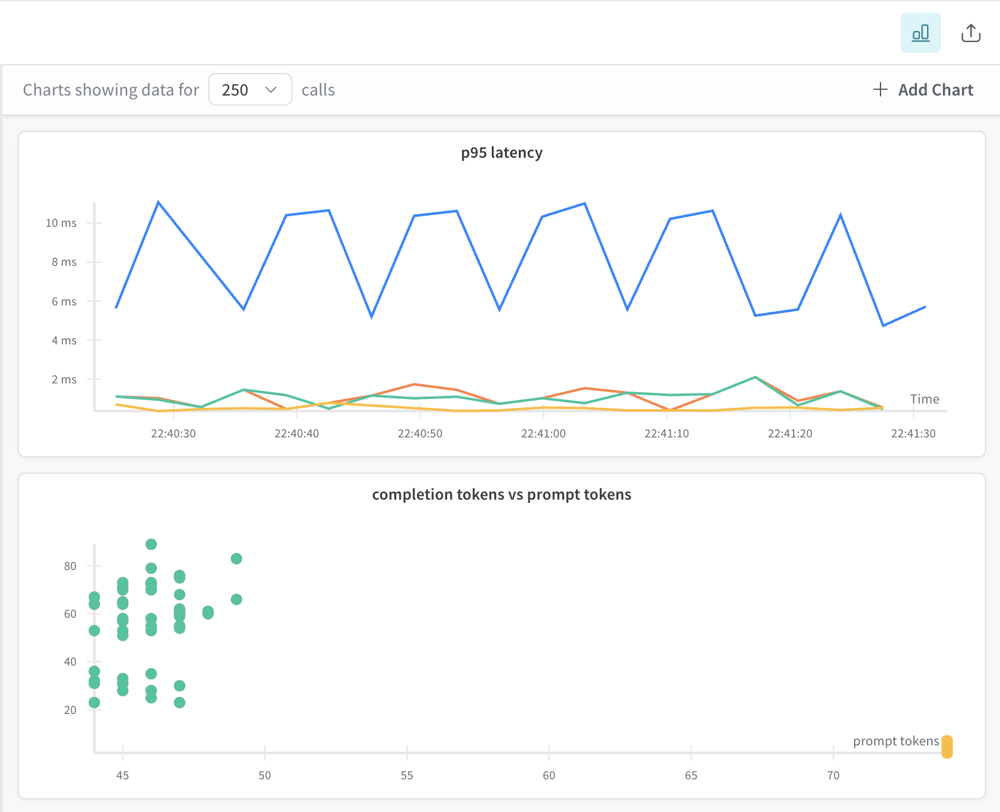
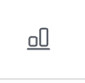
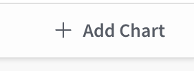
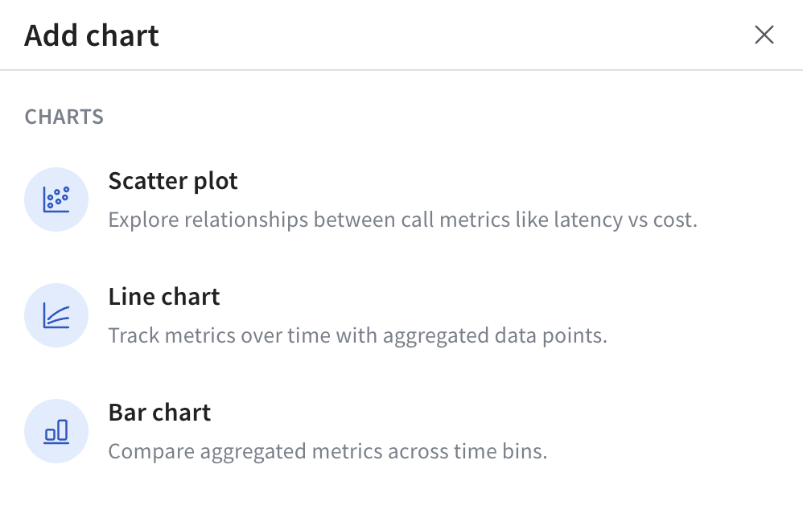

# Trace Plots

The _trace plots_ tool in W&B Weave allows you to explore, visualize, and debug trace-level metrics (e.g. latency, cost, tokens) using interactive charts. You can use the default trace plots or create your own via the custom trace plot builder.

## Get started

1. Navigate to your project’s **Traces** page.
2. (Optional) Select **Filter** to filter selected traces (e.g. by datetime or operation).
3. In the upper right hand corner of the **Traces** view, click the **Show Metrics** icon to open the trace plots side pane. 

    

    From here, you can:
   - View the [default trace plots](#default-trace-plots).
   - Create a [custom trace plots](#create-a-custom-trace-plot).
4. Charts update dynamically based on your trace filters and selections.

## Default trace plots

When you first open the trace plots panel, Weave auto-generates a few trace plots based on your available project trace data:

- Bar chart (cost or latency grouped over time bins)
- Line chart (latency over time)
- Scatter plot (e.g. prompt tokens vs. completion tokens)

Each trace plot is interactive:

- Hover for tooltips
- Drag to zoom
- Double-click to reset
- Click points in scatter plots to open a specific trace

## Create a custom trace plot

You can also create custom trace plot. To create a custom trace plot, do the following:

1. From the trace plots side pane, click **➕ Add Chart** .

    

2. In the pop-up, select one of the available trace plot types:

    
    
3. For the selected trace plot type, configure your trace plot. For information on configuration options by trace plot type, see [Trace plot settings by plot type](#trace-plot-settings-by-plot-type).
4. Click **Save chart** to save your chart.

### Trace plot settings by plot type

When adding or editing a custom trace plot, the available configuration options vary slightly depending on the selected trace plot type. The table provides a breakdown of the configurable options.

| Setting         | Scatter Plot         | Line Chart           | Bar Chart            |
| --------------- | -------------------- | -------------------- | -------------------- |
| Y-axis      | ✅ Required           | ✅ Required           | ✅ Required           |
| X-axis      | ✅ Selectable         | Fixed (`started at`) | Fixed (`started at`) |
| Grouping    | ✅ Optional           | ✅ Optional           | ✅ Optional           |
| Binning     | ❌ Not used           | ✅ Used               | ✅ Used               |
| Aggregation | ❌ Not used           | ✅ Used               | ✅ Used               |
