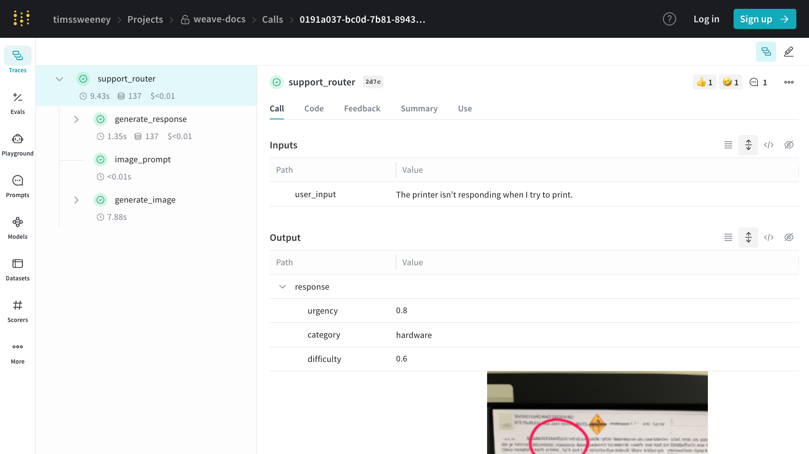

import Tabs from '@theme/Tabs';
import TabItem from '@theme/TabItem';
import { DesktopWindow } from '../../../src/components/DesktopImage'
import TracingCallsMacroImage from '@site/static/img/screenshots/calls_macro.png';
import TracingCallsFilterImage from '@site/static/img/screenshots/calls_filter.png';
import BasicCallImage from '@site/static/img/screenshots/basic_call.png';


# Calls

<DesktopWindow 
  images={[
    TracingCallsMacroImage,
    BasicCallImage,
    TracingCallsFilterImage,
  ]}
  alt="Screenshot of Weave Calls"
  title="Weave Calls"
/>

:::info[Calls]
Calls are the fundamental building block in Weave. They represent a single execution of a function, including:
- Inputs (arguments)
- Outputs (return value) 
- Metadata (duration, exceptions, LLM usage, etc.)

Calls are similar to spans in the [OpenTelemetry](https://opentelemetry.io) data model. A Call can:
- Belong to a Trace (a collection of calls in the same execution context)
- Have parent and child Calls, forming a tree structure
:::

## Creating Calls

There are three main ways to create Calls in Weave:

### 1. Automatic Tracking of LLM Libraries


<Tabs groupId="programming-language">
  <TabItem value="python" label="Python" default>
    Weave automatically tracks [calls to common LLM libraries](../integrations/index.md) like `openai`, `anthropic`, `cohere`, and `mistral`. Simply call [`weave.init('project_name')`](../../reference/python-sdk/weave/index.md#function-init) at the start of your program:

    ```python showLineNumbers
    import weave

    from openai import OpenAI
    client = OpenAI()

    # Initialize Weave Tracing
    weave.init('intro-example')

    response = client.chat.completions.create(
        model="gpt-4",
        messages=[
            {
                "role": "user",
                "content": "How are you?"
            }
        ],
        temperature=0.8,
        max_tokens=64,
        top_p=1,
    )
    ```

  </TabItem>
  <TabItem value="typescript" label="TypeScript">
    Weave automatically tracks [calls to common LLM libraries](../integrations/index.md) like `openai`. Simply call [`await weave.init('project_name')`](../../reference/typescript-sdk/weave/functions/init.md) and wrap your OpenAI client with [`weave.wrapOpenAI`](../../reference/typescript-sdk/weave/functions/wrapOpenAI.md) at the start of your program:

    ```typescript showLineNumbers
    import OpenAI from 'openai'
    import * as weave from 'weave'

    const client = weave.wrapOpenAI(new OpenAI())

    // Initialize Weave Tracing
    await weave.init('intro-example')

    const response = await client.chat.completions.create({
      model: 'gpt-4',
      messages: [
        {
          role: 'user',
          content: 'How are you?',
        },
      ],
      temperature: 0.8,
      max_tokens: 64,
      top_p: 1,
    });
    ```

  </TabItem>
</Tabs>


### 2. Decorating/Wrapping Functions

However, often LLM applications have additional logic (such as pre/post processing, prompts, etc.) that you want to track.

<Tabs groupId="programming-language">
  <TabItem value="python" label="Python" default>
    Weave allows you to manually track these calls using the [`@weave.op`](../../reference/python-sdk/weave/index.md#function-op) decorator. For example:

    ```python showLineNumbers
    import weave

    # Initialize Weave Tracing
    weave.init('intro-example')

    # Decorate your function
    @weave.op
    def my_function(name: str):
        return f"Hello, {name}!"

    # Call your function -- Weave will automatically track inputs and outputs
    print(my_function("World"))
    ```

    This works for both functions as well as methods on classes:


    ```python showLineNumbers
    import weave

    # Initialize Weave Tracing
    weave.init("intro-example")

    class MyClass:
        # Decorate your method
        @weave.op
        def my_method(self, name: str):
            return f"Hello, {name}!"

    instance = MyClass()

    # Call your method -- Weave will automatically track inputs and outputs
    print(instance.my_method("World"))
    ```
  </TabItem>
  <TabItem value="typescript" label="TypeScript">
    Weave allows you to manually track these calls by wrapping your function with [`weave.op`](../../reference/typescript-sdk/weave/functions/op.md). For example:

    ```typescript showLineNumbers
    import * as weave from 'weave'

    await weave.init('intro-example')

    function myFunction(name: string) {
        return `Hello, ${name}!`
    }

    const myFunctionOp = weave.op(myFunction)
    ```

    You can also define the wrapping inline:

    ```typescript
    const myFunctionOp = weave.op((name: string) => `Hello, ${name}!`)
    ```

    This works for both functions as well as methods on classes:

    ```typescript
    class MyClass {
        constructor() {
            this.myMethod = weave.op(this.myMethod)
        }

        myMethod(name: string) {
            return `Hello, ${name}!`
        }
    }
    ```
  </TabItem>
</Tabs>


#### Getting a handle to the Call object during execution

<Tabs groupId="programming-language">
  <TabItem value="python" label="Python" default>
    Sometimes it is useful to get a handle to the `Call` object itself. You can do this by calling the `op.call` method, which returns both the result and the `Call` object. For example:

    ```python showLineNumbers
    result, call = my_function.call("World")
    ```

    Then, `call` can be used to set / update / fetch additional properties (most commonly used to get the ID of the call to be used for feedback).

    :::note
    If your op is a method on a class, you need to pass the instance as the first argument to the op (see example below).
    :::

    ```python showLineNumbers
    # Notice that we pass the `instance` as the first argument.
    print(instance.my_method.call(instance, "World"))
    ```


    ```python showLineNumbers
    import weave

    # Initialize Weave Tracing
    weave.init("intro-example")

    class MyClass:
        # Decorate your method
        @weave.op
        def my_method(self, name: str):
            return f"Hello, {name}!"

    instance = MyClass()

    # Call your method -- Weave will automatically track inputs and outputs
    instance.my_method.call(instance, "World")
    ```
  </TabItem>
  <TabItem value="typescript" label="TypeScript">
    ```plaintext
    This feature is not available in TypeScript yet.  Stay tuned!
    ```
  </TabItem>
</Tabs>


#### Call Display Name

<Tabs groupId="programming-language">
  <TabItem value="python" label="Python" default>
    Sometimes you may want to override the display name of a call. You can achieve this in one of four ways:

    1. Change the display name at the time of calling the op:

    ```python showLineNumbers
    result = my_function("World", __weave={"display_name": "My Custom Display Name"})
    ```

    :::note

    Using the `__weave` dictionary sets the call display name which will take precedence over the Op display name.

    :::

    2. Change the display name on a per-call basis. This uses the [`Op.call`](../../reference/python-sdk/weave/trace/weave.trace.op.md#function-call) method to return a `Call` object, which you can then use to set the display name using [`Call.set_display_name`](../../reference/python-sdk/weave/trace/weave.trace.weave_client.md#method-set_display_name).
    ```python showLineNumbers
    result, call = my_function.call("World")
    call.set_display_name("My Custom Display Name")
    ```

    3. Change the display name for all Calls of a given Op:

    ```python showLineNumbers
    @weave.op(call_display_name="My Custom Display Name")
    def my_function(name: str):
        return f"Hello, {name}!"
    ```

    4. The `call_display_name` can also be a function that takes in a `Call` object and returns a string.  The `Call` object will be passed automatically when the function is called, so you can use it to dynamically generate names based on the function's name, call inputs, attributes, etc.

    1. One common use case is just appending a timestamp to the function's name.

        ```py
        from datetime import datetime

        @weave.op(call_display_name=lambda call: f"{call.func_name}__{datetime.now()}")
        def func():
            return ...
        ```

    2. You can also get creative with custom attributes

        ```py
        def custom_attribute_name(call):
            model = call.attributes["model"]
            revision = call.attributes["revision"]
            now = call.attributes["date"]

            return f"{model}__{revision}__{now}"

        @weave.op(call_display_name=custom_attribute_name)
        def func():
            return ...

        with weave.attributes(
            {
                "model": "finetuned-llama-3.1-8b",
                "revision": "v0.1.2",
                "date": "2024-08-01",
            }
        ):
            func()  # the display name will be "finetuned-llama-3.1-8b__v0.1.2__2024-08-01"


            with weave.attributes(
                {
                    "model": "finetuned-gpt-4o",
                    "revision": "v0.1.3",
                    "date": "2024-08-02",
                }
            ):
                func()  # the display name will be "finetuned-gpt-4o__v0.1.3__2024-08-02"
        ```


    **Technical Note:** "Calls" are produced by "Ops". An Op is a function or method that is decorated with `@weave.op`. 
    By default, the Op's name is the function name, and the associated calls will have the same display name. The above example shows how to override the display name for all Calls of a given Op.  Sometimes, users wish to override the name of the Op itself. This can be achieved in one of two ways:

    1. Set the `name` property of the Op before any calls are logged
    ```python showLineNumbers
    my_function.name = "My Custom Op Name"
    ```

    2. Set the `name` option on the op decorator
    ```python showLineNumbers
    @weave.op(name="My Custom Op Name)
    ```
  </TabItem>
  <TabItem value="typescript" label="TypeScript">
    ```plaintext
    This feature is not available in TypeScript yet.  Stay tuned!
    ```
  </TabItem>
</Tabs>


#### Attributes

<Tabs groupId="programming-language">
  <TabItem value="python" label="Python" default>
    When calling tracked functions, you can add additional metadata to the call by using the [`weave.attributes`](../../reference/python-sdk/weave/index.md#function-attributes) context manager. In the example below, we add an `env` attribute to the call specified as `'production'`.

    ```python showLineNumbers
    # ... continued from above ...

    # Add additional "attributes" to the call
    with weave.attributes({'env': 'production'}):
        print(my_function.call("World"))
    ```

  </TabItem>
  <TabItem value="typescript" label="TypeScript">
    ```plaintext
    This feature is not available in TypeScript yet.  Stay tuned!
    ```
  </TabItem>
</Tabs>

### 3. Manual Call Tracking

You can also manually create Calls using the API directly.

<Tabs groupId="programming-language">
    <TabItem value="python" label="Python" default>

        ```python showLineNumbers
        import weave

        # Initialize Weave Tracing
        client = weave.init('intro-example')

        def my_function(name: str):
            # Start a call
            call = client.create_call(op="my_function", inputs={"name": name})

            # ... your function code ...

            # End a call
            client.finish_call(call, output="Hello, World!")

        # Call your function
        print(my_function("World"))
        ```

    </TabItem>
    <TabItem value="typescript" label="TypeScript">

    ```plaintext
    This feature is not available in TypeScript yet.  Stay tuned!
    ```

    </TabItem>

    <TabItem value="service_api" label="HTTP API">
    * Start a call: [POST `/call/start`](../../reference/service-api/call-start-call-start-post.api.mdx)
    * End a call: [POST `/call/end`](../../reference/service-api/call-end-call-end-post.api.mdx)
    ```bash
    curl -L 'https://trace.wandb.ai/call/start' \
    -H 'Content-Type: application/json' \
    -H 'Accept: application/json' \
    -d '{
        "start": {
            "project_id": "string",
            "id": "string",
            "op_name": "string",
            "display_name": "string",
            "trace_id": "string",
            "parent_id": "string",
            "started_at": "2024-09-08T20:07:34.849Z",
            "attributes": {},
            "inputs": {},
            "wb_run_id": "string"
        }
    }
    ```
    </TabItem>
</Tabs>


## Viewing Calls
<Tabs groupId="programming-language">
    <TabItem value="web_app" label="Web App">
    To view a call in the web app:
    1. Navigate to your project's "Traces" tab
    2. Find the call you want to view in the list
    3. Click on the call to open its details page
    
    The details page will show the call's inputs, outputs, runtime, and any additional attributes or metadata.
    
    
    </TabItem>
    <TabItem value="python_sdk" label="Python">
    To view a call using the Python API, you can use the [`get_call`](../../reference/python-sdk/weave/trace/weave.trace.weave_client#method-get_call) method:

    ```python
    import weave

    # Initialize the client
    client = weave.init("your-project-name")

    # Get a specific call by its ID
    call = client.get_call("call-uuid-here")

    print(call)
    ```

    </TabItem>
    <TabItem value="typescript" label="TypeScript">
    ```typescript showLineNumbers
    import * as weave from 'weave'

    // Initialize the client
    const client = await weave.init('intro-example')

    // Get a specific call by its ID
    const call = await client.getCall('call-uuid-here')

    console.log(call)
    ```
    </TabItem>

    <TabItem value="service_api" label="HTTP API">
    To view a call using the Service API, you can make a request to the [`/call/read`](../../reference/service-api/call-read-call-read-post.api.mdx) endpoint.

    ```bash
    curl -L 'https://trace.wandb.ai/call/read' \
    -H 'Content-Type: application/json' \
    -H 'Accept: application/json' \
    -d '{
        "project_id": "string",
        "id": "string",
    }'
    ```
    </TabItem>
</Tabs>


## Updating Calls

Calls are mostly immutable once created, however, there are a few mutations which are supported:
* [Set Display Name](#set-display-name)
* [Add Feedback](#add-feedback)
* [Delete a Call](#delete-a-call)

All of these mutations can be performed from the UI by navigating to the call detail page:


### Set Display Name

<Tabs groupId="client-layer">
    <TabItem value="python_sdk" label="Python">
    In order to set the display name of a call, you can use the [`Call.set_display_name`](../../reference/python-sdk/weave/trace/weave.trace.weave_client.md#method-set_display_name) method.

    ```python showLineNumbers
    import weave

    # Initialize the client
    client = weave.init("your-project-name")

    # Get a specific call by its ID
    call = client.get_call("call-uuid-here")

    # Set the display name of the call
    call.set_display_name("My Custom Display Name")
    ```
    </TabItem>
    <TabItem value="typescript" label="TypeScript">
    ```plaintext
    This feature is not available in TypeScript yet.  Stay tuned!
    ```
    </TabItem>
    <TabItem value="service_api" label="HTTP API">
    To set the display name of a call using the Service API, you can make a request to the [`/call/update`](../../reference/service-api/call-update-call-update-post.api.mdx) endpoint.

    ```bash
    curl -L 'https://trace.wandb.ai/call/update' \
    -H 'Content-Type: application/json' \
    -H 'Accept: application/json' \
    -d '{
        "project_id": "string",
        "call_id": "string",
        "display_name": "string",
    }'
    ```
    </TabItem>
</Tabs>

### Add Feedback 

Please see the [Feedback Documentation](./feedback.md) for more details.

### Delete a Call

<Tabs groupId="client-layer">
    <TabItem value="python_sdk" label="Python">
    To delete a call using the Python API, you can use the [`Call.delete`](../../reference/python-sdk/weave/trace/weave.trace.weave_client.md#method-delete) method.

    ```python showLineNumbers
    import weave

    # Initialize the client
    client = weave.init("your-project-name")

    # Get a specific call by its ID
    call = client.get_call("call-uuid-here")
    
    # Delete the call
    call.delete()
    ```

    </TabItem>
    <TabItem value="typescript" label="TypeScript">
    ```plaintext
    This feature is not available in TypeScript yet.  Stay tuned!
    ```
    </TabItem>
    <TabItem value="service_api" label="HTTP API">
    To delete a call using the Service API, you can make a request to the [`/calls/delete`](../../reference/service-api/calls-delete-calls-delete-post.api.mdx) endpoint.

    ```bash
    curl -L 'https://trace.wandb.ai/calls/delete' \
    -H 'Content-Type: application/json' \
    -H 'Accept: application/json' \
    -d '{
        "project_id": "string",
        "call_ids": [
            "string"
        ],
    }'
    ```
    </TabItem>
</Tabs>

## Querying & Exporting Calls

<DesktopWindow 
  images={[
    TracingCallsFilterImage,
  ]}
  alt="Screenshot of many calls"
  title="Weave Calls"
/>

The `/calls` page of your project ("Traces" tab) contains a table view of all the Calls in your project. From there, you can:
* Sort
* Filter
* Export


The Export Modal (shown above) allows you to export your data in a number of formats, as well as shows the Python & CURL equivalents for the selected calls!
The easiest way to get started is to construct a view in the UI, then learn more about the export API via the generated code snippets.


<Tabs groupId="client-layer">
    <TabItem value="python_sdk" label="Python">
    To fetch calls using the Python API, you can use the [`client.get_calls`](../../reference/python-sdk/weave/trace/weave.trace.weave_client.md#method-get_calls) method:

    ```python
    import weave

    # Initialize the client
    client = weave.init("your-project-name")

    # Fetch calls
    calls = client.get_calls(filter=...)
    ```

    </TabItem>
    <TabItem value="typescript" label="TypeScript">
    To fetch calls using the TypeScript API, you can use the [`client.getCalls`](../../reference/typescript-sdk/weave/classes/WeaveClient#getcalls) method.
    ```typescript
    import * as weave from 'weave'

    // Initialize the client
    const client = await weave.init('intro-example')

    // Fetch calls
    const calls = await client.getCalls(filter=...)
    ```
    </TabItem>
    <TabItem value="service_api" label="HTTP API">
    The most powerful query layer is at the Service API. To fetch calls using the Service API, you can make a request to the [`/calls/stream_query`](../../reference/service-api/calls-query-stream-calls-stream-query-post.api.mdx) endpoint.

    ```bash
    curl -L 'https://trace.wandb.ai/calls/stream_query' \
    -H 'Content-Type: application/json' \
    -H 'Accept: application/json' \
    -d '{
    "project_id": "string",
    "filter": {
        "op_names": [
            "string"
        ],
        "input_refs": [
            "string"
        ],
        "output_refs": [
            "string"
        ],
        "parent_ids": [
            "string"
        ],
        "trace_ids": [
            "string"
        ],
        "call_ids": [
            "string"
        ],
        "trace_roots_only": true,
        "wb_user_ids": [
            "string"
        ],
        "wb_run_ids": [
            "string"
        ]
    },
    "limit": 100,
    "offset": 0,
    "sort_by": [
        {
        "field": "string",
        "direction": "asc"
        }
    ],
    "query": {
        "$expr": {}
    },
    "include_costs": true,
    "include_feedback": true,
    "columns": [
        "string"
    ],
    "expand_columns": [
        "string"
    ]
    }'
    ```
    </TabItem>
</Tabs>

{/* ## Compare Calls

:::info[Comming Soon]
::: */}

### Call Schema

Please see the [schema](../../reference/python-sdk/weave/trace_server/weave.trace_server.trace_server_interface#class-callschema) for a complete list of fields.


| Property | Type | Description |
|----------|------|-------------|
| id | string (uuid) | Unique identifier for the call |
| project_id | string (optional) | Associated project identifier |
| op_name | string | Name of the operation (can be a reference) |
| display_name | string (optional) | User-friendly name for the call |
| trace_id | string (uuid) | Identifier for the trace this call belongs to |
| parent_id | string (uuid) | Identifier of the parent call |
| started_at | datetime | Timestamp when the call started |
| attributes | Dict[str, Any] | User-defined metadata about the call |
| inputs | Dict[str, Any] | Input parameters for the call |
| ended_at | datetime (optional) | Timestamp when the call ended |
| exception | string (optional) | Error message if the call failed |
| output | Any (optional) | Result of the call |
| summary | Optional[SummaryMap] | Post-execution summary information |
| wb_user_id | Optional[str] | Associated Weights & Biases user ID |
| wb_run_id | Optional[str] | Associated Weights & Biases run ID |
| deleted_at | datetime (optional) | Timestamp of call deletion, if applicable |

The table above outlines the key properties of a Call in Weave. Each property plays a crucial role in tracking and managing function calls:

- The `id`, `trace_id`, and `parent_id` fields help in organizing and relating calls within the system.
- Timing information (`started_at`, `ended_at`) allows for performance analysis.
- The `attributes` and `inputs` fields provide context for the call, while `output` and `summary` capture the results.
- Integration with Weights & Biases is facilitated through `wb_user_id` and `wb_run_id`.

This comprehensive set of properties enables detailed tracking and analysis of function calls throughout your project.


Calculated Fields:
    * Cost
    * Duration
    * Status

## FAQs

### How do I disable tracing?

**Environment Variable:**

In situations where you want to unconditionally disable tracing for the entire program, you can set the environment variable `WEAVE_DISABLED=true`.

**Client Initialization:**

Sometimes, you may want to conditionally enable tracing for a specific initialization based on some condition. In this case, you can initialize the client with the `disabled` flag in init settings.

```python
import weave

# Initialize the client
client = weave.init(..., settings={"disabled": True})
```

**Context Manager:**

Finally, you may want to conditionally disable tracing for a single function based on some application logic. In this case, you can use the context manager `with set_tracing_enabled(False)` which can be imported from `weave.trace.context.call_context`.

```python
import weave
from weave.trace.context.call_context import set_tracing_enabled

client = weave.init(...)

@weave.op
def my_op():
    ...

with set_tracing_enabled(False):
    my_op()
```

### How do I capture information about a call?

Typically you would call an op directly:

```python
@weave.op
def my_op():
    ...

my_op()
```

However, you can also get access to the call object directly by invoking the `call` method on the op:

```python
@weave.op
def my_op():
    ...

output, call = my_op.call()
```

From here, the `call` object will have all the information about the call, including the inputs, outputs, and other metadata.

