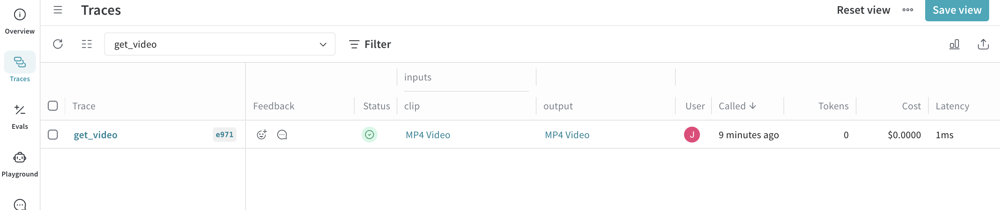
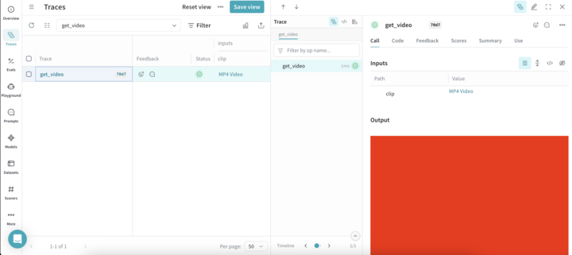

# Video Support

Weave automatically logs videos using [`moviepy`](https://zulko.github.io/moviepy/). This allows you to pass video inputs and outputs to traced functions, and Weave will automatically handle uploading and storing video data.

:::note
Video support is currently only available in Python.
:::

## Supported video types

Weave recognizes `moviepy` video clip objects, such as:

- A `VideoFileClip` loaded from a video file
- In-memory clips like `ImageClip`, `ColorClip`, and `TextClip`

### Direct upload of file-based clips

If your clip is a `VideoFileClip` and has a valid filename with a supported extension, Weave will upload the file directly.

**Supported file extensions:**

- `.mp4`
- `.webm`
- `.gif`

### In-memory clip support

If the video object is in memory (no file on disk), Weave will encode it as an `.mp4` file and handle the upload automatically. This applies to clips of the following type:

- `ImageClip`
- `ColorClip`
- `TextClip`

## Example: Trace a video function

The following code sample demonstrates how to trace a video processing function in Weave. The code sample:

1. Initializes a Weave project `video-test`.
2. Defines a `get_video` function tracked as a `weave.op` that extracts a 1 second subclip of the loaded `VideoFileClip` as a `VideoClip`.
3. Uploads and tracks the clip in Weave.
4. Automatically generates a dummy MP4 video if none is found.

Before you can use the code sample, complete the prerequisites:

1. Install `weave` and `moviepy==1.0.3`.
2. Create a W&B account.

:::important
To avoid thread-safety issues, always pass the path to `VideoFileClip` objects instead of creating them outside the Weave `op`.
:::

```python
import os
import weave
from moviepy import VideoFileClip, ColorClip, VideoClip

# Update to your project name, or create a new project named 'video-test'
weave.init('video-test')

@weave.op
def get_video(clip: VideoFileClip) -> VideoClip:
    """Process a video by path rather than by passing the clip directly.

    This ensures that the VideoFileClip is created and managed within the
    Weave op's thread context, avoiding thread-safety issues.
    """
    new_clip = clip.subclip(0, 1)
    return new_clip

if __name__ == "__main__":
    os.makedirs("videos", exist_ok=True)

    # Update the path to point to your MP4 file
    video_path = './videos/example.mp4'

    # Generate a dummy video if it doesn't exist
    # Dummy video contents: A red square that displays for 5 seconds
    if not os.path.isfile(video_path):
        print("No video found. Creating dummy video...")
        dummy_clip = ColorClip(size=(640, 480), color=(255, 0, 0), duration=5)
        dummy_clip.write_videofile(video_path, fps=24)

    clip = VideoFileClip(video_path, has_mask=False, audio=True)
    get_video(clip) 
```

When the code sample runs successfully, you can view your video by clicking the link in the **Traces** table of your project.




