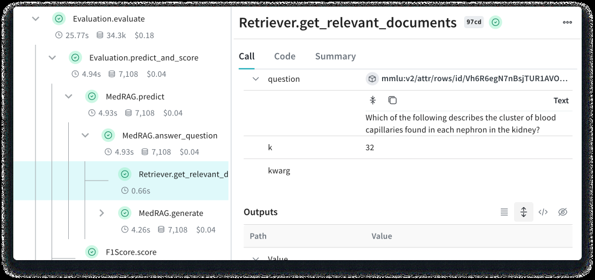

# Introduction

**Weave** is a lightweight toolkit for tracking and evaluating LLM applications, built by Weights & Biases.

Our goal is to bring rigor, best-practices, and composability to the inherently experimental process of developing AI applications, without introducing cognitive overhead.

**[Get started](/quickstart)** by decorating Python functions with `@weave.op()`.

Seriously, try the 🍪 **[quickstart](/quickstart)** 🍪 or 

You can use Weave to:

- Log and debug language model inputs, outputs, and traces
- Build rigorous, apples-to-apples evaluations for language model use cases
- Organize all the information generated across the LLM workflow, from experimentation to evaluations to production

## What's next?

- Try the **[Quickstart](/quickstart)** to see Weave in action.
- Check out our **[AI Academy](https://www.wandb.courses/pages/w-b-courses)** to learn how build an advanced RAG system, improve your LLM prompting, fine-tune an LLM, and more.
