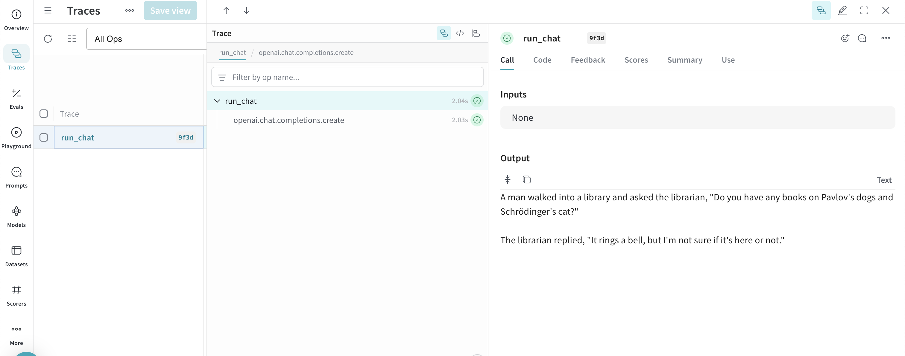

import Tabs from '@theme/Tabs';
import TabItem from '@theme/TabItem';

# Get started with W&B Inference

This guide shows you how to use W&B Weave with the W&B Inference service. You can build and trace LLM applications without setting up your own infrastructure or managing API keys from multiple providers.

## What you'll learn

In this guide, you'll:
- Set up Weave and the W&B Inference service
- Build a simple LLM application with automatic tracing
- Compare multiple models
- Evaluate model performance on a dataset
- View your results in the Weave UI

## Prerequisites

Before you begin, you need:
- A W&B account ([sign up free](https://app.wandb.ai/login?signup=true))
- Python 3.8 or later
- Basic Python knowledge

## Step 1: Install Weave

Install the required libraries:

```bash
pip install weave openai
```

Get your W&B API key from [https://wandb.ai/authorize](https://wandb.ai/authorize).

## Step 2: Make your first traced LLM call

Start with a simple example that uses Llama 3.1 8B through W&B Inference:

```python
import weave
import openai

# Initialize Weave - replace with your-team/your-project
weave.init("my-first-weave-project")

# Create an OpenAI-compatible client pointing to W&B Inference
client = openai.OpenAI(
    base_url='https://api.inference.wandb.ai/v1',
    api_key="YOUR_WANDB_API_KEY",  # Replace with your actual API key
    project="my-first-weave-project",  # Required for usage tracking
)

# Decorate your function to enable tracing
@weave.op()
def ask_llama(question: str) -> str:
    response = client.chat.completions.create(
        model="meta-llama/Llama-3.1-8B-Instruct",
        messages=[
            {"role": "system", "content": "You are a helpful assistant."},
            {"role": "user", "content": question}
        ],
    )
    return response.choices[0].message.content

# Call your function - Weave automatically traces everything
result = ask_llama("What are the benefits of using W&B Weave for LLM development?")
print(result)
```

When you run this code, Weave:
- Traces your LLM call automatically
- Logs inputs, outputs, latency, and token usage
- Provides a link to view your trace in the Weave UI

## Step 3: Build a text summarization application

Create a simple summarization app that shows how Weave traces nested operations:

```python
@weave.op()
def extract_key_points(text: str) -> list[str]:
    """Extract key points from a text."""
    response = client.chat.completions.create(
        model="meta-llama/Llama-3.1-8B-Instruct",
        messages=[
            {"role": "system", "content": "Extract 3-5 key points from the text. Return each point on a new line."},
            {"role": "user", "content": text}
        ],
    )
    return response.choices[0].message.content.strip().split('\n')

@weave.op()
def create_summary(text: str, key_points: list[str]) -> str:
    """Create a concise summary based on key points."""
    points_text = "\n".join([f"- {point}" for point in key_points])
    response = client.chat.completions.create(
        model="meta-llama/Llama-3.1-8B-Instruct",
        messages=[
            {"role": "system", "content": "Create a 2-3 sentence summary based on these key points."},
            {"role": "user", "content": f"Key points:\n{points_text}"}
        ],
    )
    return response.choices[0].message.content

@weave.op()
def summarize_text(text: str) -> dict:
    """Main summarization pipeline."""
    key_points = extract_key_points(text)
    summary = create_summary(text, key_points)
    return {
        "key_points": key_points,
        "summary": summary
    }

# Try it with sample text
sample_text = """
W&B Weave is a framework for building, tracking, and evaluating LLM applications. 
It provides automatic tracing of LLM calls, helps you understand costs and performance, 
and makes it easy to compare different models and prompts. With Weave, you can iterate 
faster on your AI applications by having full visibility into what's happening under the hood.
"""

result = summarize_text(sample_text)
print("Key Points:", result["key_points"])
print("\nSummary:", result["summary"])
```

## Step 4: Compare multiple models

W&B Inference provides access to multiple models. Compare their performance:

```python
# Define a Model class to compare different LLMs
class InferenceModel(weave.Model):
    model_name: str
    
    @weave.op()
    def predict(self, question: str) -> str:
        response = client.chat.completions.create(
            model=self.model_name,
            messages=[
                {"role": "user", "content": question}
            ],
        )
        return response.choices[0].message.content

# Create instances for different models
llama_model = InferenceModel(model_name="meta-llama/Llama-3.1-8B-Instruct")
deepseek_model = InferenceModel(model_name="deepseek-ai/DeepSeek-V3-0324")

# Compare their responses
test_question = "Explain quantum computing in one paragraph for a high school student."

print("Llama 3.1 8B response:")
print(llama_model.predict(test_question))
print("\n" + "="*50 + "\n")
print("DeepSeek V3 response:")
print(deepseek_model.predict(test_question))
```

## Step 5: Evaluate model performance

Evaluate how well different models perform on a Q&A task:

```python
# Create a simple dataset
dataset = [
    {"question": "What is 2 + 2?", "expected": "4"},
    {"question": "What is the capital of France?", "expected": "Paris"},
    {"question": "Name a primary color", "expected_one_of": ["red", "blue", "yellow"]},
]

# Define a scorer
@weave.op()
def accuracy_scorer(expected: str, output: str, expected_one_of: list[str] = None) -> dict:
    """Score the accuracy of the model output."""
    output_clean = output.strip().lower()
    
    if expected_one_of:
        is_correct = any(option.lower() in output_clean for option in expected_one_of)
    else:
        is_correct = expected.lower() in output_clean
    
    return {"correct": is_correct, "score": 1.0 if is_correct else 0.0}

# Evaluate a model
@weave.op()
def evaluate_model(model: InferenceModel, dataset: list[dict]) -> dict:
    """Run evaluation on a dataset."""
    scores = []
    
    for example in dataset:
        # Get model prediction
        output = model.predict(example["question"])
        
        # Score the output
        score = accuracy_scorer(
            expected=example.get("expected", ""),
            output=output,
            expected_one_of=example.get("expected_one_of")
        )
        scores.append(score["score"])
    
    return {
        "model": model.model_name,
        "accuracy": sum(scores) / len(scores),
        "total_correct": sum(scores),
        "total_examples": len(dataset)
    }

# Run evaluation
results = evaluate_model(llama_model, dataset)
print(f"Model: {results['model']}")
print(f"Accuracy: {results['accuracy']:.2%}")
print(f"Correct: {results['total_correct']}/{results['total_examples']}")
```

## Step 6: View your results in Weave

After running these examples, you'll see links in your terminal. Click any link to view traces in the Weave UI.

In the Weave UI, you can:
- See a timeline of all your LLM calls
- Inspect inputs and outputs for each operation
- View token usage and estimated costs
- Analyze latency and performance metrics
- Compare different runs



## Available models

W&B Inference provides access to many models including Llama 3.1 8B for general-purpose tasks, Llama 3.3 70B for complex reasoning, DeepSeek V3 for language processing, and Qwen3 235B for mathematical and structured reasoning. 

For a complete list of available models with specifications, context windows, pricing, and usage limits, see the [Available Models section](guides/tools/inference.md#available-models) in the W&B Inference reference documentation.

## Next steps

After completing this guide:

- **Use the Playground**: [Try models interactively](guides/tools/playground.md#access-the-playground) in the Weave Playground
- **Build evaluations**: Learn about [systematic evaluation](guides/core-types/evaluations.md) of your LLM applications
- **Try other integrations**: Weave works with [OpenAI, Anthropic, and many more](guides/integrations/index.md)
- **Deploy your app**: Use [Weave Serve](guides/tools/serve.md) to deploy your applications

## Troubleshooting

<details>
<summary>Authentication errors</summary>

If you get authentication errors:
1. Verify you have a valid W&B account
2. Check that you're using the correct API key from [wandb.ai/authorize](https://wandb.ai/authorize)
3. Ensure your project name follows the format `team-name/project-name`

</details>

<details>
<summary>Rate limit errors</summary>

W&B Inference has concurrency limits per project. If you hit rate limits:
- Reduce the number of concurrent requests
- Add delays between calls
- Consider upgrading your plan for higher limits

</details>

<details>
<summary>Running out of credits</summary>

The free tier includes limited credits. To continue using W&B Inference:
- Free users: [Upgrade to Pro](https://wandb.ai/subscriptions)
- Pro users: Usage is billed monthly after free credits (default cap: $6,000/month)
- Enterprise users: Contact your account executive

See the [pricing and limits documentation](guides/tools/inference.md#usage-information-and-limits) for details.

</details>