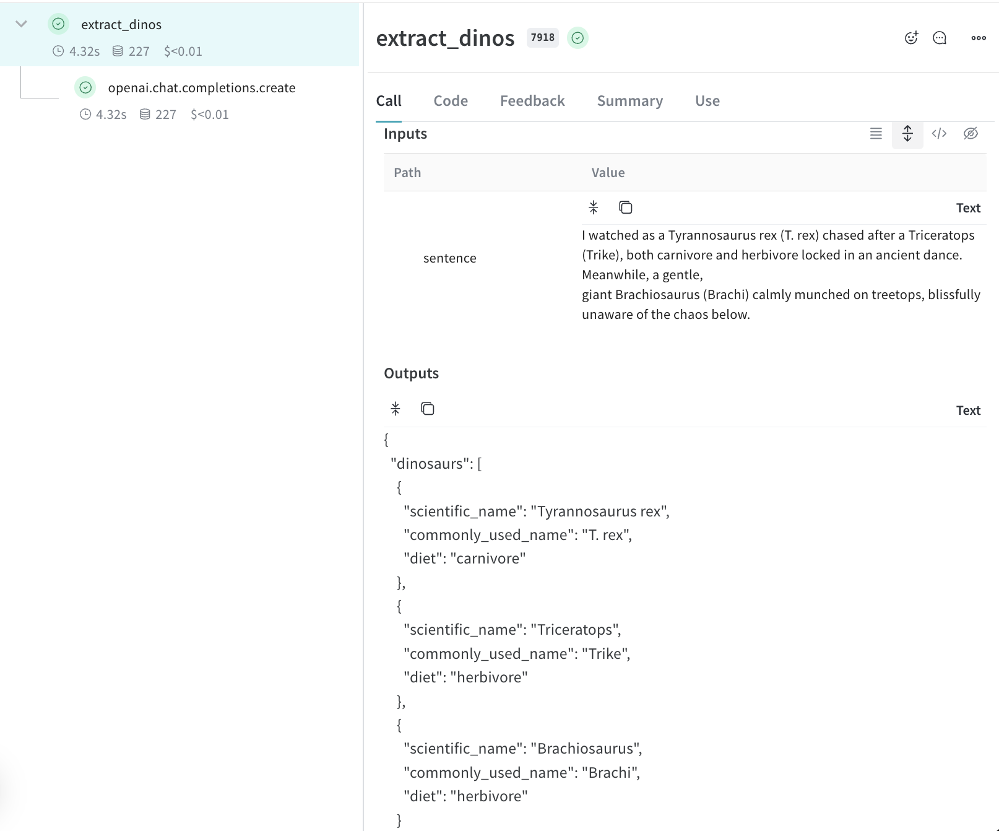

# Track LLM inputs & outputs

<!-- TODO: Update wandb.me/weave-quickstart to match this new link -->


Follow these steps to track your first call or <a class="vertical-align-colab-button" target="_blank" href="http://wandb.me/weave_colab"></a>

## 1. Install Weave and create an API Key

**Install weave**

First install the weave python library:

```python
pip install weave
```

**Get your API key**

Then, create a Weights & Biases (W&B) account here https://wandb.ai/site and copy your API key from https://wandb.ai/authorize

## 2. Log a trace to a new project

To get started with tracking your first project with Weave:

- Import the `weave` library
- Call `weave.init('project-name')` to start tracking
    - You will be prompted to log in with your API key if you are not yet logged in on your machine.
    - To log to a specific W&B Team name, replace `project-name` with `team-name/project-name`
- Add the `@weave.op()` decorator to the python functions you want to track

*In this example, we're using openai so you will need to add an OpenAI [API key](https://platform.openai.com/docs/quickstart/step-2-setup-your-api-key).*

```python
# highlight-next-line
import weave
from openai import OpenAI

client = OpenAI(api_key="...")

# Weave will track the inputs, outputs and code of this function
# highlight-next-line
@weave.op()
def extract_dinos(sentence: str) -> dict:
    response = client.chat.completions.create(
        model="gpt-4o",
        messages=[
            {
                "role": "system",
                "content": """In JSON format extract a list of `dinosaurs`, with their `name`, 
their `common_name`, and whether its `diet` is a herbivore or carnivore"""
            },
            {
                "role": "user",
                "content": sentence
            }
            ],
            response_format={ "type": "json_object" }
        )
    return response.choices[0].message.content


# Initialise the weave project
# highlight-next-line
weave.init('jurassic-park')

sentence = """I watched as a Tyrannosaurus rex (T. rex) chased after a Triceratops (Trike), \
both carnivore and herbivore locked in an ancient dance. Meanwhile, a gentle giant \
Brachiosaurus (Brachi) calmly munched on treetops, blissfully unaware of the chaos below."""

result = extract_dinos(sentence)
print(result)
```

When you call the `extract_dinos` function Weave will output a link to view your trace.

## 3. Automated LLM library logging

Calls made to OpenAI, Anthropic and [many more LLM libraries](guides/integrations/) are automatically tracked with Weave, with **LLM metadata**, **token usage** and **cost** being logged automatically. If your LLM library isn't currently one of our integrations you can track calls to other LLMs libraries or frameworks easily by wrapping them with `@weave.op()`.


## 4. See traces of your application in your project

🎉 Congrats! Now, every time you call this function, weave will automatically capture the input & output data and log any changes made to the code.




## What's next?

- Follow the [Tracking flows and app metadata](/tutorial-tracing_2) to start tracking and the data flowing through your app.
