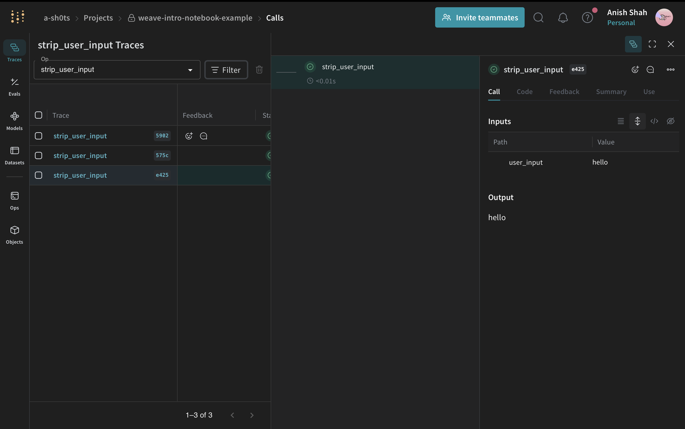
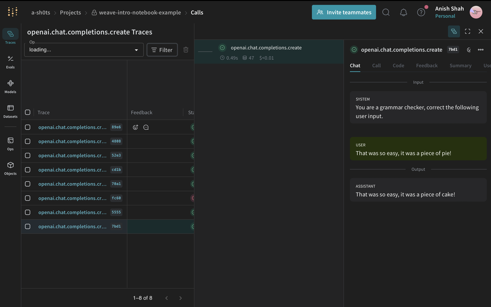
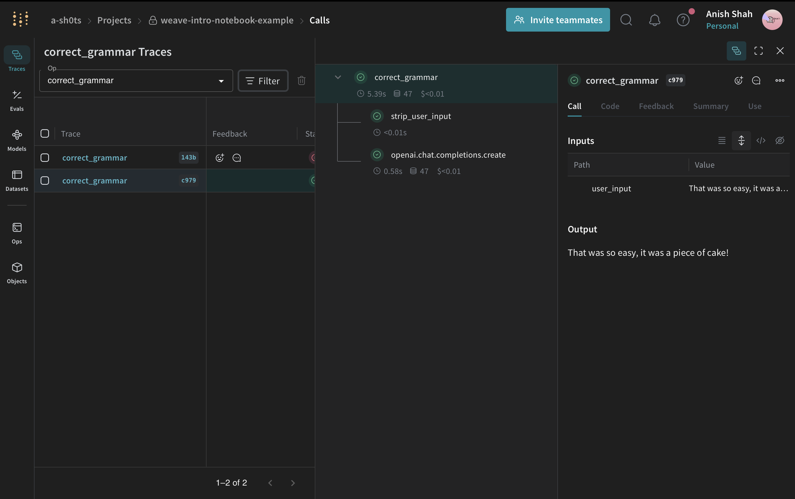
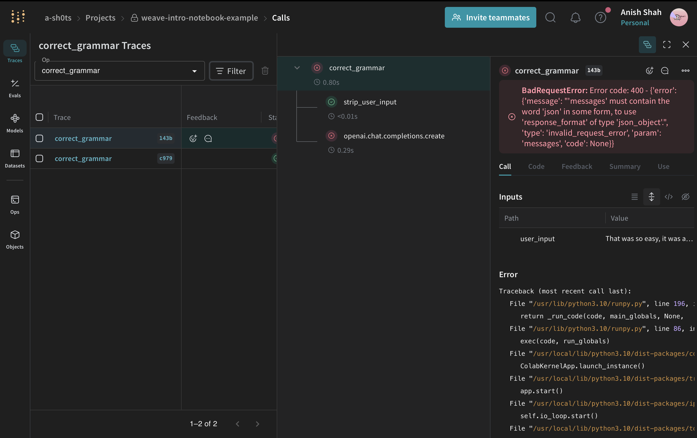
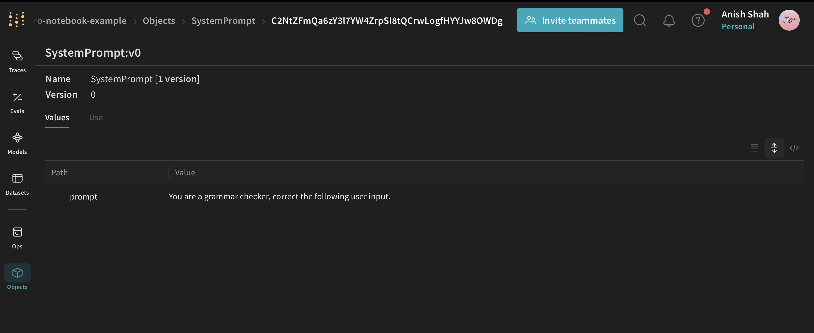
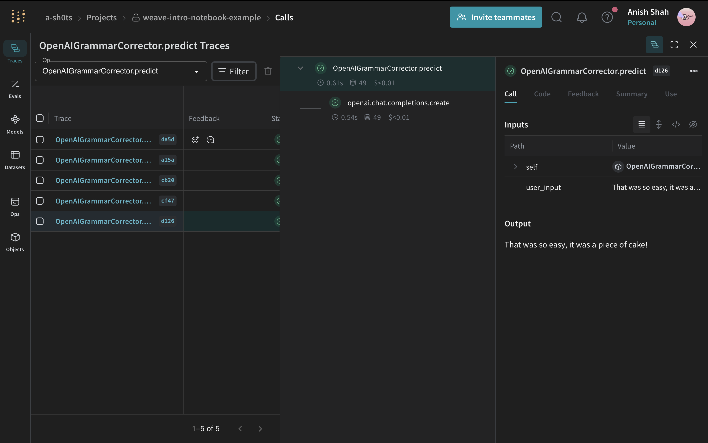
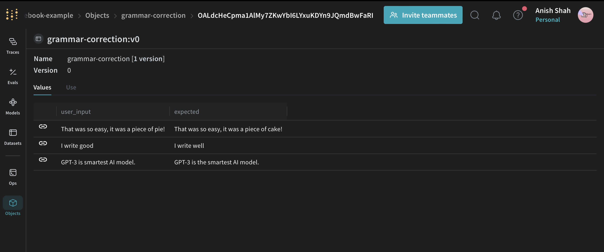
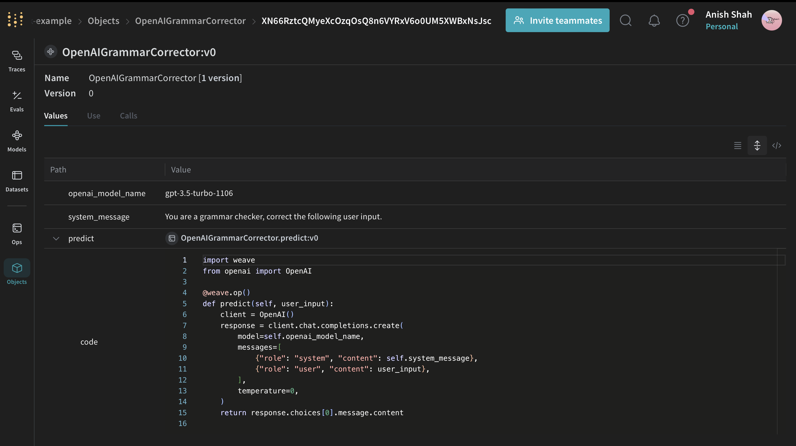
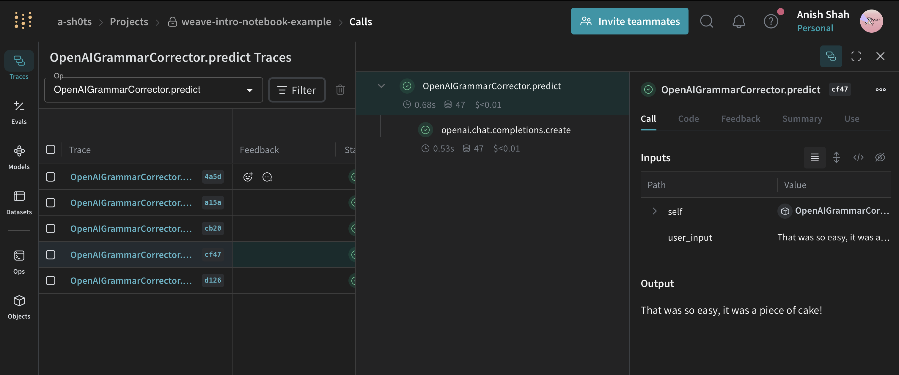
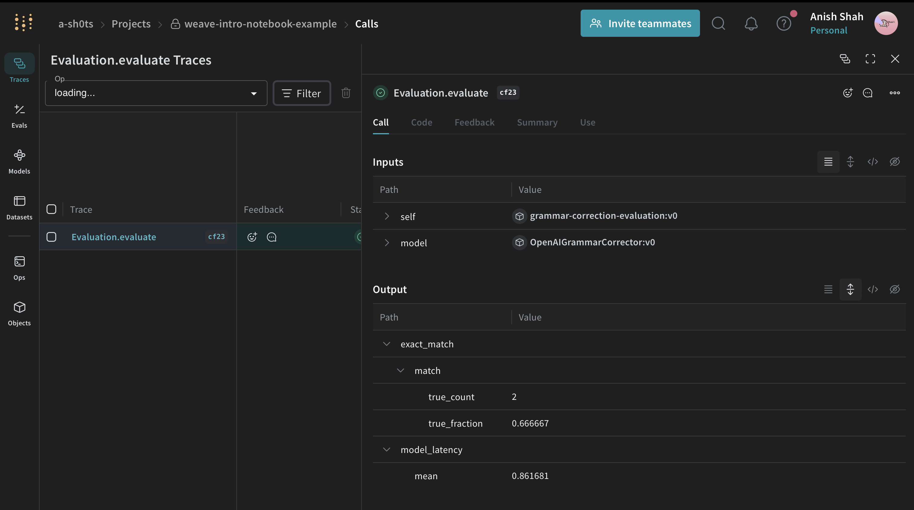

:::tip This is a notebook

<a href="https://colab.research.google.com/github/wandb/weave/blob/master/docs/./intro_notebook.ipynb" target="_blank" rel="noopener noreferrer" class="navbar__item navbar__link button button--secondary button--med margin-right--sm notebook-cta-button">
  <div>
    
    <div>Open in Colab</div>
  </div>
</a>

<a href="https://github.com/wandb/weave/blob/master/docs/./intro_notebook.ipynb" target="_blank" rel="noopener noreferrer" class="navbar__item navbar__link button button--secondary button--med margin-right--sm notebook-cta-button">
  <div>
    
    <div>View in GitHub</div>
  </div>
</a>

:::

<!--- @wandbcode{intro-colab} -->

# Quickstart

Get started using Weave to:

- Log and debug language model inputs, outputs, and traces
- Build rigorous, apples-to-apples evaluations for language model use cases
- Organize all the information generated across the LLM workflow, from experimentation to evaluations to production

See the full Weave documentation [here](https://wandb.me/weave).

## Install `weave` and log in

Start by installing the library and logging in to your account.

In this example, we're using OpenAI, so you should [add an OpenAI API key](https://platform.openai.com/docs/quickstart/step-2-setup-your-api-key).

```python
%%capture
!pip install weave openai set-env-colab-kaggle-dotenv
```

```python
# Set your OpenAI API key
from set_env import set_env

# Put your OPENAI_API_KEY in the secrets panel to the left
_ = set_env("OPENAI_API_KEY")
# os.environ["OPENAI_API_KEY"] = "sk-..." # alternatively, put your key here

PROJECT = "weave-intro-notebook"
```

## Track inputs and outputs of functions

Weave allows users to track function calls: the code, inputs, outputs, and even LLM tokens and costs. The following sections cover:

- Custom Functions
- Vendor Integrations
- Nested Function Calling
- Error Tracking

In all cases, start by initializing Weave:

```python
import weave

weave.init('project-name')
```

### Track custom functions

Add the `@weave.op` decorator to the functions you want to track.



```python
import weave

weave.init(PROJECT)

@weave.op()
def strip_user_input(user_input):
    return user_input.strip()

result = strip_user_input("    hello    ")
print(result)
```

After adding `@weave.op` and calling the function, visit the link to see it tracked within your project.

### Vendor integrations

Here, we're automatically tracking all calls to OpenAI. We automatically track many LLM libraries, and it's easy to add support for others.



```python
from openai import OpenAI
import weave

weave.init(PROJECT)

client = OpenAI()
response = client.chat.completions.create(
    model="gpt-4o-mini",
    messages=[
        {"role": "system", "content": "You are a grammar checker, correct the following user input."},
        {"role": "user", "content": "That was so easy, it was a piece of pie!"},
    ],
    temperature=0,
)
generation = response.choices[0].message.content
print(generation)
```

### Track nested functions

Now that you've seen the basics, let's combine all the above and track deeply nested functions alongside LLM calls.



```python
from openai import OpenAI
import weave

weave.init(PROJECT)

@weave.op()
def strip_user_input(user_input):
    return user_input.strip()

@weave.op()
def correct_grammar(user_input):
    client = OpenAI()

    stripped = strip_user_input(user_input)
    response = client.chat.completions.create(
        model="gpt-4o-mini",
        messages=[
            {"role": "system", "content": "You are a grammar checker, correct the following user input."},
            {"role": "user", "content": stripped},
        ],
        temperature=0,
    )
    return response.choices[0].message.content

result = correct_grammar("   That was so easy, it was a piece of pie!    ")
print(result)
```

### Track errors

When your code crashes, Weave highlights the issue, making it especially useful for debugging JSON parsing issues in LLM responses.



```python
import json
from openai import OpenAI
import weave

weave.init(PROJECT)

@weave.op()
def strip_user_input(user_input):
    return user_input.strip()

@weave.op()
def correct_grammar(user_input):
    client = OpenAI()

    stripped = strip_user_input(user_input)
    response = client.chat.completions.create(
        model="gpt-4o-mini",
        messages=[
            {"role": "system", "content": "You are a grammar checker, correct the following user input."},
            {"role": "user", "content": stripped},
        ],
        temperature=0,
        response_format={"type": "json_object"},
    )
    return json.loads(response.choices[0].message.content)

result = correct_grammar("   That was so easy, it was a piece of pie!    ")
print(result)
```

## Tracking objects

Organizing experimentation is challenging with many moving pieces. Capture and organize experimental details of your app, such as your system prompt or model, within `weave.Objects`. This helps compare different iterations of your app. 

### General object tracking

Track and version data as you do with code. For example, define a `SystemPrompt(weave.Object)` that can be shared with teammates.



```python
import weave

weave.init(PROJECT)

class SystemPrompt(weave.Object):
    prompt: str

system_prompt = SystemPrompt(
    prompt="You are a grammar checker, correct the following user input."
)
weave.publish(system_prompt)
```

### Model tracking

Models are common objects, so Weave provides the `weave.Model` class. Define a `predict` method to represent models.



```python
from openai import OpenAI
import weave

weave.init(PROJECT)

class OpenAIGrammarCorrector(weave.Model):
    openai_model_name: str
    system_message: str

    @weave.op()
    def predict(self, user_input):
        client = OpenAI()
        response = client.chat.completions.create(
            model=self.openai_model_name,
            messages=[
                {"role": "system", "content": self.system_message},
                {"role": "user", "content": user_input},
            ],
            temperature=0,
        )
        return response.choices[0].message.content

corrector = OpenAIGrammarCorrector(
    openai_model_name="gpt-4o-mini",
    system_message="You are a grammar checker, correct the following user input."
)

result = corrector.predict("     That was so easy, it was a piece of pie!       ")
print(result)
```

### Dataset tracking

The `weave.Dataset` object helps track, organize, and operate on datasets.



```python
dataset = weave.Dataset(
    name="grammar-correction",
    rows=[
        {
            "user_input": "   That was so easy, it was a piece of pie!   ",
            "expected": "That was so easy, it was a piece of cake!",
        },
        {"user_input": "  I write good   ", "expected": "I write well"},
        {
            "user_input": "  GPT-4 is smartest AI model.   ",
            "expected": "GPT-4 is the smartest AI model.",
        },
    ],
)

weave.publish(dataset)
```

### Retrieve published objects and operations

Publish objects and retrieve them later. You can call functions from your retrieved objects.



```python
import weave

weave.init(PROJECT)

corrector = OpenAIGrammarCorrector(
    openai_model_name="gpt-4o-mini",
    system_message="You are a grammar checker, correct the following user input."
)

ref = weave.publish(corrector)
print(ref.uri())
```



```python
import weave

weave.init(PROJECT)

# Note: this URL is available in the UI after publishing the object!
ref_url = f"weave:///{ref.entity}/{PROJECT}/object/{ref.name}:{ref.digest}"
fetched_corrector = weave.ref(ref_url).get()

# This object was loaded from a remote location!
result = fetched_corrector.predict("That was so easy, it was a piece of pie!")

print(result)
```

## Evaluation

Evaluation-driven development helps you reliably iterate on an application. The `Evaluation` class assesses the performance of a `Model` on a `Dataset` or set of examples using scoring functions.



```python
import weave
from weave import Evaluation

# Define any custom scoring function
@weave.op()
def exact_match(expected: str, model_output: dict) -> dict:
    return {"match": expected == model_output}

# Score your examples using scoring functions
evaluation = Evaluation(
    dataset=dataset,  # can be a list of dictionaries or a weave.Dataset object
    scorers=[exact_match],  # can be a list of scoring functions
)

# Start tracking the evaluation
weave.init(PROJECT)

# Run the evaluation
summary = await evaluation.evaluate(corrector)  # can be a model or simple function
```

## What's next?

Follow the [Build an Evaluation Pipeline](http://wandb.me/weave_eval_tut) tutorial to learn more about evaluation and begin iteratively improving your applications.
