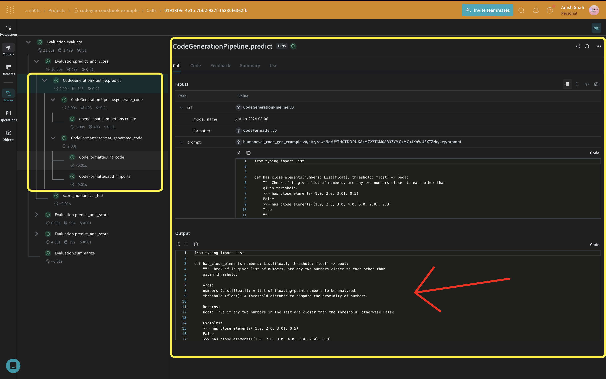

:::tip[This is a notebook]

<a href="https://colab.research.google.com/github/wandb/weave/blob/master/docs/./notebooks/codegen.ipynb" target="_blank" rel="noopener noreferrer" class="navbar__item navbar__link button button--secondary button--med margin-right--sm notebook-cta-button"><div><div>Open in Colab</div></div></a>

<a href="https://github.com/wandb/weave/blob/master/docs/./notebooks/codegen.ipynb" target="_blank" rel="noopener noreferrer" class="navbar__item navbar__link button button--secondary button--med margin-right--sm notebook-cta-button"><div><div>View in Github</div></div></a>

:::


# Code Generation using Weave and OpenAI

Generating high-quality code with proper structure, documentation, and tests is a challenging task. This guide demonstrates how to implement a code generation pipeline. You'll learn to create a code generation pipeline that produces high-quality Python functions against the humaneval test suite.

We'll use Weave for evaluation comparison and tracking, and OpenAI's GPT models for code generation using structured outputs.


## Video Demonstration

For a visual demonstration of the code generation pipeline using Weave, Groq, and E2B check out this video:

<iframe width="560" height="315" src="https://www.youtube.com/embed/B70jJYPVAzE?si=75Z4Fg_DBxAiu9_6&amp" title="YouTube video player" frameborder="0" allow="accelerometer; autoplay; clipboard-write; encrypted-media; gyroscope; picture-in-picture; web-share" referrerpolicy="strict-origin-when-cross-origin" allowfullscreen></iframe>

This video provides a step-by-step walkthrough of the process, showcasing how Weave integrates with Groq to create a powerful code generation tool and then running the code in E2B, to validate the code. We use OpenAI in the following example, but you can use any LLM provider with Weave.

## Why use Weave?

In this tutorial, we'll use Weave to implement and evaluate a code generation pipeline. You'll learn how to:

1. **Track your LLM pipeline**: Log inputs, outputs, and intermediate steps of your code generation process.
2. **Evaluate LLM outputs**: Create and compare evaluations of your generated code with rich debugging tools and visualizations.

## Set up the environment

First, let's set up our environment and import the necessary libraries:


```python
!pip install -qU autopep8 autoflake weave isort openai set-env-colab-kaggle-dotenv datasets
```


```python
import ast
import os
import re
import subprocess
import tempfile
import traceback

import autopep8
import isort
from autoflake import fix_code
from datasets import load_dataset
from openai import OpenAI
from pydantic import BaseModel
from set_env import set_env

import weave
from weave import Dataset, Evaluation

set_env("WANDB_API_KEY")
set_env("OPENAI_API_KEY")
```


```python
WEAVE_PROJECT = "codegen-cookbook-example"
weave.init(WEAVE_PROJECT)
```


```python
client = OpenAI()
```


```python
human_eval = load_dataset("openai_humaneval")
selected_examples = human_eval["test"][:3]
```

:::note
Weave automatically tracks OpenAI API calls, including inputs, outputs, and metadata. This means you don't need to add any additional logging code for your OpenAI interactions – Weave handles it seamlessly in the background.
:::

## Leveraging Structured Outputs and Pydantic Models

In this code generation pipeline, we utilize OpenAI's [structured outputs mode](https://platform.openai.com/docs/guides/structured-outputs) and Pydantic models to ensure consistent and well-formatted responses from the language model. This approach offers several advantages:


1. **Type Safety**: By defining Pydantic models for our expected outputs, we enforce a strict structure for the generated code, program runners, and unit tests.
2. **Easier Parsing**: The structured output mode allows us to directly parse the model's response into our predefined Pydantic models, reducing the need for complex post-processing.
3. **Improved Reliability**: By specifying the exact format we expect, we reduce the likelihood of unexpected or malformed outputs from the language model.

Here's an example of how we define our Pydantic models and use them with OpenAI's structured outputs:


```python
class GeneratedCode(BaseModel):
    function_signature: str
    function_args_with_docstring_within_triple_quotes: str
    code_logic: str


class FormattedGeneratedCode(BaseModel):
    full_code: str
```

## Implementing a Code Formatter

To ensure consistent and clean code output, we implement a `CodeFormatter` class using Weave operations. This formatter applies various linting and styling rules to the generated code, program runner, and unit tests.


```python
class CodeFormatter(BaseModel):
    @weave.op()
    def lint_code(self, code: str) -> str:
        # Replace escaped newlines with actual newlines
        code = code.replace("\\n", "\n")

        # Remove unused imports and variables
        code = fix_code(
            code, remove_all_unused_imports=True, remove_unused_variables=True
        )

        # Sort imports
        code = isort.code(code)

        # Apply PEP 8 formatting
        code = autopep8.fix_code(code, options={"aggressive": 2})

        return code

    @weave.op()
    def add_imports(self, code: str) -> str:
        tree = ast.parse(code)
        from_imports = {}
        global_names = set()

        for node in ast.walk(tree):
            if isinstance(node, ast.Name):
                if node.id not in dir(__builtins__):
                    global_names.add(node.id)

        # Only add typing imports that are actually used
        typing_imports = global_names.intersection(
            {"List", "Dict", "Tuple", "Set", "Optional", "Union"}
        )
        if typing_imports:
            from_imports["typing"] = typing_imports

        # Remove names that are defined within the function
        function_def = next(
            node for node in tree.body if isinstance(node, ast.FunctionDef)
        )
        local_names = {arg.arg for arg in function_def.args.args}
        local_names.update(
            node.id
            for node in ast.walk(function_def)
            if isinstance(node, ast.Name) and isinstance(node.ctx, ast.Store)
        )

        global_names -= local_names
        global_names -= {"sorted"}  # Remove built-in functions

        # Construct the import statements
        import_statements = []
        for module, names in from_imports.items():
            names_str = ", ".join(sorted(names))
            import_statements.append(f"from {module} import {names_str}")

        return (
            "\n".join(import_statements) + ("\n\n" if import_statements else "") + code
        )

    @weave.op()
    def format_generated_code(
        self, generated_code: GeneratedCode
    ) -> FormattedGeneratedCode:
        # Combine the code parts
        full_code = f"{generated_code.function_signature}\n{generated_code.function_args_with_docstring_within_triple_quotes}\n{generated_code.code_logic}"

        # Ensure proper indentation
        lines = full_code.split("\n")
        indented_lines = []
        for i, line in enumerate(lines):
            if i == 0:  # Function signature
                indented_lines.append(line)
            elif i == 1:  # Function arguments (docstring)
                indented_lines.append("    " + line)
            else:  # Function body
                indented_lines.append("    " + line)
        full_code = "\n".join(indented_lines)

        # Lint the code
        full_code = self.lint_code(full_code)

        # Add imports
        cleaned_code = self.add_imports(full_code)

        return FormattedGeneratedCode(full_code=cleaned_code)
```

This `CodeFormatter` class provides several Weave operations to clean and format the generated code:
   - Replacing escaped newlines with actual newlines
   - Removing unused imports and variables
   - Sorting imports
   - Applying PEP 8 formatting
   - Adding missing imports

## Define the CodeGenerationPipeline



Now, let's implement the core code generation logic:

We're using a `weave.Model` so that it's automatically versioned when it changes. We're also keeping the `model_name` as an attribute so that we can experiment with it and easily diff & compare it in Weave. We're tracking our function calls with `@weave.op` so the inputs & outputs are logged to help with error tracking and debugging. 


```python
class CodeGenerationPipeline(weave.Model):
    model_name: str
    formatter: CodeFormatter

    def __init__(
        self, model_name: str = "gpt-4o", formatter: CodeFormatter = CodeFormatter()
    ):
        super().__init__(model_name=model_name, formatter=formatter)
        self.model_name = model_name
        self.formatter = formatter

    @weave.op()
    async def predict(self, prompt: str):
        generated_code = self.generate_code(prompt)
        formatted_generated_code = self.formatter.format_generated_code(generated_code)

        return formatted_generated_code.full_code

    @weave.op()
    def generate_code(self, prompt: str) -> GeneratedCode:
        completion = client.beta.chat.completions.parse(
            model=self.model_name,
            messages=[
                {
                    "role": "system",
                    "content": "You are an expert Python code generator.",
                },
                {"role": "user", "content": prompt},
            ],
            response_format=GeneratedCode,
        )
        message = completion.choices[0].message
        if message.parsed:
            return message.parsed
        else:
            raise ValueError(message.refusal)
```

This `CodeGenerationPipeline` class encapsulates our code generation logic as a Weave Model, providing several key benefits:

1. Automatic experiment tracking: Weave captures inputs, outputs, and parameters for each run of the model.
2. Versioning: Changes to the model's attributes or code are automatically versioned, creating a clear history of how your code generation pipeline evolves over time.
3. Reproducibility: The versioning and tracking make it easy to reproduce any previous result or configuration of your code generation pipeline.
4. Hyperparameter management: Model attributes (like `model_name`) are clearly defined and tracked across different runs, facilitating experimentation.
5. Integration with Weave ecosystem: Using `weave.Model` allows seamless integration with other Weave tools, such as evaluations and serving capabilities.

## Implement evaluation metrics

To assess the quality of our generated code, we'll implement simple evaluation metrics using a `weave.Scorer` subclass. This will run `score` on every `model_output` from our dataset. `model_output` comes from the output of the `predict` function in our `weave.Model`. `prompt` is taken from our dataset `human-eval`.


```python
CODE_TEMPLATE = """
{model_output}

{test}

if __name__ == "__main__":
    check({entry_point})
"""
```


```python
@weave.op()
async def score_humaneval_test(test: str, entry_point: str, model_output: str):
    generated_code = model_output

    # Extract test cases from the test string
    test_cases = re.findall(r"assert.*", test)
    test_cases_str = "\n            ".join(test_cases)

    # Generate the full source code
    full_code = CODE_TEMPLATE.format(
        model_output=generated_code,
        test=test,
        test_cases=test_cases_str,
        entry_point=entry_point,
    )

    # Create a temporary file to store the code
    with tempfile.NamedTemporaryFile(delete=False, suffix=".py") as tmp_file:
        # Write the generated code to the temporary file
        tmp_file.write(full_code.encode())
        tmp_file_path = tmp_file.name

    try:
        # Run the temporary Python file as a subprocess with a timeout
        result = subprocess.run(
            ["python", tmp_file_path],
            capture_output=True,
            text=True,
            timeout=10,  # Timeout of 10 seconds
        )

        print(result)

        if result.returncode == 0:
            return {"correct": True}
        else:
            return {"correct": False, "error": result.stderr, "output": result.stdout}
    except subprocess.TimeoutExpired:
        return {"correct": False, "error": "TimeoutExpired"}
    except Exception as e:
        return {"correct": False, "error": traceback.format_exc()}
    finally:
        # Ensure the temporary file is removed after execution
        os.remove(tmp_file_path)
```

These evaluation functions run the generated code and return a boolean value indicating whether the code passed the test provided from the dataset.


## Create a Weave Dataset and run evaluation

To evaluate our pipeline, we'll create a Weave Dataset and run an evaluation:


```python
formatted_selected_examples = [
    {
        "task_id": task_id,
        "prompt": prompt,
        "canonical_solution": solution,
        "test": test,
        "entry_point": entry_point,
    }
    for task_id, prompt, solution, test, entry_point in zip(
        selected_examples["task_id"],
        selected_examples["prompt"],
        selected_examples["canonical_solution"],
        selected_examples["test"],
        selected_examples["entry_point"],
    )
]
```


```python
prompt_dataset = Dataset(
    name="humaneval_code_gen_example",
    rows=[
        {
            "prompt": example["prompt"],
            "test": example["test"],
            "entry_point": example["entry_point"],
        }
        for example in formatted_selected_examples
    ],
)
weave.publish(prompt_dataset)
```


```python
EVAL_RUN = True
```


```python
for model_name in ["gpt-4o-2024-08-06"]:
    pipeline = CodeGenerationPipeline(model_name=model_name)
    if not EVAL_RUN:
        dataset = prompt_dataset.rows[2]
        result = await pipeline.predict(dataset["prompt"])
        score_result = await score_humaneval_test(
            dataset["test"], dataset["entry_point"], result["generated_code"].full_code
        )
    else:
        evaluation = Evaluation(
            name="minimal_code_gen_evaluation",
            dataset=prompt_dataset,
            scorers=[score_humaneval_test],
        )
        results = await evaluation.evaluate(pipeline)
```

This code creates a dataset with our sample prompts, defines our humaneval test scorer, and runs an evaluation of our code generation pipeline.


## Conclusion

In this example, we've demonstrated how to implement a code generation pipeline using Weave and OpenAI's language models. We've shown how to:

1. Create Weave operations for each step of the code generation process
2. Wrap the pipeline in a Weave Model for easy tracking and evaluation
3. Implement custom evaluation metrics using Weave operations
4. Create a dataset and run an evaluation of the pipeline

Weave's seamless integration allows us to track inputs, outputs, and intermediate steps throughout the code generation process, making it easier to debug, optimize, and evaluate our LLM application.

For more information on Weave and its capabilities, check out the [Weave documentation](https://docs.wandb.ai/weave). You can extend this example to handle larger datasets, implement more sophisticated evaluation metrics, or integrate with other LLM workflows.
