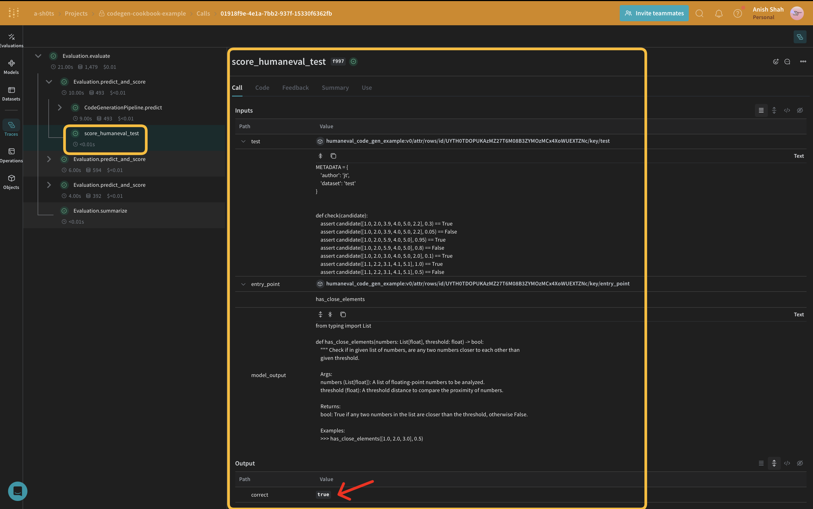

:::tip[This is a notebook]

<a href="https://colab.research.google.com/github/wandb/weave/blob/master/docs/./notebooks/codegen.ipynb" target="_blank" rel="noopener noreferrer" class="navbar__item navbar__link button button--secondary button--med margin-right--sm notebook-cta-button"><div><div>Open in Colab</div></div></a>

<a href="https://github.com/wandb/weave/blob/master/docs/./notebooks/codegen.ipynb" target="_blank" rel="noopener noreferrer" class="navbar__item navbar__link button button--secondary button--med margin-right--sm notebook-cta-button"><div><div>View in Github</div></div></a>

:::


# Code Generation using Weave and OpenAI

Generating high-quality code with proper structure, documentation, and tests is a challenging task. This guide demonstrates how to implement a code generation pipeline. You'll learn to create a code generation pipeline that produces high-quality Python functions, complete with main program runners and unit tests.

We'll use Weave for evaluation comparison and tracking, and OpenAI's GPT models for code generation using structured outputs.


## Video Demonstration

For a visual demonstration of the code generation pipeline using Weave, Groq, and E2B check out this video:

<iframe width="560" height="315" src="https://www.youtube.com/embed/B70jJYPVAzE?si=75Z4Fg_DBxAiu9_6&amp" title="YouTube video player" frameborder="0" allow="accelerometer; autoplay; clipboard-write; encrypted-media; gyroscope; picture-in-picture; web-share" referrerpolicy="strict-origin-when-cross-origin" allowfullscreen></iframe>

This video provides a step-by-step walkthrough of the process, showcasing how Weave integrates with Groq to create a powerful code generation tool and then running the code in E2B, to validate the code. We use OpenAI in the following example, but you can use any LLM provider with Weave.

## Why use Weave?

In this tutorial, we'll use Weave to implement and evaluate a code generation pipeline. You'll learn how to:

1. **Track your LLM pipeline**: Log inputs, outputs, and intermediate steps of your code generation process.
2. **Evaluate LLM outputs**: Create and compare evaluations of your generated code with rich debugging tools and visualizations.

## Set up the environment

First, let's set up our environment and import the necessary libraries:


```python
!pip install -qU autopep8 autoflake weave isort openai set-env-colab-kaggle-dotenv

```


```python
import ast
import re
from typing import Any, Dict

import autopep8
import isort
import weave
from autoflake import fix_code
from openai import OpenAI
from pydantic import BaseModel
from weave import Dataset, Evaluation

from set_env import set_env

set_env("WANDB_API_KEY")
set_env("OPENAI_API_KEY")

```


```python
WEAVE_PROJECT = "codegen-cookbook"
weave.init(WEAVE_PROJECT)
```


```python
client = OpenAI()
```

:::note
Weave automatically tracks OpenAI API calls, including inputs, outputs, and metadata. This means you don't need to add any additional logging code for your OpenAI interactions – Weave handles it seamlessly in the background.
:::

## Leveraging Structured Outputs and Pydantic Models

In this code generation pipeline, we utilize OpenAI's [structured outputs mode](https://platform.openai.com/docs/guides/structured-outputs) and Pydantic models to ensure consistent and well-formatted responses from the language model. This approach offers several advantages:


1. **Type Safety**: By defining Pydantic models for our expected outputs, we enforce a strict structure for the generated code, program runners, and unit tests.
2. **Easier Parsing**: The structured output mode allows us to directly parse the model's response into our predefined Pydantic models, reducing the need for complex post-processing.
3. **Improved Reliability**: By specifying the exact format we expect, we reduce the likelihood of unexpected or malformed outputs from the language model.

Here's an example of how we define our Pydantic models and use them with OpenAI's structured outputs:


```python
class GeneratedCode(BaseModel):
    code: str

class ProgramRunner(BaseModel):
    main_function_code: str

class UnitTest(BaseModel):
    test_code: str
```

## Implementing a Code Formatter

To ensure consistent and clean code output, we implement a `CodeFormatter` class using Weave operations. This formatter applies various linting and styling rules to the generated code, program runner, and unit tests.


```python
class CodeFormatter(BaseModel):

    @weave.op()
    def lint_code(self, code: str) -> str:
        # Replace escaped newlines with actual newlines
        code = code.replace('\\n', '\n')

        # Remove unused imports and variables
        code = fix_code(code, remove_all_unused_imports=True,
                        remove_unused_variables=True)

        # Sort imports
        code = isort.code(code)

        # Apply PEP 8 formatting
        code = autopep8.fix_code(code, options={'aggressive': 1})

        return code

    @weave.op()
    def format_generated_code(self, generated_code: GeneratedCode) -> GeneratedCode:
        cleaned_code = self.lint_code(generated_code.code)
        return GeneratedCode(code=cleaned_code)

    @weave.op()
    def format_program_runner(self, program_runner: ProgramRunner) -> ProgramRunner:
        cleaned_code = self.lint_code(program_runner.main_function_code)
        return ProgramRunner(main_function_code=cleaned_code)

    @weave.op()
    def format_unit_test(self, unit_test: UnitTest) -> UnitTest:
        cleaned_code = self.lint_code(unit_test.test_code)
        return UnitTest(test_code=cleaned_code)
```

This `CodeFormatter` class provides several Weave operations to clean and format the generated code:
   - Replacing escaped newlines with actual newlines
   - Removing unused imports and variables
   - Sorting imports
   - Applying PEP 8 formatting

## Define the CodeGenerationPipeline


Now, let's implement the core code generation logic:

1. **Generate code**: Create initial code from prompt
2. **Create runner**: Generate main function to execute code
3. **Generate tests**: Create unit tests for code and runner
4. **Return results**: Combine formatted code, runner, and tests

We're using a `weave.Model` so that it's automatically versioned when it changes. We're also keeping the `model_name` as an attribute so that we can experiment with it and easily diff & compare it in Weave. We're tracking our function calls with `@weave.op` so the inputs & outputs are logged to help with error tracking and debugging. 


```python
class CodeGenerationPipeline(weave.Model):

    model_name: str
    formatter: CodeFormatter

    def __init__(self, model_name: str = "gpt-4o", formatter: CodeFormatter = CodeFormatter()):
        super().__init__(model_name=model_name, formatter=formatter)
        self.model_name = model_name
        self.formatter = formatter

    @weave.op()
    async def predict(self, prompt: str):
        generated_code = self.generate_code(prompt)
        formatted_generated_code = self.formatter.format_generated_code(generated_code)

        program_runner = self.generate_program(formatted_generated_code)
        formatted_program_runner = self.formatter.format_program_runner(program_runner)

        unit_tests = self.generate_tests(formatted_generated_code, formatted_program_runner)
        formatted_unit_tests = self.formatter.format_unit_test(unit_tests)
        
        return {
            "generated_code": formatted_generated_code,
            "program_runner": formatted_program_runner,
            "unit_tests": formatted_unit_tests,
        }

    @weave.op()
    def generate_code(self, prompt: str) -> GeneratedCode:
        completion = client.beta.chat.completions.parse(
            model=self.model_name,
            messages=[
                {"role": "system", "content": "You are an expert Python code generator."},
                {"role": "user", "content": prompt}
            ],
            response_format=GeneratedCode,
        )
        message = completion.choices[0].message
        if message.parsed:
            return message.parsed
        else:
            raise ValueError(message.refusal)

    @weave.op()
    def generate_program(self, generated_code: GeneratedCode) -> ProgramRunner:
        completion = client.beta.chat.completions.parse(
            model=self.model_name,
            messages=[
                {"role": "system", "content": """
You are an expert Python program generator. Create a main function that orchestrates the execution of the given functions. Follow these guidelines:

1. Create a main() function that calls the necessary functions to run the program.
2. Include a proper if __name__ == "__main__": guard to call the main() function.
3. Do not redefine or implement any functions; use only the functions provided.
4. Do not include any imports or package specifications.
5. Use clear and concise code with proper indentation.
6. Do not use escape characters for newlines; write actual line breaks.
7. Keep the main() function simple, calling only the top-level function(s) needed.

Example structure:

def main():
    result = top_level_function()
    print(result)

if __name__ == "__main__":
    main()

Remember, your task is solely to create the main() function and the __main__ guard. All other functions are assumed to be already defined.
"""},
                {"role": "user", "content": f"Generate a main function for this code:\n\n{generated_code.code}"}
            ],
            response_format=ProgramRunner,
        )
        message = completion.choices[0].message
        if message.parsed:
            return message.parsed
        else:
            raise ValueError(message.refusal)

    @weave.op()
    def generate_tests(self, generated_code: GeneratedCode, program_runner: ProgramRunner) -> UnitTest:
        completion = client.beta.chat.completions.parse(
            model=self.model_name,
            messages=[
                {"role": "system", "content": "You are an expert Python unit test generator."},
                {"role": "user", "content": f"""
Generate a complete unittest for the following code:

Context (Surrounding Code):
<python>
{generated_code.code}
{program_runner.main_function_code}
</python>

Requirements:

1. **Structure:** Use `unittest.TestCase` and name the class `Test<FunctionName>`.
2. **Coverage:** Include tests for normal cases, edge cases, and potential errors.
3. **Naming:** Use descriptive test method names (e.g., `test_valid_input`, `test_empty_input`, `test_invalid_input_type`).
4. **Type Hints:** Include type hints for clarity.
5. **Mocking:** Mock external dependencies (e.g., database interactions, API calls) when necessary.
6. **Assertions:** Use appropriate assertions (e.g., `assertEqual`, `assertRaises`, `assertTrue`).
7. **Isolation:** Ensure test isolation to prevent interference between tests.
9. **Executable:** Include a `__main__` block to run tests directly: `if __name__ == '__main__': unittest.main()`
10. **Formatting:** Ensure proper indentation and formatting for readability.
11. **Imports:** Include all necessary imports.
12. **Completeness:** Provide a complete, runnable test file.

Provide only the complete, properly formatted test code, no explanations or markdown.
"""}
            ],
            response_format=UnitTest,
        )
        message = completion.choices[0].message
        if message.parsed:
            return message.parsed
        else:
            raise ValueError(message.refusal)

```

This `CodeGenerationPipeline` class encapsulates our code generation logic as a Weave Model, providing several key benefits:

1. Automatic experiment tracking: Weave captures inputs, outputs, and parameters for each run of the model.
2. Versioning: Changes to the model's attributes or code are automatically versioned, creating a clear history of how your code generation pipeline evolves over time.
3. Reproducibility: The versioning and tracking make it easy to reproduce any previous result or configuration of your code generation pipeline.
4. Hyperparameter management: Model attributes (like `model_name`) are clearly defined and tracked across different runs, facilitating experimentation.
5. Integration with Weave ecosystem: Using `weave.Model` allows seamless integration with other Weave tools, such as evaluations and serving capabilities.

## Implement evaluation metrics

To assess the quality of our generated code, we'll implement simple evaluation metrics using a `weave.Scorer` subclass. This will run `score` on every `model_output` from our dataset. `model_output` comes from the output of the `predict` function in our `weave.Model`. `prompt` is taken from our dataset. You can also use something like `human-eval` for this. 

Note for Anish:
https://wandb.ai/shawn/humaneval6/weave

Shawn implemented human eval here: https://wandb.ai/shawn/humaneval6/weave/calls?filter=%7B%22opVersionRefs%22%3A%5B%22weave%3A%2F%2F%2Fshawn%2Fhumaneval6%2Fop%2FEvaluation.predict_and_score%3ANmwfShfFmgAhDGLXrF6Xn02T9MIAsCXBUcifCjyKpOM%22%5D%2C%22parentId%22%3A%2258c9db2c-c1f8-4643-a79d-7a13c55fbc72%22%7D&peekPath=%2Fshawn%2Fhumaneval6%2Fcalls%2F27d108e1-7524-4042-ba1b-a5ede9c176b2%3Fpath%3DEvaluation.predict_and_score*491%2Bscore_humaneval_test*0%26tracetree%3D1


```python
async def score_humaneval_test(test: str, entry_point: str, model_output: str):
    # Generate the full source code
    full_code = CODE_TEMPLATE.format(
        model_output=model_output, test=test, entry_point=entry_point
    )

    # Create a temporary file to store the code
    with tempfile.NamedTemporaryFile(delete=False, suffix=".py") as tmp_file:
        # Write the generated code to the temporary file
        tmp_file.write(full_code.encode())
        tmp_file_path = tmp_file.name

    try:
        # Run the temporary Python file as a subprocess with a timeout
        result = subprocess.run(
            ["python", tmp_file_path],
            capture_output=True,
            text=True,
            timeout=10,  # Timeout of 10 seconds
        )

        if result.returncode == 0:
            return {"correct": True}
        else:
            return {"correct": False, "error": result.stderr, "output": result.stdout}
    except subprocess.TimeoutExpired:
        return {"correct": False, "error": "TimeoutExpired"}
    except Exception as e:
        return {"correct": False, "error": traceback.format_exc()}
    finally:
        # Ensure the temporary file is removed after execution
        os.remove(tmp_file_path)

```


```python
class TestResultScorer(weave.Scorer):
    @weave.op()
    def score(self, model_output: Dict[str, Any], prompt: str) -> Dict[str, Any]:
        if not model_output or "generated_code" not in model_output:
            return {"error": "No generated code provided"}

        generated_code = model_output["generated_code"].code
        unit_tests = model_output["unit_tests"].test_code

        code_quality_score = self.assess_code_quality(generated_code)
        test_coverage_score = self.assess_test_coverage(generated_code, unit_tests)

        overall_score = (code_quality_score + test_coverage_score) / 2

        return {
            "code_quality_score": code_quality_score,
            "test_coverage_score": test_coverage_score,
            "overall_score": overall_score
        }

    @weave.op()
    def assess_code_quality(self, code: str) -> float:
        score = 0.0
        try:
            tree = ast.parse(code)
            
            # Check for docstrings
            for node in ast.walk(tree):
                if isinstance(node, (ast.FunctionDef, ast.ClassDef, ast.Module)):
                    if ast.get_docstring(node):
                        score += 0.2

            # Check for type hints
            for node in ast.walk(tree):
                if isinstance(node, ast.FunctionDef):
                    if node.returns or any(arg.annotation for arg in node.args.args):
                        score += 0.2

            # Check for meaningful variable names
            for node in ast.walk(tree):
                if isinstance(node, ast.Name):
                    if len(node.id) > 1 and not node.id.startswith('_'):
                        score += 0.1

            # Penalize for excessive line length
            lines = code.split('\n')
            if any(len(line) > 100 for line in lines):
                score -= 0.2

        except SyntaxError:
            return 0.0

        return min(max(score, 0.0), 1.0)

    @weave.op()
    def assess_test_coverage(self, code: str, unit_tests: str) -> float:
        score = 0.0
        
        # Check if unit tests are provided
        if not unit_tests:
            return 0.0

        try:
            code_tree = ast.parse(code)
            test_tree = ast.parse(unit_tests)

            code_functions = [node.name for node in ast.walk(code_tree) if isinstance(node, ast.FunctionDef)]
            test_functions = [node.name for node in ast.walk(test_tree) if isinstance(node, ast.FunctionDef) and node.name.startswith('test_')]

            # Score based on the number of test functions relative to code functions
            coverage_ratio = len(test_functions) / len(code_functions) if code_functions else 0
            score = min(coverage_ratio, 1.0)

            # Bonus for using assertions
            if 'self.assert' in unit_tests:
                score += 0.2

        except SyntaxError:
            return 0.0

        return min(score, 1.0)
```

These evaluation functions assess the quality of the generated code based on factors such as docstring presence, type hints, naming conventions, and test coverage.



## Create a Weave Dataset and run evaluation

To evaluate our pipeline, we'll create a Weave Dataset and run an evaluation:


```python
prompt_dataset = Dataset(name="minimal_code_gen_example", rows=[
    {
        "prompt": "Create a Python function that calculates the factorial of a given number."
    }
])
weave.publish(prompt_dataset)
```


```python
for model_name in ["gpt-4o-2024-08-06"]:
    pipeline = CodeGenerationPipeline(model_name=model_name)
    test_result_scorer = TestResultScorer()
    evaluation = Evaluation(
        name="minimal_code_gen_evaluation",
        dataset=prompt_dataset,
        scorers=[test_result_scorer]
    )
    results = await evaluation.evaluate(pipeline)
```

This code creates a dataset with our sample prompts, defines a quality scorer, and runs an evaluation of our code generation pipeline.


## Conclusion

In this example, we've demonstrated how to implement a code generation pipeline using Weave and OpenAI's language models. We've shown how to:

1. Create Weave operations for each step of the code generation process
2. Wrap the pipeline in a Weave Model for easy tracking and evaluation
3. Implement custom evaluation metrics using Weave operations
4. Create a dataset and run an evaluation of the pipeline

Weave's seamless integration allows us to track inputs, outputs, and intermediate steps throughout the code generation process, making it easier to debug, optimize, and evaluate our LLM application.

For more information on Weave and its capabilities, check out the [Weave documentation](https://docs.wandb.ai/weave). You can extend this example to handle larger datasets, implement more sophisticated evaluation metrics, or integrate with other LLM workflows.


```python

```
