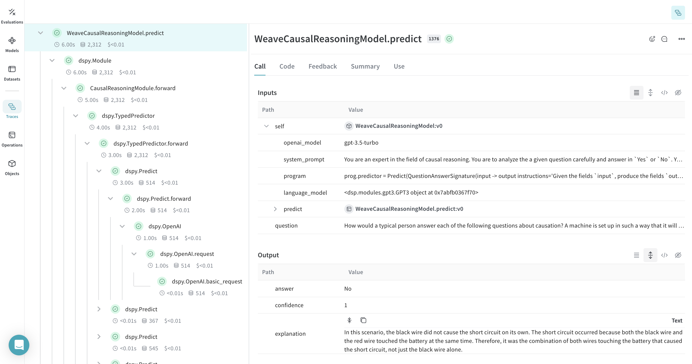
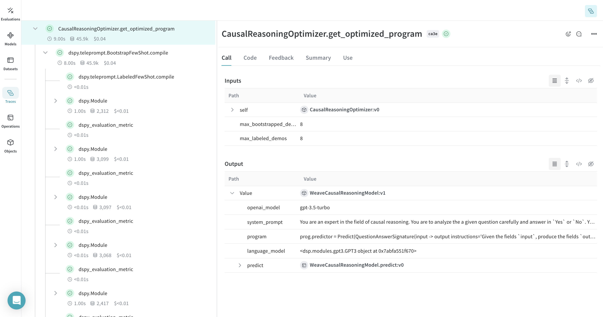

:::tip[This is a notebook]

<a href="https://colab.research.google.com/github/wandb/weave/blob/master/docs/./notebooks/dspy_prompt_optimization.ipynb" target="_blank" rel="noopener noreferrer" class="navbar__item navbar__link button button--secondary button--med margin-right--sm notebook-cta-button"><div><div>Open in Colab</div></div></a>

<a href="https://github.com/wandb/weave/blob/master/docs/./notebooks/dspy_prompt_optimization.ipynb" target="_blank" rel="noopener noreferrer" class="navbar__item navbar__link button button--secondary button--med margin-right--sm notebook-cta-button"><div><div>View in Github</div></div></a>

:::


<!--- @wandbcode{prompt-optim-notebook} -->

# Optimizing LLM Workflows Using DSPy and Weave

The [BIG-bench (Beyond the Imitation Game Benchmark)](https://github.com/google/BIG-bench) is a collaborative benchmark intended to probe large language models and extrapolate their future capabilities consisting of more than 200 tasks. The [BIG-Bench Hard (BBH)](https://github.com/suzgunmirac/BIG-Bench-Hard) is a suite of 23 most challenging BIG-Bench tasks that can be quite difficult to be solved using the current generation of language models.

This tutorial demonstrates how we can improve the performance of our LLM workflow implemented  on the **causal judgement task** from the BIG-bench Hard benchmark and evaluate our prompting strategies. We will use [DSPy](https://dspy-docs.vercel.app/) for implementing our LLM workflow and optimizing our prompting strategy. We will also use [Weave](../../introduction.md) to track our LLM workflow and evaluate our prompting strategies.

## Installing the Dependencies

We need the following libraries for this tutorial:

- [DSPy](https://dspy-docs.vercel.app/) for building the LLM workflow and optimizing it.
- [Weave](../../introduction.md) to track our LLM workflow and evaluate our prompting strategies.
- [datasets](https://huggingface.co/docs/datasets/index) to access the Big-Bench Hard dataset from HuggingFace Hub.


```python
!pip install -qU dspy-ai weave datasets
```

Since we'll be using [OpenAI API](https://openai.com/index/openai-api/) as the LLM Vendor, we will also need an OpenAI API key. You can [sign up](https://platform.openai.com/signup) on the OpenAI platform to get your own API key.


```python
import os
from getpass import getpass

api_key = getpass("Enter you OpenAI API key: ")
os.environ["OPENAI_API_KEY"] = api_key
```

## Enable Tracking using Weave

Weave is currently integrated with DSPy, and including [`weave.init`](../../reference/python-sdk/weave/index.md) at the start of our code lets us automatically trace our DSPy functions which can be explored in the Weave UI. Check out the [Weave integration docs for DSPy](../../guides/integrations/dspy.md) to learn more.


```python
import weave

weave.init(project_name="dspy-bigbench-hard")
```

## Load the BIG-Bench Hard Dataset

We will load this dataset from HuggingFace Hub, split into training and validation sets, and [publish](../../guides/core-types/datasets.md) them on Weave, this will let us version the datasets, and also use [`weave.Evaluation`](../../guides/core-types/evaluations.md) to evaluate our prompting strategy.


```python
import dspy
from datasets import load_dataset


@weave.op()
def get_dataset(dataset_address: str, big_bench_hard_task: str, num_train_examples: int):
    # load the BIG-Bench Hard dataset corresponding to the task from Huggingface Hug
    dataset = load_dataset(dataset_address, big_bench_hard_task)[
        "train"
    ]

    # create the training and validation datasets
    rows = [{"question": data["input"], "answer": data["target"]} for data in dataset]
    train_rows = rows[0 : num_train_examples]
    val_rows = rows[num_train_examples :]

    # create the training and validation examples consisting of `dspy.Example` objects
    dspy_train_examples = [
        dspy.Example(row).with_inputs("question") for row in train_rows
    ]
    dspy_val_examples = [dspy.Example(row).with_inputs("question") for row in val_rows]

    # publish the datasets to the Weave, this would let us version the data and use for evaluation
    weave.publish(
        weave.Dataset(
            name=f"bigbenchhard_{big_bench_hard_task}_train", rows=train_rows
        )
    )
    weave.publish(
        weave.Dataset(
            name=f"bigbenchhard_{big_bench_hard_task}_val", rows=val_rows
        )
    )

    return dspy_train_examples, dspy_val_examples


dspy_train_examples, dspy_val_examples = get_dataset(
    dataset_address="maveriq/bigbenchhard",
    big_bench_hard_task="causal_judgement",
    num_train_examples=50
)
```

|  |
|--------------------------------------------------------------|
| The datasets, once published, can be explored in the Weave UI |

## The DSPy Program

[DSPy](https://dspy-docs.vercel.app) is a framework that pushes building new LM pipelines away from manipulating free-form strings and closer to programming (composing modular operators to build text transformation graphs) where a compiler automatically generates optimized LM invocation strategies and prompts from a program.

We will use the [`dspy.OpenAI`](https://dspy-docs.vercel.app/api/language_model_clients/OpenAI) abstraction to make LLM calls to [GPT3.5 Turbo](https://platform.openai.com/docs/models/gpt-3-5-turbo).

### Writing the Causal Reasoning Signature

A [signature](https://dspy-docs.vercel.app/docs/building-blocks/signatures) is a declarative specification of input/output behavior of a [DSPy module](https://dspy-docs.vercel.app/docs/building-blocks/modules) which are task-adaptive components—akin to neural network layers—that abstract any particular text transformation.


```python
from pydantic import BaseModel, Field


class Input(BaseModel):
    query: str = Field(description="The question to be answered")


class Output(BaseModel):
    answer: str = Field(description="The answer for the question")
    confidence: float = Field(
        ge=0, le=1, description="The confidence score for the answer"
    )
    explanation: str = Field(description="The explanation for the answer")


class QuestionAnswerSignature(dspy.Signature):
    input: Input = dspy.InputField()
    output: Output = dspy.OutputField()


class CausalReasoningModule(dspy.Module):
    def __init__(self):
        self.prog = dspy.TypedPredictor(QuestionAnswerSignature)

    @weave.op()
    def forward(self, question) -> dict:
        return self.prog(input=Input(query=question)).output.dict()
```

Next, we write a [weave.Model](../../guides/core-types/models.md) that wraps the `CausalReasoningModule` and the OpenAI language model to form a complete LLM workflow.


```python
class WeaveCausalReasoningModel(weave.Model):
    openai_model: str
    system_prompt: str
    program: dspy.Module
    language_model: dspy.LM
    
    def __init__(self, openai_model: str, system_prompt: str, program: dspy.Module):
        super().__init__(
            openai_model=openai_model,
            system_prompt=system_prompt,
            program=program,
            language_model=dspy.OpenAI(
                model=openai_model, system_prompt=system_prompt
            )
        )

    @weave.op()
    def predict(self, question: str) -> Output:
        with dspy.context(lm=self.language_model):
            return self.program(question)
```

Let's test our LLM workflow, i.e., the `WeaveCausalReasoningModel` on an example from the causal reasoning subset of Big-Bench Hard.


```python
import rich

SYSTEM_PROMPT = """
You are an expert in the field of causal reasoning. You are to analyze the a given question carefully and answer in `Yes` or `No`.
You should also provide a detailed explanation justifying your answer.
"""

baseline_model = WeaveCausalReasoningModel(
    openai_model="gpt-3.5-turbo",
    system_prompt=SYSTEM_PROMPT,
    program=CausalReasoningModule(),
)

prediction = baseline_model.predict(dspy_train_examples[0]["question"])
rich.print(prediction)
```

|  |
|---|
| Here's how you can explore the traces of the `CausalReasoningModule` in the Weave UI |

## Evaluating our DSPy Program

Now that we have a baseline prompting strategy, let's evaluate it on our validation set using [`weave.Evaluation`](../../guides/core-types/evaluations.md) on a simple metric that matches the predicted answer with the ground truth. Weave will take each example, pass it through your application and score the output on multiple custom scoring functions. By doing this, you'll have a view of the performance of your application, and a rich UI to drill into individual outputs and scores.

First, we need to create a simple weave evaluation scoring function that tells whether the answer from the baseline module's output is the same as the ground truth answer or not. Scoring functions need to have a `model_output` keyword argument, but the other arguments are user defined and are taken from the dataset examples. It will only take the necessary keys by using a dictionary key based on the argument name.


```python
@weave.op()
def weave_evaluation_scorer(answer: str, model_output: Output) -> dict:
    return {"match": int(answer.lower() == model_output["answer"].lower())}
```

Next, we can simply define the evaluation and run it.


```python
validation_dataset = weave.ref("bigbenchhard_causal_judgement_val:v0").get()

evaluation = weave.Evaluation(
    name="baseline_causal_reasoning_module",
    dataset=validation_dataset,
    scorers=[weave_evaluation_scorer],
)

await evaluation.evaluate(baseline_model)
```

:::note
If you're running from a python script, you can use the following code to run the evaluation:

```python
import asyncio
asyncio.run(evaluation.evaluate(baseline_model))
```
:::

:::warning
Running the evaluation causal reasoning dataset will cost approximately $0.24 in OpenAI credits.
:::

## Optimizing our DSPy Program

Now, that we have a baseline DSPy program, let us try to improve its performance for causal reasoning using a [DSPy teleprompter](https://dspy-docs.vercel.app/docs/building-blocks/optimizers) that can tune the parameters of a DSPy program to maximize the specified metrics. In this tutorial, we use the [BootstrapFewShot](https://dspy-docs.vercel.app/api/category/optimizers) teleprompter.


```python
from dspy.teleprompt import BootstrapFewShot


class CausalReasoningOptimizer(weave.Model):
    model: WeaveCausalReasoningModel

    @weave.op()
    def get_optimized_program(
        self, max_bootstrapped_demos: int, max_labeled_demos: int
    ) -> weave.Model:
        @weave.op()
        def dspy_evaluation_metric(true, prediction, trace=None):
            return prediction["answer"].lower() == true.answer.lower()
    
        teleprompter = BootstrapFewShot(
            metric=dspy_evaluation_metric,
            max_bootstrapped_demos=max_bootstrapped_demos,
            max_labeled_demos=max_labeled_demos,
        )
        with dspy.context(lm=self.model.language_model):
            optimized_program = teleprompter.compile(
                self.model.program, trainset=dspy_train_examples
            )
        return WeaveCausalReasoningModel(
            openai_model=self.model.openai_model,
            system_prompt=self.model.system_prompt,
            program=optimized_program
        )


optimizer = CausalReasoningOptimizer(model=baseline_model)
optimized_model = optimizer.get_optimized_program(
    max_bootstrapped_demos=8, max_labeled_demos=8
)
```

:::warning
Running the evaluation causal reasoning dataset will cost approximately $0.04 in OpenAI credits.
:::

|  |
|---|
| You can explore the traces of the optimization process in the Weave UI. |

Now that we have our optimized program (the optimized prompting strategy), let's evaluate it once again on our validation set and compare it with our baseline DSPy program.


```python
evaluation = weave.Evaluation(
    name="optimized_causal_reasoning_module",
    dataset=validation_dataset,
    scorers=[weave_evaluation_scorer],
)

await evaluation.evaluate(optimized_model)
```

:::warning
Running the evaluation causal reasoning dataset will cost approximately $0.30 in OpenAI credits.
:::

|  |
|---|
| Comparing the evalution of the baseline program with the optimized one shows that the optimized program answers the causal reasoning questions with siginificantly more accuracy. |

## Conclusion

In this tutorial, we learned how to use DSPy for prompt optimization alongside using Weave for tracking and evaluation to compare the original and optimized programs.
