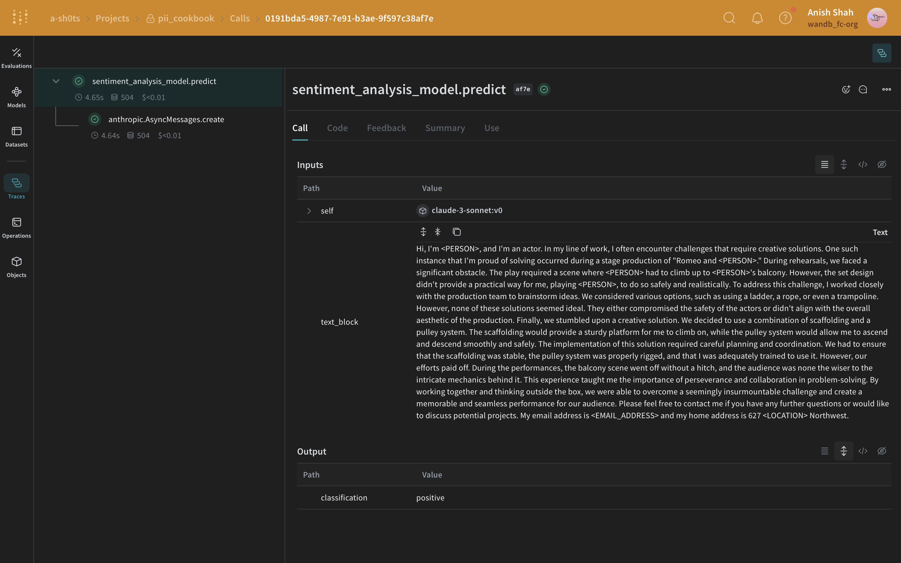

:::tip[This is a notebook]

<a href="https://colab.research.google.com/github/wandb/weave/blob/master/docs/./notebooks/pii.ipynb" target="_blank" rel="noopener noreferrer" class="navbar__item navbar__link button button--secondary button--med margin-right--sm notebook-cta-button"><div><div>Open in Colab</div></div></a>

<a href="https://github.com/wandb/weave/blob/master/docs/./notebooks/pii.ipynb" target="_blank" rel="noopener noreferrer" class="navbar__item navbar__link button button--secondary button--med margin-right--sm notebook-cta-button"><div><div>View in Github</div></div></a>

:::


<!--- @wandbcode{cod-notebook} -->

# How to use Weave with PII data:

In this tutorial, we'll demonstrate how to utilize Weave while preventing your Personally Identifiable Information (PII) data from being incorporated into Weave or the LLMs you employ.

To protect our PII data, we'll employ a couple techniques. First, we'll use regular expressions identify PII data and redact it. Second, we'll use Microsoft's [Presidio](https://microsoft.github.io/presidio/), a Python-based data protection SDK. This tool provides redaction and replacement functionalities, both of which we will implement in this tutorial.

For this use-case. We will leverage Anthropic's claude-3-sonnet to perform sentiment analysis. While we use Weave's [Traces](https://wandb.github.io/weave/quickstart) to track and analize the LLM's API calls. Sonnet will receive block of text and output one of the following sentiment classification:
1. positive
2. negative
3. neutral


```python
%%capture
# @title required python packages:
!pip install presidio_analyzer
!pip install presidio_anonymizer
!python -m spacy download en_core_web_lg # Presidio uses spacy NLP engine
!pip install Faker                       # we'll use Faker to replace PII data with fake data
!pip install weave                        # To leverage Traces
!pip install set-env-colab-kaggle-dotenv -q # for env var
!pip install anthropic                      # to use sonnet
!pip install cryptography                   # to encrypt our data
```

# Setup


```python
# @title Make sure to set up set up your API keys correctly
from set_env import set_env

_ = set_env("ANTHROPIC_API_KEY")
_ = set_env("WANDB_API_KEY")
```


```python
import weave

WEAVE_PROJECT = "pii_cookbook"
weave.init(WEAVE_PROJECT)
```

Let's load our initial PII data. For demonstration purposes, we'll use a dataset containing 10 text blocks. A larger dataset with 1000 entries is available.


```python
import requests

url = "https://raw.githubusercontent.com/wandb/weave/0379eac49b9509bd613d1fcce4227651202370c5/docs/notebooks/10_pii_data.json"
response = requests.get(url)
pii_data = response.json()
```

# Using Weave Safely with PII Data

## During Testing
- Log anonymized data to check PII detection
- Track PII handling processes with Weave traces
- Measure anonymization performance without exposing real PII

## In Production
- Never log raw PII
- Encrypt sensitive fields before logging

## Encryption Tips
- Use reversible encryption for data you need to decrypt later
- Apply one-way hashing for unique IDs you don't need to reverse
- Consider specialized encryption for data you need to analyze while encrypted

# Method 1: 

Our initial method is to use [regular expressions (regex)](https://docs.python.org/3/library/re.html) to identify PII data and redact it. It allows us to define patterns that can match various formats of sensitive information like phone numbers, email addresses, and social security numbers. By using regex, we can scan through large volumes of text and replace or redact information without the need for more complex NLP techniques. 


```python
import re

def clean_pii_with_regex(text):
    # Phone number pattern
    # \b         : Word boundary
    # \d{3}      : Exactly 3 digits
    # [-.]?      : Optional hyphen or dot
    # \d{3}      : Another 3 digits
    # [-.]?      : Optional hyphen or dot
    # \d{4}      : Exactly 4 digits
    # \b         : Word boundary
    text = re.sub(r'\b\d{3}[-.]?\d{3}[-.]?\d{4}\b', '<PHONE>', text)
    
    # Email pattern
    # \b         : Word boundary
    # [A-Za-z0-9._%+-]+ : One or more characters that can be in an email username
    # @          : Literal @ symbol
    # [A-Za-z0-9.-]+ : One or more characters that can be in a domain name
    # \.         : Literal dot
    # [A-Z|a-z]{2,} : Two or more uppercase or lowercase letters (TLD)
    # \b         : Word boundary
    text = re.sub(r'\b[A-Za-z0-9._%+-]+@[A-Za-z0-9.-]+\.[A-Z|a-z]{2,}\b', '<EMAIL>', text)
    
    # SSN pattern
    # \b         : Word boundary
    # \d{3}      : Exactly 3 digits
    # -          : Literal hyphen
    # \d{2}      : Exactly 2 digits
    # -          : Literal hyphen
    # \d{4}      : Exactly 4 digits
    # \b         : Word boundary
    text = re.sub(r'\b\d{3}-\d{2}-\d{4}\b', '<SSN>', text)
    
    # Simple name pattern (this is not comprehensive)
    # \b         : Word boundary
    # [A-Z]      : One uppercase letter
    # [a-z]+     : One or more lowercase letters
    # \s         : One whitespace character
    # [A-Z]      : One uppercase letter
    # [a-z]+     : One or more lowercase letters
    # \b         : Word boundary
    text = re.sub(r'\b[A-Z][a-z]+ [A-Z][a-z]+\b', '<NAME>', text)
    
    return text

# Test the function
test_text = "My name is John Doe, my email is john.doe@example.com, my phone is 123-456-7890, and my SSN is 123-45-6789."
cleaned_text = clean_pii_with_regex(test_text)
print(cleaned_text)
```

# Method 2: Microsoft Presidio

In this example, we'll create a [Weave Model](https://wandb.github.io/weave/guides/core-types/models) which is a combination of data (which can include configuration, trained model weights, or other information) and code that defines how the model operates.
In this model, we will include our predict function where the Anthropic API will be called.

Once you run this code you will receive a link to the Weave project page


```python
import weave
import asyncio
from anthropic import AsyncAnthropic
import json

# Weave model / predict function
class sentiment_analysis_model(weave.Model):
    model_name: str
    system_prompt: str
    temperature: int

    @weave.op()
    async def predict(self, text_block: str) -> dict:
        client =AsyncAnthropic()

        response = await client.messages.create(
            max_tokens=1024,
            model=self.model_name,
            system=self.system_prompt,
            messages=[
                {   "role": "user",
                    "content":[
                        {
                            "type": "text",
                            "text": text_block
                        }
                        ]
                 }
            ]
        )
        result = response.content[0].text
        if result is None:
            raise ValueError("No response from model")
        parsed = json.loads(result)
        return parsed
    
    # create our LLM model with a system prompt
model = sentiment_analysis_model(name="claude-3-sonnet",
            model_name="claude-3-5-sonnet-20240620",
            system_prompt="You are a Sentiment Analysis classifier. You will be classifying text based on their sentiment. Your input will be a block of text. You will answer with one the following rating option[\"positive\", \"negative\", \"neutral\"]. Your answer should be one word in json format: {classification}. Ensure that it is valid JSON.",
            temperature=0
        )
```

# Method 2A:
Our next method involves complete removal of PII data using Presidio. This approach redacts PII and replaces it with a placeholder representing the PII type. For example:
```
 "My name is Alex"
```

Will be:

```
 "My name is <PERSON>"
```
Presidio comes with a built-in [list of recognizable entities](https://microsoft.github.io/presidio/supported_entities/). We can select the ones that are important for our use case. In the below example, we are only looking at redicating names and phone numbers from our text:




```python
from presidio_analyzer import AnalyzerEngine
from presidio_anonymizer import AnonymizerEngine

text= "My phone number is 212-555-5555 and my name is alex"

# Set up the engine, loads the NLP module (spaCy model by default)
# and other PII recognizers
analyzer = AnalyzerEngine()

# Call analyzer to get results
results = analyzer.analyze(text=text,
                           entities=["PHONE_NUMBER", "PERSON"],
                           language='en')

# Analyzer results are passed to the AnonymizerEngine for anonymization

anonymizer = AnonymizerEngine()

anonymized_text = anonymizer.anonymize(text=text,analyzer_results=results)

print(anonymized_text)
```

Let's encapsulate the previous step into a function and expand the entity recognition capabilities. We will expand our redaction scope to include addresses, email addresses, and US Social Security numbers.


```python
from presidio_analyzer import AnalyzerEngine
from presidio_anonymizer import AnonymizerEngine

analyzer = AnalyzerEngine()
anonymizer = AnonymizerEngine()
"""
The below function will take a block of text, process it using presidio
and return a block of text with the PII data redicated.
PII data to be redicated:
- Phone Numbers
- Names
- Addresses
- Email addresses
- US Social Security Numbers
"""
def anonymize_my_text(text):
  results = analyzer.analyze(text=text,
                           entities=["PHONE_NUMBER", "PERSON", "LOCATION", "EMAIL_ADDRESS","US_SSN"],
                           language='en')
  anonymized_text = anonymizer.anonymize(text=text,analyzer_results=results)
  return anonymized_text.text
```


```python
# for every block of text, anonymized first and then predict
for entry in pii_data:
  anonymized_entry = anonymize_my_text(entry["text"])
  (await model.predict(anonymized_entry))

```

# Method 2B: Replace PII data with fake data

Instead of redacting text, we can anonymize it by swapping PII (like names and phone numbers) with fake data generated using the [Faker](https://faker.readthedocs.io/en/master/) Python library. For example:


```
"My name is Raphael and I like to fish. My phone number is 212-555-5555"
```
Will be:


```
"My name is Katherine Dixon and I like to fish. My phone number is 667.431.7379"

```

To effectively utilize Presidio, we must supply references to our custom operators. These operators will direct Presidio to the functions responsible for swapping PII with fake data.


```python
from presidio_anonymizer import AnonymizerEngine
from presidio_anonymizer.entities import OperatorConfig, EngineResult, RecognizerResult
from faker import Faker


fake = Faker()

# Create faker functions (note that it has to receive a value)
def fake_name(x):
    return fake.name()

def fake_number(x):
    return fake.phone_number()


# Create custom operator for the PERSON and PHONE_NUMBER" entities
operators = {
    "PERSON": OperatorConfig("custom", {"lambda": fake_name}),
    "PHONE_NUMBER": OperatorConfig("custom", {"lambda": fake_number}),
             }


text_to_anonymize = "My name is Raphael and I like to fish. My phone number is 212-555-5555"

# Analyzer output
analyzer_results = analyzer.analyze(text=text_to_anonymize,
                           entities=["PHONE_NUMBER", "PERSON"],
                           language='en')


anonymizer = AnonymizerEngine()

# do not forget to pass the operators from above to the anonymizer
anonymized_results = anonymizer.anonymize(
    text=text_to_anonymize, analyzer_results=analyzer_results, operators=operators
)

print(anonymized_results.text)
```

Let's consolidate our code into a single class and expand the list of entities to include the additional ones we identified earlier.


```python
from presidio_anonymizer import AnonymizerEngine
from presidio_anonymizer.entities import OperatorConfig, EngineResult, RecognizerResult
from faker import Faker
import weave
import asyncio
from anthropic import AsyncAnthropic

# Let's build a custom class for generating fake data that will extend Faker
class my_faker(Faker):

  # Create faker functions (note that it has to receive a value)
  def fake_address(x):
    return fake.address()

  def fake_ssn(x):
    return fake.ssn()

  def fake_name(x):
    return fake.name()

  def fake_number(x):
    return fake.phone_number()

  def fake_email(x):
    return fake.email()

  # Create custom operators for the entities
  operators = {
    "PERSON": OperatorConfig("custom", {"lambda": fake_name}),
    "PHONE_NUMBER": OperatorConfig("custom", {"lambda": fake_number}),
    "EMAIL_ADDRESS": OperatorConfig("custom", {"lambda": fake_email}),
    "LOCATION": OperatorConfig("custom", {"lambda": fake_address}),
    "US_SSN":OperatorConfig("custom", {"lambda": fake_ssn})
             }

  def anonymize_my_text(self, text):
    anonymizer = AnonymizerEngine()
    analyzer_results = analyzer.analyze(text=text,
                           entities=["PHONE_NUMBER", "PERSON", "LOCATION", "EMAIL_ADDRESS", "US_SSN"],
                           language='en')
    anonymized_results = anonymizer.anonymize(text=text,
                            analyzer_results=analyzer_results, operators=self.operators)
    return anonymized_results.text


faker = my_faker()
for entry in pii_data:
  anonymized_entry = faker.anonymize_my_text(entry["text"])
  (await model.predict(anonymized_entry))
```

<details>
<summary> (Optional) Encrypting our data </summary>


In addition to anonymizing PII, we can add an extra layer of security by encrypting our data using the cryptography library's [Fernet](https://cryptography.io/en/latest/fernet/) symmetric encryption. This approach ensures that even if the anonymized data is intercepted, it remains unreadable without the encryption key.

```python
import os
from cryptography.fernet import Fernet
from pydantic import BaseModel, ValidationInfo, model_validator

def get_fernet_key():
    # Check if the key exists in environment variables
    key = os.environ.get('FERNET_KEY')
    
    if key is None:
        # If the key doesn't exist, generate a new one
        key = Fernet.generate_key()
        # Save the key to an environment variable
        os.environ['FERNET_KEY'] = key.decode()
    else:
        # If the key exists, ensure it's in bytes
        key = key.encode()
    
    return key

cipher_suite = Fernet(get_fernet_key())

class EncryptedSentimentAnalysisInput(BaseModel):
    encrypted_text: str = None

    @model_validator(mode="before")
    def encrypt_fields(cls, values):
        if "text" in values and values["text"] is not None:
            values["encrypted_text"] = cipher_suite.encrypt(values["text"].encode()).decode()
            del values["text"]
        return values

    @property
    def text(self):
        if self.encrypted_text:
            return cipher_suite.decrypt(self.encrypted_text.encode()).decode()
        return None

    @text.setter
    def text(self, value):
        self.encrypted_text = cipher_suite.encrypt(str(value).encode()).decode()

    @classmethod
    def encrypt(cls, text: str):
        return cls(text=text)

    def decrypt(self):
        return self.text

# Modified sentiment_analysis_model to use the new EncryptedSentimentAnalysisInput
class sentiment_analysis_model(weave.Model):
    model_name: str
    system_prompt: str
    temperature: int

    @weave.op()
    async def predict(self, encrypted_input: EncryptedSentimentAnalysisInput) -> dict:
        client = AsyncAnthropic()

        decrypted_text = encrypted_input.decrypt() # We use the custom class to decrypt the text

        response = await client.messages.create(
            max_tokens=1024,
            model=self.model_name,
            system=self.system_prompt,
            messages=[
                {   "role": "user",
                    "content":[
                        {
                            "type": "text",
                            "text": decrypted_text
                        }
                    ]
                }
            ]
        )
        result = response.content[0].text
        if result is None:
            raise ValueError("No response from model")
        parsed = json.loads(result)
        return parsed

model = sentiment_analysis_model(
    name="claude-3-sonnet",
    model_name="claude-3-5-sonnet-20240620",
    system_prompt="You are a Sentiment Analysis classifier. You will be classifying text based on their sentiment. Your input will be a block of text. You will answer with one the following rating option[\"positive\", \"negative\", \"neutral\"]. Your answer should one word in json format dict where the key is classification.",
    temperature=0
)

for entry in pii_data:
    encrypted_input = EncryptedSentimentAnalysisInput.encrypt(entry["text"])
    await model.predict(encrypted_input)
```
