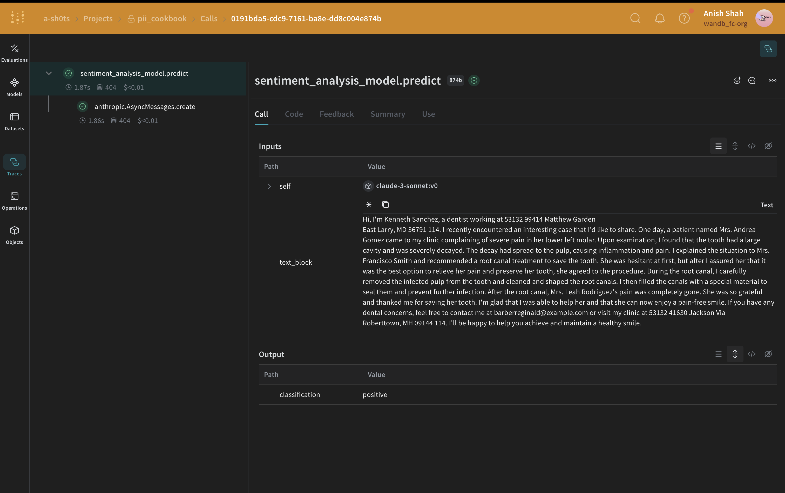
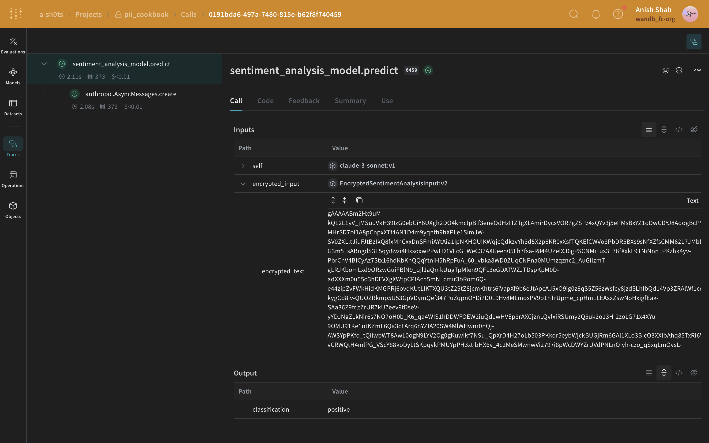

:::tip[This is a notebook]

<a href="https://colab.research.google.com/github/wandb/weave/blob/master/docs/./notebooks/pii.ipynb" target="_blank" rel="noopener noreferrer" class="navbar__item navbar__link button button--secondary button--med margin-right--sm notebook-cta-button"><div><div>Open in Colab</div></div></a>

<a href="https://github.com/wandb/weave/blob/master/docs/./notebooks/pii.ipynb" target="_blank" rel="noopener noreferrer" class="navbar__item navbar__link button button--secondary button--med margin-right--sm notebook-cta-button"><div><div>View in Github</div></div></a>

:::


<!--- @wandbcode{cod-notebook} -->

# How to use Weave with PII data

In this guide, you'll learn how to use W&B Weave while ensuring your Personally Identifiable Information (PII) data remains private. The guide demonstrates the following methods to identify, redact and anonymize PII data:

1. __Regular expressions__ to identify PII data and redact it.
2. __Microsoft's [Presidio](https://microsoft.github.io/presidio/)__, a python-based data protection SDK. This tool provides redaction and replacement functionalities.
3. __[Faker](https://faker.readthedocs.io/en/master/)__, a Python library to generate fake data, combined with Presidio to anonymize PII data.

Additionally, you'll learn how to use _`weave.op` input/output logging customization_ and _`autopatch_settings`_ to integrate PII redaction and anonymization into the workflow. For more information, see [Customize logged inputs and outputs](https://weave-docs.wandb.ai/guides/tracking/ops/#customize-logged-inputs-and-outputs).

To get started, do the following:

1. Review the [Overview](#overview) section.
2. Complete the [prerequisites](#prerequisites).
3. Review the [available methods](#redaction-methods-overview) for identifying, redacting and anonymizing PII data.
4. [Apply the methods to Weave calls](#apply-the-methods-to-weave-calls).

## Overview 

The following section provides an overview of input and output logging using `weave.op`, as well as best practices for working with PII data in Weave.

### Customize input and output logging using `weave.op`

Weave Ops allow you to define input and output postprocessing functions. Using these functions, you can modify the data that is passed to your LLM call or logged to Weave.

In the following example, two postprocessing functions are defined and passed as arguments to `weave.op()`.

```python
from dataclasses import dataclass
from typing import Any

import weave

# Inputs Wrapper Class
@dataclass
class CustomObject:
    x: int
    secret_password: str

# First we define functions for input and output postprocessing:
def postprocess_inputs(inputs: dict[str, Any]) -> dict[str, Any]:
    return {k:v for k,v in inputs.items() if k != "hide_me"}

def postprocess_output(output: CustomObject) -> CustomObject:
    return CustomObject(x=output.x, secret_password="REDACTED")

# Then, when we use the `@weave.op` decorator, we pass these processing functions as arguments to the decorator:
@weave.op(
    postprocess_inputs=postprocess_inputs,
    postprocess_output=postprocess_output,
)
def some_llm_call(a: int, hide_me: str) -> CustomObject:
    return CustomObject(x=a, secret_password=hide_me)
```

### Best practices for using Weave with PII data 

Before using Weave with PII data, review the best practices for using Weave with PII data.

#### During testing
- Log anonymized data to check PII detection
- Track PII handling processes with Weave Traces
- Measure anonymization performance without exposing real PII

#### In production
- Never log raw PII
- Encrypt sensitive fields before logging

#### Encryption tips
- Use reversible encryption for data you need to decrypt later
- Apply one-way hashing for unique IDs you don't need to reverse
- Consider specialized encryption for data you need to analyze while encrypted

## Prerequisites

1. First, install the required packages. 


```python
%%capture
# @title required python packages:
!pip install cryptography 
!pip install presidio_analyzer
!pip install presidio_anonymizer
!python -m spacy download en_core_web_lg    # Presidio uses spacy NLP engine
!pip install Faker                          # we'll use Faker to replace PII data with fake data
!pip install weave                          # To leverage Traces
!pip install set-env-colab-kaggle-dotenv -q # for env var
!pip install anthropic                      # to use sonnet
!pip install cryptography                   # to encrypt our data
```

2. Set up your API keys. You can find your API keys at the following links.

   - [W&B](https://wandb.ai/authorize)
   - [Anthropic](https://console.anthropic.com/settings/keys).


```python
%%capture
# @title Make sure to set up set up your API keys correctly
# See: https://pypi.org/project/set-env-colab-kaggle-dotenv/ for usage instructions.

from set_env import set_env

_ = set_env("ANTHROPIC_API_KEY")
_ = set_env("WANDB_API_KEY")
```

3. Initialize your Weave project.


```python
import weave

# Start a new Weave project
WEAVE_PROJECT = "pii_cookbook"
weave.init(WEAVE_PROJECT)
```

4. Load the demo PII dataset, which contains 10 text blocks. 


```python
import requests

url = "https://raw.githubusercontent.com/wandb/weave/master/docs/notebooks/10_pii_data.json"
response = requests.get(url)
pii_data = response.json()

print('PII data first sample: "' + pii_data[0]["text"] + '"')
```

## Redaction methods overview

Once you've completed the [setup](#setup), you can 

To detect and protect our PII data, we'll identify and redact PII data and optionally anonymize it using the following methods:

1. __Regular expressions__ to identify PII data and redact it.
2. __Microsoft [Presidio](https://microsoft.github.io/presidio/)__, a Python-based data protection SDK that provides redaction and replacement functionality.
3. __[Faker](https://faker.readthedocs.io/en/master/)__, a Python library for generating fake data.


### Method 1: Filter using regular expressions

[Regular expressions (regex)](https://docs.python.org/3/library/re.html) are the simplest method to identify and redact PII data. Regex allows you to define patterns that can match various formats of sensitive information like phone numbers, email addresses, and social security numbers. Using regex, you can scan through large volumes of text and replace or redact information without the need for more complex NLP techniques. 


```python
import re


# Define a function to clean PII data using regex
def redact_with_regex(text):
    # Phone number pattern
    # \b         : Word boundary
    # \d{3}      : Exactly 3 digits
    # [-.]?      : Optional hyphen or dot
    # \d{3}      : Another 3 digits
    # [-.]?      : Optional hyphen or dot
    # \d{4}      : Exactly 4 digits
    # \b         : Word boundary
    text = re.sub(r"\b\d{3}[-.]?\d{3}[-.]?\d{4}\b", "<PHONE>", text)

    # Email pattern
    # \b         : Word boundary
    # [A-Za-z0-9._%+-]+ : One or more characters that can be in an email username
    # @          : Literal @ symbol
    # [A-Za-z0-9.-]+ : One or more characters that can be in a domain name
    # \.         : Literal dot
    # [A-Z|a-z]{2,} : Two or more uppercase or lowercase letters (TLD)
    # \b         : Word boundary
    text = re.sub(
        r"\b[A-Za-z0-9._%+-]+@[A-Za-z0-9.-]+\.[A-Z|a-z]{2,}\b", "<EMAIL>", text
    )

    # SSN pattern
    # \b         : Word boundary
    # \d{3}      : Exactly 3 digits
    # -          : Literal hyphen
    # \d{2}      : Exactly 2 digits
    # -          : Literal hyphen
    # \d{4}      : Exactly 4 digits
    # \b         : Word boundary
    text = re.sub(r"\b\d{3}-\d{2}-\d{4}\b", "<SSN>", text)

    # Simple name pattern (this is not comprehensive)
    # \b         : Word boundary
    # [A-Z]      : One uppercase letter
    # [a-z]+     : One or more lowercase letters
    # \s         : One whitespace character
    # [A-Z]      : One uppercase letter
    # [a-z]+     : One or more lowercase letters
    # \b         : Word boundary
    text = re.sub(r"\b[A-Z][a-z]+ [A-Z][a-z]+\b", "<NAME>", text)

    return text
```

Let's test the function with a sample text:


```python
# Test the function
test_text = "My name is John Doe, my email is john.doe@example.com, my phone is 123-456-7890, and my SSN is 123-45-6789."
cleaned_text = redact_with_regex(test_text)
print(f"Raw text:\n\t{test_text}")
print(f"Redacted text:\n\t{cleaned_text}")
```

### Method 2: Redact using Microsoft Presidio 
The next method involves complete removal of PII data using [Microsoft Presidio](https://microsoft.github.io/presidio/). Presidio redacts PII and replaces it with a placeholder representing the PII type. For example, Presidio replaces `Alex` in `"My name is Alex"` with `<PERSON>`.

Presidio comes with a built-in support for [common entities](https://microsoft.github.io/presidio/supported_entities/). In the below example, we redact all entities that are a `PHONE_NUMBER`, `PERSON`, `LOCATION`, `EMAIL_ADDRESS` or `US_SSN`. The Presidio process is encapsulated in a function.


```python
from presidio_analyzer import AnalyzerEngine
from presidio_anonymizer import AnonymizerEngine

# Set up the Analyzer, which loads an NLP module (spaCy model by default) and other PII recognizers.
analyzer = AnalyzerEngine()

# Set up the Anonymizer, which will use the analyzer results to anonymize the text.
anonymizer = AnonymizerEngine()


# Encapsulate the Presidio redaction process into a function
def redact_with_presidio(text):
    # Analyze the text to identify PII data
    results = analyzer.analyze(
        text=text,
        entities=["PHONE_NUMBER", "PERSON", "LOCATION", "EMAIL_ADDRESS", "US_SSN"],
        language="en",
    )
    # Anonymize the identified PII data
    anonymized_text = anonymizer.anonymize(text=text, analyzer_results=results)
    return anonymized_text.text
```

Let's test the function with a sample text:


```python
text = "My phone number is 212-555-5555 and my name is alex"

# Test the function
anonymized_text = redact_with_presidio(text)

print(f"Raw text:\n\t{text}")
print(f"Redacted text:\n\t{anonymized_text}")
```

### Method 3: Anonymize with replacement using Faker and Presidio

Instead of redacting text, you can anonymize it by using MS Presidio to swap PII like names and phone numbers with fake data generated using the [Faker](https://faker.readthedocs.io/en/master/) Python library. For example, suppose you have the following data:

`"My name is Raphael and I like to fish. My phone number is 212-555-5555"` 

Once the data has been processed using Presidio and Faker, it might look like:

`"My name is Katherine Dixon and I like to fish. My phone number is 667.431.7379"`

To effectively use Presidio and Faker together, we must supply references to our custom operators. These operators will direct Presidio to the Faker functions responsible for swapping PII with fake data.


```python
from faker import Faker
from presidio_anonymizer import AnonymizerEngine
from presidio_anonymizer.entities import OperatorConfig

fake = Faker()


# Create faker functions (note that it has to receive a value)
def fake_name(x):
    return fake.name()


def fake_number(x):
    return fake.phone_number()


# Create custom operator for the PERSON and PHONE_NUMBER" entities
operators = {
    "PERSON": OperatorConfig("custom", {"lambda": fake_name}),
    "PHONE_NUMBER": OperatorConfig("custom", {"lambda": fake_number}),
}

text_to_anonymize = (
    "My name is Raphael and I like to fish. My phone number is 212-555-5555"
)

# Analyzer output
analyzer_results = analyzer.analyze(
    text=text_to_anonymize, entities=["PHONE_NUMBER", "PERSON"], language="en"
)

anonymizer = AnonymizerEngine()

# do not forget to pass the operators from above to the anonymizer
anonymized_results = anonymizer.anonymize(
    text=text_to_anonymize, analyzer_results=analyzer_results, operators=operators
)

print(f"Raw text:\n\t{text_to_anonymize}")
print(f"Anonymized text:\n\t{anonymized_results.text}")
```

Let's consolidate our code into a single class and expand the list of entities to include the additional ones identified earlier.


```python
from faker import Faker
from presidio_anonymizer import AnonymizerEngine
from presidio_anonymizer.entities import OperatorConfig


# A custom class for generating fake data that extends Faker
class my_faker(Faker):
    # Create faker functions (note that it has to receive a value)
    def fake_address(x):
        return fake.address()

    def fake_ssn(x):
        return fake.ssn()

    def fake_name(x):
        return fake.name()

    def fake_number(x):
        return fake.phone_number()

    def fake_email(x):
        return fake.email()

    # Create custom operators for the entities
    operators = {
        "PERSON": OperatorConfig("custom", {"lambda": fake_name}),
        "PHONE_NUMBER": OperatorConfig("custom", {"lambda": fake_number}),
        "EMAIL_ADDRESS": OperatorConfig("custom", {"lambda": fake_email}),
        "LOCATION": OperatorConfig("custom", {"lambda": fake_address}),
        "US_SSN": OperatorConfig("custom", {"lambda": fake_ssn}),
    }

    def redact_and_anonymize_with_faker(self, text):
        anonymizer = AnonymizerEngine()
        analyzer_results = analyzer.analyze(
            text=text,
            entities=["PHONE_NUMBER", "PERSON", "LOCATION", "EMAIL_ADDRESS", "US_SSN"],
            language="en",
        )
        anonymized_results = anonymizer.anonymize(
            text=text, analyzer_results=analyzer_results, operators=self.operators
        )
        return anonymized_results.text
```

Let's test the function with a sample text:


```python
faker = my_faker()
text_to_anonymize = (
    "My name is Raphael and I like to fish. My phone number is 212-555-5555"
)
anonymized_text = faker.redact_and_anonymize_with_faker(text_to_anonymize)

print(f"Raw text:\n\t{text_to_anonymize}")
print(f"Anonymized text:\n\t{anonymized_text}")
```

### Method 4: Use `autopatch_settings` 

You can use `autopatch_settings` to configure PII handling directly during initialization for one or more of the supported LLM integrations. The advantages of this method are:

1. PII handling logic is centralized and scoped at initialization, reducing the need for scattered custom logic.
2. PII processing workflows can be customized or disabled entirely for specific intergations.

To use `autopatch_settings` to configure PII handling, define `postprocess_inputs` and/or `postprocess_output` in `op_settings` for any one of the supported LLM integrations. 

```python 

def postprocess(inputs: dict) -> dict:
    if "SENSITIVE_KEY" in inputs:
        inputs["SENSITIVE_KEY"] = "REDACTED"
    return inputs

client = weave.init(
    ...,
    autopatch_settings={
        "openai": {
            "op_settings": {
                "postprocess_inputs": postprocess,
                "postprocess_output": ...,
            }
        },
        "anthropic": {
            "op_settings": {
                "postprocess_inputs": ...,
                "postprocess_output": ...,
            }
        }
    },
)
```


## Apply the methods to Weave calls

In the following examples, we will integrate our PII redaction and anonymization methods into Weave Models and preview the results in Weave Traces.

First, we'll create a [Weave Model](https://wandb.github.io/weave/guides/core-types/models). A Weave Model is a combination of information like configuration settings, model weights, and code that defines how the model operates. 

In our model, we will include our predict function where the Anthropic API will be called. Anthropic's Claude Sonnet is used to perform sentiment analysis while tracing LLM calls using [Traces](https://wandb.github.io/weave/quickstart). Claude Sonnet will receive a block of text and output one of the following sentiment classifications: _positive_, _negative_, or _neutral_. Additionally, we will include our postprocessing functions to ensure that our PII data is redacted or anonymized before it is sent to the LLM.

Once you run this code, you will receive a links to the Weave project page, as well as the specific trace (LLM calls) you ran.

### Regex method 

In the simplest case, we can use regex to identify and redact PII data from the original text.


```python
import json
from typing import Any

import anthropic

import weave


# Define an input postprocessing function that applies our regex redaction for the model prediction Weave Op
def postprocess_inputs_regex(inputs: dict[str, Any]) -> dict:
    inputs["text_block"] = redact_with_regex(inputs["text_block"])
    return inputs


# Weave model / predict function
class sentiment_analysis_regex_pii_model(weave.Model):
    model_name: str
    system_prompt: str
    temperature: int

    @weave.op(
        postprocess_inputs=postprocess_inputs_regex,
    )
    async def predict(self, text_block: str) -> dict:
        client = anthropic.AsyncAnthropic()
        response = await client.messages.create(
            max_tokens=1024,
            model=self.model_name,
            system=self.system_prompt,
            messages=[
                {"role": "user", "content": [{"type": "text", "text": text_block}]}
            ],
        )
        result = response.content[0].text
        if result is None:
            raise ValueError("No response from model")
        parsed = json.loads(result)
        return parsed
```


```python
# create our LLM model with a system prompt
model = sentiment_analysis_regex_pii_model(
    name="claude-3-sonnet",
    model_name="claude-3-5-sonnet-20240620",
    system_prompt='You are a Sentiment Analysis classifier. You will be classifying text based on their sentiment. Your input will be a block of text. You will answer with one the following rating option["positive", "negative", "neutral"]. Your answer should be one word in json format: {classification}. Ensure that it is valid JSON.',
    temperature=0,
)

print("Model: ", model)
# for every block of text, anonymized first and then predict
for entry in pii_data:
    await model.predict(entry["text"])
```

### Presidio redaction method

Next, we will use Presidio to identify and redact PII data from the original text.


```python
import json
from typing import Any

import anthropic

import weave


# Define an input postprocessing function that applies our Presidio redaction for the model prediction Weave Op
def postprocess_inputs_presidio(inputs: dict[str, Any]) -> dict:
    inputs["text_block"] = redact_with_presidio(inputs["text_block"])
    return inputs


# Weave model / predict function
class sentiment_analysis_presidio_pii_model(weave.Model):
    model_name: str
    system_prompt: str
    temperature: int

    @weave.op(
        postprocess_inputs=postprocess_inputs_presidio,
    )
    async def predict(self, text_block: str) -> dict:
        client = anthropic.AsyncAnthropic()
        response = await client.messages.create(
            max_tokens=1024,
            model=self.model_name,
            system=self.system_prompt,
            messages=[
                {"role": "user", "content": [{"type": "text", "text": text_block}]}
            ],
        )
        result = response.content[0].text
        if result is None:
            raise ValueError("No response from model")
        parsed = json.loads(result)
        return parsed
```


```python
# create our LLM model with a system prompt
model = sentiment_analysis_presidio_pii_model(
    name="claude-3-sonnet",
    model_name="claude-3-5-sonnet-20240620",
    system_prompt='You are a Sentiment Analysis classifier. You will be classifying text based on their sentiment. Your input will be a block of text. You will answer with one the following rating option["positive", "negative", "neutral"]. Your answer should be one word in json format: {classification}. Ensure that it is valid JSON.',
    temperature=0,
)

print("Model: ", model)
# for every block of text, anonymized first and then predict
for entry in pii_data:
    await model.predict(entry["text"])
```

### Faker and Presidio replacement method

In this example, we use Faker to generate anonymized replacement PII data and use Presidio to identify and replace the PII data in the original text.





```python
import json
from typing import Any

import anthropic

import weave

# Define an input postprocessing function that applies our Faker anonymization and Presidio redaction for the model prediction Weave Op
faker = my_faker()


def postprocess_inputs_faker(inputs: dict[str, Any]) -> dict:
    inputs["text_block"] = faker.redact_and_anonymize_with_faker(inputs["text_block"])
    return inputs


# Weave model / predict function
class sentiment_analysis_faker_pii_model(weave.Model):
    model_name: str
    system_prompt: str
    temperature: int

    @weave.op(
        postprocess_inputs=postprocess_inputs_faker,
    )
    async def predict(self, text_block: str) -> dict:
        client = anthropic.AsyncAnthropic()
        response = await client.messages.create(
            max_tokens=1024,
            model=self.model_name,
            system=self.system_prompt,
            messages=[
                {"role": "user", "content": [{"type": "text", "text": text_block}]}
            ],
        )
        result = response.content[0].text
        if result is None:
            raise ValueError("No response from model")
        parsed = json.loads(result)
        return parsed
```


```python
# create our LLM model with a system prompt
model = sentiment_analysis_faker_pii_model(
    name="claude-3-sonnet",
    model_name="claude-3-5-sonnet-20240620",
    system_prompt='You are a Sentiment Analysis classifier. You will be classifying text based on their sentiment. Your input will be a block of text. You will answer with one the following rating option["positive", "negative", "neutral"]. Your answer should be one word in json format: {classification}. Ensure that it is valid JSON.',
    temperature=0,
)

print("Model: ", model)
# for every block of text, anonymized first and then predict
for entry in pii_data:
    await model.predict(entry["text"])
```

### `autopatch_settings` method

In the following example, we set `postprocess_inputs` for `anthropic` to the `postprocess_inputs_regex()` function () at initialization. The `postprocess_inputs_regex` function applies the`redact_with_regex` method defined in [Method 1: Regular Expression Filtering](#method-1-regular-expression-filtering). Now, `redact_with_regex` will be applied to all inputs to any `anthropic` models.


```python
import json
from typing import Any

import anthropic

import weave

client = weave.init(
    ...,
    autopatch_settings={
        "anthropic": {
            "op_settings": {
                "postprocess_inputs": postprocess_inputs_regex,
            }
        }
    },
)


# Define an input postprocessing function that applies our regex redaction for the model prediction Weave Op
def postprocess_inputs_regex(inputs: dict[str, Any]) -> dict:
    inputs["text_block"] = redact_with_regex(inputs["text_block"])
    return inputs


# Weave model / predict function
class sentiment_analysis_regex_pii_model(weave.Model):
    model_name: str
    system_prompt: str
    temperature: int

    async def predict(self, text_block: str) -> dict:
        client = anthropic.AsyncAnthropic()
        response = await client.messages.create(
            max_tokens=1024,
            model=self.model_name,
            system=self.system_prompt,
            messages=[
                {"role": "user", "content": [{"type": "text", "text": text_block}]}
            ],
        )
        result = response.content[0].text
        if result is None:
            raise ValueError("No response from model")
        parsed = json.loads(result)
        return parsed
```


```python
# create our LLM model with a system prompt
model = sentiment_analysis_regex_pii_model(
    name="claude-3-sonnet",
    model_name="claude-3-5-sonnet-20240620",
    system_prompt='You are a Sentiment Analysis classifier. You will be classifying text based on their sentiment. Your input will be a block of text. You will answer with one the following rating option["positive", "negative", "neutral"]. Your answer should be one word in json format: {classification}. Ensure that it is valid JSON.',
    temperature=0,
)

print("Model: ", model)
# for every block of text, anonymized first and then predict
for entry in pii_data:
    await model.predict(entry["text"])
```

### (Optional) Encrypt your data 



In addition to anonymizing PII, you can add an extra layer of security by encrypting your data using the cryptography library's [Fernet](https://cryptography.io/en/latest/fernet/) symmetric encryption. This approach ensures that even if the anonymized data is intercepted, it remains unreadable without the encryption key.

```python
import os
from cryptography.fernet import Fernet
from pydantic import BaseModel, ValidationInfo, model_validator

def get_fernet_key():
    # Check if the key exists in environment variables
    key = os.environ.get('FERNET_KEY')
    
    if key is None:
        # If the key doesn't exist, generate a new one
        key = Fernet.generate_key()
        # Save the key to an environment variable
        os.environ['FERNET_KEY'] = key.decode()
    else:
        # If the key exists, ensure it's in bytes
        key = key.encode()
    
    return key

cipher_suite = Fernet(get_fernet_key())

class EncryptedSentimentAnalysisInput(BaseModel):
    encrypted_text: str = None

    @model_validator(mode="before")
    def encrypt_fields(cls, values):
        if "text" in values and values["text"] is not None:
            values["encrypted_text"] = cipher_suite.encrypt(values["text"].encode()).decode()
            del values["text"]
        return values

    @property
    def text(self):
        if self.encrypted_text:
            return cipher_suite.decrypt(self.encrypted_text.encode()).decode()
        return None

    @text.setter
    def text(self, value):
        self.encrypted_text = cipher_suite.encrypt(str(value).encode()).decode()

    @classmethod
    def encrypt(cls, text: str):
        return cls(text=text)

    def decrypt(self):
        return self.text

# Modified sentiment_analysis_model to use the new EncryptedSentimentAnalysisInput
class sentiment_analysis_model(weave.Model):
    model_name: str
    system_prompt: str
    temperature: int

    @weave.op()
    async def predict(self, encrypted_input: EncryptedSentimentAnalysisInput) -> dict:
        client = AsyncAnthropic()

        decrypted_text = encrypted_input.decrypt() # We use the custom class to decrypt the text

        response = await client.messages.create(
            max_tokens=1024,
            model=self.model_name,
            system=self.system_prompt,
            messages=[
                {   "role": "user",
                    "content":[
                        {
                            "type": "text",
                            "text": decrypted_text
                        }
                    ]
                }
            ]
        )
        result = response.content[0].text
        if result is None:
            raise ValueError("No response from model")
        parsed = json.loads(result)
        return parsed

model = sentiment_analysis_model(
    name="claude-3-sonnet",
    model_name="claude-3-5-sonnet-20240620",
    system_prompt="You are a Sentiment Analysis classifier. You will be classifying text based on their sentiment. Your input will be a block of text. You will answer with one the following rating option[\"positive\", \"negative\", \"neutral\"]. Your answer should one word in json format dict where the key is classification.",
    temperature=0
)

for entry in pii_data:
    encrypted_input = EncryptedSentimentAnalysisInput.encrypt(entry["text"])
    await model.predict(encrypted_input)
```
