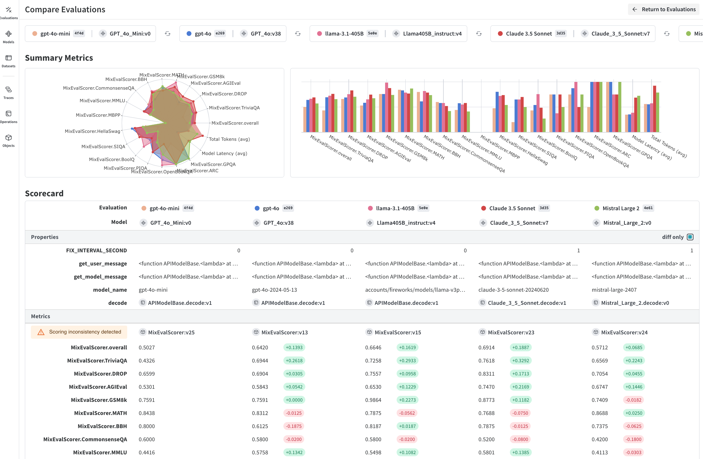

# Running an Evaluation

In this tutorial **we will learn how to evaluate a LLM system using Weave**. To increase the performance an LLM system, we need a way to assess if it is improving - we need Evaluation Driven Development. These evaluations, or tests, can be as simple as asserting that the correct data type was output by an LLM, or more complex evaluations such as whether a response from a customer support application was appropriate.

Weave [Evaluations](guides/core-types/evaluations) will run your LLM system against your evaluation dataset for you; displaying  **metrics**, **token usage** and **latency** for the entire evaluation, as well as for each of the samples in your evaluation dataset. As you iterate on your LLM system using Weave Evaluations you can then compare the performance of different system settings using Weave's Evaluations Comparison view:



## Running an Evaluation in Weave

Building off of the previous [App Versioning](/tutorial-weave_models) tutorial, now we will evaluate the performance of our LLM system to:

- generate valid JSON
- extract the "common name" of the carnivorous dinosaurs mentioned in the texts
- return the correct number of dinosaurs from each text 

We will later define scorer functions for each of these criteria, but first we need an evaluation dataset.

### 1. Evaluation Data


To begin, we first need an evaluation dataset. Evaluation datasets in Weave Evaluations can either be a list of python dictionaries or a [`weave.Dataset`](guides/core-types/datasets).

**Naming items in the evaluation dataset**

How our items in the evaluation dataset are named is important - the **item keys** must match the **argument names** in your Weave Model's **predict function** and **scorer function(s)** you'll use. This is how Weave knows which elemets in each row in the dataset should be passed to the appropriate predict and scorer functions.

For example if the values for your LLM inputs are stored under the `"question"` key and the ground truth, or labels, are stored under the `"target"` key like so:

```python
eval_data = [
    {"question": "What is the capital of France?", "target": "Paris"},
    ...
]
```

Then the signature of the `predict` function that calls the LLM system must contain an argument called `question`:

```python
class CountryCapitalLLM(weave.Model):
    ...

    # "question" must be in the function signature of predict
    @weave.op
    def predict(self, question: str) -> dict:
        ...

```

And similarly the signature of the scorer function that grades the LLM system output must contain an argument called `target`: 

```python
def capital_cities_scorer(target: str, model_output: dict): 
    ...
```


**Defining our data**

As mentioned, the evaluation dataset can be structured as a list of dictionaries or as a `weave.Dataset`. Here we will use a list of dictionaries:

```python
inputs = [
    "A Velociraptor (Raptor) darted through the undergrowth, stalking a \
grazing Stegosaurus (Stego), while an Archaeopteryx (Archie) herbivore soared overhead.",
    "The Ankylosaurus (Anky) swung its clubbed tail defensively as a pack of \
ten Dilophosaurus (Dilo) circled.",
    "A massive Spinosaurus (Gali) emerged from the river, eating seaweed, startling \
a herd of Gallimimus into a frenzied sprint across the plain."
]

labels = [
    {"id": 0, "carnivore_name": "velociraptor", "common_name": "raptor", "n_dinos": 3},
    {"id": 1, "carnivore_name": "dilophosaurus", "common_name": "dilo", "n_dinos": 2},
    {"id": 2, "carnivore_name": "spinosaurus", "common_name": "spino", "n_dinos": 2}
]

eval_set = [
    {"id": 0, "text": inputs[0], "target": labels[0]},
    {"id": 1, "text": inputs[1], "target": labels[1]},
    {"id": 2, "text": inputs[2], "target": labels[2]}
]
```

### 2. Instantiate a LLM system

Building off of the previous [App Versioning](/tutorial-weave_models) tutorial, we will define our LLM system as a Weave [`Model`](guides/core-types/models). 

A weave `Model` stores and versions information about your system, such as prompts, temperatures, and more.
Weave automatically captures when a Model is used and updates the Model version when changes are made to it.

`Model`s are declared by subclassing `weave.Model` and implementing a `predict` function definition, which takes an input and returns a response. Note, as mentioned earlier the predict function's argument name(s) should match the keys of the input data in the evaluation dataset, `text` in this case:

```python
import json
import weave
from openai import OpenAI

# Define our LLM function
@weave.op
def extract_dinos(wmodel: weave.Model, text: str) -> dict:
    response = wmodel.client.chat.completions.create(
        model=wmodel.model_name,
        temperature=wmodel.temperature,
        messages=[
            {
                "role": "system",
                "content": wmodel.system_prompt
            },
            {
                "role": "user",
                "content": text
            }
            ],
            response_format={ "type": "json_object" }
        )
    return response.choices[0].message.content

# Create a Weave Model to call the LLM function
class ExtractDinos(weave.Model):
    client: OpenAI = None
    model_name: str
    temperature: float
    system_prompt: str

    # The `text` argument matches the `text` key in the evaluation dataset
    @weave.op
    def predict(self, text: str) -> dict:
        return extract_dinos(self, text)
```

### 3. Define scoring criteria

Scorers are used to assess your LLM system output against one or more criterion. Here we define scorer functions that assess whether or not:

- the generated JSON is valid
- the common names of carnivorous dinosaurs mentioned in the input texts are extracted correctly
- the model returns the correct number of dinosaurs in each input text 

Scorer functions are just regular python functions, decorated with `weave.op` and must return a dictionary with the metric name as the key and the evaluation result as the value. The value should be of type `bool`, `int` or `float`: 

```python
{"valid_json": True}
{"entity_count": 10}
{"score": 0.78}
```

Multiple metric:value pairs can be returned from a single scorer function if needed, for example:

```python
{"score": 0.78 , "threshold_passed": True}
```

Lets define the scorers:

```python
# Assess that the generated JSON is valid
@weave.op
def json_check(target: str, model_output: dict) -> dict:
    try:
        json.loads(model_output)
        return {"json_correct": True}
    except:
        return {"json_correct": False}

# Assess that the correct carnivorous dinosaur name is extracted
@weave.op
def carnivore_name_check(target: str, model_output: dict) -> dict:
    model_output = json.loads(model_output)
    for dino in model_output["dinosaurs"]:
      if dino["diet"] == "carnivore":
        return {
            "carnivore_name_correct": target["carnivore_name"] == dino["name"].lower()
            }
    return {"carnivore_name_correct": False}

# Assess that the correct number of dinosaurs is extracted
@weave.op
def count_dinos_check(target: str, model_output: dict) -> dict:
    model_output = json.loads(model_output)
    return {
        "count_dinos_correct" : target["n_dinos"] == len(model_output["dinosaurs"])
    }
```


The [Evaluations](guides/core-types/evaluations) guide and [RAG tutorial](/tutorial-rag) contains more details on how to build advanced custom scorers, including how to post-processes the results from your scorers using the `Scorer` classes' `summarize` method.


### 4. Running the evaluation

The `Evaluation` class is designed to assess the performance of a LLM system on a given dataset using the scoring functions. The LLM system, which has to be of type `weave.Model`, is passed to the `Evaluation.evaluate` method to kick off evaluation.

**Evaluations are run asynchronously**

When the `evaluate` method is called, Weave will run the LLM system across all items in your dataset asyncronously. To set a maximum on the number of async evaluation calls at any one time, you can set the `WEAVE_PARALLELISM` environment variable to any integer; setting it to 1 will run through the evaluation dataset synchronously. Setting this env variable can help avoid hitting rate limit errors from LLM providers for example.

Note that the `asyncio` python library must be used when running an evaluation in a python script, while running in a Jupyter or Colab notebooks simply requires using `await`:

```python
# When in a python script:
summary_metrics =  asyncio.run(evaluation.evaluate(model=dinos))

# When in a Jupyter or Colab Notebook:
summary_metrics = await evaluation.evaluate(model=dinos)
```

The [Evaluation](guides/core-types/evaluations) guide contains more details on the `Evaluation` class.


```python
import os
import asyncio
from weave import Evaluation

client = OpenAI(api_key=os.getenv["OPENAI_API_KEY"])

system_prompt = """Extract any dinosaur `name`, their `common_name`, \
and whether its `diet` is herbivore or carnivore, in JSON format"""

temperature = 0.4

# Instantiate the weave Model
dinos = ExtractDinos(
    client=client,
    model_name='gpt-4o-mini',
    temperature=temperature,
    system_prompt=system_prompt
)

# Create your evaluation object
# highlight-next-line
evaluation = Evaluation(
    name=f"carnivore_evaluator_temp-{temperature}",  # optionally set a name for the object
    dataset=eval_set,  # can be a list of dictionaries or a weave.Dataset object
    scorers=[json_check, carnivore_name_check, count_dinos_check],  # list of scoring functions
)

# Initialise weave, use "ENTITY/PROJECT" to log to a project in a specific W&B Team
weave.init("jurassic-park")

# Run the evaluation, passing in the `dinos` Model
# highlight-next-line
summary_metrics = asyncio.run(evaluation.evaluate(model=dinos))

# If you're in a Jupyter or Colab Notebook, run:
# summary_metrics = await evaluation.evaluate(model=dinos)
```

You've now run a Weave Evaluation! The results will be printed in the terminal output as well as logged to the Weave UI in the Evaluations tab. 


### 5. Comparing Evaluations

When you'd like to compare multiple evaluations you can select the evaluations you're interested in in the Evaluations tab of the Weave UI and then click "Compare" button to generate charts.


## What's next?

Try the [Evaluate a RAG App](/tutorial-rag) tutorial to learn how use use advanced Weave `Scorer`s to evaluate a RAG app using an LLM judge.
