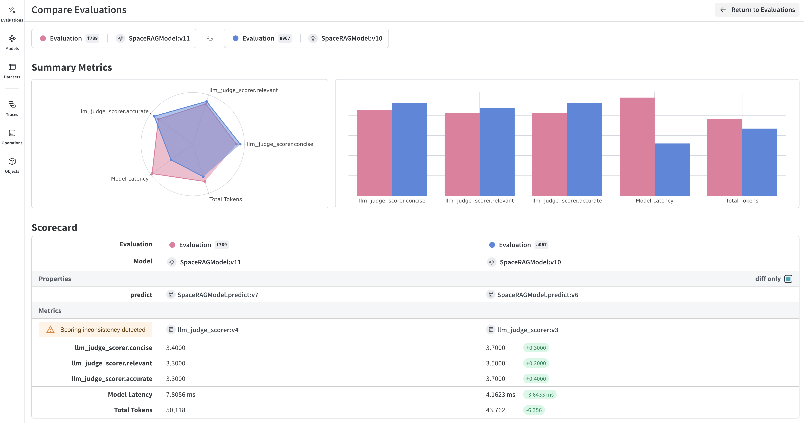

# Tutorial: Build an Evaluation pipeline

To iterate on an application, we need a way to evaluate if it's improving. To do so, a common practice is to test it against the same set of examples when there is a change. Weave has a first-class way to track evaluations with `Model` & `Evaluation` classes. We have built the APIs to make minimal assumptions to allow for the flexibility to support a wide array of use-cases.



## 1. Build a `Model`

`Model`s store and version information about your system, such as prompts, temperatures, and more.
Weave automatically captures when they are used and update the version when there are changes.

`Model`s are declared by subclassing `Model` and implementing a `predict` function definition, which takes one example and returns the response.

:::warning

**Known Issue**: If you are using Google Colab, remove `async` from the following examples.

:::

```python
import json
import openai
import weave

# highlight-next-line
class ExtractFruitsModel(weave.Model):
    model_name: str
    prompt_template: str

    # highlight-next-line
    @weave.op()
    # highlight-next-line
    async def predict(self, sentence: str) -> dict:
        client = openai.AsyncClient()

        response = await client.chat.completions.create(
            model=self.model_name,
            messages=[
                {"role": "user", "content": self.prompt_template.format(sentence=sentence)}
            ],
        )
        result = response.choices[0].message.content
        if result is None:
            raise ValueError("No response from model")
        parsed = json.loads(result)
        return parsed
```

You can instantiate `Model` objects as normal like this:

```python
import asyncio
import weave

weave.init('intro-example')

model = ExtractFruitsModel(model_name='gpt-3.5-turbo-1106',
                          prompt_template='Extract fields ("fruit": <str>, "color": <str>, "flavor": <str>) from the following text, as json: {sentence}')
sentence = "There are many fruits that were found on the recently discovered planet Goocrux. There are neoskizzles that grow there, which are purple and taste like candy."
print(asyncio.run(model.predict(sentence)))
# if you're in a Jupyter Notebook, run:
# await model.predict(sentence)
```

:::note
Checkout the [Models](/guides/core-types/models) guide to learn more.
:::

## 2. Collect some examples

```python
sentences = ["There are many fruits that were found on the recently discovered planet Goocrux. There are neoskizzles that grow there, which are purple and taste like candy.",
"Pounits are a bright green color and are more savory than sweet.",
"Finally, there are fruits called glowls, which have a very sour and bitter taste which is acidic and caustic, and a pale orange tinge to them."]
labels = [
    {'fruit': 'neoskizzles', 'color': 'purple', 'flavor': 'candy'},
    {'fruit': 'pounits', 'color': 'bright green', 'flavor': 'savory'},
    {'fruit': 'glowls', 'color': 'pale orange', 'flavor': 'sour and bitter'}
]
examples = [
    {'id': '0', 'sentence': sentences[0], 'target': labels[0]},
    {'id': '1', 'sentence': sentences[1], 'target': labels[1]},
    {'id': '2', 'sentence': sentences[2], 'target': labels[2]}
]
```

## 3. Evaluate a `Model`

`Evaluation`s assess a `Model`s performance on a set of examples using a list of specified scoring functions or `weave.flow.scorer.Scorer` classes.

Here, we'll use a default scoring class `MultiTaskBinaryClassificationF1` and we'll also define our own `fruit_name_score` scoring function.

Here `sentence` is passed to the model's predict function, and `target` is used in the scoring function, these are inferred based on the argument names of the `predict` and scoring functions. The `fruit` key needs to be outputted by the model's predict function and must also be existing as a column in the dataset (or outputted by the `preprocess_model_input` function if defined).

```python
import weave
from weave.flow.scorer import MultiTaskBinaryClassificationF1

weave.init('intro-example')

@weave.op()
def fruit_name_score(target: dict, model_output: dict) -> dict:
    return {'correct': target['fruit'] == model_output['fruit']}

# highlight-next-line
evaluation = weave.Evaluation(
    # highlight-next-line
    dataset=examples,
    # highlight-next-line
    scorers=[
        # highlight-next-line
        MultiTaskBinaryClassificationF1(class_names=["fruit", "color", "flavor"]),
        # highlight-next-line
        fruit_name_score
    # highlight-next-line
    ],
# highlight-next-line
)
# highlight-next-line
print(asyncio.run(evaluation.evaluate(model)))
# if you're in a Jupyter Notebook, run:
# await evaluation.evaluate(model)
```

In some applications we want to create custom `Scorer` classes - where for example a standardized `LLMJudge` class should be created with specific parameters (e.g. chat model, prompt), specific scoring of each row, and specific calculation of an aggregate score. See the tutorial on defining a `Scorer` class in the next chapter on [Model-Based Evaluation of RAG applications](/tutorial-rag#optional-defining-a-scorer-class) for more information.

## 4. Pulling it all together

```python
import json
import asyncio
# highlight-next-line
import weave
# highlight-next-line
from weave.flow.scorer import MultiTaskBinaryClassificationF1
import openai

# We create a model class with one predict function.
# All inputs, predictions and parameters are automatically captured for easy inspection.

# highlight-next-line
class ExtractFruitsModel(weave.Model):
    model_name: str
    prompt_template: str

    # highlight-next-line
    @weave.op()
    # highlight-next-line
    async def predict(self, sentence: str) -> dict:
        client = openai.AsyncClient()

        response = await client.chat.completions.create(
            model=self.model_name,
            messages=[
                {"role": "user", "content": self.prompt_template.format(sentence=sentence)}
            ],
            response_format={ "type": "json_object" }
        )
        result = response.choices[0].message.content
        if result is None:
            raise ValueError("No response from model")
        parsed = json.loads(result)
        return parsed

# We call init to begin capturing data in the project, intro-example.
weave.init('intro-example')

# We create our model with our system prompt.
model = ExtractFruitsModel(name='gpt4',
                           model_name='gpt-4-0125-preview',
                           prompt_template='Extract fields ("fruit": <str>, "color": <str>, "flavor") from the following text, as json: {sentence}')
sentences = ["There are many fruits that were found on the recently discovered planet Goocrux. There are neoskizzles that grow there, which are purple and taste like candy.",
"Pounits are a bright green color and are more savory than sweet.",
"Finally, there are fruits called glowls, which have a very sour and bitter taste which is acidic and caustic, and a pale orange tinge to them."]
labels = [
    {'fruit': 'neoskizzles', 'color': 'purple', 'flavor': 'candy'},
    {'fruit': 'pounits', 'color': 'bright green', 'flavor': 'savory'},
    {'fruit': 'glowls', 'color': 'pale orange', 'flavor': 'sour and bitter'}
]
examples = [
    {'id': '0', 'sentence': sentences[0], 'target': labels[0]},
    {'id': '1', 'sentence': sentences[1], 'target': labels[1]},
    {'id': '2', 'sentence': sentences[2], 'target': labels[2]}
]
# If you have already published the Dataset, you can run:
# dataset = weave.ref('example_labels').get()

# We define a scoring functions to compare our model predictions with a ground truth label.
@weave.op()
def fruit_name_score(target: dict, model_output: dict) -> dict:
    return {'correct': target['fruit'] == model_output['fruit']}

# Finally, we run an evaluation of this model.
# This will generate a prediction for each input example, and then score it with each scoring function.
# highlight-next-line
evaluation = weave.Evaluation(
    name='fruit_eval',
    # highlight-next-line
    dataset=examples, scorers=[MultiTaskBinaryClassificationF1(class_names=["fruit", "color", "flavor"]), fruit_name_score],
# highlight-next-line
)
print(asyncio.run(evaluation.evaluate(model)))
# if you're in a Jupyter Notebook, run:
# await evaluation.evaluate(model)
```

## What's next?

- Follow the [Model-Based Evaluation of RAG applications](/tutorial-rag) to evaluate a RAG app using an LLM judge.
