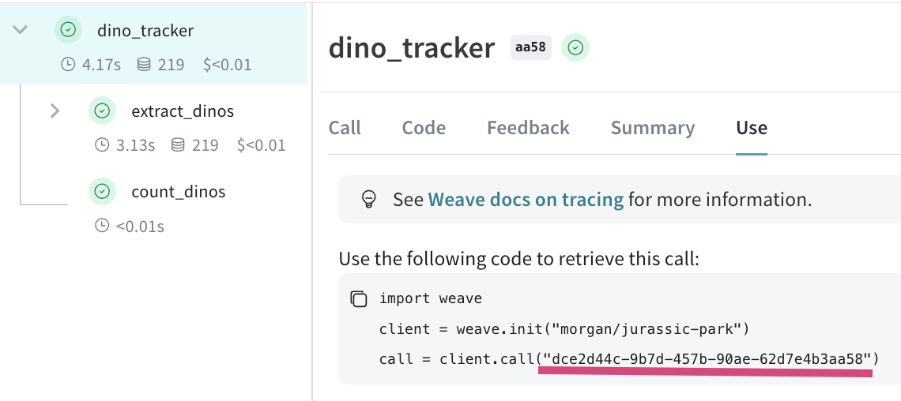

# Track data flows and app metadata

In the [Track LLM inputs & outputs](/tutorial-tracing_1) tutorial, the basics of tracking inputs and outputs of LLMs was explained.

In this tutorial you will learn how to:
- **Track data** as it flows though your application
- **Track metadata** at call time
- **Export data** that was logged to Weave

## Tracking nested function calls

LLM-powered applications can contain multiple LLMs calls and additional data processing and validation logic that is important to monitor. Weave will keep track of the parent-child relationships in nested functions as long as `weave.op()` is added to every function you'd like to track. 

Building on our [basic tracing example](/tutorial-tracing_1), we will now add additional logic to count the returned items from our LLM and wrap them all in a higher level function:

```python
import weave
import json
from openai import OpenAI

client = OpenAI(api_key="...")

# highlight-next-line
@weave.op()
def extract_dinos(sentence: str) -> dict:
    response = client.chat.completions.create(
        model="gpt-4o",
        messages=[
            {
                "role": "system",
                "content": """Extract any dinorsaur `name`, their `common_name`, \
  names and whether its `diet` is a herbivore or carnivore, in JSON format."""
            },
            {
                "role": "user",
                "content": sentence
            }
            ],
            response_format={ "type": "json_object" }
        )
    return response.choices[0].message.content

# highlight-next-line
@weave.op()
def count_dinos(dino_data: dict) -> int:
    k = list(dino_data.keys())[0]
    return len(dino_data[k])

# highlight-next-line
@weave.op()
def dino_tracker(sentence: str) -> dict:
    # extract dinosaurs using a LLM
    dino_data = extract_dinos(sentence)
    dino_data = json.loads(dino_data)

    # count the number of dinosaurs returned
    n_dinos = count_dinos(dino_data)
    return {"n_dinosaurs": n_dinos, "dinosaurs": dino_data}

# highlight-next-line
weave.init('jurassic-park')

sentence = """I watched as a Tyrannosaurus rex (T. rex) chased after a Triceratops (Trike), \
both carnivore and herbivore locked in an ancient dance. Meanwhile, a gentle giant \
Brachiosaurus (Brachi) calmly munched on treetops, blissfully unaware of the chaos below."""

result = dino_tracker(sentence)
print(result)
```

**Nested functions**

When you run the above code you will see the the inputs and outputs from the two nested functions, as well as the automatically-logged OpenAI trace.


 

<!--  -->


## Tracking metadata

Tracking metadata can be done easily by using the `weave.attributes` context manger at call time.

```python
weave.init('jurassic-park')

sentence = """I watched as a Tyrannosaurus rex (T. rex) chased after a Triceratops (Trike), \
both carnivore and herbivore locked in an ancient dance. Meanwhile, a gentle giant \
Brachiosaurus (Brachi) calmly munched on treetops, blissfully unaware of the chaos below."""

# highlight-next-line
# track metadata alongside your function call
with weave.attributes({'user_id': 'lukas', 'env': 'production'}):
    result = dino_tracker(sentence)
```

:::note
It's recommended to use metadata tracking to track metadata at run time, e.g. user ids or whether or not the call is part of the development process or is in production etc.

To track system attributes, such as a System Prompt, we recommend using [weave Models](guides/core-types/models)
:::


## Exporting call data

Exporting data from a Weave call can be useful if further post-processing is needed in other tools.

**Get the weave call ID**

To export all the data and metadata from a call you just need the call ID, which can be found in the "Use" tab in the call's view



After initialising the weave client, you can then use `weave.call` to retrieve the call object which includes the input, output and metadata of that particular call.

**Export the call data**

Once you have the call ID you can get the inputs, outputs and metadata that was logged to that call.

```python
import weave

client = weave.init("morgan/jurassic-park")
call = client.call("dce2d44c-9b7d-457b-90ae-62d7e4b3aa58")
```

Export one of the call outputs:
```python
call.output["n_dinosaurs"]

>>> 3
```

Export the inputs:
```python
call.input["sentence"]

>>> """I watched as a Tyrannosaurus rex (T. rex) chased after a Triceratops (Trike), 
both carnivore and herbivore locked in an ancient dance. Meanwhile, a gentle giant 
Brachiosaurus (Brachi) calmly munched on treetops, blissfully unaware of the chaos below."""
```

Export the usage status from the call summary:
```python
call.summary["usage"]

>>> WeaveDict({'gpt-4o-2024-05-13': {'requests': 1, 'completion_tokens': 109, 
'prompt_tokens': 110, 'total_tokens': 219}})
```
