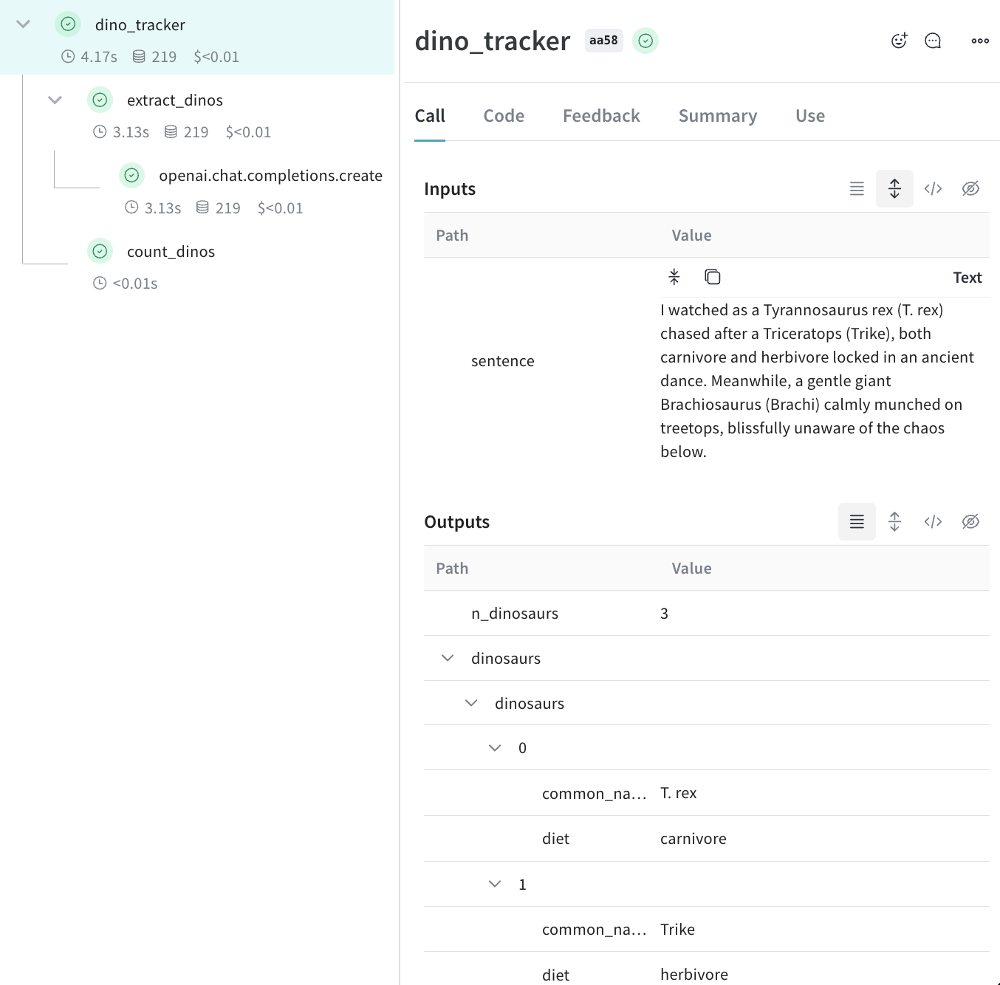

import Tabs from '@theme/Tabs';
import TabItem from '@theme/TabItem';

# Track nested functions and metadata

In the [Log a trace](/quickstart) tutorial, you learned how to create a Weave project and log your first trace.

In this guide, you will learn how to:

- Track nested function calls
- Track metadata at call time

## Track nested function calls

Creating LLM-powered applications often requires the use of multiple functions, nested functions for LLMs calls, additional data processing, and validation logic. It is important for LLM application developers to be able to monitor and analyze these nested functions.

With Weave, you can automatically track the parent-child relationships in nested functions as long as `weave.op()` is added to every function you'd like to track.

Building on the [basic tracing example](/quickstart), the following example adds additional functions (`extract_dinos` and `count_dinos`) to extract and count the items returned by `gpt-4o`. The `weave.op()` decorator is added to every function for tracing. Now, Weave keeps track of every function in the application, including parent-child relationships.

<Tabs groupId="programming-language" queryString>
  <TabItem value="python" label="Python" default>

    ```python
    import weave
    import json
    from openai import OpenAI

    client = OpenAI()

    # highlight-next-line
    @weave.op()
    def extract_dinos(sentence: str) -> dict:
        response = client.chat.completions.create(
            model="gpt-4o",
            messages=[
                {
                    "role": "system",
                    "content": """Extract any dinosaur `name`, their `common_name`, \
    names and whether its `diet` is a herbivore or carnivore, in JSON format."""
                },
                {
                    "role": "user",
                    "content": sentence
                }
                ],
                response_format={ "type": "json_object" }
            )
        return response.choices[0].message.content

    # highlight-next-line
    @weave.op()
    def count_dinos(dino_data: dict) -> int:
        # count the number of items in the returned list
        k = list(dino_data.keys())[0]
        return len(dino_data[k])

    # highlight-next-line
    @weave.op()
    def dino_tracker(sentence: str) -> dict:
        # extract dinosaurs using a LLM
        dino_data = extract_dinos(sentence)

        # count the number of dinosaurs returned
        dino_data = json.loads(dino_data)
        n_dinos = count_dinos(dino_data)
        return {"n_dinosaurs": n_dinos, "dinosaurs": dino_data}

    # highlight-next-line
    weave.init('jurassic-park')

    sentence = """I watched as a Tyrannosaurus rex (T. rex) chased after a Triceratops (Trike), \
    both carnivore and herbivore locked in an ancient dance. Meanwhile, a gentle giant \
    Brachiosaurus (Brachi) calmly munched on treetops, blissfully unaware of the chaos below."""

    result = dino_tracker(sentence)
    print(result)
    ```

    To view the trace data for the inputs and outputs from the nested functions, as well as the automatically-logged OpenAI trace, run the code sample, and navigate to your Weave **Traces** tab.

    

  </TabItem>
  <TabItem value="typescript" label="TypeScript">

    ```typescript
    import OpenAI from 'openai';
    import * as weave from 'weave';

    const openai = weave.wrapOpenAI(new OpenAI());

    const extractDinos = weave.op(async (sentence: string) => {
      const response = await openai.chat.completions.create({
        model: 'gpt-4o',
        messages: [
          {
            role: 'system',
            content:
              'Extract any dinosaur `name`, their `common_name`, names and whether its `diet` is a herbivore or carnivore, in JSON format.',
          },
          {role: 'user', content: sentence},
        ],
        response_format: {type: 'json_object'},
      });
      return response.choices[0].message.content;
    });

    const countDinos = weave.op(async (dinoData: string) => {
      const parsed = JSON.parse(dinoData);
      return Object.keys(parsed).length;
    });

    const dinoTracker = weave.op(async (sentence: string) => {
      const dinoData = await extractDinos(sentence);
      const nDinos = await countDinos(dinoData);
      return {nDinos, dinoData};
    });

    async function main() {
      await weave.init('jurassic-park');

      const sentence = `I watched as a Tyrannosaurus rex (T. rex) chased after a Triceratops (Trike),
            both carnivore and herbivore locked in an ancient dance. Meanwhile, a gentle giant
            Brachiosaurus (Brachi) calmly munched on treetops, blissfully unaware of the chaos below.`;

      const result = await dinoTracker(sentence);
      console.log(result);
    }

    main();

    ```

    **Nested functions**

    When you run the above code you will see the the inputs and outputs from the two nested functions (`extractDinos` and `countDinos`), as well as the automatically-logged OpenAI trace.

    <!-- TODO: Update to TS screenshot -->
    

  </TabItem>
</Tabs>

## Track metadata

You can track metadata using the `weave.attributes` context manager. To track metadata using `weave.attributes`, pass it a dictionary of metadata to track at call time.

:::tip
Using `weave.attributes` is only recommended for tracking run time metadata such as user ids and environment information (production, development, etc.).

To track system attributes, such as a System Prompt, use [Weave `Model`s](guides/core-types/models)
:::

The following example builds on [Track nested function calls](#track-nested-function-calls). A dictionary containing `user_id` and `env` metadata is passed to `weave.attributes`. Now, when `dino_tracker` is called on `sentence`, Weave automatically logs the metadata.

<Tabs groupId="programming-language" queryString>
  <TabItem value="python" label="Python" default>
    ```python
    import weave

    weave.init('jurassic-park')

    sentence = """I watched as a Tyrannosaurus rex (T. rex) chased after a Triceratops (Trike), \
    both carnivore and herbivore locked in an ancient dance. Meanwhile, a gentle giant \
    Brachiosaurus (Brachi) calmly munched on treetops, blissfully unaware of the chaos below."""

    # track metadata alongside our previously defined function
    # highlight-next-line
    with weave.attributes({'user_id': 'lukas', 'env': 'production'}):
        result = dino_tracker(sentence)
    ```

  </TabItem>
  <TabItem value="typescript" label="TypeScript">
    ```plaintext
    This feature is not available in TypeScript yet.  Stay tuned!
    ```
  </TabItem>
</Tabs>

## What's next?

- Follow the [App Versioning tutorial](/tutorial-weave_models) to capture, version and organize ad-hoc prompt, model, and application changes.
