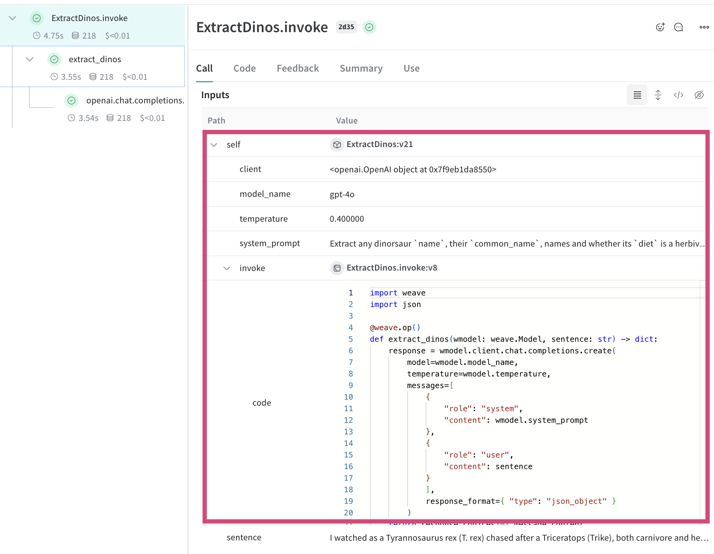
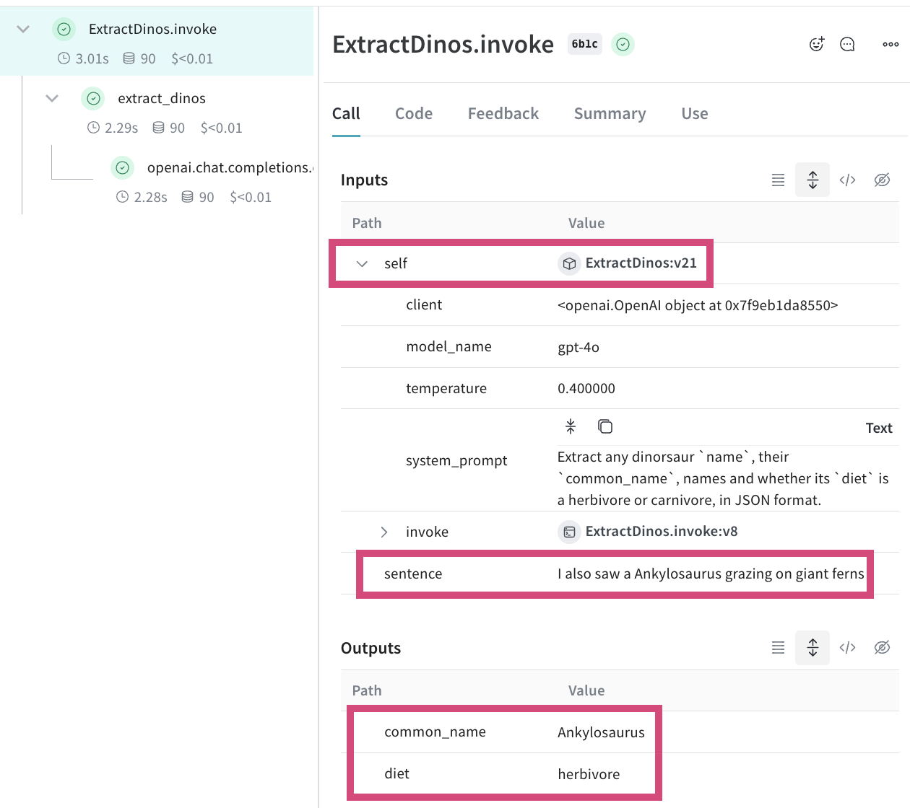

# App versioning

Tracking the [inputs, outputs, metadata](/quickstart) as well as [data flowing through your app](/tutorial-tracing_2) is critical to understanding the performance of your system. However **versioning your app over time** is also critical to understand how modifications to your code or app attributes change your outputs. Weave's `Model` class is how these changes can be tracked in Weave. 


In this tutorial you'll learn:

- How to use Weave `Model` to track and version your app and its attributes.
- How to export, modify and re-use a Weave `Model` already logged.

## Using `weave.Model`

Using Weave `Model`s means that attributes such as model vendor ids, prompts, temperature, and more are stored and versioned when they change.

To create a `Model` in Weave, you need the following:

- a class that inherits from `weave.Model`
- type definitions on all class attributes
- a typed `invoke` function with the `@weave.op()` decorator

When you change the class attributes or the code that defines your model, **these changes will be logged and the version will be updated**. This ensures that you can compare the generations across different versions of your app.

In the example below, the **model name, temperature and system prompt will be tracked and versioned**:

```python
import json
from openai import OpenAI

import weave

@weave.op()
def extract_dinos(wmodel: weave.Model, sentence: str) -> dict:
    response = wmodel.client.chat.completions.create(
        model=wmodel.model_name,
        temperature=wmodel.temperature,
        messages=[
            {
                "role": "system",
                "content": wmodel.system_prompt
            },
            {
                "role": "user",
                "content": sentence
            }
            ],
            response_format={ "type": "json_object" }
        )
    return response.choices[0].message.content

# Sub-class with a weave.Model
# highlight-next-line
class ExtractDinos(weave.Model):
    client: OpenAI = None
    model_name: str
    temperature: float
    system_prompt: str

    # Ensure your function is called `invoke` or `predict`
    # highlight-next-line
    @weave.op()
    # highlight-next-line
    def invoke(self, sentence: str) -> dict:
        dino_data  = extract_dinos(self, sentence)
        return json.loads(dino_data)
```

Now you can instantiate and call the model with `invoke`:

```python
weave.init('jurassic-park')
client = OpenAI()

system_prompt = """Extract any dinosaur `name`, their `common_name`, \
names and whether its `diet` is a herbivore or carnivore, in JSON format."""

# highlight-next-line
dinos = ExtractDinos(
    client=client,
    model_name='gpt-4o',
    temperature=0.4,
    system_prompt=system_prompt
)

sentence = """I watched as a Tyrannosaurus rex (T. rex) chased after a Triceratops (Trike), \
both carnivore and herbivore locked in an ancient dance. Meanwhile, a gentle giant \
Brachiosaurus (Brachi) calmly munched on treetops, blissfully unaware of the chaos below."""

# highlight-next-line
result = dinos.invoke(sentence)
print(result)
```

Now after calling `.invoke` you can see the trace in Weave **now tracks the model attributes as well as the code** for the model functions that have been decorated with `weave.op()`. You can see the model is also versioned, "v21" in this case, and if you click on the model **you can see all of the calls** that have used that version of the model



**A note on using `weave.Model`:**
- You can use `predict` instead of `invoke` for the name of the function in your Weave `Model` if you prefer.
- If you want other class methods to be tracked by weave they need to be wrapped in `weave.op()`
- Attributes starting with an underscore are ignored by weave and won't be logged

## Exporting and re-using a logged `weave.Model`
Because Weave stores and versions Models that have been invoked, it is possible to export and re-use these models.

**Get the Model ref**
In the Weave UI you can get the Model ref for a particular version


**Using the Model**
Once you have the URI of the Model object, you can export and re-use it. Note that the exported model is already initialised and ready to use:

```python
# the exported weave model is already initialised and ready to be called
# highlight-next-line
new_dinos = weave.ref("weave:///morgan/jurassic-park/object/ExtractDinos:ey4udBU2MU23heQFJenkVxLBX4bmDsFk7vsGcOWPjY4").get()

# set the client to the openai client again
new_dinos.client = client

new_sentence = """I also saw a Ankylosaurus grazing on giant ferns"""
new_result = new_dinos.invoke(new_sentence)
print(new_result)
```

Here you can now see the name Model version (v21) was used with the new input:



## What's next?

- Follow the [Build an Evaluation pipeline tutorial](/tutorial-eval) to start iteratively improving your applications.
