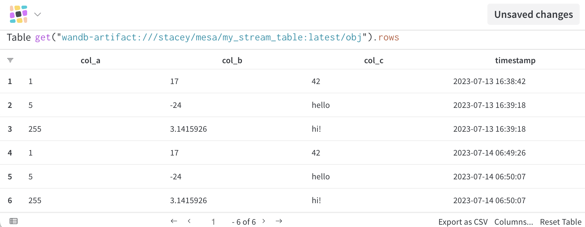
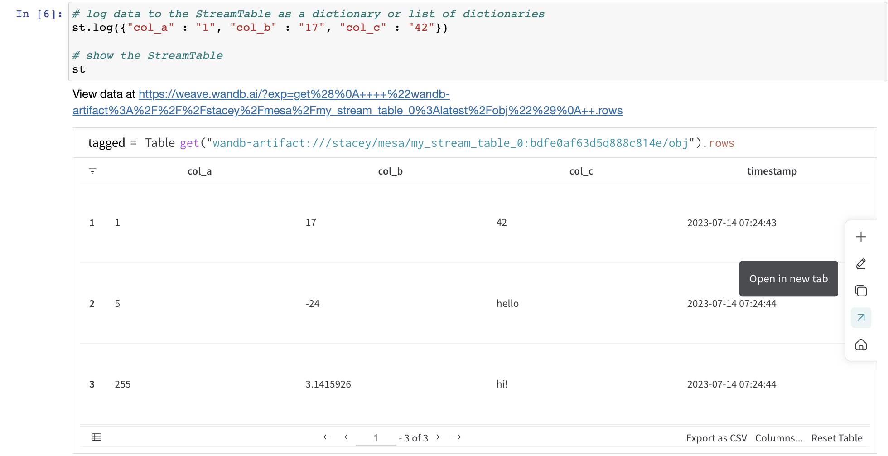

# Weave StreamTable

Log and explore some basic StreamTables now in the [interactive notebook version](../ProductionMontoring/stream_table_api.ipynb) of these docs.

A Weave StreamTable object enables continuous streaming of data from an application or service to W&B. This is an extension of the standard wandb.Table object to handle monitoring use cases. Instead of uploading a complete, immutable Table object once, you can append data repeatedly to the same StreamTable object with `.log([your data rows])`.

A StreamTable of data serves as the foundation to build production monitoring Boards in Weave, like this example to recognize MNIST digits hand-drawn in an [interactive Jupyter notebook](../ProductionMonitoring/ProductionMonitoringConceptualOverview.ipynb).


 
## Create a StreamTable

The only required argument to create a StreamTable is the name of the StreamTable object. 

```python
from weave.monitoring import StreamTable
st = StreamTable("my_entity_name/my_project_name/my_table_name")
```
If an entity (W&B username or shared team name) is not provided, this will attempt to  default to the current logged in entity on the local machine if there is one (via ~/.netrc file).

## Log data to a StreamTable

Call `.log()` to add rows to a StreamTable:

```python
st.log({"one_column_name" : "value_a", "another_column_name" : 7})
st.log([
    {"one_column_name" : "value_b", "another_column_name" : 19},
    {"one_column_name" : "value_c", "another_column_name" : 28},
    {"one_column_name" : "value_d", "another_column_name" : 36}])
```
`.log()` accepts a single dictionary or a list of dictionaries, where each dictionary entry corresponds to one row of the table. In each dictionary, the keys are column names and the values are the corresponding cell values.

## Visualize the StreamTable

The first call to `.log()` will return a Weave Panel URL, where you can view, edit, and save the resulting StreamTable as a Weave Board, of the form:

View data at : https://weave.wandb.ai/?exp=get%28%0A++++%22wandb-artifact%3A%2F%2F%2Fstacey%2Fmesa%2Fmy_stream_table%3Alatest%2Fobj%22%29%0A++.rows




Subsequent log calls will silently append these rows to the StreamTable instance.

In a notebook, the StreamTable variable on a line by itself will return a Weave Panel view of the StreamTable. The StreamTable will contain all the logged columns and their values, as well as a `timestamp` column indicating when the row was logged. By default, rows will be ordered by oldest first. You can modify a StreamTable Panel as you would a wandb.Table from the UI: sort, filter, group, etc.

**Note: Column display order is currently non-deterministic** over repeated views of the Panel. If you would like to modify the order, open the StreamTable Panel in a new window as a Board and edit/save a Board from this seed panel. There are two options to achieve this:
* via the weave.wandb.ai/?exp=... URL
* via "Open in new tab" arrow button, revealed in the menu when you hover on the right side of a StreamTable panel displayed in the notebok)



Continue logging as much data as you like. If you save the StreamTable Panel as a Board, the Board will continue to update as you send more data to the same StreamTable instance.

## StreamTable API Reference

### StreamTable()

Create a StreamTable by providing a table name, with W&B entity (username or team name) and W&B project as optional prefixes to the table name (of the form `entity_name/project_name/table_name`) or separate arguments.

```python
StreamTable(
  table_name: str,
  project_name: typing.Optional[str] = None,
  entity_name: typing.Optional[str] = None
)
```

### .log()

Append rows to the SteamTable. Each row is a dictionary, and `.log()` accepts a single dictionary or a list of dictionaries.

```python
st = StreamTable("stream_table")
st.log({"col_A" : 10, "col_B" : "x"})
st.log([{"col_A" : 20, "col_B" : "y"}, {"col_A" : 30, "col_B" : "z"}])
```

### .rows()

Add this Weave op to the expression at the top of a Weave Panel to show the contents/actual rows of a StreamTable. Without this op, a StreamTable Panel in the UI will only display the entity, project, and table names (and not the row contents of the StreamTable object).

### .finish()

Wait to show a StreamTable Panel in a notebook UI until all the `.log()` calls have completed / have finished writing to the StreamTable instance (which may mean a longer wait, if e.g. rows are the result of significant computation, running inference, etc).
 

## Important usage notes 

Some details to keep in mind for this early iteration of the StreamTables API:

* **columns must match exactly in each log**: each dictionary passed to `.log()` must contain a key for every column in the StreamTable instance. Skipping a key, even if its value is null, or adding a new key/column name after the first log call, may break the StreamTable. 
* **columns will union across singleton types but not container types**: we strongly recommend keeping the values in one column to one object type (Number, String, image, etc). Logging multiple different singletons to one column will work—that column will become a Union type across the logged instance types. However, logging a container type—say, a List of objects to a String type column—may break the StreamTable.
* **optionally use `.finish()` before viewing the StreamTable**: if you'd like to wait for all the rows to finish logging their values before displaying the StreamTable, call `.finish()`. This will take longer to display the Weave Panel if you are logging a large number of rows, or if each log call takes a while to complete (e.g. each row returns the result of running inference on some input to a model). Note that the weave.wandb.ai URL will still show a snapshot of your data at the time it finishes loading — you may need to refresh the page to get all the rows.
