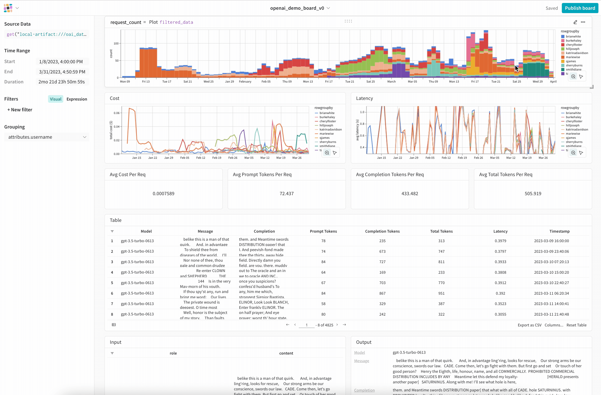

# Monitor & Visualize LLM Usage with Weave

These example notebooks demonstrate LLM monitoring with Weave. As a primary use case for your LLM project or team, you can easily track, visualize, and understand OpenAI API usage.

## Notebooks

* [OpenAI Monitoring Demo](../monitoring/openai_ux_demo.ipynb): create, explore, and share OpenAI Monitoring Boards in Weave
* [OpenAI Proxy Quickstart](../monitoring/openai_proxy_quickstart.ipynb): set up a proxy to monitor OpenAI API calls
* [Weave Monitoring API](../monitoring/monitor_api.ipynb): understand the Weave monitoring API

## OpenAI Integration

There are two main ways to authenticate OpenAI API calls so you can view them in a monitoring board.

### OpenAI API

1. Set your OPENAI_API_KEY in your environment/script/notebook (e.g. via `os.environ["OPENAI_API_KEY"]`).
2. Import openai as follows: `from weave.monitoring import openai`.
3. Make calls via the OpenAI SDK as usual.

See details and create an interactive board in the [OpenAI monitoring notebook](../monitoring/openai_ux_demo.ipynb).

### OpenAI Proxy

To log all calls made via an OpenAI proxy:

1. Find your wandb API key: for the public cloud instance, this will be at [wandb.ai/authorize](https://wandb.ai/authorize). On other instances, append "/authorize" to the base url of your instance.
2. Find [your OpenAI API key](https://platform.openai.com/account/api-keys).
3. Set your OPENAI_API_KEY to these two keys joined by ":", i.e. wandb_api_key:openai_api_key.
4. Change the OpenAI base url to `https://wandb.ai/proxy/openai/v1` for the public cloud instance (or replace `wandb.ai` with the base url for your instance).
5. Optionally set headers on each call to customize the wandb entity, project, data stream name, and other aspects of logging (see the table below for details).
6. Call OpenAI via the OpenAI SDK or CURL from the base url. 

Try some calls from the [proxy quickstart notebook](../monitoring/openai_proxy_quickstart.ipynb).

### OpenAI Proxy Headers

You can configure where your data is streamed and stored via proxy headers. For OpenAI SDK calls, pass a dictionary of "header name" keys to "header value" values in the `headers` argument.
For CURL, add each header as an argument flag in the CURL command with the syntax `-H header_name: header_value`.
All these headers are optional. The last header type, `X-Wandb-Attribute-`, lets you add custom attribute fields and values to any call. For example, logging `X-Wandb-Attribute-my_attr` : "my_attr_value" will add a column named `my_attr` to the data stream and store `my_attr_value` in the row for this call.

| Header name | Description | SDK Example | CURL Example | Default setting |
|-------------|-------------|-------------|--------------|-----------------|
|X-Wandb-Entity| set the wandb entity for this call | {"X-Wandb-Entity" : "my_dream_team"}| `-H X-Wandb-Entity: my_dream_team`| your default entity on your W&B instance |
|X-Wandb-Project| set the wandb project name for this call | {"X-Wandb-Project" : "my_dream_llm"}| `-H X-Wandb-Project: my_dream_llm`| `monitoring` |
|X-Wandb-Stream| set the StreamTable name for this call | {"X-Wandb-Stream" : "my_chatbot_test"}| `-H X-Wandb-Stream: my_chatbot_test` | `openai` |
|X-Wandb-Client-Id| set this to group related requests together | {"X-Wandb-Client-Id" : "user_A_bottest"}| `-H X-Wandb-Client: user_A_bottest` | unique Client Id for each request |
|X-Wandb-Atrribute-| add custom attributes as extra columns in your data stream table | {"X-Wandb-Attribute-chatbot_name": "wandbot", "X-Wandb-Attribute-chatbot_version" : "0.0.0"}| `-H X-Wandb-Attribute-chatbot_name: wandbot -H X-Wandb-Attribute-chatbot_version: 0.0.0` | none ||
