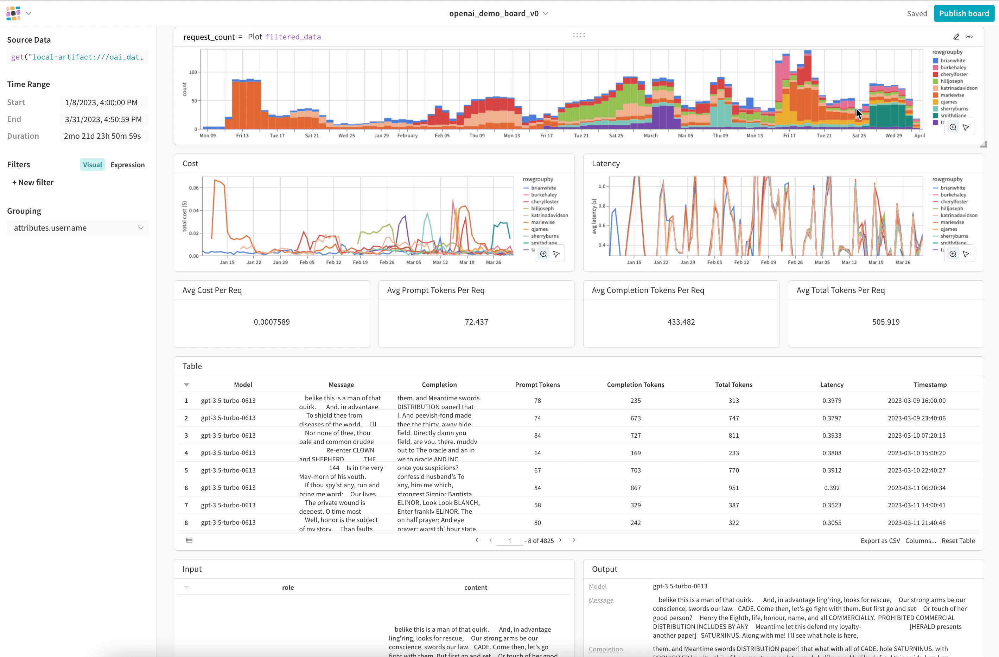
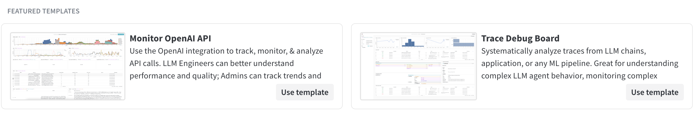

# 🔆 W&B Prompts Feedback Sprint - Sep 29th - Oct 22nd 🔆 

Built on Weights & Biases new library, weave, the W&B Engineering team want your feedback on how our new LLM tool, LLM Monitoring, can be tailored to your specific use cases!

LLM Monitoring is our observability and governance platform for all LLM-related work, [see here](##w&b-prompts) for more.

The Feedback Sprint closes Sunday, October 22nd 2023, **[sign up for a free Weights & Biases account here](https://wandb.ai/site/monitoring?utm_source=weave-github&utm_medium=github&utm_campaign=prompts-feedback-sprint&utm_term=prompts-feedback-sprint-sep23)** to participate and be in for a chance to win some W&B swag.

  

## How to participate
Join the W&B Prompts Feedback Sprint for a chance to win some W&B swag by **[signing up for a free Weights & Biases account](https://wandb.ai/site/monitoring?utm_source=weave-github&utm_medium=github&utm_campaign=prompts-feedback-sprint&utm_term=prompts-feedback-sprint-sep23)** and following the instructions below.

### 1. Try W&B Prompts

**Template Quickstarts**

The easiest way to try LLM Monitoring is to go to **https://weave.wandb.ai** and click on the LLM Monitoring template. From there you should see Quickstart instructions as well as links to colabs to run.

  

**Colabs**

Alternatively you could try one of the [LLM Monitoring colabs here](https://github.com/wandb/weave/tree/sep23_feedback_programme/examples/prompts/llm_monitoring)

### 2. Give feedback, win swag
We'll select 10 people who provide the team feedback on W&B Prompts. To chat with and give feedback to the W&B Engineering team you have 2 options:

**Discord**
- Join the W&B Discord - https://wandb.me/discord
- Head to the `#prompts-feedback` channel to share your thoughts with our Engineering team!

**Github**
- If you prefer github, you can open an issue [in the weave repository here](https://github.com/wandb/weave/issues) and add the label `prompts-feedback` to your issue.

We're looking forward to hearing from you and we're excited to shape the future of LLM developer tools with you!

## W&B Prompts
W&B Prompts is our latest LLM offering and comprises so far of LLM Monitoring and Traces:

- **[LLM Monitoring](https://github.com/wandb/weave/tree/master/examples/prompts/llm_monitoring) →** The central observability and governance platform for all LLM-related activities, including:
    - Centrally monitor all LLM activities in real time including throughput, token usage, cost, latency, errors
    - Track end-to-end LLM inputs & outputs across distributed systems
    - Centrally secure and govern all LLM workloads with LLM API Gateway

