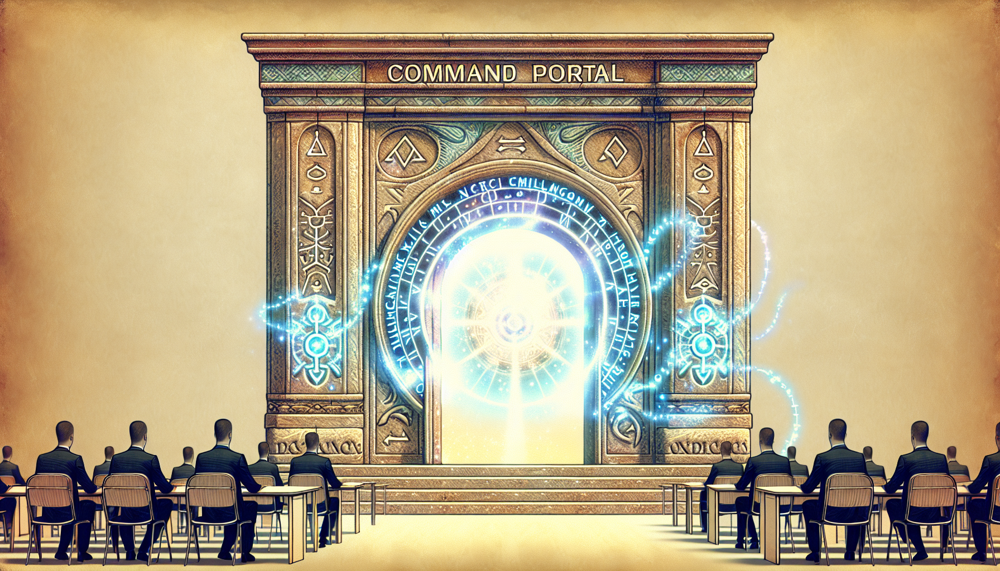
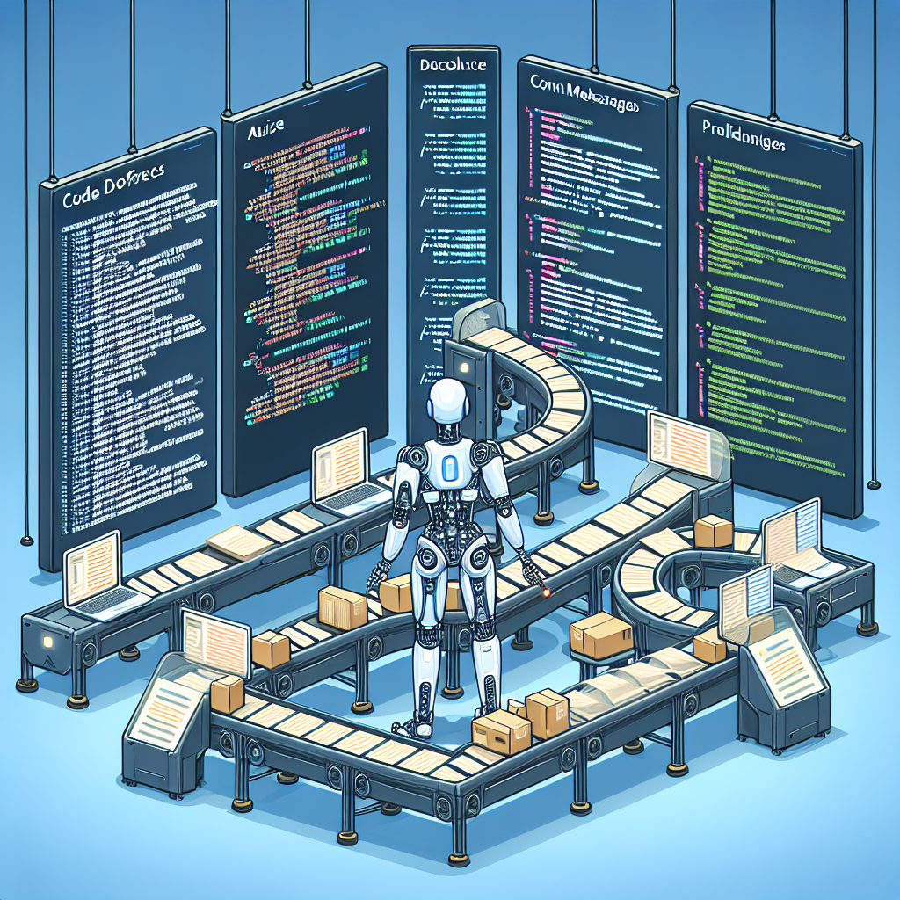

# Vibe Coding
_Prompted by Tim Sweeney_
_Written by Claude_

<!-- IMG_GEN: {"prompt": "Modern developer sitting at a desk with holographic AI assistant, coding on multiple screens, futuristic tech workspace, blue and purple color scheme"} -->


<!-- 
Presenter Notes:
- Welcome everyone, introduce yourself
- Set expectation: this is about sharing practical experience
- Emphasize that this is preparation for when they get authorization
- Mention the mix of content and demos

Outline:

1. What is Vibe Coding? (5 mins)
   * Definition & Philosophy
   * Why it's different from traditional coding
   * The mindset shift

2. Impact - Will I Still Have a Job? (8 mins)
   * The abstraction layer progression
   * What changes, what stays the same
   * New opportunities and responsibilities

3. Common Tools Landscape (10 mins + demos)
    * Co-Pilot IDEs
        * Cursor
        * Windsurf
        * Zed
        * VSCode (GH Copilot)
    * Task-Oriented Tools
        * Claude Code
        * Cursor Background Agents
        * Devin
    * CI / Bug Detection Tools
        * CoderRabbit
        * Cursor BugBot
    * Terminals
        * Warp

4. Essential Workflow Elements (15 mins + workflow demos):
    * Shell Commands
    * Typeahead
    * Spot Requests
    * Ask Questions
    * Agent Mode

5. Advanced Tips and Tricks (10 mins + tips demos)
    * AGENTS.md (or equivalent)
    * PR.md
    * Context Summarization
    * Templating
    * Notes
    * PR Summarization
    * Using Staging & Commits as Checkpoints

6. Building your AI "Team" (10 mins)
    * Service Provider Options:
        * Anthropic Claude Family
        * OpenAI GPT Family
        * Google Gemini Family
        * X.ai Grok Family
    * Self Hosted Options:
        * Deepseek Family
        * Meta Llama Family

7. Q&A (10 mins)

--- BONUS CONTENT (if time permits) ---

8. Understanding Tools & MCP
9. Uncommon Use Cases
    * Notebooks
    * Markdown
    * Presentations
    * Diagrams
 -->

---

## What is Vibe Coding?

<!-- IMG_GEN: {"prompt": "Two developers collaborating - one human and one AI robot, sitting side by side at computers, friendly partnership, modern office setting, warm lighting"} -->


<!-- 
Presenter Notes:
- Start with relatable analogy - like having a brilliant colleague who never gets tired
- Emphasize the "pair programming" aspect - it's collaborative, not replacement
- Be clear this isn't just autocomplete or code generation
-->

---

### What is Vibe Coding? 🤔

**Vibe Coding** = Coding with AI as your pair programming partner 🤝

**Traditional:** Write → Test → Debug → Repeat 🔄  
**Vibe Coding:** Think → Discuss → Code → Iterate 💭✨

**Key Shifts:**
* 🎯 From "What syntax?" → "What am I achieving?"
* 🧠 From isolated solving → collaborative reasoning  
* ⚡ From perfect drafts → rapid iteration
* 🤖 From Stack Overflow → asking your AI pair

> *"Like having a senior dev who never gets tired, never judges, and has read every doc ever written."*

<!-- IMG_GEN: {"prompt": "Split-screen artistic comparison: left side shows isolated programmer in dark room with single screen, right side shows collaborative workspace with AI hologram, bright and connected, cyberpunk aesthetic"} -->


<!-- 
Presenter Notes:
- Emphasize the conversational aspect - this is about reasoning together, not just generating code
- You maintain control and decision-making authority
- Traditional coding is more isolated and sequential, vibe coding is collaborative and iterative
- Context sharing is KEY - AI remembers what you're working on
- This is the most important concept - the mindset shift is everything
- Moving from implementation details to high-level problem solving
-->

---

## Impact - Will I Still Have a Job?

<!-- IMG_GEN: {"prompt": "Layered pyramid diagram showing evolution of programming - assembly code at bottom, high-level languages in middle, AI assistance at top, upward arrows showing progression", "size": "1792x1024"} -->


<!-- 
Presenter Notes:
- Address the elephant in the room head-on
- This is likely their biggest concern
- Use historical examples they'll relate to
- Be confident and reassuring but realistic
-->

---

### We've Been Here Before 📈

**Abstraction Evolution:**
* Assembly → High-Level Languages (C, Java, Python) 💻
* Raw SQL → ORMs (SQLAlchemy, Hibernate) 🗄️
* Manual Memory → Garbage Collection 🗑️
* Monoliths → Microservices → Serverless ☁️

**Now:** Manual Coding → AI-Assisted Coding 🤖

**What Changes:** ⚡ Speed, 🎯 Focus (syntax→architecture), 🔧 AI debugging, 📝 AI docs
**What Stays Critical:** 🧠 System design, 🔍 Code review, 🎯 Business requirements, 🚀 Performance, 🛡️ Security

<!-- IMG_GEN: {"prompt": "Abstract data visualization: skills as interconnected nodes, some nodes fading (manual coding) while others grow brighter (architecture, creative thinking), network effect visualization with pulsing energy, clean modern infographic style"} -->


<!-- 
Presenter Notes:
- Each transition was feared but ultimately made us more productive
- We didn't stop being programmers when we moved from assembly to Python
- Same pattern applies here - Ask: "Did anyone become unemployed when we got IDEs with autocomplete?"
- Emphasize that the HARD parts of engineering remain
- AI doesn't understand business context like you do
- AI doesn't make architectural decisions or understand trade-offs in your specific domain
-->

---

### Your New Superpowers

**With AI:** Multiple, simulataneous workstreams

**You become:**
* 🎨 **Creative Director** - defining what to build
* 🏗️ **System Architect** - designing how it fits together  
* 🔧 **Technical Product Manager** - prioritizing and coordinating
* 🎯 **Quality Gatekeeper** - ensuring standards and best practices

**The demand for great engineers increases, not decreases**

<!-- IMG_GEN: {"prompt": "Epic superhero-style illustration: developer in flowing cape standing atop multiple floating project platforms, AI assistants as glowing orbs orbiting around them, dramatic lighting with city skyline background, comic book art style with dynamic action lines"} -->


<!-- 
Presenter Notes:
- This is the key insight - you become MORE valuable, not less
- You can take on bigger, more complex challenges
- Companies will need fewer junior developers but more senior/staff engineers
- The work becomes more strategic and less tactical
-->

---

## Common Tools Landscape
*10 minutes + demos*

<!-- IMG_GEN: {"prompt": "Futuristic tool workshop floating in space: various AI coding tools as crystalline floating workstations connected by energy bridges, holographic interfaces everywhere, space station aesthetic with cosmic background", "size": "1792x1024"} -->


<!-- 
Presenter Notes:
- Now we get into the practical stuff
- This is where you can show actual tools
- Have your demo environment ready
- Focus on 2-3 tools max in the demo
-->

---

### 🖥️ Co-Pilot IDEs
*Your primary coding environment with AI built-in*

**🚀 Cursor** - Multi-file editing, background agents  
**🌊 Windsurf** - Autonomous code changes across files  
**⚡ Zed** - Real-time collaboration, lightning-fast  
**📝 VSCode + Copilot** - Most widely adopted, beginner-friendly


<!-- 
Presenter Notes:
- Demo Cursor if possible - show the multi-file editing
- Mention that most people start with VSCode + Copilot
- Cursor is where the power users end up
- Show the different UX approaches
-->

---

### 🎯 Task-Oriented Tools
*Specialized AI for specific coding tasks*

**🤖 Claude Code** - Deep reasoning, CLI-based  
**🔧 Cursor Agents** - Autonomous workers, cloud-based  
**👨‍💻 Devin** - Full-stack development & deployment  
**⚙️ OpenAI Codex** - Code generation API, powers many tools

<!-- IMG_GEN: {"prompt": "Specialist AI entities as mystical beings: Claude as wise oracle with ancient scrolls of code, Cursor agents as busy worker sprites, Devin as powerful wizard orchestrating entire projects, fantasy art meets cyberpunk"} -->


<!-- 
Presenter Notes:
- These are more advanced tools
- Show Claude Code if you have access
- Devin is still in early access but worth mentioning
- Background agents are where things get really powerful
-->

---

### 🔍 CI/Bug Detection Tools
*AI-powered code review and quality*

**🐰 CodeRabbit** - Automated PR reviews & suggestions  
**🐛 Cursor BugBot** - Intelligent debugging & root cause analysis

<!-- IMG_GEN: {"prompt": "Security checkpoint scene: CodeRabbit as detective with magnifying glass examining code scrolls, BugBot as friendly robot medic healing broken code with rainbow laser beams, whimsical cartoon style with bright colors"} -->


<!-- 
Presenter Notes:
- These integrate into your existing workflow
- Show a CodeRabbit review if possible
- Emphasize that these enhance, not replace, human review
-->

---

### ⚡ AI-Enhanced Terminals
*Smarter command line experience*

**⚡ Warp** - Natural language → shell commands, smart suggestions & AI assistant

<!-- IMG_GEN: {"prompt": "Magical command portal: terminal window as ancient stone archway with mystical runes, natural language floating in as glowing spells, transforming into command line incantations, magical realism art style", "size": "1792x1024"} -->


<!-- 
Presenter Notes:
- Demo Warp if possible - show the natural language to command translation
- This is often the easiest entry point for people
- Show complex commands being generated from simple requests
-->

---

## Essential Workflow Elements
*15 minutes + workflow demos*

<!-- IMG_GEN: {"prompt": "Dynamic workflow symphony: five different work patterns as musical instruments in an orchestra, each element creating visual music notes in the air, conductor coordinating the harmony, art deco poster style", "size": "1792x1024"} -->


<!-- 
Presenter Notes:
- This is the meat of the presentation
- These are the patterns that separate beginners from experts
- Try to demo each workflow element
-->

---

### 🖥️ Shell Commands
*AI helps you navigate the command line*

**Pattern:** Natural language → Shell command 🗣️➡️💻

* "Find all Python files modified in the last week"
* "Show me memory usage by process"  
* "Deploy this to staging with rollback capability"

<!-- IMG_GEN: {"prompt": "Translation machine concept: casual human speech bubbles on one side, complex shell commands emerging on the other, connected by swirling transformation gears and clockwork mechanisms, steampunk meets modern UI design"} -->


<!-- 
Presenter Notes:
- Demo this live if possible
- Show how complex commands are generated from simple requests
- Emphasize the time savings
-->

---

### ⚡ Typeahead
*Intelligent code completion on steroids*

**Beyond autocomplete:** 🚀
* 🎯 Context-aware across multiple files  
* 🧠 Learns your coding patterns & style
* 🏗️ Suggests entire function implementations
* ⚡ Reduces cognitive load, speeds up boilerplate

<!-- IMG_GEN: {"prompt": "Intelligent completion visualization: developer typing with ghostly helpful hands appearing to complete the code, multiple timeline suggestions flowing like river branches, ethereal and flowing, impressionist painting style with digital elements"} -->


<!-- 
Presenter Notes:
- Show how different this is from traditional autocomplete
- Demo multi-file context awareness
- Show how it learns your patterns
-->

---

### 🎯 Spot Requests
*Quick, targeted AI assistance*

**Use cases:** 🎪
* 🐛 "Fix this bug" (highlight problematic code)
* 🛡️ "Add error handling to this function"  
* ⚡ "Convert this to use async/await"
* 📝 "Add type hints to this module"

<!-- IMG_GEN: {"prompt": "Precision targeting concept: developer with laser-guided crosshairs selecting specific code sections, AI responding with surgical precision tools, medical operation meets sniper precision, clean vector illustration style"} -->


<!-- 
Presenter Notes:
- This is about precision requests
- Show how you can highlight code and ask for specific changes
- Emphasize the speed of iteration
-->

---

### ❓ Ask Questions
*Your AI pair programming partner*

**Types of questions:** 🤔
* 📖 **Explanatory:** "What does this regex do?"
* 🏗️ **Architectural:** "Should I use a factory pattern here?"
* 🐛 **Debugging:** "Why isn't this working as expected?"
* ✨ **Best practices:** "Is there a more Pythonic way to do this?"

**Flow:** Ask → Get explanations + examples → Iterate → Learn 🔄

<!-- IMG_GEN: {"prompt": "Socratic dialogue scene: developer and AI as ancient philosophers in a modern setting, thought bubbles containing code patterns and architectural diagrams, wisdom-sharing atmosphere, renaissance art style with modern coding elements"} -->


<!-- 
Presenter Notes:
- This is where the "pair programming" aspect really shines
- Show a conversation flow if possible
- Emphasize the learning aspect
-->

---

### 🤖 Agent Mode
*AI takes the wheel for complex tasks*

**When to use:** 🚁
* 🔄 Large refactoring across multiple files
* 🏗️ Implementing new features end-to-end  
* 🔀 Migrating between frameworks/libraries
* 📁 Setting up complex project structures

**AI handles:** Planning, multi-file changes, consistency, testing ✅  
**Your role:** Guide, review, approve 👨‍✈️

<!-- IMG_GEN: {"prompt": "AI autopilot taking control: futuristic spacecraft cockpit with AI avatar piloting while developer sits back as mission commander, multiple screens showing autonomous code generation across files, space opera cinematic style", "size": "1792x1024"} -->


<!-- 
Presenter Notes:
- This is the most advanced workflow
- Show an agent working across multiple files if possible
- Emphasize that YOU are still in control
-->

---

## Advanced Tips and Tricks
*10 minutes + tips demos*

<!-- IMG_GEN: {"prompt": "Master craftsman's workshop: ancient scrolls transforming into digital interfaces, traditional tools morphing into AI assistants, blend of medieval craftsmanship and futuristic technology, golden hour lighting with mystical atmosphere", "size": "1792x1024"} -->


<!-- 
Presenter Notes:
- These are the "pro tips" that separate casual users from power users
- Focus on the most impactful ones
- Demo AGENTS.md setup if possible
-->

---

### 📋 AGENTS.md (or equivalent)
*Your AI's instruction manual for your project*

**What to include:**
```markdown
# Project Context
- Architecture overview
- Key patterns and conventions
- Coding standards and style guide
- Common gotchas and pitfalls

# AI Instructions
- "Always use TypeScript strict mode"
- "Follow the Repository pattern for data access"
- "Include comprehensive error handling"
- "Write tests for all public methods"
```

**Benefits:**
* Consistent AI behavior across sessions
* Faster onboarding for new features
* Maintains code quality automatically

<!-- IMG_GEN: {"prompt": "Living instruction manual: AGENTS.md file as glowing tome with pages that float and rearrange themselves, AI reading and memorizing the patterns, library of knowledge with floating texts, magical realism meets technical documentation"} -->


<!-- 
Presenter Notes:
- This is HUGE for consistency
- Show an example AGENTS.md file
- Explain how this saves time in every session
-->

---

### 📝 PR.md
*Template for AI-generated pull request descriptions*

**Template structure:**
```markdown
## What changed
<!-- AI fills this automatically -->

## Why this change
<!-- AI explains the reasoning -->

## Testing notes
<!-- AI lists what to test -->

## Review focus areas
<!-- AI highlights potential concerns -->
```

**Demo opportunity:** Generate PR descriptions automatically


<!-- 
Presenter Notes:
- Show how AI can generate comprehensive PR descriptions
- This improves code review quality
- Saves significant time
-->

---

### 🧠 Context Summarization
*Keeping AI focused on what matters*

**Techniques:**
* **File summaries:** AI creates 2-3 line summaries of complex files
* **Session context:** Regularly summarize what you're working on
* **Decision logs:** Track architectural decisions and rationale

**Pattern:**
```
"Summarize our conversation so far and the current state 
of the refactoring we're working on"
```


<!-- 
Presenter Notes:
- Context management is crucial for long sessions
- Show how summarization keeps AI focused
- This prevents AI from "forgetting" what you're working on
-->

---

### 🎯 Templating
*Standardize common patterns*

**Code templates:**
* API endpoint patterns
* Test file structures  
* Component boilerplates
* Configuration files

**AI prompt templates:**
* "Implement [PATTERN] for [FEATURE] following our [STANDARD]"
* "Add comprehensive error handling to [FUNCTION] using our standard patterns"
* "Create tests for [MODULE] covering [SCENARIOS]"


<!-- 
Presenter Notes:
- Templates ensure consistency
- Show how to create reusable patterns
- This scales your best practices
-->

---

### 📚 Notes
*Building your AI knowledge base*

**Capture patterns:**
* Solutions to tricky problems
* Architecture decisions
* Performance optimizations
* Debugging techniques

**Share with AI:**
* "Here's how we solved a similar problem before..."
* "Apply the same pattern we used in the auth module"
* "Use the optimization technique from our notes"


<!-- 
Presenter Notes:
- This builds institutional knowledge
- Show how notes can be referenced in future sessions
- This is like having a team wiki that AI can use
-->

---

### 🔄 PR Summarization
*AI writes your commit messages and PR descriptions*

**Process:**
1. Make changes with AI assistance
2. AI reviews the diff
3. AI generates meaningful commit messages
4. AI creates comprehensive PR description
5. AI suggests review criteria

**Benefits:** Better documentation, easier code review, improved team communication



<!-- 
Presenter Notes:
- Show the full workflow if possible
- Emphasize the quality improvement
- This helps with team collaboration
-->

---

### 🎯 Using Staging & Commits as Checkpoints
*Version control as collaboration tool*

**Pattern:**
1. **Explore:** Let AI try different approaches in working directory
2. **Checkpoint:** Commit working solutions
3. **Branch:** Create branches for different AI-generated approaches
4. **Compare:** Use AI to analyze differences between approaches
5. **Merge:** Combine best parts of different solutions

**AI helps with:**
* Comparing different implementations
* Explaining trade-offs between approaches
* Suggesting which approach to keep


<!-- 
Presenter Notes:
- This is advanced version control with AI
- Show how AI can compare different approaches
- This enables rapid experimentation
-->

---

## Building your AI "Team"
*10 minutes*

<!-- IMG_GEN: {"prompt": "AI dream team assembly: diverse AI personalities as superhero squad, each with unique powers and visual design representing their capabilities, team lineup poster style with dramatic lighting and heroic poses", "size": "1792x1024"} -->


<!-- 
Presenter Notes:
- This is about strategy - choosing the right tools
- Emphasize that different models have different strengths
- Multi-model approach is often best
-->

---

### Service Provider Options
*Cloud-based AI models*

**🧠 Anthropic Claude Family**
* **Claude 3.5 Sonnet:** Best for complex reasoning and code architecture
* **Claude 3 Haiku:** Fast responses for simple tasks
* **Strengths:** Code explanation, debugging, architectural advice

**🤖 OpenAI GPT Family**  
* **GPT-4o:** Well-rounded for most coding tasks
* **GPT-4o Mini:** Quick responses for simpler requests
* **Strengths:** Wide knowledge base, good at following instructions

**🌟 Google Gemini Family**
* **Gemini 1.5 Pro:** Large context window (great for big codebases)
* **Gemini 1.5 Flash:** Fast responses with decent capability
* **Strengths:** Multi-modal capabilities, excellent context retention

**🚀 X.ai Grok Family**
* **Grok-2:** Real-time information access
* **Strengths:** Up-to-date knowledge, web integration


<!-- 
Presenter Notes:
- Give brief overview of each family's strengths
- Mention pricing considerations
- Claude is great for code, GPT for general tasks, Gemini for large context
-->

---

### Self-Hosted Options
*Run AI models on your own infrastructure*

**🔥 Deepseek Family**
* **DeepSeek Coder:** Specialized for code generation
* **Benefits:** Privacy, cost control, customization

**🦙 Meta Llama Family**
* **Code Llama:** Open-source coding specialist
* **Llama 3.1:** General-purpose with good coding abilities
* **Benefits:** Full control, no API costs, offline capability


<!-- 
Presenter Notes:
- Important for companies with strict data policies
- Mention the trade-offs: control vs. convenience
- Self-hosted requires more technical expertise
-->

---

### 🛠️ Building Your Toolkit Strategy

**The Multi-Model Approach:** 🎯
1. **Primary:** Main model for most work (Claude 3.5 Sonnet) 🏆
2. **Specialist:** Code-specific for complex algorithms (DeepSeek Coder) 🧠  
3. **Speed:** Fast model for simple tasks (GPT-4o Mini) ⚡

**Consider:** 💭 Cost vs. Capability, 🔐 Privacy, 📏 Context window, ⚡ Speed


<!-- 
Presenter Notes:
- Emphasize that one size doesn't fit all
- Different models for different use cases
- Budget considerations are important
-->

---

## Q&A
*10 minutes*

<!-- IMG_GEN: {"prompt": "Interactive Q&A constellation: questions floating as glowing orbs around a central discussion space, answers materializing as connecting light streams, community gathering in digital space, warm and welcoming atmosphere"} -->


<!-- 
Presenter Notes:
- Encourage questions throughout
- These are common questions you'll get
- Be prepared with specific examples
-->

### Common Questions:

**"How do I get started?"**
* Pick one AI-powered IDE (recommend Cursor for beginners)
* Start with simple requests and build confidence
* Practice the core workflows we covered

**"What about code quality?"**
* AI doesn't replace code review - it enhances it
* Use AI to catch common issues early
* Still need human judgment for architecture decisions

**"How much does this cost?"**
* Most tools: $20-50/month per developer
* ROI typically positive within first month
* Self-hosted options available for budget constraints

**"What about security?"**
* Most providers offer enterprise plans with data protection
* Consider self-hosted options for sensitive codebases
* Review your organization's AI policies

---

## Bonus Content
*If time permits*


<!-- 
Presenter Notes:
- Only cover if you have extra time
- These are advanced topics
- Pick the most relevant for your audience
-->

---

### Understanding Tools & MCP
*Model Context Protocol - The future of AI tool integration*

**What is MCP?**
* Standard protocol for AI models to interact with external tools
* Allows AI to use databases, APIs, file systems, etc.
* Makes AI more capable and autonomous

**Examples:**
* AI directly queries your database
* AI reads and writes files across your system  
* AI interacts with external APIs
* AI runs tests and sees results

**Benefits:**
* More powerful AI capabilities
* Standardized tool integration
* Better context awareness


<!-- 
Presenter Notes:
- This is cutting-edge stuff
- Show MCP in action if possible
- This is where AI coding is heading
-->

---

### Uncommon Use Cases
*AI coding beyond traditional software development*


<!-- 
Presenter Notes:
- These show the versatility of AI coding
- Pick examples relevant to your audience
- Show how AI coding applies beyond just writing code
-->

---

#### 📓 Notebooks
*AI-powered data science and research*

**Jupyter/Google Colab + AI:**
* Generate analysis code from natural language
* Explain complex data science concepts
* Debug statistical models
* Create visualizations automatically

**Demo opportunities:**
* "Create a plot showing correlation between X and Y"
* "Explain why this model is overfitting"
* "Generate code to clean this messy dataset"


<!-- 
Presenter Notes:
- Great for data scientists in the audience
- Show Jupyter + AI if possible
- Emphasize the analysis capabilities
-->

---

#### 📝 Markdown
*AI as your writing and documentation partner*

**Use cases:**
* Generate technical documentation
* Create README files
* Write API documentation
* Convert code comments to docs

**Patterns:**
* "Convert these function signatures to API docs"
* "Write a README for this project"
* "Explain this algorithm in simple terms"


<!-- 
Presenter Notes:
- Documentation is often neglected - AI makes it easier
- Show documentation generation if possible
- This improves team communication
-->

---

#### 🎯 Presentations
*AI helps create and structure presentations*

**What AI can do:**
* Generate slide content from bullet points
* Create presentation outlines
* Suggest visual elements
* Format content for different audiences

**This presentation was built with AI assistance!**


<!-- 
Presenter Notes:
- Meta moment - this presentation is an example
- Show how AI can help with non-coding tasks
- Useful for technical talks and documentation
-->

---

#### 📊 Diagrams  
*AI generates visual representations*

**Types:**
* Architecture diagrams
* Database schemas
* Flow charts
* UML diagrams
* Network diagrams

**Tools:**
* Mermaid integration in many AI tools
* PlantUML generation
* ASCII art diagrams
* SVG/drawing code generation

**Example:** "Create a diagram showing the data flow in our microservices architecture"


<!-- 
Presenter Notes:
- Visual communication is crucial in engineering
- Show diagram generation if possible
- This helps with system design and communication
-->

---

## Thank You!
### Questions?

**Contact:** Tim Sweeney  
**Resources:**
* This presentation: [GitHub link]
* Recommended starting tool: Cursor
* Practice projects: [Link to examples]

*"The best time to start vibe coding was yesterday. The second best time is now."*

<!-- IMG_GEN: {"prompt": "Celebration of new coding era: developer and AI raising hands in victory together, confetti of code symbols falling like celebration, sunrise over a futuristic coding city, inspirational poster art style with vibrant colors"} -->


<!-- 
Presenter Notes:
- Thank the audience
- Encourage them to start experimenting
- Offer to help with questions later
- Emphasize that the best way to learn is by doing
-->