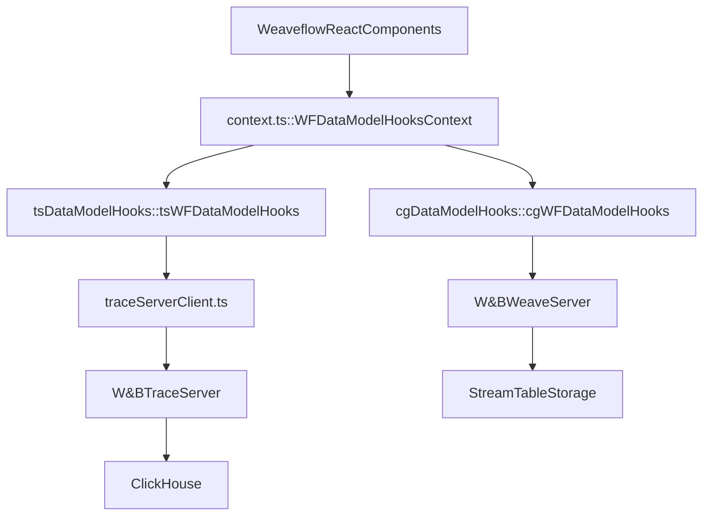
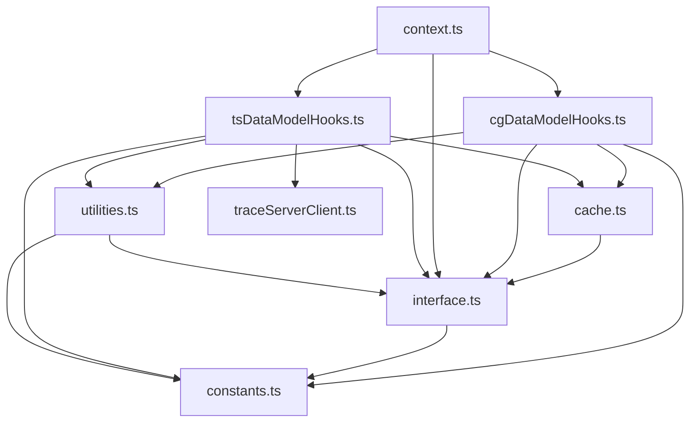

# Weaveflow React Interface

This directory contains the various abstractions for working with the Weaveflow data model. This document outlines the design

I would recommend checking out the trace server data flow described in `weave/trace_server/README.md`.

At the highest level, consider that we have the following:

The React application calls high-level hooks such as `useCalls` which then make queries to the appropriate data provider. Until Feb, the only data provider was Weave Compute Graph (which is backed by W&B StreamTables). However, we are introducing a new provider: Trace Server (backed by a new Clickhouse server). In the near future, we will remove parts of the Compute Graph data provider, but until then we need a nicer abstraction for working with the system. So we now have the following logical data flow:

The dependencies are laid out like:

