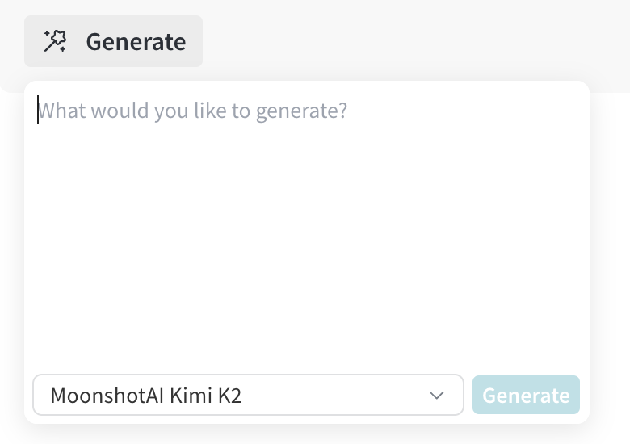

# Magician ✨

A React library for adding AI-powered "magic moments" to your W&B application. Provides dead-simple access to LLM capabilities through a developer-friendly API and consistent UI components.

## 🎯 **What Magician Does**

Magician allows React developers to focus on lightweight prompting by handling all the complex LLM integration details:

### **Automatic Infrastructure**
- **Authentication** - Handles W&B API authentication seamlessly
- **Model Selection** - Global model management with dropdown UI. Supports CoreWeave inference service as well as any configured vendor!
- **Streaming & Error Handling** - Real-time responses with built-in error recovery
- **Structured Response Handling** - Automatic parsing and validation with Zod schemas
- **LLM API Semantics** - Manages message construction, temperature, and provider-specific details

### **Simple Developer Experience**
- **Common UX Components** - Pre-built buttons, tooltips, and interfaces
- **Lightweight APIs** - Focus on your prompts, not boilerplate code
- **Real-time Feel** - Streaming responses that feel instant

## 🚀 **Why Magician?**

Building AI features shouldn't be hard. Magician gives you:
- **Simple APIs** - Focus on content, not API complexity
- **Consistent UI** - Pre-built components that look great together
- **Real-time feel** - Streaming responses that feel instant
- **Context management** - Global state for models and projects

## ⚡ **Quick Integration Guide**

Adding magic to any component takes just **3 steps**:

### Step 1: Wrap with Provider
```tsx
import { MagicProvider, MagicButton } from './magician';

function App() {
  return (
    <MagicProvider value={{ entity: 'my-org', project: 'my-project' }}>
      <MyComponent />
    </MagicProvider>
  );
}
```

### Step 2: Add Magic Button



```tsx
function MyComponent() {
  const [content, setContent] = useState('');

  return (
    <MagicButton
      onStream={(chunk, accumulation, parsedCompletion, isComplete) => 
        setContent(accumulation)
      }
      systemPrompt="You are a helpful assistant..."
      placeholder="What would you like to generate?"
      text="Generate"
    />
  );
}
```

**That's it!** ✨ Your component now has AI-powered generation capabilities.

## 🎯 **Common Use Cases**

### Text Generation
```tsx
<MagicButton
  onStream={(chunk, accumulation) => setDescription(accumulation)}
  systemPrompt="You are an expert at writing clear, concise descriptions."
  placeholder="What should I describe?"
  text="Generate Description"
/>
```

### Content Revision
```tsx
<MagicButton
  onStream={(chunk, accumulation) => setContent(accumulation)}
  systemPrompt="You are an expert editor. Improve the given content."
  contentToRevise={existingContent}
  revisionPlaceholder="How should I improve this?"
  text="Revise Content"
/>
```

### Structured Data Generation
```tsx
import { z } from 'zod';

const UserProfileSchema = z.object({
  name: z.string(),
  bio: z.string(),
  skills: z.array(z.string())
});

<MagicButton
  onStream={(chunk, accumulation, parsedCompletion, isComplete) => {
    if (isComplete && parsedCompletion) {
      setUserProfile(parsedCompletion); // Already parsed and validated!
    }
  }}
  systemPrompt="Generate a user profile"
  responseFormat={UserProfileSchema}
  text="Generate Profile"
/>
```

## 📚 **API Reference**

### Core Hooks

#### `useChatCompletionStream`
Streaming chat completions with automatic context management.

```tsx
const complete = useChatCompletionStream();

// inside some callback:
const res = await complete(
  {messages: 'Write a haiku about coding'},
  (chunk) => console.log(chunk.content)
);
```

#### `useMagicContext`
Access global magic state (entity, project, selected model).

```tsx
const { entity, project, selectedModel, setSelectedModel } = useMagicContext();
```

### Utilities

#### `prepareSingleShotMessages`
Utility for creating properly formatted message arrays using a standard convention.

```tsx
const messages = prepareSingleShotMessages({
  staticSystemPrompt: "You are a helpful assistant...",
  generationSpecificContext: { 
    userRole: "developer",
    projectType: "web app" 
  },
  additionalUserPrompt: "Write a function to sort an array"
});

// Use with chat completion
await complete({messages}, onChunk);
```

### Structured Output

#### Using Zod Schemas for Type-Safe Responses
Pass Zod schemas directly to automatically get structured, validated responses. The library converts your schema to JSON schema format and handles parsing automatically.

```tsx
import { z } from 'zod';

// Define your schema
const UserSchema = z.object({
  name: z.string(),
  age: z.number(),
  email: z.string().email(),
  preferences: z.array(z.string())
});

// With MagicButton - just pass the schema!
<MagicButton
  onStream={(chunk, accumulation, parsedCompletion, isComplete) => {
    if (isComplete && parsedCompletion) {
      // parsedCompletion is already parsed and validated!
      console.log('User:', parsedCompletion);
    }
  }}
  systemPrompt="Generate a user profile"
  responseFormat={UserSchema}
  text="Generate User"
/>

// With useChatCompletionStream - same magic!
const complete = useChatCompletionStream();

const generateUser = async () => {
  await complete(
    {
      messages: "Create a user profile for a 25-year-old developer",
      responseFormat: UserSchema
    },
    (chunk) => {
      if (chunk.isComplete) {
        // chunk.content is already the parsed object!
        setUser(chunk.content);
      }
    }
  );
};
```

**Available response formats:**
- **Zod Schema** - Automatically converts to JSON schema and parses response
- `{ type: "json_object" }` - Forces JSON object output (manual parsing required)
- `{ type: "text" }` - Default text output (can be omitted)

**Why Zod schemas are magical:**
- ✅ **Type Safety** - Full TypeScript support
- ✅ **Auto-Validation** - Responses are automatically validated against your schema
- ✅ **Auto-Parsing** - No manual JSON.parse() needed
- ✅ **Error Handling** - Invalid responses are caught automatically

### Cancellation

Both `MagicButton` and `useChatCompletionStream` support cancellation to stop ongoing generation.

```tsx
// With MagicButton - handle cancellation to revert changes
<MagicButton
  onStream={(chunk, accumulation, parsedCompletion, isComplete) => setContent(accumulation)}
  onCancel={() => setContent(originalContent)} // Revert on cancel
  systemPrompt="Generate content..."
  text="Generate"
/>

// With useChatCompletionStream - use AbortController
const complete = useChatCompletionStream();
const abortController = new AbortController();

const generate = async () => {
  try {
    await complete(
      { messages: "Generate content..." },
      (chunk) => setContent(chunk.content),
      undefined,
      abortController.signal
    );
  } catch (error) {
    if (error.name === 'AbortError') {
      console.log('Generation cancelled');
    }
  }
};

// Cancel generation
const cancel = () => abortController.abort();
```

### UI Components

#### `MagicButton`
Smart button with built-in AI generation capabilities. Manages all UI state internally and provides a tooltip interface for user input.

```tsx
<MagicButton
  onStream={(chunk, accumulation, parsedCompletion, isComplete) => setContent(accumulation)}
  onCancel={() => setContent(originalContent)} // Optional: handle cancellation
  systemPrompt="You are an expert..."
  placeholder="What would you like to generate?"
  contentToRevise={existingContent} // Optional: revise existing content
  showModelSelector={true} // Optional: show model dropdown
  additionalContext={{
    // Optional context for the model
  }}
  size="medium" // Button size
  variant="primary" // Button variant
  text="Generate Analysis"
/>

#### `MagicTooltip` (Advanced Usage)
Low-level tooltip component for advanced use cases where you need custom trigger elements.

```tsx
<MagicTooltip
  onStream={handleStream}
  systemPrompt="Generate content..."
  placeholder="What would you like to generate?"
>
  <CustomTriggerComponent />
</MagicTooltip>
```

### Provider

#### `MagicProvider`
Provides context for entity/project and model selection.

```tsx
<MagicProvider value={{ entity: 'org', project: 'project' }}>
  {/* Your components */}
</MagicProvider>
```

## 🎮 **Real Example**

Here's how it's used in the W&B playground:

```tsx
function PlaygroundMessagePanelEditor() {
  const [editedContent, setEditedContent] = useState('');
  const [isEditable, setIsEditable] = useState(true);

  const handleMagicStream = (chunk: string, accumulation: string, parsedCompletion: any, isComplete: boolean) => {
    if (!isComplete) {
      setIsEditable(false);
      setEditedContent(accumulation + '█'); // Show cursor during generation
    } else {
      setEditedContent(accumulation);
      setIsEditable(true);
    }
  };

  return (
    <div>
      <textarea 
        value={editedContent} 
        disabled={!isEditable}
      />
      
      <MagicButton
        onStream={handleMagicStream}
        systemPrompt="You are an expert LLM developer..."
        placeholder="What would you like the model to do?"
        contentToRevise={editedContent}
        size="medium"
        text="Generate"
      />
    </div>
  );
}
```

## 🎨 **Design Principles**

- **Developer Simplicity** - APIs should be intuitive with minimal boilerplate
- **Real-time Feel** - Emphasize streaming and immediate feedback  
- **Minimal UI** - Dead-simple design, no unnecessary styling