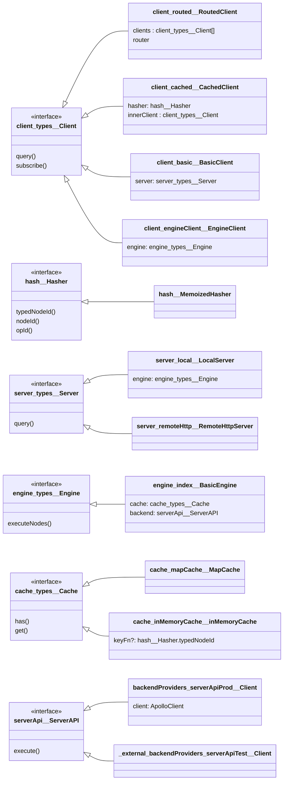
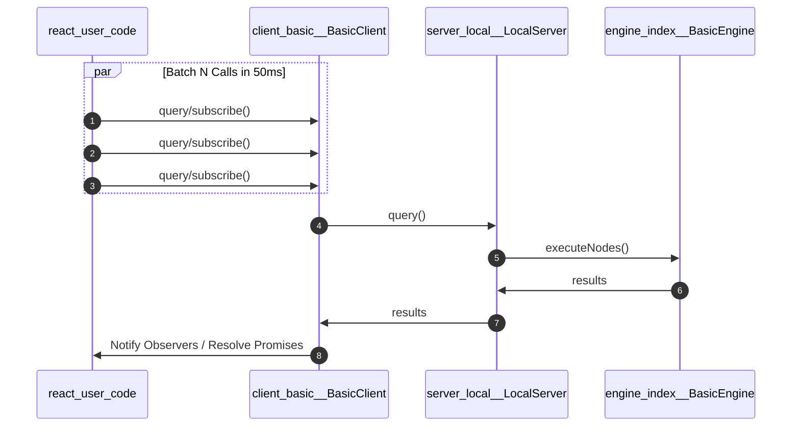
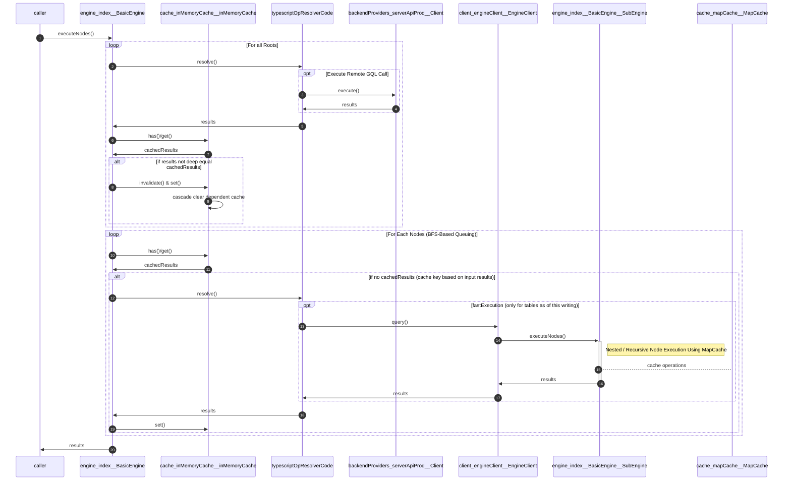
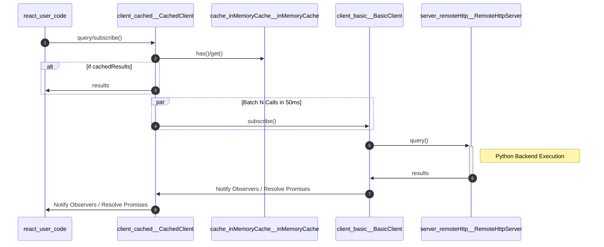
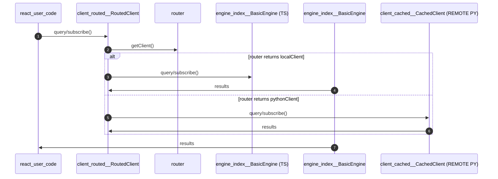

# Overview

The `cg` package allows users to make powerful queries against many kinds of data on the W&B platform. `cg` consists of two main parts:

1. A way to construct a DAG that represents a query, and
1. A way to execute that query.

## Constructing the DAG

`cg` defines a set of types that consists of primitives (`string`,`date`, etc.) and domain (`project`,`artifact`, etc.) types.  `cg` also defines a set of "ops" to retrieve and transform data, which uses the type system to enable context-sensitive hints while creating or modifying graphs.

Here's a very simple query to get the list of runs associated with a particular project:

```
const myQuery = opProjectRuns({
  project: opRootProject({
    entityName: constString('shawn'),
    projectName: constString('fasion-sweep'),
  })
})
```

More complex use cases like Tables can involve hundreds or thousands of such queries.

## Executing the query

`cg` provides some functions to instantiate a `Client`.  They require passing a `ServerAPI` object, which implements methods for interacting with W&B's GraphQL and file storage backend.  The `Client` class publishes a small async interface to resolve the value of a query:

```
const myClient = createLocalClient(backend)
const result = await myClient.query(myQuery)
```

# Architecture

## Graph Definition

`cg` exports a set of functions that produce the nodes that a user chains together to construct a compute graph.  Each node is typed based on its inputs and/or value at execution time, and can represent a constant or variable value, or an operation that takes in one or more values and returns some other value.

### Types

CG defines a rich set of primitive types (`number`, `string`, `date`, etc.) and domain types (`project`, `run`, `artifact`, etc.) which are specific to W&B concepts.  Each type is associated with a set of ops that define the transformations, queries and calculations that can be done to a value of that type.

### Ops

Op nodes are the workhorses of CG.  They represent some operation to be performed, but they only define it; they do not actually perform the operation.  Generally, ops take one or more typed inputs and produce a typed output.

The convention for op names is `op<Type><Operation>`. For example, `opProjectRuns` takes a `project` as input and retrieves the set of runs associated with that project.

"Root ops" are ops that fetch or generate data.  These are named `opRoot<Type>`.  For example, `opRootProject` takes as input an entity name and project name and returns that project.

### Constants

Constant nodes represent literal, constant values like numbers, strings, dates, and functions.

### Variables

Variable nodes represent typed placeholders in the graph where values can later be injected.  For example, when we use the `opMap` operation to map over a list of values with a function, the map function must include a var node named `row` to represent the element being mapped.  Graphs which contain variables are considered unbounded and are not valid to execute.

## Execution

Once a graph has been defined in terms of the nodes described above, any variable nodes in the graph must be dereferenced, then the graph is passed to a CG `Client` for execution.

### Dereferencing Variables

`cg` provides the `dereferenceAllVariables(node, variables)` function to apply a map of variables and their values to a graph:

```
const myParameterizedQuery = opProjectRuns({
  project: opRootProject({
    entityName: varNode('entityName'),
    projectName: varNode('projectName'),
  })
})

const myQuery = dereferenceAllVariables(myParameterizedQuery, {
  entityName: constString('shawn'),
  projectName: constString('fasion-sweep'),
})
```

### Client

The `Client` interface is the main entry point for users to access CG execution.

```
export interface Client {
  subscribe<T extends Model.Type>(node: GraphTypes.Node<T>): Observable<any>;
  query<T extends Model.Type>(node: GraphTypes.Node<T>): Promise<any>;
  loadingObservable(): Observable<boolean>;
}
```

Constructing a `Client` requires passing a `ServerAPI` implementation, which has methods for executing GraphQL and retrieving other content like artifacts and other run files.

There are two methods for executing CG: `subscribe(node)` returns an observable that yields the result; and `query(node)` which asynchronously returns the result.

`loadingObservable()` can be used to get an `Observable` which represents the loading state of the `Client`.  When the `Client` is executing, the loading observable yields `true`, then yields `false` once quiescent.

### Server

The `Server` interface abstracts away the details of where and how CG should be executed.

```
export interface Server {
  query(nodes: GraphTypes.Node[], stripTags?: boolean): Promise<any[]>;
}
```

It is a single method, `query`, which accepts an array of executable graphs and asynchronously resolves them to their final values.

The `stripTags` parameter determines if tag data should be returned along with the resolved values.

`LocalServer` embeds a `BasicEngine` that performs CG execution in the main thread.

`WebWorkerServer` embeds a `DelegatingEngine` that behaves similarly to `BasicEngine`, but manages a pool of web workers to execute subqueries.

In the future, there will be a `RemoteHttpServer` will not embed any `Engine`, and instead implement an RPC protocol to send queries elsewhere for remote execution.

### Engine

The `Engine` interface represents an object that implements CG execution.

```
export interface Engine {
  executeNodes(
    targetNodes: GraphTypes.NodeOrVoidNode[],
    stripTags?: boolean
  ): Promise<any[]>;

  mapNode(
    node: GraphTypes.NodeOrVoidNode,
    inputs: any[],
    stripTags?: boolean
  ): Promise<any[]>;
}
```

`executeNodes` is the "main" method for execution, and it accepts an array of executable graphs.  An executable graph is one which has had all variables dereferenced into concrete values.

`mapNode` is used primarily by op resolvers, and accepts a single graph containing a single var node.  The graph is then evaluated for each element of `inputs`.

The `stripTags` flag determines if the resulting value should include tag information or not.

#### ForwardGraph

The `ForwardGraph` interface holds the execution state for an `Engine`.

```
export interface ForwardGraphStorage {
  getRoots(): Set<ForwardOp>;
  getOp(op: GraphTypes.Op): ForwardOp | undefined;
  setOp(op: ForwardOp): void;
}

export interface ForwardGraph extends ForwardGraphStorage {
  update(node: GraphTypes.Node): void;
}
```

> [source](./engine/forwardGraph/types.ts)

At the beginning of query execution, an `Engine` constructs a blank `ForwardGraph` and populates it by calling `update(node)`, which in turn adds the node to the graph and updates its internal bookkeeping.

Generally speaking, updating the graph can be an expensive operation, but some optimizations can be made when certain conditions are true.  For this reason, we separate the storage and update logic so we can independently swap out implementations for each piece.

##### Ref-Equal ForwardGraphStorage

Using ref-equality to identify nodes is very fast but can lead to duplicated work, since two nodes can be identical with respect to the operation they represent and their inputs BUT actually they are two separate nodes in memory.

##### Hashing ForwardGraphStorage

We solve the problem described above by using a hashing algorithm to identify a node by recursively hashing its op along with the hashes of its inputs.  This solves the duplicated work issue but hashing can be several orders slower than ref-equality.


## System Overview
### Class Diagram

Note: Mermaid diagrams do not support dots (.) or slashes (/) in their names. So we use `_` separators to indicate directory/file location, followed by `__` then the class/interface name.



### Execution Flow

### Production TS Execution

The following diagram outlines the Production TS execution flow (initialized with `main.ts::createLocalClient`)


**Outer Layer: Client Query and Node Batching**


**Inner Layer: TS Node Execution**


### Pure Python Execution

This mode is used in Notebooks or in the Weave Python Panels - it uses a `CachedClient` in front of a `remoteHttpClient` - initialized with `main.py::createRemoteClient`



### Mixed Client Execution (Python Performance Mode)

This mode blends the two above by having a `RoutedClient` in front of a `BasicClient` (TS) and a `CachedClient` (PY) - initialized in `main.ts::createRoutedPerformanceClient`



# Development (WIP)

- (One time only) Link `./package` to its consumers in this repo: From `wandb/core`, run `make link-js-deps`

- Start the dev watcher: From this directory, run `yarn dev`

- Start the dev set via `invoker` or `governor` (if already running, restart `app.wandb` and/or `weave.wandb`)

## Details (deprecated)

The above will watch the `src` directory for changes and automatically update `frontends/app` with changes.  If you have the `webpack-dev-server` running for the FE app, it will hot reload with your changes!

We can't simply link this directory into its consumers, because:

- Dependencies are not de-duped/hoisted out w/r/t this package's locally installed `node_modules` and the rest of the dependency tree in the consumer(s).  This wreaks havoc in TS code that uses certain patterns, e.g., class references instead of interfaces, module-level singletons.

- Module resolution in a symlinked package is inconsistent with real packages or other sources in tree.  E.g., if we require package `x` from this package, node/bundlers may look for this package under `frontends/app/weave/src/cg/node_modules/x` before, say, `frontends/app/src/node_modules/x`

Instead, we `yarn pack` and extract it to a local subdirectory, and link *THAT* to consumers.

## Generated constants

`src/benchmark` contains tests that measure CG performance.  These depend on pre-generated constants that are checked in and should not normally need to be regenerated.

To regenerate these constants, run `yarn generate`

## Type Documentation

The documentation generator creates a markdown page for each weave type, containing the set of operations that can be called on the type, or on a list containing the type. For each type name (i.e. the string representing the type or the type string property of the type object), the doc generator will look for a `[type name].md` file in `/docs`, and, if it finds one, use the contents of that file as a top-level description of the type.

See [generateDocs.ts](./generateDocs.ts) for implementation.

# Testing Against Weave Python

1. Start a Weave Server using `./weave_server.sh` from the `weave/weave` directory
2. Run `yarn test:python-backend` from this directory
