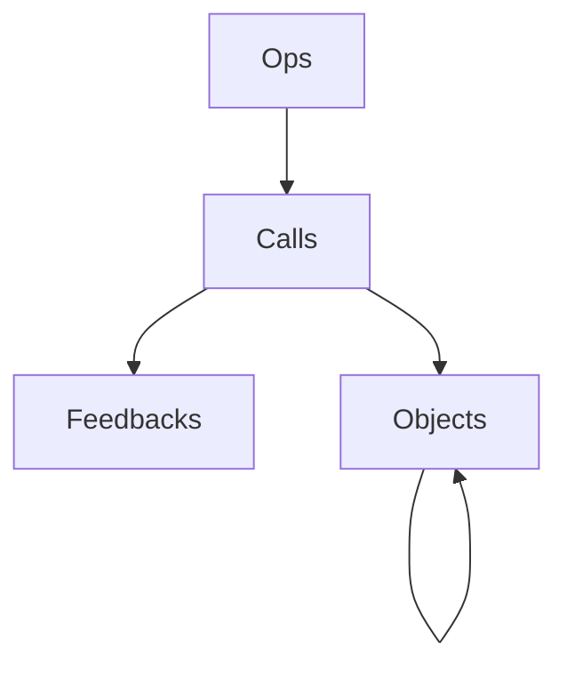

# 1. Clickhouse Calls Query Performance Analysis

In this document, I will outline my learnings from investigating the Weave Calls Query performance. I will also cover some foundational topics relating to ClickHouse as it pertains to this discussion.

- [1. Clickhouse Calls Query Performance Analysis](#1-clickhouse-calls-query-performance-analysis)
- [2. Goal(s)](#2-goals)
  - [2.1. Motivating Example](#21-motivating-example)
- [3. Clickhouse Fundamentals](#3-clickhouse-fundamentals)
  - [3.1. Parts / Granules / Indexes](#31-parts--granules--indexes)
  - [3.2. AggregatingMergeTree](#32-aggregatingmergetree)
- [4. High level Insights](#4-high-level-insights)
  - [4.1. Research \& Questions](#41-research--questions)
  - [4.2. Granule Simulation](#42-granule-simulation)
- [5. New Capability: Dynamic Queries](#5-new-capability-dynamic-queries)
  - [5.1. Current Database Schema](#51-current-database-schema)
    - [5.1.1. Application Perspective](#511-application-perspective)
  - [5.2. Notebook Exploration](#52-notebook-exploration)
- [6. Technical Recommendations](#6-technical-recommendations)
  - [6.1. CallsQueryPlanner \& Dynamic Queries](#61-callsqueryplanner--dynamic-queries)
    - [6.1.1. General Principles](#611-general-principles)
    - [6.1.2. Dynamic Queries](#612-dynamic-queries)
    - [6.1.3. Joins](#613-joins)
  - [6.2. Column Sub-Selection](#62-column-sub-selection)
  - [6.3. Async Inserts](#63-async-inserts)
  - [6.4. Indexing Strategies and Id Structure](#64-indexing-strategies-and-id-structure)


# 2. Goal(s)
I set out to focus on solving 2 problems:
1. Even after converting to streaming, moving pagination, sorting & filters to the backend, and implementing predicate pushdown, a number of simple queries are still taking longer than expected. We should characterize why this is happening and take steps to improve it. With new features like Call Deletion, Call Display Names, and Feedback, these queries are only going to get more complicated and slower.
2. One of the last "features" missing to complete the core API is filtering / sorting "through" references. We will discuss what this means later, but the query mechanics and implementation to achieve this calls the entire call schema & query layer into question. 
Given that these problems are so closely related, it is appropriate to consider them together.


## 2.1. Motivating Example
This is our current query for the homepage, which for Chris' project (limit=100) has the following characteristics:
* Elapsed: 0.309s
* Read: 210,695 rows (105.40 MB)
* Parts: 14/16
* Granules: 242/4401

```sql
SELECT
    any(deleted_at) AS deleted_at,
    any(parent_id) AS parent_id,
    any(exception) AS exception,
    any(op_name) AS op_name,
    any(summary_dump) AS summary_dump,
    project_id AS project_id,
    id AS id,
    any(attributes_dump) AS attributes_dump,
    array_concat_agg(output_refs) AS output_refs,
    any(started_at) AS started_at,
    array_concat_agg(input_refs) AS input_refs,
    any(wb_user_id) AS wb_user_id,
    any(inputs_dump) AS inputs_dump,
    any(wb_run_id) AS wb_run_id,
    any(output_dump) AS output_dump,
    any(trace_id) AS trace_id,
    any(ended_at) AS ended_at
FROM
    calls_merged
WHERE
    project_id = {project_id: String }
    AND (
        calls_merged.id IN (
            SELECT
                id
            from
                calls_merged
            WHERE
                (
                    project_id = {project_id: String }
                    AND (
                        (
                            calls_merged.id IN (
                                SELECT
                                    id
                                FROM
                                    calls_merged
                                WHERE
                                    (
                                        (project_id = {project_id: String })
                                        AND (isNotNull(started_at))
                                        AND (calls_merged.parent_id IS NULL)
                                    )
                            )
                        )
                        AND (
                            calls_merged.id NOT IN (
                                SELECT
                                    id
                                FROM
                                    calls_merged
                                WHERE
                                    (
                                        (project_id = {project_id: String })
                                        AND (isNotNull(deleted_at))
                                    )
                            )
                        )
                    )
                )
                AND isNotNull(started_at)
            ORDER BY
                started_at desc
            LIMIT
                {limit: Int64} OFFSET {offset: Int64}
        )
    )
GROUP BY
    project_id,
    id
ORDER BY
    started_at desc
```

Note: this is ~version 4 of our query style and is admittedly overly complex - the latest column pushdown is definitely overkill. The question becomes: "what is the best query here, and in general, everywhere?". An initial hand-tuning of the query gives:
* Elapsed: 0.334s
* Read: 96,979 rows (99.66 MB)
* Parts: 14/15
* Granules: 242/4400

```sql
EXPLAIN indexes = 1
SELECT
    any(deleted_at) AS deleted_at,
    any(parent_id) AS parent_id,
    any(exception) AS exception,
    any(op_name) AS op_name,
    any(summary_dump) AS summary_dump,
    project_id AS project_id,
    id AS id,
    any(attributes_dump) AS attributes_dump,
    array_concat_agg(output_refs) AS output_refs,
    any(started_at) AS started_at,
    array_concat_agg(input_refs) AS input_refs,
    any(wb_user_id) AS wb_user_id,
    any(inputs_dump) AS inputs_dump,
    any(wb_run_id) AS wb_run_id,
    any(output_dump) AS output_dump,
    any(trace_id) AS trace_id,
    any(ended_at) AS ended_at
FROM
    calls_merged
WHERE
    project_id = {project_id: String }
    AND (
        calls_merged.id IN (
            SELECT
                id
            FROM
                calls_merged
            WHERE
                project_id = {project_id: String }
            GROUP BY
                project_id, id
            HAVING
                isNull(any(deleted_at))
                    AND
                isNull(any(parent_id))
            ORDER BY
                any(started_at) desc
            LIMIT
                {limit: Int64} OFFSET {offset: Int64}
        )
    )
GROUP BY
    project_id,
    id
ORDER BY
    started_at desc
```

While this is less complicated, it does not actually improve the performance. The inner query has: Elapsed: 0.032s and Read: 59,434 rows (7.10 MB). Ok, so, let's manually paste in the list:
* Elapsed: 0.254s
* Read: 37,546 rows (92.57 MB)
* Parts: 14/16
* Granules: 242/4401
```sql
SELECT
    any(deleted_at) AS deleted_at,
    any(parent_id) AS parent_id,
    any(exception) AS exception,
    any(op_name) AS op_name,
    any(summary_dump) AS summary_dump,
    project_id AS project_id,
    id AS id,
    any(attributes_dump) AS attributes_dump,
    array_concat_agg(output_refs) AS output_refs,
    any(started_at) AS started_at,
    array_concat_agg(input_refs) AS input_refs,
    any(wb_user_id) AS wb_user_id,
    any(inputs_dump) AS inputs_dump,
    any(wb_run_id) AS wb_run_id,
    any(output_dump) AS output_dump,
    any(trace_id) AS trace_id,
    any(ended_at) AS ended_at
FROM
    calls_merged
WHERE
    project_id = {project_id: String }
    AND (
        calls_merged.id IN [
            '72e2ef4c-7ddd-4509-813d-5657970df071',
            --- snip 98 other ids --
            'dc271f97-2875-4859-bdb8-9decdcfbedbd'
        ]
    )
GROUP BY
    project_id,
    id
ORDER BY
    started_at desc
```

Here, we see that the granules haven't changed (242), but the rows have (that is because the rows report sums across sub queries). This is still ridiculous! We are reading 242 granules (37k rows @ 92MB) to report 100 rows of data! Now, if we remove the "heavy" columns, we get much better performance: Elapsed: 0.030s, Read: 37,593 rows (4.12 MB). However, the user needs this data! Darn users!


The rest of this document is a writeup of my learnings from 2 days of research, playing with clickhouse, and prototyping queries. Essentially my goal is to have a definitive understanding of how we can build complex queries that are efficient and support our upcoming features (rather than just patching in changes on top of a shaky foundation.)

# 3. Clickhouse Fundamentals
* Must Read: https://clickhouse.com/docs/en/optimize/sparse-primary-indexes
* Must Read: https://clickhouse.com/docs/en/engines/table-engines/mergetree-family/mergetree#mergetree-data-storage
  
## 3.1. Parts / Granules / Indexes

## 3.2. AggregatingMergeTree
Rough Notes:
* The aggregating merge tree is really nasty since we can't garuntee that parts will be merged - ever? seems to be true accoring to my research


# 4. High level Insights
1. Query latency is largely a function of: # of applicable granules X column "width" read. Therefore, query optimization is a game of:
   1. Reducing the number of granules which apply to the query (and importantly, de-fragging the granules). This in itself is a function of:
      1. BatchSize: The bigger the batch size, the more de-fragmented the granules will be.
           * **Action:** Implement [Async Inserts](https://clickhouse.com/docs/en/optimize/asynchronous-inserts)! This will maximize our part size.
      2. Data: Index Column Format (UUID vs Naturally Ordered)
           * **Action:** Revisit our call id structure. I have a strong feeling that prefixing the UUID with a numeric timestamp will have huge impacts in terms of the granule fragmentation. We need to research this a bit more and possible consider other prefixes.
      3. Schema: Indexing Strategy & Projections
           * **Action:** I think we can add additional indexes on the calls_merged table, at least for (trace_id, user_id, run_id, parent_id, and timestamp) - trace and project should be timestamp prefixed. This needs more research to get correct and might warrant a few projects. [Indexing is an important subject in Clickhouse](https://clickhouse.com/docs/en/optimize/sparse-primary-indexes) and requires deep reading. Choosing the right indexing strategy is paramount to fast queries. [Projections can help](https://clickhouse.com/docs/en/sql-reference/statements/alter/projection) where there are disjoint indexing use cases.
      4. Query: Pushing filtering clauses operating on indexed fields as far down as possible. Critically predicate pushdown only matters if the ID reduction actually reduces the rows read!
          * **Action:** Implement a `CallsQueryPlanner` that is able to build optimized queries (see below for a larger discussion here)
   2. Reducing the number / width of the fields read for each query/subquery. This in itself is a function of:
      1. Data: Some fields are static width (ie. date) vs "dynamic" such as inputs.
      2. Query: Pulling "heavier" fieldsets up for example, a selection or a filter operating on inputs should be after all the lightweight filters.
            * **Action:** Implement a `CallsQueryPlanner` that is able to build optimized queries (see below for a larger discussion here)
2. Strong Hypothesis: Out current strategy results in nearly the entire project data getting loaded for most queries. Even though we have started to implement predicate pushdown, our indexing strategy results in nearly every part for the project getting loaded, and we don't do any sort of column sub-selection. This is what is likely leading to our near constant query time for any given project
3. The AggregatingMergeTree's "group by" is not always that costly. In cases where the query doing the groupby does not select "heavy" fields, then it seems to be negligible. 

## 4.1. Research & Questions
* Q: Does clickhouse store ranges for indexed columns or a set? Probably a range
    * A: Start/Stop Marks
* Q: Target granule size
  * A: 2^13 = 8192
* Q: How many parts do we have? 
  * A: This query tells us that we have 15 parts, ranging from 2 to ~1250 granules (marks) per part
```sql
  SELECT
    part_type,
    path,
    formatReadableQuantity(rows) AS rows,
    formatReadableSize(data_uncompressed_bytes) AS data_uncompressed_bytes,
    formatReadableSize(data_compressed_bytes) AS data_compressed_bytes,
    formatReadableSize(primary_key_bytes_in_memory) AS primary_key_bytes_in_memory,
    marks,
    formatReadableSize(bytes_on_disk) AS bytes_on_disk
FROM system.parts
WHERE (table = 'calls_merged') AND (active = 1)
```
* Q: Why does this query take so long?
```sql
SELECT
    project_id,
    id,
    any(inputs_dump)
FROM
    calls_merged
WHERE
    project_id = 'UHJvamVjdEludGVybmFsSWQ6MzkwNzUzNzU=' -- CVP's project
GROUP BY
    project_id, id
LIMIT 100;
-- Elapsed: 27.473s
-- Read: 59,525 rows (4.68 GB)
```
Well, Let's explain it:
```sql
EXPLAIN indexes=1
SELECT
    project_id,
    id,
    any(inputs_dump)
FROM
    calls_merged
WHERE
    project_id = 'UHJvamVjdEludGVybmFsSWQ6MzkwNzUzNzU='
GROUP BY
    project_id, id
LIMIT 100
FORMAT PrettySpace
```
```text
 Expression ((Projection + Before ORDER BY))                                                                               
   Limit (preliminary LIMIT (without OFFSET))                                                                              
     Aggregating                                                                                                           
       Expression (Before GROUP BY)                                                                                        
         Expression                                                                                                        
           ReadFromMergeTree (weave_trace_db.calls_merged)                                                                 
           Indexes:                                                                                                        
             PrimaryKey                                                                                                    
               Keys:                                                                                                       
                 project_id                                                                                                
               Condition: (project_id in ['UHJvamVjdEludGVybmFsSWQ6MzkwNzUzNzU=', 'UHJvamVjdEludGVybmFsSWQ6MzkwNzUzNzU=']) 
               Parts: 13/15                                                                                                
               Granules: 434/4391   
```
So, we had to read 13 of our 15 parts, and 434 of our total 4391 granules. This was a collective 59,525 rows, which totaled 4.68 GB of data for the selected columns.

Contrast this without the `inputs_dump` selection
```sql
SELECT
    project_id,
    id
FROM
    calls_merged
WHERE
    project_id = 'UHJvamVjdEludGVybmFsSWQ6MzkwNzUzNzU='
GROUP BY
    project_id, id
LIMIT 100;
-- Elapsed: 0.027s
-- Read: 59,526 rows (5.30 MB)
```
This was 3 orders of magnitude faster, AND 3 orders of magnitude less data. *KEY LEARNING:* Speed is primarily a function of data size loaded into memory (at least for these simple queries).
* Q: What makes these different?
```sql
SELECT
    id
FROM
    calls_merged
WHERE
    project_id = 'UHJvamVjdEludGVybmFsSWQ6MzkwNzUzNzU='
GROUP BY
    project_id,
    id
LIMIT 20
```
and without the grouping?
```sql
SELECT
    id
FROM
    calls_merged
WHERE
    project_id = 'UHJvamVjdEludGVybmFsSWQ6MzkwNzUzNzU='
LIMIT 20
```
With the grouping requires all data to be processed (grouped) - if we were to sort, it comes out the same as the grouping case.
* Q: How efficient is our indexing? Let's consider the following query
```sql
SELECT
    project_id,
    id
FROM
    calls_merged
WHERE
    project_id = 'UHJvamVjdEludGVybmFsSWQ6MzkwNzUzNzU='
        AND
    id in [  -- 3 most recent calls
            '72e2ef4c-7ddd-4509-813d-5657970df071',
            '8c5b89d1-a1a4-4cfe-93bb-03fd413d0eb8',
            'ec245c0d-b468-4e6c-ae70-1708618b376b'
        ]
GROUP BY
    project_id, id;
-- Elapsed: 0.024s
-- Read: 5,615 rows (6.06 MB)
-- Parts: 13/14
-- Granules: 28/4391
```
vs
```sql
SELECT
    project_id,
    id
FROM
    calls_merged
WHERE
    project_id = 'UHJvamVjdEludGVybmFsSWQ6MzkwNzUzNzU='
        AND
    id in [  -- 15 most recent calls
            '72e2ef4c-7ddd-4509-813d-5657970df071',
            '8c5b89d1-a1a4-4cfe-93bb-03fd413d0eb8',
            'a9f0c035-cb35-4fa1-9fbf-7cbebe642c6c',
            'b24d4c04-6ecc-4b81-b871-496930cb967f',
            '548479df-f14b-4a4a-b373-3677ba809b35',
            'cfd25a37-12ae-4f69-8113-36746052d626',
            '6d3b3b48-6c41-43be-89bb-18bdb38ea0a2',
            '69d68c52-013e-4f46-a9d6-a622a5f4b573',
            '4ff15dd8-330f-43a6-9c68-abb9ebbceceb',
            '6aa557c1-f0d4-44ef-bd5d-567dd472e8dd',
            '17f7b31a-24f6-4224-8b43-dfe2c6e4ecae',
            '00301734-c7fb-4463-8ee3-bac7f24bf4d4',
            '576f10b6-fe99-412f-b41c-f297073f8a61',
            '73e96f24-e169-46ea-9a45-a090224f9ccd',
            'ec245c0d-b468-4e6c-ae70-1708618b376b'
        ]
GROUP BY
    project_id, id
LIMIT 100;
-- Elapsed: 0.330s
-- Read: 17,107 rows (6.58 MB)
-- Parts: 13/14
-- Granules: 83/4391
```
So here, we are doing a lookup 3 IDs vs 15. Notice that the time is about an order of magnitude different and the number of granules/rows is much higher. When we bump this up to 100 (a page size), we see that the number of rows scanned is 38k. The entire table is 58k right now. So 65% of the project's data is needed to read 100 rows! We can do better here.
* Q: What is the execution order for Clickhouse
* A:
    * Step 1: select granules based on where clause and indexes
    * Step 2: load all columns requested
    * Step 3: (perform join)
    * Step 3: apply where filters
    * Step 4: apply aggregates if applicable
    * Step 5: apply having filters if applicable
    * Step 6: apply sorting
    * Step 7: apply offset/limit


## 4.2. Granule Simulation
TODO: Notebook


# 5. New Capability: Dynamic Queries

## 5.1. Current Database Schema
Before we analyze the system, or consider how to add new features, let's establish some common ground by describing the current DB Schema
### 5.1.1. Application Perspective
First, let's consider the application perspective. From this perspective, there are the following "tables"



**Ops** are the "operations" or "methods", which when "called", produce a **Call**. **Calls** can "reference" **Objects** if they are used as *inputs* or *output* (read: "parameters" or "return value"). **Objects** can recursively "reference" other **Objects**. Finally, **Calls** will (soon) support having multiple **Feedbacks** associated with them.


## 5.2. Notebook Exploration
Link [to notebook](./../../clickhouse_explore.ipynb). Fill in More details!

```python
def custom_query_for_d(path):
    query_count = 0
    def build_query_for_path_part(part, subquery):
        nonlocal query_count
        query_count += 1
        subquery_name = f"subquery_{query_count}"
        return f"""
            SELECT 
                {subquery_name}.id as id,
                JSONExtractString({subquery_name}.payload_dump, '{part}') as payload_dump
            FROM
                ({subquery}) as {subquery_name}
        """
    def replace_ref_query(query):
        nonlocal query_count
        query_count += 1

        subquery_name = f"subquery_{query_count}"
        objquery_name = f"objquery_{query_count}"
        return f""" 
                SELECT 
                    {subquery_name}.id as id,
                    if({objquery_name}.payload_dump != '', {objquery_name}.payload_dump, {subquery_name}.payload_dump) as payload_dump
                FROM
                    ({query}) as {subquery_name}
                LEFT JOIN
                    objects as {objquery_name}
                ON
                    substring({subquery_name}.payload_dump, 15) = {objquery_name}.id
        """
            
            
    base_query = replace_ref_query("SELECT calls.id as id, calls.payload_dump as payload_dump FROM calls")
    for part in path:
        base_query = replace_ref_query(build_query_for_path_part(part, base_query))
    return base_query
```

```sql
SELECT
    subquery_9.id as id,
    if(
        objquery_9.payload_dump != '',
        objquery_9.payload_dump,
        subquery_9.payload_dump
    ) as payload_dump
FROM
    (
        SELECT
            subquery_8.id as id,
            JSONExtractString(subquery_8.payload_dump, 'd') as payload_dump
        FROM
            (
                SELECT
                    subquery_7.id as id,
                    if(
                        objquery_7.payload_dump != '',
                        objquery_7.payload_dump,
                        subquery_7.payload_dump
                    ) as payload_dump
                FROM
                    (
                        SELECT
                            subquery_6.id as id,
                            JSONExtractString(subquery_6.payload_dump, 'c') as payload_dump
                        FROM
                            (
                                SELECT
                                    subquery_5.id as id,
                                    if(
                                        objquery_5.payload_dump != '',
                                        objquery_5.payload_dump,
                                        subquery_5.payload_dump
                                    ) as payload_dump
                                FROM
                                    (
                                        SELECT
                                            subquery_4.id as id,
                                            JSONExtractString(subquery_4.payload_dump, 'b') as payload_dump
                                        FROM
                                            (
                                                SELECT
                                                    subquery_3.id as id,
                                                    if(
                                                        objquery_3.payload_dump != '',
                                                        objquery_3.payload_dump,
                                                        subquery_3.payload_dump
                                                    ) as payload_dump
                                                FROM
                                                    (
                                                        SELECT
                                                            subquery_2.id as id,
                                                            JSONExtractString(subquery_2.payload_dump, 'a') as payload_dump
                                                        FROM
                                                            (
                                                                SELECT
                                                                    subquery_1.id as id,
                                                                    if(
                                                                        objquery_1.payload_dump != '',
                                                                        objquery_1.payload_dump,
                                                                        subquery_1.payload_dump
                                                                    ) as payload_dump
                                                                FROM
                                                                    (
                                                                        SELECT
                                                                            calls.id as id,
                                                                            calls.payload_dump as payload_dump
                                                                        FROM
                                                                            calls
                                                                    ) as subquery_1
                                                                    LEFT JOIN objects as objquery_1 ON substring(subquery_1.payload_dump, 15) = objquery_1.id
                                                            ) as subquery_2
                                                    ) as subquery_3
                                                    LEFT JOIN objects as objquery_3 ON substring(subquery_3.payload_dump, 15) = objquery_3.id
                                            ) as subquery_4
                                    ) as subquery_5
                                    LEFT JOIN objects as objquery_5 ON substring(subquery_5.payload_dump, 15) = objquery_5.id
                            ) as subquery_6
                    ) as subquery_7
                    LEFT JOIN objects as objquery_7 ON substring(subquery_7.payload_dump, 15) = objquery_7.id
            ) as subquery_8
    ) as subquery_9
    LEFT JOIN objects as objquery_9 ON substring(subquery_9.payload_dump, 15) = objquery_9.id
```


# 6. Technical Recommendations

## 6.1. CallsQueryPlanner & Dynamic Queries


Rough Notes:
* Column Selection
* Pushing/popping requires heuristic analysis
* Push constant time ops down (in fact, the push down order is a bit nuanced) - in the specific case that filters can be applied to indexes on ungrounded data, push them into the where clause
* Change op_name:* to use "startsWith" and consider indexing this field
* Build an example of every case. (Regular, dynamic both sides. Feedback join x sort and filter)
Calls Query Structure (considering the merge tree)

Unoptimized form:
```sql
SELECT
    {AGG_COLUMNS_REQUESTED}
FROM
    calls_merged
WHERE
    project_id = {PROJECT_ID}
        AND
    {WHERE_CONDITIONS}
GROUP BY
    project_id, id
HAVING
    isNull(deleted_at)
        AND
    {HAVING_CONDITIONS}
ORDER BY
    {ORDER_BY_CLAUSE}
LIMIT
    {LIMIT_CLAUSE}
OFFSET
    {OFFSET_CLAUSE}
```

Reqs:

* sort options:
    (known)
    - started_at
    - ended_at
        (soon)
        - op_name?
        - op_display_name?
        - duration
        - wb_run_id
        - wb_user_id
    (generic)
    - input/output/attribute/summary json query
    - feedback json query

* query/filter options:
    (known)
    - id in list
    - op_name pattern / match
    - input_ref contains
    - output_ref contains
    - trace_id in list
    - parent_id nullish
    - parent_id in list
    - wb_user_id in list
    - wb_run_id in list
        (soon)
        - op_display_name?
        - exception nullish
        - start_time range
        - end_time range
        - duration range
    (generic)
    - input/output/attribute/summary json query
    - feedback json query

* always need to filter out:
    - deleted_at

* need to support limit / offset
Approach:
- We will take a layered approach to building the query:
1. (Innermost): Query for IDs matching known filters
2. (Deletion): Account for deleted_at: Note: i think deleted_at needs to be pushed down into the materialized view,
3. (Call Name): This is probably where we would apply the display name filter once avail (sad)
4. (Feedback): Join on feedback and apply next layer of filters
5. (Dynamic): Filter by passing through refs
    - Adapt the notebook prototype to create a synthetic table based on the needed fields as columns
6. (Sort / Offset / Limit): Apply sorting and pagination
    - Seems like it might benefit from the temp table of layer 5?
Remaining question: can we properly handle ands/ors across part types? Example:
* inputs.a = 1 AND (outputs.b = 2 OR inputs.c = 3)

This approach should eliminate the need for offset, having, and limit on the outside, changing the form to:
```sql
--- IDEA 1:

WITH 
    SIMPLE_FILTERED_IDS_QUERY AS (
        -- This is not ideal. It could be improved under the following conditions:
        -- 1. If we can push down the deleted_at filter into the materialized view
        -- 2. We are able to assume that the table is optimized
        --
        -- If the above conditions where met, then all the conditions could be collapsed
        -- into a single clause, which would remove the need for a full-table scan
        WITH
            SIMPLE_START_PART_FILTERED_IDS_QUERY AS (
                SELECT
                    id
                FROM
                    calls_merged 
                WHERE
                    project_id = {PROJECT_ID}
                        AND
                    isNotNull(started_at)
                        AND
                    {BASIC_WHERE_CONDITIONS_ON_START_PART_FIELDS}
            ),
            SIMPLE_END_PART_FILTERED_IDS_QUERY AS (
                SELECT
                    id
                FROM
                    calls_merged 
                WHERE
                    project_id = {PROJECT_ID}
                        AND
                    isNotNull(ended_at)
                        AND
                    {BASIC_WHERE_CONDITIONS_ON_END_PART_FIELDS}
            ),
            SIMPLE_DELETED_FILTERED_IDS_QUERY AS (
                SELECT
                    id
                FROM
                    calls_merged 
                WHERE
                    project_id = {PROJECT_ID}
                        AND
                    isNotNull(deleted_at)
            )
        SELECT
            id
        FROM
            calls_merged 
        WHERE
            project_id = {PROJECT_ID}
                AND
            id IN (SELECT id FROM SIMPLE_START_PART_FILTERED_IDS_QUERY)
                AND
            id IN (SELECT id FROM SIMPLE_END_PART_FILTERED_IDS_QUERY)
                AND
            id NOT IN (SELECT id FROM SIMPLE_DELETED_FILTERED_IDS_QUERY)
    ),
    -- The goal of the next CTE is is to create a synthetic filter that can be used
    -- to filter and sort the data. In the application layer, we should extract the 
    -- total set of fields that are needed to filter and sort the data, and then
    -- create a synthetic table that has those fields as columns. Again, this
    -- assumes that the table is optimized
    FILTERED_SORTED_HYDRATED_QUERY AS (
        WITH 
            ITERATIVELY_HYDRATED_QUERY (
                SELECT
                    id,
                    ...
                -- This could have many iteratively deep layers here, 
                -- but always terminates at the bottom with the following:
                FROM
                    calls_merged 
                WHERE
                    project_id = {PROJECT_ID}
                        AND
                    id IN (SELECT id FROM SIMPLE_FILTERED_IDS_QUERY)
            )
        SELECT
            id,
            -- These fields might be dynamic fields, feedback fields, or known fields
            query.field.x, 
            query.field.y,
            query.field.z,
            sort.field.x,
            sort.field.y,
            sort.field.z,
            ...
        FROM
            ITERATIVELY_HYDRATED_QUERY
        WHERE
            {WHERE_CONDITIONS}
        ORDER BY
            {ORDER_BY_CLAUSE}
        LIMIT
            {LIMIT_CLAUSE}
        OFFSET
            {OFFSET_CLAUSE}
    )
SELECT
    {AGG_COLUMNS_REQUESTED}
FROM
    calls_merged
WHERE
    project_id = {PROJECT_ID}
        AND
    id IN (SELECT id FROM SORTED_PAGINATED_IDS_QUERY)
GROUP BY
    project_id, id
ORDER BY
    {ORDER_BY_CLAUSE}


```
```sql
--- IDEA 2:

WITH 
    SIMPLE_FILTERED_IDS_QUERY AS (
        SELECT
            project_id,
            id
        FROM
            calls_merged 
        WHERE
            project_id = {PROJECT_ID}
                AND
            {SIMPLE_WHERE_CONDITIONS}
        GROUP BY
            project_id, id
        [IF THERE ARE 0 DYNAMIC_WHERE_CONDITIONS and ORDER_BY_DEPENDING_ON_DYNAMIC_FIELDS
            ORDER BY
                {ORDER_BY_CLAUSE}
            LIMIT
                {LIMIT_CLAUSE}
            OFFSET
                {OFFSET_CLAUSE}
        ]
            
    ),
    -- The goal of the next CTE is is to create a synthetic filter that can be used
    -- to filter and sort the data. In the application layer, we should extract the 
    -- total set of fields that are needed to filter and sort the data, and then
    -- create a synthetic table that has those fields as columns.
    --
    -- This section is only needed if there are dynamic fields that need to be filtered
    -- or sorted on. If there are no dynamic fields, then this section can be skipped
    SORTED_PAGINATED_IDS_QUERY AS (
        WITH 
            ITERATIVELY_HYDRATED_QUERY (
                SELECT
                    project_id,
                    id,
                    -- These fields might be dynamic fields, feedback fields, or known fields
                    query.field.x, 
                    query.field.y,
                    query.field.z,
                    sort.field.x,
                    sort.field.y,
                    sort.field.z,
                    ...
                -- This could have many iteratively deep layers here, 
                -- but always terminates at the bottom with the following:
                FROM
                    calls_merged 
                WHERE
                    project_id = {PROJECT_ID}
                        AND
                    id IN (SELECT id FROM SIMPLE_FILTERED_IDS_QUERY)
                GROUP BY
                    project_id, id
            )
        SELECT
            id,
            project_id
        FROM
            ITERATIVELY_HYDRATED_QUERY
        WHERE
            {DYNAMIC_WHERE_CONDITIONS}
        ORDER BY
            {ORDER_BY_CLAUSE}
        LIMIT
            {LIMIT_CLAUSE}
        OFFSET
            {OFFSET_CLAUSE}
    ),
    PRE_ORDERED_RESULTS AS (
        SELECT
            {AGG_COLUMNS_REQUESTED}
        FROM
            calls_merged
        WHERE
            project_id = {PROJECT_ID}
                AND
            id IN (SELECT id FROM SORTED_PAGINATED_IDS_QUERY)
        GROUP BY
            project_id, id
        -- can we use the ordering calculated in the previous step?
    ),
    -- UGG is this the only way to sort this??
    FINAL_RESULTS AS ( 
        SELECT
            final.*
        FROM
            (
                SELECT
                    id,
                    rowNumberInAllBlocks() as rowNumber
                FROM
                    SORTED_PAGINATED_IDS_QUERY
            ) as sorted
        JOIN
            PRE_ORDERED_RESULTS as final USING (project_id, id)
        ORDER BY
            sorted.rowNumber
    )
SELECT * FROM FINAL_RESULTS
```

### 6.1.1. General Principles
### 6.1.2. Dynamic Queries
### 6.1.3. Joins
## 6.2. Column Sub-Selection
## 6.3. Async Inserts
## 6.4. Indexing Strategies and Id Structure
