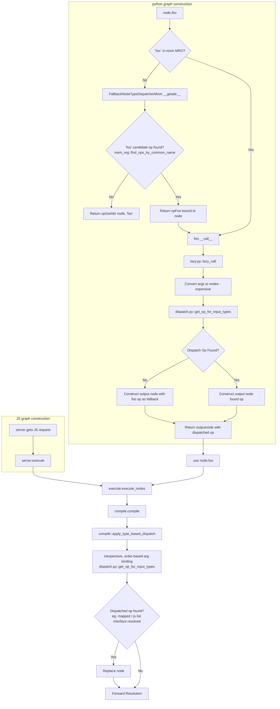

# Dispatching and Resolution

The overall dispatch and resolution flow works as follows (pictured in the diagram below):

1. When constructing a graph in python, the user will write something like `node.foo` or `node.foo()`. In both cases the Python runtime will ask `node` to resolve the symbol `foo`. If `foo` is found in the MRO (faciliated by the mix-ins in `lazy.py`), then that is returned. Else, we get to the base `FallbackNodeTypeDispatcherMixin` class which will attempt to resolve `foo` dynamically.
2. (First dispatch-like logic): At this point, we take the type of `node` (already known) and look for any op ending in `foo` which would accept the type of `node`. We return the first one found. If none is found, we return the opGetAttr op assuming `foo` is an attribute of the type.
3. From there, the returned op for `foo` is called with any params. This follows `__call__` -> `lazy_call` path in OpDef.
   4.(Second dispatch-like logic) Here, we must convert the arguments to nodes (and by definition, determine their types). This is expensive, but required. At this point in time, it is possible that the opDef being called is not the correct op def (this is the case when the first param and the common name is the same, but the op resolution needs to look at the rest of the params). Here we call `dispatch.py::get_op_for_input_types` to determine the correct opDef to use, then constuct the output node.
4. Now, consider that the user calls `use(node.foo())` - or, equivilently, a request comes in from the UI with a node payload. In this case, we enter the execute path.
5. (Third dispatch-like logic) Before running the graph, we compile it in `compile.py`. One step: `compile::apply_type_based_dispatch`, will look at the common name of the ops in the graph and attempt to replace them with the correct op based on the types of the inputs. This is fast since the types are known. True, this is a bit duplicative for graphs constructed in python, but that should be ok. In addition mappability, this step implicitly handles JSList interface conversion. Since the target ops have the same common name, they are automatically replaced with their type-specific counterparts.
6. Finally, the graph is executed.

