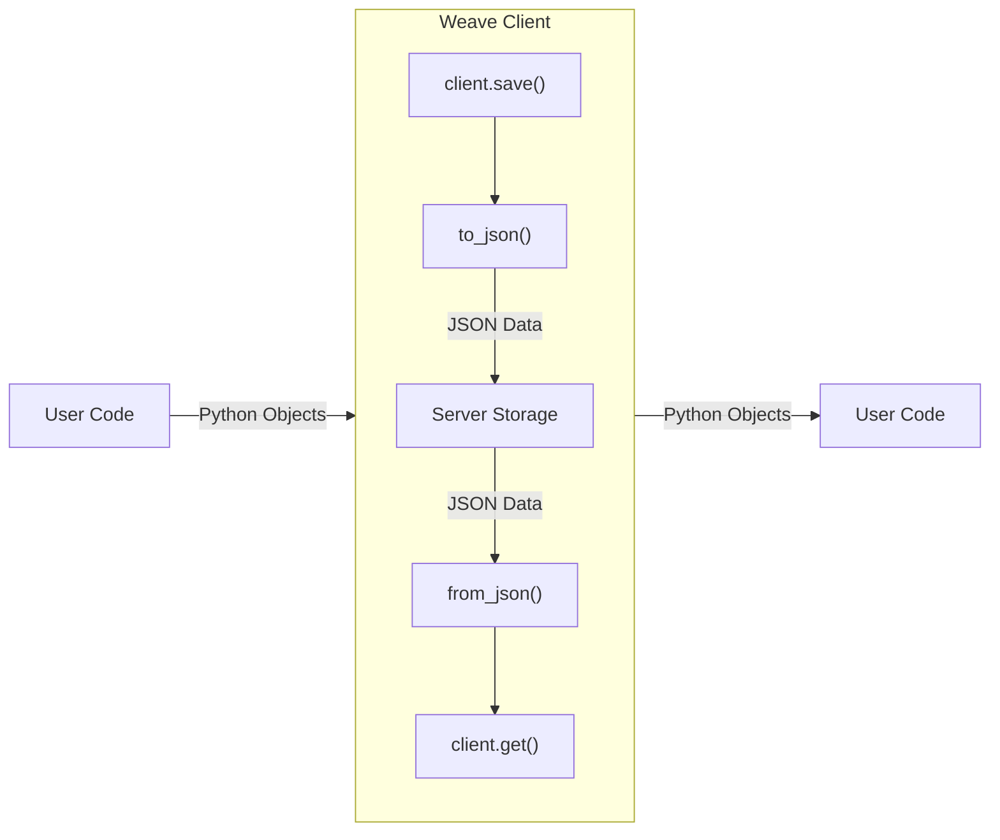
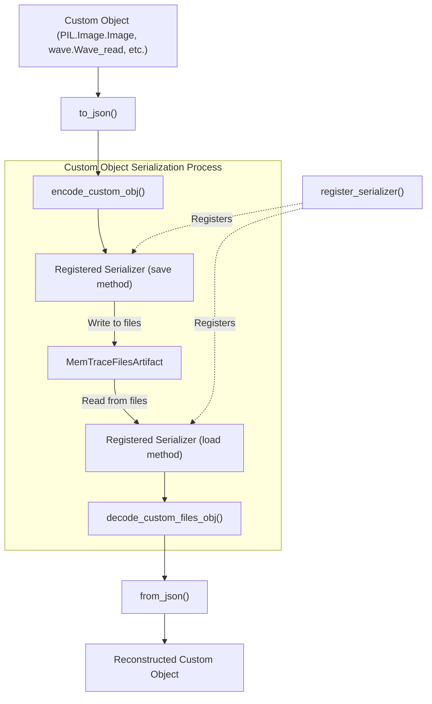
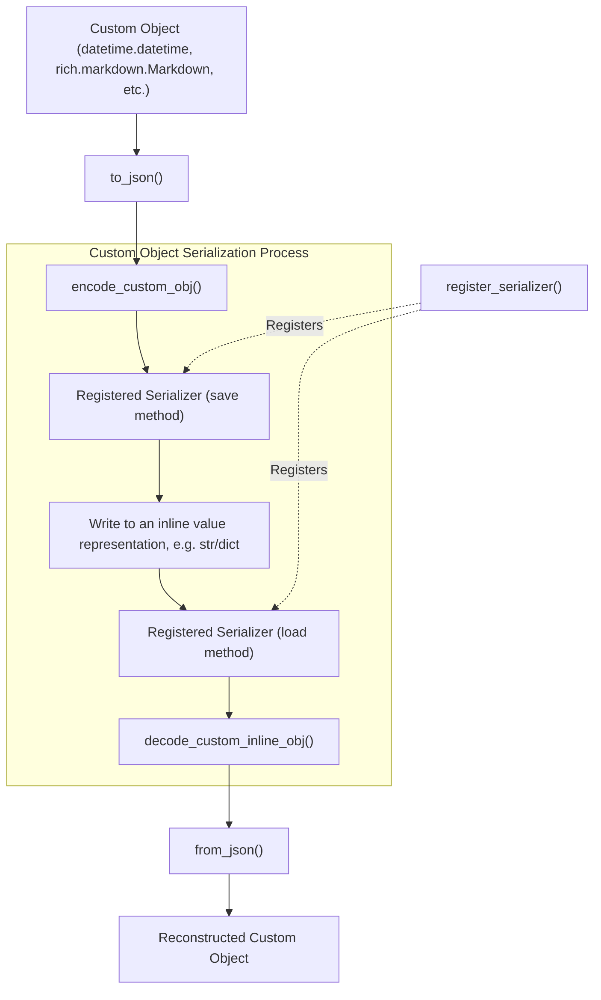

# Serialization Patterns Audit in Weave (for Weave devs)

## Overview

This doc covers the current serialization patterns in Weave. For the purposes of this doc, contents are grouped by the files they are implemented in. Some concepts are currently split across multiple files, which is a limitation that should be addressed in the future.

## Core Serialization Components

### 1. Serialization Entrypoint (`serialize.py`)

The entrypoint for serialization is `weave/trace/serialization/serialize.py`. This file principally contains:

1. `to_json()`, which converts Python objects to JSON-serializable formats
2. `from_json()`, which converts JSON data back to Python objects

#### Serialization Flow Diagram



Today, serialization handles a variety of types, including:
| Type | Reversibility |
|------|---------------|
| Python primitives (int, float, str, bool, None) | Reversible |
| Collections (list, tuple, dict) | Reversible |
| Registered custom objects (via the `custom_objs` module) | Reversible |
| Arbitrary python objects | Not reversible |
| "Dictifiable" objects | Partially reversible (back into a dict) |

NOTE: Not all serialization is reversible, which can be surprising and frustrating. We also handle weave-specific concepts like `ObjectRecord` and refs (`ObjectRef`, `TableRef`, etc.)

### 2. Custom Object Serialization (`custom_objs.py` and `serializer.py`)

NOTE: Custom object serialization is WIP and subject to change! In particular, there are some asymmetries and other issues that we should fix:

1. Encoding requires a WeaveClient while decoding requires a TraceServerInterface. Encoding is more complicated because of asynchronous file creation and caching in the client. A client object contains a reference to a TraceServerInterface so ideally we could use a WeaveClient object for both encoding and decoding.
2. We are currently passing a project_id as a separate argument - a client has entity/project information internally so we shouldn't need to pass it separately.
3. to_json and from_json should not need to know about inline vs. file-backed custom objects, the logic for things like file creation should be moved from `serializer.py` to `custom_objs.py` - this is complicated by #1 above. If we fix this we could expose a single `decode_custom_obj` method mirroring the single encode method.

The entrypoint for custom object serialization is `weave/trace/serialization/custom_objs.py`. This file primarily contains:

1. `encode_custom_obj()`, which encodes custom objects using registered serializers (both inline and file-based)
2. `decode_custom_inline_obj()`, which decodes custom inline objects using the appropriate serializer
3. `decode_custom_files_obj()`, which decodes custom file-based objects using the appropriate serializer

#### Custom Object Serialization Flow

This diagram shows the flow for file-based custom objects.



The flow for inline custom objects is similar:



Custom serializers can be registered with `register_serializer`. This allows users to specify custom `save` and `load` methods for custom types. For portability, weave also packages the `load` function as an op in the saved object so it can try to be loaded even if the serializer is not registered in the target runtime (this is done on a best-effort basis). See more in the `Adding Custom Types` section.

Weave also ships with a set of first-class serializers for common types, defined in `weave/type_handlers/`, including:

- Images (`PIL.Image.Image`)
- Audio (`wave.Wave_read`)
- Op (`weave.Op`)
- Datetime (`datetime.datetime`)
- Markdown (`rich.markdown.Markdown`)

These `KNOWN_TYPES` are implemented using `register_serializer`. Unlike other types, these will always be loaded using the SDK's current `load` function (instead of the one packaged with the object).

#### File-based serialization

Some custom object serialization is file-based via `MemTraceFilesArtifact`. Technically this supports many files per artifact, but in practice today we use just a single file (obj.py) for each artifact. Elements of this are hardcoded in both the SDK and App layers. File-based serialization is typically used for larger values, such as images.

#### Inline serialization

Objects that have a small serialized representation, like a Python datetime object, can have that value stored "inline" with the other serialization information such as the class name and deserialization Op. This avoids needing to make a separate API request to retrieve the value.

#### Other limitations

1. File I/O can block the main thread for particularly large files.
2. There's not an easy way to know what types are registered, or their relative order. This may become more relevant as users begin to bring their own types, and especially if there is a conflicting type hierarchy (e.g. a registered `torch.Tensor` serializer + a subclass of `torch.Tensor` serializer.)
3. The current file-based approach also requires a network request for each file. This can be a problematic, especially in the dataset case, where a row may contain many custom objects that each have to reach out to the server to load.
4. There is no file-deduplication for custom objects. If a custom object is saved multiple times, it will use multiple files. This might be surprising, e.g. in the dataset case where a single image may be present in multiple rows.

### Fallback serialization

For objects that are not explicitly registered, there are a few (lossy) fallback mechanisms, including:

1. `Dictifiable` -- objects that can implement `to_dict() -> dict[str, Any]` will attempt to be serialized as a dict. The actual mechanics are up to the object's implementation, but usually this involves dumping the object's public attributes to a dict.
2. `stringify` -- in the worst case, python objects will be serialized as the object's repr string.

## Adding Custom Types

Users who want to add their own custom types to Weave can do so by registering custom serializers. This section provides a guide for users who are not Weave developers but want to ensure their custom types can be properly serialized and deserialized.

### 1. Creating Serialization Functions

To add support for a custom type, you need to define two functions:

1. **Save Function**: Responsible for serializing the object to files
2. **Load Function**: Responsible for deserializing the object from files

Example:

```python
from weave.trace.serialization import serializer
from weave.trace.serialization.custom_objs import MemTraceFilesArtifact

class MyCustomType:
    def __init__(self, value):
        self.value = value

def save_my_type(obj: MyCustomType, artifact: MemTraceFilesArtifact, name: str) -> None:
    # Save the object's data to a file in the artifact
    with artifact.new_file(f"{name}.txt") as f:
        f.write(str(obj.value))

def load_my_type(artifact: MemTraceFilesArtifact, name: str) -> MyCustomType:
    # Load the object's data from the file in the artifact
    with artifact.open(f"{name}.txt") as f:
        value = f.read()
    return MyCustomType(value)
```

### 2. Registering the Serializer

Once you have defined the save and load functions, you need to register them with Weave:

```python
from weave.trace.serialization import serializer

# Register the serializer for your custom type
serializer.register_serializer(MyCustomType, save_my_type, load_my_type)
```

### 3. Using Custom Types with Weave

After registering the serializer, you can use your custom type with Weave operations:

```python
import weave

# Create an instance of your custom type
my_obj = MyCustomType("Hello, Weave!")

# Save the object to Weave
client = weave.init()
ref = client.save(my_obj, "my-custom-object")

# Retrieve the object from Weave
retrieved_obj = client.get(ref)
```

### 4. Cross-Runtime Compatibility

When a custom object is saved, Weave also saves the load function as an op. This allows the object to be deserialized in a Python runtime that does not have the serializer registered, as long as the necessary dependencies are available. This is done on a best-effort basis, and the object will not be loadable if any of the dependencies are not available.

We don't currently save a lock file of the dependencies, but we might want to if we want to provide better portability in future.

## Server-Side Object Registration (WIP)

Weave is also in the process of adding support for server-side object registration. Currently, we have limited support for server-side object registration through the `BUILTIN_OBJECT_REGISTRY`
