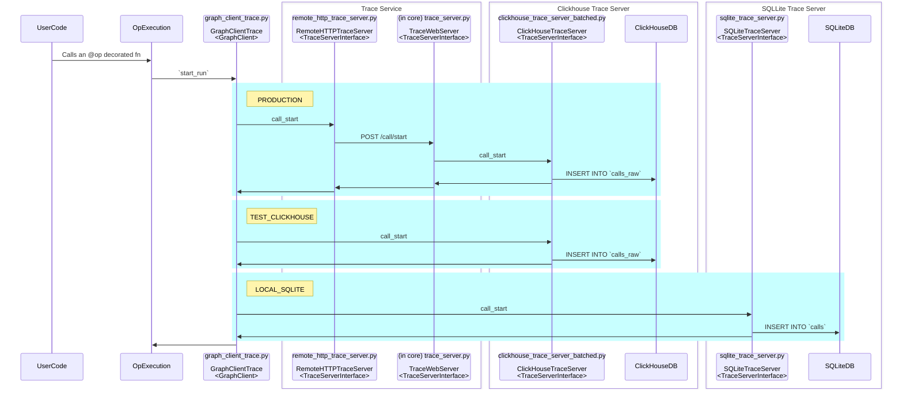

# Trace Server

## Example data flow for starting a call

### TraceServerInterface Inconsistencies:
In the beginning, having a single `TraceServerInterface` was nice because there was a standard data format used across multiple interface boundaries. However, we are now in a situation where each layer has deviated:
* `remote_http_trace_server.py`
  * Additional: server info
* `trace_server.py`
  * Has additional methods for for:
    * call batching
    * server info
    * calls_stream_query
* `clickhouse_trace_server_batched.py`
  * Expects refs in the format of `weave-trace-internal://project_id/...` instead of `weave://entity/project/...`
  * Expects `project_id` to not contain slashes `/`
  * Does not implement `ensure_project_exists`
  * Has additional `calls_query_stream`
  * Expects `wb_user_id` to be set for call update/delete
* `sqlite_trace_server.py`
  * Does not implement `ensure_project_exists`
  * Expects `wb_user_id` to be set for call update/delete

As a result of this deviation:
1. You cannot just hot-swap `remote_http_trace_server` and `clickhouse_trace_server_batched` and `sqlite_trace_server`.
   1. Rather, the closest equivalent interfaces are `remote_http_trace_server` and `sqlite_trace_server`, since effectively working with `clickhouse_trace_server_batched` requires the business logic that has been baked into the `trace_server.py` layer.
2. These differences meaningfully effect the data payloads, meaning the object digests differ when using different server implementations - this is pretty bad! Note: even with my fix below, this means that clients (TS) can't calculate the digest of a thing without the server! Eek - maybe when calculating the digest of a thing, we actually use the object digest, not the ref value? That might be the correct move.
3. Testing the trace_server itself has become challenging since business logic has been moved there (auth, id converting, ref converting, etc...)
4. Not all tests work equally for clickhouse and sqlite (specifically ref-related tests)

Why is this a problem now?
* Only recently was the `Expects wb_user_id to be set for call update/delete` deviation added. The result is that we have had to do some monkeypatching in our tests to fake the wb_user_id resolution inside of `trace_server`
* I am now working on filtering/sorting through refs which means the ref parsing needs to be implemented at the DB layer. Currently, we have special ref parsing for the `clickhouse_trace_server_batched` implemented in application code. This is pretty minimal. However, the work to make filtering/sorting work requires baking more ref-parsing logic into sql queries, which i'd rather have consistent between the implementations.

Possible paths forward:
1. Should we just make our lives easier and make `wb_user_id` an optional field? Would this be OK, or will there be other cases like this in the future where we really do want to make it a required field?
2. The big problem is with `project` and refs. I think what we want is probably:
   1. `clickhouse_trace_server_batched` and `sqlite_trace_server` both have the same rules / "internal" interface: 
      1. No slashes in project name (or other names for that matter)
      2. only operates on `weave-trace-internal://` scheme refs.
      3. Either Require or not require wb_user_name, but be consistent.
   2. Either do #1 above, or acknowledge that `remote_http_trace_server` + `trace_server` will have an interface definition slightly different than the others (at least with respect to the `wb_user_id`)
   3. Create a `external_server` which is constructed with an internal server (either clickhouse or sqlite) as well as a converter object is used to convert refs of type `weave://` into `weave-trace-internal://`. This converter object will need to know how to convert:
      1. ProjectID, UserId, RunID to-from External to Internal
      2. In tests, this can be super simple and just swap `project/entity` for `project_entity`, everything else is identity
      3. The `trace_server` will then use this `external_server` constructor to facilitate the real W&B lookup and replacement
         1. In theory, we could make it easier to plugin a W&B instance for testing purposes, moving the conversion & auth logic down a layer, but that is probably not preferred to put in open source.
   4. Finally, we then have 3 configurations:
      1. PRODUCTION: `remote_http_trace_server` -> `trace_server` -> `external_server(clickhouse_trace_server_batched, wb_connected_converter)`
      2. TEST_CLICKHOUSE: `external_server(clickhouse_trace_server_batched, identity)`
      3. LOCAL_SQLITE: `external_server(sqlite_trace_server, identity)`
      4. At this point each of these would behave the same across all interactions, with the exception of:
         1. digests would be different in production (since the conversion is getting hashed)
            1. However, tests would both use the identity, so we are fine.
