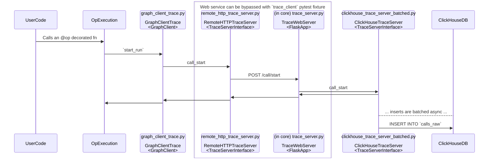

# Trace Server

## Example data flow for starting a call

```mermaid
sequenceDiagram
    participant UserCode
    participant OpExecution
    participant GraphClient as graph_client_trace.py<br><br>GraphClientTrace<br><GraphClient>
    box Web service can be bypassed with `trace_client` pytest fixture
    participant RemoteHTTPTraceServer as remote_http_trace_server.py<br><br>RemoteHTTPTraceServer<br><TraceServerInterface>
    participant TraceWebServer as (in core) trace_server.py<br><br>TraceWebServer<br><FlaskApp>
    end
    participant ClickHouseTraceServer as clickhouse_trace_server_batched.py<br><br>ClickHouseTraceServer<br><TraceServerInterface>
    participant ClickHouseDB

    UserCode->>OpExecution: Calls an @op decorated fn
    OpExecution->>GraphClient: `start_run`
    GraphClient->>RemoteHTTPTraceServer: call_start
    RemoteHTTPTraceServer->>TraceWebServer: POST /call/start
    TraceWebServer->>ClickHouseTraceServer: call_start
    ClickHouseTraceServer->>TraceWebServer: 
    TraceWebServer->>RemoteHTTPTraceServer: 
    RemoteHTTPTraceServer->>GraphClient: 
    GraphClient->>OpExecution: 

    ClickHouseTraceServer-->ClickHouseDB: ... inserts are batched async ...
    ClickHouseTraceServer->>ClickHouseDB: INSERT INTO `calls_raw`
```

## Bulk export admission

Bulk exports require shared Redis through `WEAVE_REDIS_URL`. All trace-server
replicas in a deployment must use the same Redis database. One job owns the
deployment-wide slot; additional requests receive `409 EXPORT_BUSY`. Missing
Redis, failed discovery, or unreachable ClickHouse replicas return
`503 EXPORT_ADMISSION_UNAVAILABLE` rather than starting an export.

The slot has two records: a renewable 60-second ownership lease and a persistent
active-job record. Before submitting a query, the worker atomically checks its
ownership and writes the query ID into the active record. Export query IDs start
with `weave-export:`. A worker renews ownership every 15 seconds and stops
launching targets after losing it. Successful completion clears both records;
an uncertain command outcome stops the remaining targets and retains intent.

Recovery runs on the next start request, without a periodic cleanup worker.
After acquiring the lease, admission checks `system.processes` for both marked
exports and legacy `INSERT INTO FUNCTION s3(weave_exports, ...)` queries. An
orphan's pending query also needs a terminal `system.query_log` event before its
slot can be reused. This preserves the slot if a paused former worker could
still submit its recorded query. Missing or expired logs deliberately block
recovery; they do not prove a query ended. Recovery admits a new job and does
not resume the orphan's unsubmitted targets.

Use `WF_CLICKHOUSE_REPLICATED_CLUSTER` for self-managed multi-node deployments;
ClickHouse Cloud uses its `default` cluster. With no cluster, discovery assumes
a standalone server. Admission checks do not skip unavailable replicas. The
service account needs access to `system.processes` and `system.query_log` on
every relevant node. The probe conservatively includes other marked exporters
visible to that ClickHouse user.

### Decision and rollout

A TTL-only lock followed by query discovery is insufficient: the old worker
can pause between checking its lease and sending HTTP, then submit after a new
owner found no running query. Persistent submission intent closes this window
by keeping the slot occupied until that exact query has a terminal result.
A durable queue would support resuming incomplete jobs but adds a worker
lifecycle; request-time reconciliation is the smaller first version.

Redis must retain admission keys: use persistence and a policy that does not
evict them. This is admission control under retained Redis state, not fencing
against Redis data loss or inconsistent failover. A lost record plus a delayed
HTTP submission cannot be reconciled safely from a process-list snapshot alone.
Manual recovery of an unknown intent requires fencing the old worker/connection
and confirming no query can still arrive; do not simply delete the keys.

Roll out the same admission implementation to all replicas before enabling the
export API. Legacy workers do not participate in Redis admission, so a mixed
rollout cannot guarantee one job. Reverting to an unguarded exporter also
removes this guarantee. Per-query memory, thread, and I/O limits remain separate
controls; one export can still contend with application traffic.
