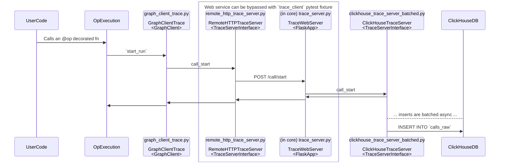

# Trace Server

## Example data flow for starting a call

```mermaid
sequenceDiagram
    participant UserCode
    participant OpExecution
    participant GraphClient as graph_client_trace.py<br><br>GraphClientTrace<br><GraphClient>
    box Web service can be bypassed with `trace_client` pytest fixture
    participant RemoteHTTPTraceServer as remote_http_trace_server.py<br><br>RemoteHTTPTraceServer<br><TraceServerInterface>
    participant TraceWebServer as (in core) trace_server.py<br><br>TraceWebServer<br><FlaskApp>
    end
    participant ClickHouseTraceServer as clickhouse_trace_server_batched.py<br><br>ClickHouseTraceServer<br><TraceServerInterface>
    participant ClickHouseDB

    UserCode->>OpExecution: Calls an @op decorated fn
    OpExecution->>GraphClient: `start_run`
    GraphClient->>RemoteHTTPTraceServer: call_start
    RemoteHTTPTraceServer->>TraceWebServer: POST /call/start
    TraceWebServer->>ClickHouseTraceServer: call_start
    ClickHouseTraceServer->>TraceWebServer: 
    TraceWebServer->>RemoteHTTPTraceServer: 
    RemoteHTTPTraceServer->>GraphClient: 
    GraphClient->>OpExecution: 

    ClickHouseTraceServer-->ClickHouseDB: ... inserts are batched async ...
    ClickHouseTraceServer->>ClickHouseDB: INSERT INTO `calls_raw`
```
