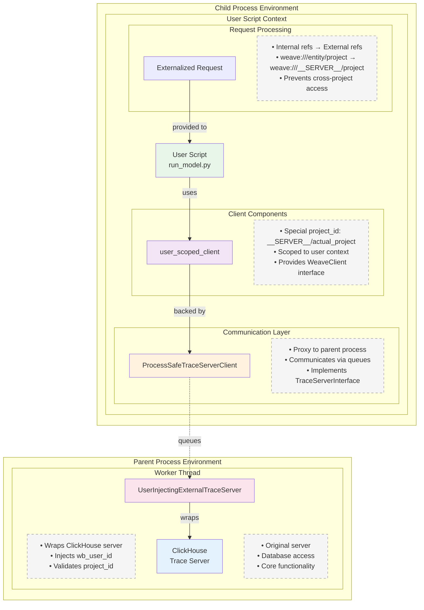

# Execution Runner

Secure server-side execution framework for running user models and evaluations.

## Quick Start

```python
# Initialize the execution runner
runner = RunAsUser(
    internal_trace_server=trace_server,
    project_id="my-project", 
    wb_user_id="user123",
    timeout_seconds=60,  # Optional: execution timeout (default: 60s)
    max_concurrent_requests=20  # Optional: max concurrent requests (default: 10)
)

# Execute a model
response = await runner.run_model(
    RunModelReq(
        project_id="my-project",
        model_ref="weave:///entity/my-project/object/model:digest",
        inputs={"user_input": "Hello, world!"},
        wb_user_id="user123"
    )
)

# Response contains:
# - call_id: The trace call ID for the execution
# - output: The model's output
print(f"Model output: {response.output}")
print(f"Trace call ID: {response.call_id}")
```

## Overview

The execution runner provides a secure way to execute user code on the server while maintaining complete isolation between users. It achieves this through process isolation and careful management of security contexts.

### Key Features

- **`run_model` Server API**: Allows direct execution of models on the server side (currently limited to `LLMStructuredCompletionModel` class)
- **Process Isolation**: Each execution runs in a separate OS process
- **User Context Preservation**: All operations maintain proper user authentication
- **Project Scoping**: User code can only access data within their project scope
- **Concurrent Request Handling**: The trace server can handle multiple simultaneous requests using a thread pool

## Architecture

The execution runner uses a clean separation of concerns:

### Core Components

#### Security Wrapper (`secure_trace_server`)
- **Purpose**: Wraps the internal trace server with user context and security
- **Responsibilities**:
  - Injects user ID into all requests
  - Validates project access
  - Prefixes project IDs with `__SERVER__/`

#### Process-Safe Adapter (`ProcessSafeTraceServerAdapter`)
- **Purpose**: Exposes trace server through process-safe primitives
- **Responsibilities**:
  - Manages a pool of worker threads
  - Provides multiprocessing queues for communication
  - Handles concurrent request processing (N parallel requests)
  - Lives in the parent process

#### Process-Safe Client (`ProcessSafeTraceServerClient`)
- **Purpose**: TraceServerInterface implementation for child process
- **Responsibilities**:
  - Uses queues to communicate with the adapter
  - Implements all TraceServerInterface methods
  - Handles request/response correlation
  - Lives in the child process

### Data Flow

```
┌─────────────────────────────────────────────────┐
│              Parent Process                      │
│                                                  │
│  Internal      Security        Process-Safe      │
│  TraceServer → Wrapper  →      Adapter          │
│      ↑                              ↓            │
│      └──────── Workers ─────────────┘            │
│                   ↓                              │
│              [Queues]                            │
└───────────────────┼─────────────────────────────┘
                    │ Process Boundary
┌───────────────────┼─────────────────────────────┐
│              Child Process                       │
│                   │                              │
│              [Queues]                            │
│                   ↓                              │
│           Process-Safe Client                    │
│                   ↓                              │
│             User Code                            │
└─────────────────────────────────────────────────┘
```

### Key Design Principles

1. **Clean Separation**: Each layer has a single, well-defined responsibility
2. **No Global State**: No global registries or complex lifecycle management
3. **Simple Communication**: Direct queue-based communication without intermediate threads
4. **Concurrent by Design**: Worker pool processes multiple requests simultaneously

### Why Process Isolation?

The `WeaveClient` design leads to in-memory mutations of refs when they're loaded. This creates potential security issues in a multi-user environment where different users' code might access shared memory. Process isolation ensures:

1. **Memory Safety**: Each user's code runs in completely separate memory space
2. **No Cross-Contamination**: One user's ref mutations cannot affect another user
3. **Clean State**: Each execution starts with a fresh process and clean memory
4. **Resource Limits**: OS-level process controls can enforce resource limits

## Execution Architecture

### Component Architecture (User Script Perspective)

This diagram shows how the user script (`run_model`) operates within multiple components:



### Multiprocessing Communication Flow

This diagram shows how processes communicate during a `run_model` execution:


## Data Model

### Key Components

1. **ProcessSafeTraceServerClient**
   - Acts as a proxy in the child process
   - Sends requests through multiprocessing queues
   - Receives responses asynchronously
   - Implements full TraceServerInterface

2. **UserInjectingExternalTraceServer**
   - Wraps the internal trace server
   - Injects `wb_user_id` into all requests
   - Validates project IDs match expected values
   - Converts between internal/external reference formats

3. **RunAsUser**
   - Main orchestrator for isolated execution
   - Creates child processes with proper context
   - Manages the lifecycle of execution
   - Handles errors and timeouts (60s default)

### Security Model

The execution runner enforces security at multiple levels:

1. **Process Isolation**: Each user's code runs in a separate OS process
2. **Project Scoping**: All references are validated to ensure they belong to the correct project
3. **User Context**: Every operation is tagged with the authenticated user ID
4. **Reference Externalization**: Internal references are converted to prevent cross-project access

### Request Flow Example

For a `run_model` request:

1. **Request arrives** at ClickHouse Trace Server with:
   - `model_ref`: Reference to the model object
   - `inputs`: Input data for the model
   - `project_id`: Project scope
   - `wb_user_id`: User context

2. **RunAsUser** prepares for isolated execution:
   - Wraps trace server with `UserInjectingExternalTraceServer`
   - Starts worker thread with `generate_child_process_trace_server_args()`
   - Externalizes any references in the request
   - Spawns child process

3. **Child process** executes the model:
   - Builds `ProcessSafeTraceServerClient` from handle
   - Creates user-scoped WeaveClient
   - Loads model from reference
   - Executes model with inputs
   - Returns result through queues

4. **Response flows back** through the layers:
   - Child process → Worker thread (via queue)
   - Worker thread → RunAsUser (via queue)
   - RunAsUser → ClickHouse Trace Server
   - ClickHouse Trace Server → Client

## File Structure

```
execution_runner/
├── README.md                       # This file
├── process_safe_trace_server.py    # Process-safe communication implementation
├── run_as_user.py                  # Main API for isolated execution
├── trace_server_adapter.py         # Security wrappers and ID conversion
└── user_scripts/
    └── run_model.py               # Model execution implementation
```

## Usage

### Using the `run_model` API

Currently, the `run_model` functionality is available as an internal server API:

```python
# Server-side usage (within trace server)
runner = RunAsUser(
    internal_trace_server=trace_server,
    project_id="my-project", 
    wb_user_id="user123",
    timeout_seconds=60,  # Optional: execution timeout
    max_concurrent_requests=20  # Optional: max concurrent requests (default: 10)
)

# Execute a model
response = await runner.run_model(
    RunModelReq(
        project_id="my-project",
        model_ref="weave:///entity/my-project/object/model:digest",
        inputs={"user_input": user_input},
        wb_user_id="user123"
    )
)

# Response contains:
# - call_id: The trace call ID for the execution
# - output: The model's output
```

### Direct API Usage (Server Implementation)

For server implementations that need to execute models on behalf of users:

```python
# Initialize the execution runner with concurrency control
runner = RunAsUser(
    internal_trace_server=clickhouse_trace_server,
    project_id=project_id,
    wb_user_id=wb_user_id,
    timeout_seconds=30,  # 30 second timeout
    max_concurrent_requests=50  # Handle up to 50 concurrent requests
)

# The runner will:
# 1. Create a process pool for handling requests
# 2. Process up to 50 requests simultaneously
# 3. Queue additional requests if all workers are busy
# 4. Maintain isolation between all concurrent executions
```

## Future Improvements

- **Expanded Model Support**: Currently limited to `LLMStructuredCompletionModel`, will expand to other model types
- **Scorer Execution**: Will support running scoring functions in isolated processes
- **Eval Execution**: Will enable backend workers to execute evaluations safely
- **HTTP API**: Expose `run_model` and related APIs via HTTP endpoints
- **Streaming Support**: Currently, streaming operations fall back to batch mode
- **Async Support**: Model execution is synchronous due to current interface limitations
- **Resource Limits**: Add CPU/memory limits per child process
- **Process Pooling**: Reuse processes for better performance 

## Core Components

### process_safe_trace_server.py
Complete implementation of process-safe trace server communication:
- `ProcessSafeTraceServerAdapter`: Exposes trace server via process-safe queues
- `ProcessSafeTraceServerClient`: Client proxy for child processes
- `ProcessSafeTraceServerHandle`: Serializable handle containing communication primitives
- Helper functions for creating and using process-safe trace servers

### trace_server_adapter.py
Security layer that wraps trace servers with user context:
- `secure_trace_server`: Wraps a trace server with user ID injection and project validation
- `IdConverter`: Validates and converts between internal/external IDs
- Reference externalization to prevent cross-project access

### run_as_user.py
High-level API for executing user code in isolated processes:
- `RunAsUser`: Main class that orchestrates process isolation
- Process lifecycle management (spawn, monitor, cleanup)
- Timeout handling and error propagation

### run_model.py
Implementation of the `run_model` functionality:
- Loads and executes `LLMStructuredCompletionModel` instances
- Handles model inference within the isolated environment 