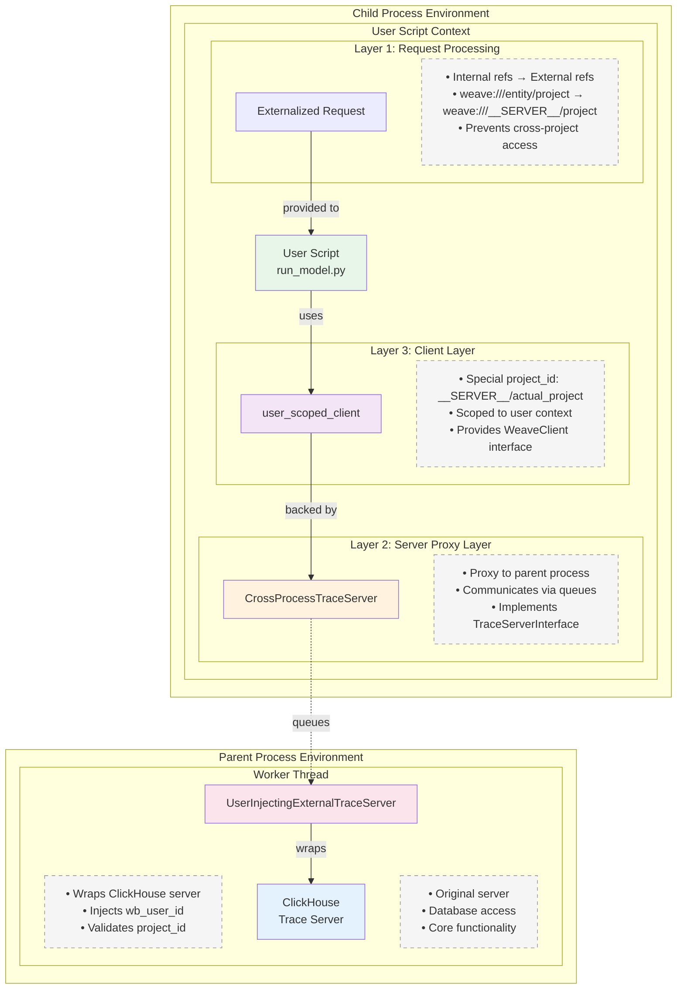
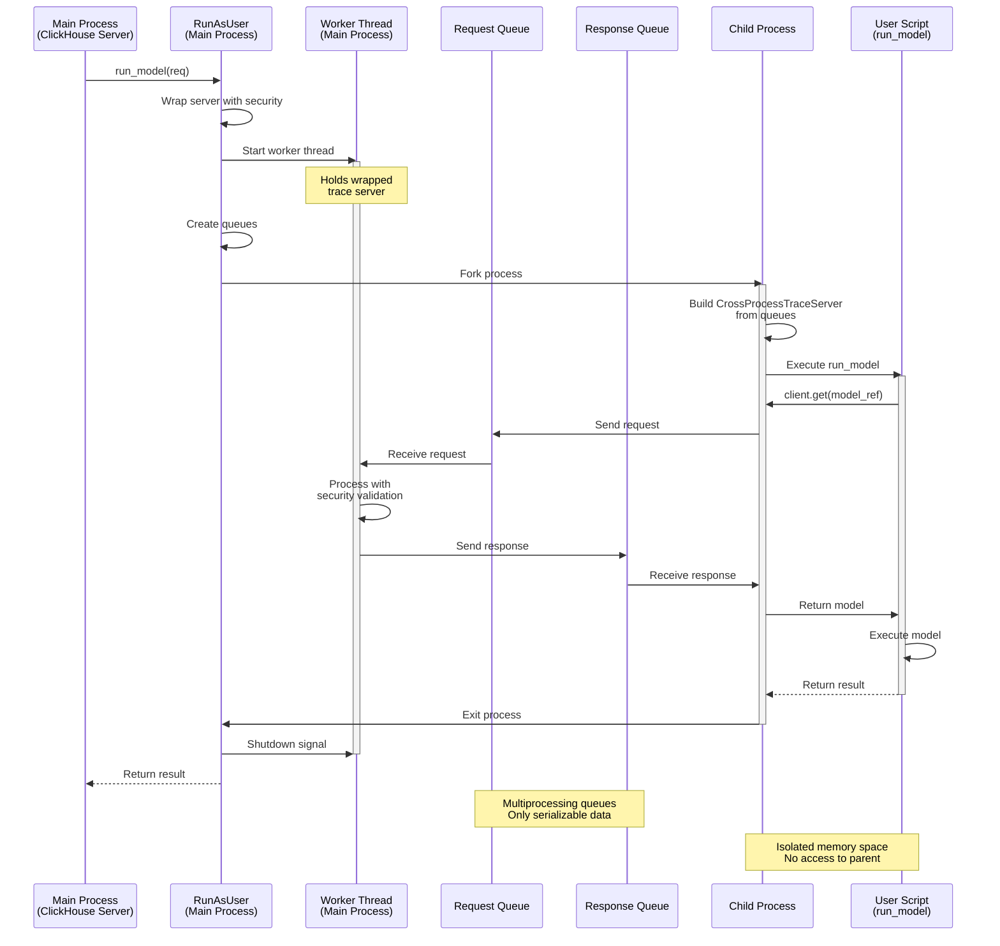

# Execution Runner

Secure server-side execution framework for running user models and evaluations.

## Overview

The execution runner provides a secure way to execute user code on the server while maintaining complete isolation between users. It achieves this through process isolation and careful management of security contexts.

### Key Features

- **`run_model` Server API**: Allows direct execution of models on the server side (currently limited to `LLMStructuredCompletionModel` class)
- **Process Isolation**: Each execution runs in a separate OS process
- **User Context Preservation**: All operations maintain proper user authentication
- **Project Scoping**: User code can only access data within their project scope
- **Concurrent Request Handling**: The trace server can handle multiple simultaneous requests using a thread pool

## Architecture

### Layer Architecture

```
┌──────────────────────────────────────────────┐
│         ClickHouse Server Process            │
│                                              │
│  ┌────────────────────────────────────────┐  │
│  │     TraceServerAdapter (Security)      │  │ Layer 1: Request Validation
│  │  - Injects user ID                     │  │
│  │  - Validates project access            │  │
│  │  - Prefixes project IDs                │  │
│  └────────────────────────────────────────┘  │
│                     │                         │
│  ┌────────────────────────────────────────┐  │
│  │         RunAsUser (Executor)           │  │ Layer 2: Process Management
│  │  - Manages child process lifecycle     │  │
│  │  - Handles timeouts/errors             │  │
│  │  - Passes wrapped trace server         │  │
│  └────────────────────────────────────────┘  │
└──────────────────────│───────────────────────┘
                       │ Process Boundary
┌──────────────────────│───────────────────────┐
│         Child Process (Isolated)             │
│                     │                        │
│  ┌────────────────────────────────────────┐  │
│  │   CrossProcessTraceServer (Proxy)      │  │ Layer 3: Communication
│  │  - Sends requests via queues           │  │
│  │  - Receives responses                  │  │
│  └────────────────────────────────────────┘  │
│                     │                         │
│  ┌────────────────────────────────────────┐  │
│  │        User Code Execution             │  │ Layer 4: User Code
│  │  - WeaveClient with user context       │  │
│  │  - Runs model/scorer/eval             │  │
│  └────────────────────────────────────────┘  │
└──────────────────────────────────────────────┘
```

### Multiprocessing Communication

```
Parent Process                           Child Process
─────────────                           ─────────────
                                       
TraceServerAdapter                      User Code
      │                                      │
      │ wraps                               │ uses
      ↓                                      ↓
Internal TraceServer                    CrossProcessTraceServer
      │                                      │
      │ handles requests                    │ sends requests
      ↓                                      ↓
Worker Thread Pool ←─── queues ────→ Request Queue
      │                                      
      ↓                                      
Concurrent Processing                        
(ThreadPoolExecutor)                         
```

The system uses multiprocessing queues for communication:
1. Child process sends requests through request queue
2. Parent's worker thread pool processes requests concurrently
3. Responses are sent back through response queue
4. Up to N requests can be processed simultaneously (configurable)

### Why Process Isolation?

The `WeaveClient` design leads to in-memory mutations of refs when they're loaded. This creates potential security issues in a multi-user environment where different users' code might access shared memory. Process isolation ensures:

1. **Memory Safety**: Each user's code runs in completely separate memory space
2. **No Cross-Contamination**: One user's ref mutations cannot affect another user
3. **Clean State**: Each execution starts with a fresh process and clean memory
4. **Resource Limits**: OS-level process controls can enforce resource limits

## Execution Architecture

### Layer Architecture (User Script Perspective)

This diagram shows how the user script (`run_model`) operates within multiple layers of abstraction:



### Multiprocessing Communication Flow

This diagram shows how processes communicate during a `run_model` execution:



## Data Model

### Key Components

1. **CrossProcessTraceServer**
   - Acts as a proxy in the child process
   - Sends requests through multiprocessing queues
   - Receives responses asynchronously
   - Implements full TraceServerInterface

2. **UserInjectingExternalTraceServer**
   - Wraps the internal trace server
   - Injects `wb_user_id` into all requests
   - Validates project IDs match expected values
   - Converts between internal/external reference formats

3. **RunAsUser**
   - Main orchestrator for isolated execution
   - Creates child processes with proper context
   - Manages the lifecycle of execution
   - Handles errors and timeouts (60s default)

### Security Model

The execution runner enforces security at multiple levels:

1. **Process Isolation**: Each user's code runs in a separate OS process
2. **Project Scoping**: All references are validated to ensure they belong to the correct project
3. **User Context**: Every operation is tagged with the authenticated user ID
4. **Reference Externalization**: Internal references are converted to prevent cross-project access

### Request Flow Example

For a `run_model` request:

1. **Request arrives** at ClickHouse Trace Server with:
   - `model_ref`: Reference to the model object
   - `inputs`: Input data for the model
   - `project_id`: Project scope
   - `wb_user_id`: User context

2. **RunAsUser** prepares for isolated execution:
   - Wraps trace server with `UserInjectingExternalTraceServer`
   - Starts worker thread with `generate_child_process_trace_server_args()`
   - Externalizes any references in the request
   - Spawns child process

3. **Child process** executes the model:
   - Builds `CrossProcessTraceServer` from queue arguments
   - Creates user-scoped WeaveClient
   - Loads model from reference
   - Executes model with inputs
   - Returns result through queues

4. **Response flows back** through the layers:
   - Child process → Worker thread (via queue)
   - Worker thread → RunAsUser (via queue)
   - RunAsUser → ClickHouse Trace Server
   - ClickHouse Trace Server → Client

## File Structure

```
execution_runner/
├── README.md                       # This file
├── cross_process_trace_server.py   # Queue-based trace server proxy
├── run_as_user.py                  # Main orchestrator for isolated execution
├── trace_server_adapter.py         # Security wrappers and ID conversion
└── user_scripts/
    └── run_model.py               # Actual model execution logic
```

## Usage

### Using the `run_model` API

Currently, the `run_model` functionality is available as an internal server API:

```python
# Server-side usage (within trace server)
runner = RunAsUser(
    internal_trace_server=trace_server,
    project_id="my-project", 
    wb_user_id="user123",
    timeout_seconds=60,  # Optional: execution timeout
    max_concurrent_requests=20  # Optional: max concurrent requests (default: 10)
)

# Execute a model
response = await runner.run_model(
    RunModelReq(
        project_id="my-project",
        model_ref="weave:///entity/my-project/object/model:digest",
        inputs={"user_input": user_input},
        wb_user_id="user123"
    )
)

# Response contains:
# - call_id: The trace call ID for the execution
# - output: The model's output
```

### Direct API Usage (Server Implementation)

For server implementations that need to execute models on behalf of users:

```python
# Initialize the execution runner with concurrency control
runner = RunAsUser(
    internal_trace_server=clickhouse_trace_server,
    project_id=project_id,
    wb_user_id=wb_user_id,
    timeout_seconds=30,  # 30 second timeout
    max_concurrent_requests=50  # Handle up to 50 concurrent requests
)

# The runner will:
# 1. Create a process pool for handling requests
# 2. Process up to 50 requests simultaneously
# 3. Queue additional requests if all workers are busy
# 4. Maintain isolation between all concurrent executions
```

## Future Improvements

- **Expanded Model Support**: Currently limited to `LLMStructuredCompletionModel`, will expand to other model types
- **Scorer Execution**: Will support running scoring functions in isolated processes
- **Eval Execution**: Will enable backend workers to execute evaluations safely
- **HTTP API**: Expose `run_model` and related APIs via HTTP endpoints
- **Streaming Support**: Currently, streaming operations fall back to batch mode
- **Async Support**: Model execution is synchronous due to current interface limitations
- **Resource Limits**: Add CPU/memory limits per child process
- **Process Pooling**: Reuse processes for better performance 