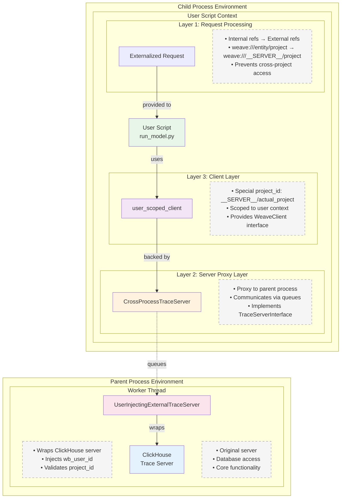
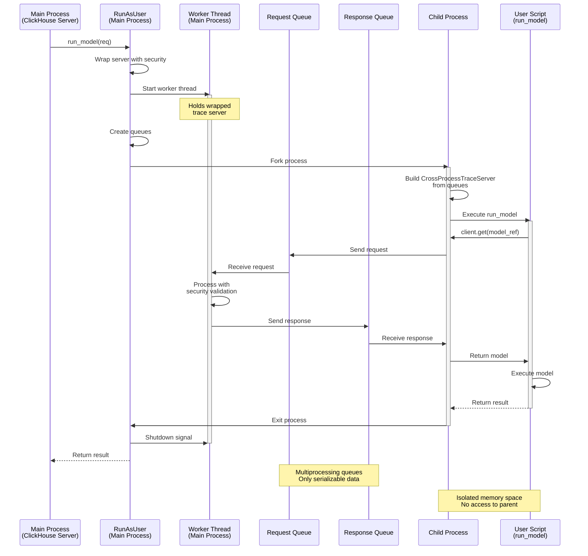

# Execution Runner

The execution runner provides secure, isolated execution of user code within the Weave trace server. It ensures memory isolation between users and enforces strict project/user scoping through a multi-process architecture.

## Overview

The execution runner is designed to safely execute user-provided code (like ML model inference) in isolated processes. This prevents:
- Memory contamination between different users
- Unauthorized access to other users' or projects' data
- Resource exhaustion affecting other users

### Why Process Isolation?

The WeaveClient mutates local objects with refs during execution, which is not thread-safe or memory-safe when multiple differently authenticated clients operate in the same process space. Specifically:

- When a client resolves a ref (e.g., `client.get(ref)`), it caches and potentially mutates the object locally
- These mutations include updating internal ref pointers and object state
- If two clients with different authentication contexts shared the same memory space, they could:
  - Access each other's cached objects
  - See mutations made by other users
  - Potentially corrupt shared state

Therefore, we use the more expensive but necessary approach of full process isolation to ensure complete memory separation between different user contexts. This guarantees that each user's operations are truly isolated, even at the cost of additional overhead from process creation and inter-process communication.

## Architecture

The system uses a three-layer architecture:

1. **Main Process** (ClickHouse Trace Server)
   - Receives incoming requests
   - Delegates to RunAsUser for isolated execution
   - Maintains the actual trace server instance

2. **Worker Thread** (in Main Process)
   - Created by `generate_child_process_trace_server_args()`
   - Holds the wrapped trace server instance
   - Processes requests from child via queues
   - Returns responses back through queues

3. **Child Process** (Isolated User Context)
   - Spawned by RunAsUser for each execution
   - Has no direct access to parent's memory
   - Communicates only through multiprocessing queues
   - Runs with a user-scoped WeaveClient

## Execution Architecture

### Layer Architecture (User Script Perspective)

This diagram shows how the user script (`run_model`) operates within multiple layers of abstraction:



### Multiprocessing Communication Flow

This diagram shows how processes communicate during a `run_model` execution:



## Data Model

### Key Components

1. **CrossProcessTraceServer**
   - Acts as a proxy in the child process
   - Sends requests through multiprocessing queues
   - Receives responses asynchronously
   - Implements full TraceServerInterface

2. **UserInjectingExternalTraceServer**
   - Wraps the internal trace server
   - Injects `wb_user_id` into all requests
   - Validates project IDs match expected values
   - Converts between internal/external reference formats

3. **RunAsUser**
   - Main orchestrator for isolated execution
   - Creates child processes with proper context
   - Manages the lifecycle of execution
   - Handles errors and timeouts (60s default)

### Security Model

The execution runner enforces security at multiple levels:

1. **Process Isolation**: Each user's code runs in a separate OS process
2. **Project Scoping**: All references are validated to ensure they belong to the correct project
3. **User Context**: Every operation is tagged with the authenticated user ID
4. **Reference Externalization**: Internal references are converted to prevent cross-project access

### Request Flow Example

For a `run_model` request:

1. **Request arrives** at ClickHouse Trace Server with:
   - `model_ref`: Reference to the model object
   - `inputs`: Input data for the model
   - `project_id`: Project scope
   - `wb_user_id`: User context

2. **RunAsUser** prepares for isolated execution:
   - Wraps trace server with `UserInjectingExternalTraceServer`
   - Starts worker thread with `generate_child_process_trace_server_args()`
   - Externalizes any references in the request
   - Spawns child process

3. **Child process** executes the model:
   - Builds `CrossProcessTraceServer` from queue arguments
   - Creates user-scoped WeaveClient
   - Loads model from reference
   - Executes model with inputs
   - Returns result through queues

4. **Response flows back** through the layers:
   - Child process → Worker thread (via queue)
   - Worker thread → RunAsUser (via queue)
   - RunAsUser → ClickHouse Trace Server
   - ClickHouse Trace Server → Client

## File Structure

```
execution_runner/
├── README.md                       # This file
├── cross_process_trace_server.py   # Queue-based trace server proxy
├── run_as_user.py                  # Main orchestrator for isolated execution
├── trace_server_adapter.py         # Security wrappers and ID conversion
└── user_scripts/
    └── run_model.py               # Actual model execution logic
```

## Usage

The execution runner is typically used internally by the trace server:

```python
# In ClickHouse Trace Server
async def run_model(self, req: RunModelReq) -> RunModelRes:
    runner = RunAsUser(
        internal_trace_server=self,
        project_id=req.project_id,
        wb_user_id=req.wb_user_id
    )
    return await runner.run_model(req)
```

## Future Improvements

- **Streaming Support**: Currently, streaming operations fall back to batch mode
- **Async Support**: Model execution is synchronous due to current interface limitations
- **Resource Limits**: Add CPU/memory limits per child process
- **Process Pooling**: Reuse processes for better performance 